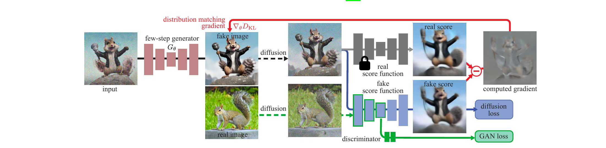

# PAPER: DMD2 - Improved Distribution Matching Distillation 쉽게 읽기

## 0. 이 문서를 읽는 법

이 문서는 DMD2 논문과 공개 코드를 보고, 처음 읽는 사람이 흐름을 따라갈 수 있도록 다시 정리한 리뷰입니다.

핵심 목표는 하나입니다.

> **DMD2는 큰 diffusion teacher가 50-100번 계산해서 만들던 이미지를, student가 1번 또는 4번 계산만으로 비슷하게 만들도록 압축하는 방법이다.**

다만 DMD2는 단순히 "teacher를 베끼는" 방법이 아닙니다. 기존 DMD에서 문제가 되던 안정성, 비용, teacher 품질의 한계를 해결하려고 여러 장치를 붙였습니다.

이 문서는 아래 순서로 읽으면 가장 편합니다.

1. **큰 그림**: DMD2가 무엇을 하려는지
2. **등장인물**: teacher, student, critic이 각각 무엇인지
3. **DMD의 문제**: 왜 DMD2가 필요했는지
4. **DMD2의 해결책 6개**: 논문 Section 4의 핵심
5. **학습 루프**: 코드에서는 한 step이 어떻게 돌아가는지
6. **실험 결과와 FAQ**: 숫자와 자주 헷갈리는 점

---

## 1. 메타 정보

| 항목 | 내용 |
|---|---|
| 논문 | Improved Distribution Matching Distillation for Fast Image Synthesis |
| 저자 | Tianwei Yin, Michael Gharbi, Taesung Park, Richard Zhang, Eli Shechtman, Fredo Durand, William T. Freeman |
| 학회 | NeurIPS 2024 |
| arXiv | https://arxiv.org/abs/2405.14867 |
| 코드 | https://github.com/tianweiy/dmd2 |
| 프로젝트 페이지 | https://tianweiy.github.io/dmd2/ |
| Hugging Face | https://huggingface.co/tianweiy/DMD2 |
| 이전 논문 | DMD: One-step Diffusion with Distribution Matching Distillation, CVPR 2024 |

---

## 2. 한 문장 요약

> **DMD2는 DMD에서 쓰던 expensive paired regression loss를 제거하고, 그 대신 critic을 더 자주 학습하는 TTUR, real-data GAN loss, multi-step consistency 구조, backward simulation을 붙여서 1-step/4-step 빠른 이미지 생성을 안정적으로 학습하는 distillation 방법이다.**

조금 더 쉽게 말하면:

> **DMD2는 "teacher를 그대로 베끼는 학생"이 아니라, teacher의 방향 힌트와 진짜 이미지 판별 신호를 같이 받아 teacher만큼 빠르게, 때로는 teacher보다 더 좋은 이미지를 만드는 student를 학습시킨다.**

---

## 3. 먼저 알아야 할 큰 그림

### 3.1 우리가 원하는 것

일반적인 diffusion 모델은 이미지를 만들 때 여러 번 denoising을 반복합니다.

```text
pure noise
  -> denoise
  -> denoise
  -> denoise
  -> ...
  -> image
```

SDXL 같은 모델은 보통 50 step 정도를 쓰고, CFG까지 쓰면 step마다 네트워크를 2번 지나가기 때문에 NFE가 100에 가깝습니다.

DMD2의 목표는 이 과정을 아주 짧게 줄이는 것입니다.

```text
teacher: 50 step + CFG -> NFE 약 100
DMD2 1-step: 1 step -> NFE 1
DMD2 4-step: 4 step -> NFE 4
```

즉, **이미지 생성 속도를 크게 줄이면서 품질을 최대한 유지**하는 것이 핵심입니다.

### 3.2 DMD2가 하는 일

DMD2는 큰 teacher 모델을 직접 빠르게 만드는 것이 아닙니다. 대신 작은 역할을 하는 student 모델을 학습합니다.

```text
teacher diffusion model
  - 느리다
  - 품질이 좋다
  - 학습 중에는 frozen

student generator
  - 빠르다
  - 처음에는 못 만든다
  - DMD2로 학습해서 teacher 분포를 따라가게 만든다
```

최종 목표:

```text
student가 만든 이미지들의 분포 ~= teacher 또는 real image 분포
```

여기서 중요한 단어가 **분포**입니다. DMD2는 "같은 노이즈를 넣었을 때 teacher와 똑같은 한 장을 만들어라"가 아니라, **student가 만들어내는 이미지 전체의 통계적 패턴이 teacher/real image와 같아지도록** 학습합니다.

---

## 4. 등장인물 정리

### 4.1 Student, `G_θ`

Student는 빠른 생성기입니다.

논문에서는 student generator를 보통 **`G_θ`**로 씁니다. 여기서 **`θ`는 student 신경망의 학습 파라미터**, 즉 weights를 뜻합니다.

입력:

```text
noise 또는 noisy latent + timestep + text condition
```

출력:

```text
clean image latent, 즉 `x₀` 예측
```

DMD2의 multi-step student는 일반 diffusion sampler처럼 "노이즈를 조금 줄인 다음 상태"를 출력하지 않습니다. **현재 noisy input에서 바로 clean image `x₀`를 예측**합니다.

```text
G_θ(x_t, t) -> x̂₀
```

여기서 **LCM**은 Latent Consistency Model입니다. 일반 diffusion처럼 긴 reverse trajectory를 촘촘히 따라가는 대신, 여러 noise level의 입력이 결국 같은 clean image 쪽으로 가야 한다는 **consistency**를 학습해서 few-step 생성을 가능하게 하는 계열입니다.

**LCMScheduler**는 diffusers에서 LCM 방식의 추론 timestep과 update 규칙을 다루는 scheduler입니다.

DMD2가 LCM/LCMScheduler와 잘 맞는 이유는 함수 형태가 비슷하기 때문입니다.

```text
LCM 계열:        (x_t, t) -> x̂₀
DMD2 student:    (x_t, t) -> x̂₀
```

즉, 둘 다 "현재 noisy latent에서 clean latent를 직접 예측하는 모델"로 볼 수 있습니다. 그래서 DMD2 4-step 모델은 diffusers에서 LCMScheduler를 붙이고, 학습 때 사용한 timestep `[999, 749, 499, 249]`를 지정해 추론할 수 있습니다.

### 4.2 Teacher, `real_unet`

Teacher는 이미 학습된 diffusion 모델입니다.

역할:

```text
"이 지점에서 real/teacher 분포 쪽으로 가려면 어느 방향으로 가야 하는가?"
```

Teacher는 학습 중 고정됩니다. 코드에서는 `real_unet`으로 등장합니다.

### 4.3 Critic, `fake_unet` 또는 `μ_fake`

DMD2에서 가장 헷갈리는 대상이 critic입니다.

한 줄 정의:

> **Critic은 현재 student가 만들어내는 이미지 분포의 score를 추정하는 보조 diffusion U-Net이다.**

여기서 score는 "분포의 밀도가 높아지는 방향"이라고 생각하면 됩니다.

Teacher가 알려주는 것:

```text
s_real = teacher 분포에서는 어느 방향이 더 그럴듯한가?
```

Critic이 알려주는 것:

```text
s_fake = 현재 student 분포에서는 어느 방향이 더 자주 나오는가?
```

DMD류 방법은 이 둘의 차이를 이용합니다.

```text
student update direction ~= s_fake - s_real
```

직관적으로는:

```text
"student가 지금 너무 자주 가는 곳에서는 빠져나오고,
 teacher/real 분포가 좋아하는 곳으로 이동하라."
```

### 4.4 `p_fake_θ`는 한 장의 이미지가 아니다

`p_fake_θ`는 student가 만든 한 장의 이미지가 아닙니다.

정확히는:

> **현재 student `G_θ`에 여러 noise를 넣었을 때 나오는 모든 이미지들의 분포**

예를 들어 noise를 100만 개 뽑아서 student에 넣는다고 생각합니다.

```text
z1 -> G_θ -> dog-like image
z2 -> G_θ -> cat-like image
z3 -> G_θ -> blurry image
...
```

이 출력들이 이미지 공간 어디에 얼마나 모이는지의 패턴이 `p_fake_θ`입니다.

학습이 진행되면 student의 가중치 `θ`가 바뀌므로 `p_fake_θ`도 매 step 조금씩 바뀝니다. 그래서 critic은 계속 현재 student 분포를 따라잡아야 합니다.

---

## 5. DMD 원작의 문제

DMD2는 DMD의 후속작입니다. 그래서 DMD2의 설계를 이해하려면 DMD가 어디서 막혔는지 먼저 봐야 합니다.

### 5.1 DMD의 기본 아이디어

DMD는 student 출력 분포가 teacher 분포와 같아지도록 학습합니다.

먼저 diffusion score의 기본 수식부터 보면:

```math
s(x_t, t)
= \nabla_{x_t} \log p_t(x_t)
= -\frac{x_t - \alpha_t \mu(x_t, t)}{\sigma_t^2}
```

기호를 풀면:

| 기호 | 뜻 |
|---|---|
| `x_t` | clean image `x₀`에 timestep `t`만큼 noise를 섞은 latent |
| `p_t(x_t)` | timestep `t`에서 noisy latent들이 따르는 분포 |
| `s(x_t,t)` | 그 분포의 score. 즉, `x_t` 위치에서 밀도가 높아지는 방향 |
| `μ(x_t,t)` | diffusion model이 예측한 denoised image, 보통 `x̂₀`에 해당 |
| `α_t`, `σ_t` | noise schedule이 정하는 clean 성분과 noise 성분의 계수 |

직관적으로는:

```text
score = "이 noisy latent가 더 그럴듯한 이미지 분포 쪽으로 가려면 어느 방향으로 움직여야 하는가?"
```

조금 더 와닿게 말하면, score는 **이미지 공간 위의 길 안내 화살표**입니다.

이미지 latent 공간에는 말이 되는 이미지가 많이 모여 있는 영역과, 그냥 노이즈처럼 보이는 영역이 있습니다.

```text
밀도 높음: 고양이 사진, 풍경 사진, 사람 얼굴처럼 그럴듯한 이미지들이 모인 곳
밀도 낮음: 아무 의미 없는 랜덤 노이즈 이미지들이 대부분인 곳
```

`x_t`는 clean image가 아니라 noise가 섞인 중간 상태입니다. 이 `x_t`가 이미지 공간 어딘가에 놓여 있을 때 score는 이렇게 묻습니다.

```text
"여기서 아주 조금 움직일 수 있다면,
 어느 방향으로 가야 더 그럴듯한 이미지들이 많은 쪽으로 갈까?"
```

그래서 `s(x_t,t)`는 정답 이미지를 직접 주는 값이 아닙니다. **방향 벡터**입니다.

비유하면:

```text
등산 지도에서 현재 위치 = x_t
산의 높이 = log p_t(x_t), 즉 그 위치가 얼마나 그럴듯한지
score = 가장 가파르게 높아지는 방향
```

Diffusion 모델은 이 score를 이용해 noise 상태를 조금씩 더 이미지다운 상태로 옮깁니다. DMD/DMD2는 여기서 한 발 더 나아가, teacher score와 student/fake score를 비교합니다.

```text
teacher score:
  "teacher가 보기엔 이 지점에서 real image 쪽은 저 방향이야"

fake score:
  "현재 student가 자주 만드는 분포 쪽은 이 방향이야"

두 score의 차이:
  "student 분포를 teacher/real 분포 쪽으로 옮기려면 어느 방향으로 밀어야 하는가"
```

즉 DMD2에서 score는 단순한 수학 기호가 아니라, **student를 어디로 움직일지 알려주는 방향 신호**입니다.

DMD의 핵심 학습 신호는 이 score 두 개의 차이입니다.

```text
teacher score - fake score
```

또는 코드 관점에서는 부호와 parameterization 때문에:

```text
grad ~= p_real - p_fake
```

핵심은 세 가지입니다.

1. Teacher가 real/teacher 분포 방향을 알려준다.
2. Critic이 현재 student 분포 방향을 알려준다.
3. 둘의 차이로 student를 이동시킨다.

논문 수식으로 쓰면 DMD gradient는 다음 형태입니다.

```math
\nabla_\theta \mathcal{L}_{\mathrm{DMD}}
=
\mathbb{E}_t
\left[
\nabla_\theta
\mathrm{KL}
\left(
p_{\mathrm{fake},t}
\Vert
p_{\mathrm{real},t}
\right)
\right]
```

```math
\approx
-
\mathbb{E}_{t,z}
\left[
\left(
s_{\mathrm{real}}(x_t,t)
-
s_{\mathrm{fake}}(x_t,t)
\right)
\frac{\partial G_\theta(z)}{\partial \theta}
\right],
\quad
x_t = F(G_\theta(z), t)
```

여기서:

| 기호 | 뜻 |
|---|---|
| `z ~ N(0,I)` | student에 넣는 random noise |
| `G_θ(z)` | student가 만든 clean latent |
| `F(G_θ(z),t)` | student 출력에 timestep `t`만큼 noise를 다시 섞는 forward diffusion |
| `p_fake,t` | student 출력에 noise를 섞은 분포 |
| `p_real,t` | real/teacher image에 noise를 섞은 분포 |
| `s_real` | frozen teacher가 주는 real score |
| `s_fake` | critic `μ_fake`가 주는 fake score |

이 수식의 의미는 어렵지 않습니다.

```text
student가 만든 지점 x_t에서
teacher는 어느 방향이 real 같다고 보는지 보고,
critic은 어느 방향이 student가 자주 가는 곳인지 보고,
그 차이만큼 G_θ를 업데이트한다.
```

### 5.2 그런데 DMD는 `L_reg`라는 안전벨트가 필요했다

DMD 원작은 분포 매칭만으로 학습하면 불안정해질 수 있어서 `L_reg`를 추가했습니다.

`L_reg`는 쉽게 말해:

> **같은 noise에서 teacher가 50-step으로 만든 정답 이미지와 student의 1-step 출력을 MSE로 맞추는 손실**

```text
L_reg = || G_θ(z) - teacher_output(z) ||^2
```

논문식으로는 보통 이렇게 씁니다.

```math
\mathcal{L}_{\mathrm{reg}}
=
\mathbb{E}_{(z,y)\sim \mathcal{D}}
\left[
\ell(G_\theta(z), y)
\right]
```

여기서:

| 기호 | 뜻 |
|---|---|
| `𝒟` | 미리 만들어 둔 paired dataset |
| `z` | teacher sampling을 시작한 noise |
| `y` | 같은 `z`에서 teacher를 여러 step 돌려 얻은 이미지 |
| `ℓ` | 거리 함수. MSE, LPIPS 같은 regression loss |

즉 `L_reg`는 "분포만 비슷하면 된다"가 아니라, **같은 noise `z`에서는 teacher가 만든 특정 이미지 `y`와 student 출력이 직접 가까워야 한다**는 제약입니다.

이 손실은 안정성에는 도움이 됩니다. 하지만 큰 문제가 있습니다.

### 5.3 문제 1: paired dataset이 너무 비싸다

`L_reg`를 쓰려면 미리 이런 쌍을 많이 만들어야 합니다.

```text
(noise z, teacher가 50-step으로 만든 image)
```

SDXL 규모에서는 teacher 이미지를 수백만 장 미리 생성해야 합니다. 논문은 12M 쌍을 만드는 비용을 약 **700 A100 days** 수준으로 설명합니다.

즉:

```text
학습하기 전에 정답 데이터 만드는 비용이 너무 큼
```

### 5.4 문제 2: teacher를 넘기 어렵다

`L_reg`는 student를 teacher의 특정 출력에 묶습니다.

좋게 말하면 안정적이고, 나쁘게 말하면:

```text
student가 teacher를 그대로 따라 하게 됨
```

Teacher도 완벽하지 않습니다. teacher가 흐릿한 평균을 예측하거나, 특정 artifact를 만들면 student도 그것을 따라 배웁니다.

그래서 DMD2는 `L_reg`를 제거하고 싶었습니다.

### 5.5 문제 3: `L_reg`를 빼면 학습이 불안정하다

`L_reg`를 빼면 순수 distribution matching만 남습니다. 이때 가장 큰 문제가 **stale critic**입니다.

Student는 매 step 바뀝니다.

```text
step t: student 분포 = p_fake_t
step t+1: student 분포 = p_fake_t+1
```

그런데 critic이 충분히 빨리 따라오지 못하면, critic은 현재 student 분포가 아니라 예전 student 분포의 score를 알려줍니다.

이 상태를 stale critic이라고 합니다.

```text
student는 이미 이동했는데
critic은 예전 위치의 지도를 보고 방향을 알려줌
```

그러면 student가 잘못된 방향으로 업데이트되고, 학습이 흔들리거나 발산할 수 있습니다.

---

## 6. DMD2의 핵심 해결책 6개

DMD2 논문 Section 4는 사실상 아래 6개의 처방으로 읽으면 됩니다.

| 번호 | 해결책 | 왜 필요한가 |
|---|---|---|
| 1 | `L_reg` 제거 | paired dataset 비용 제거, teacher 복사 한계 완화 |
| 2 | TTUR | critic이 student 분포를 더 빨리 따라잡게 함 |
| 3 | Real-data GAN loss | teacher score의 한계를 real image로 보완 |
| 4 | Multi-step generator | 필요하면 student를 1-step이 아니라 4-step distilled generator로 학습 |
| 5 | Backward simulation | 학습 입력과 추론 입력의 불일치 해결 |
| 6 | 통합 학습 루프 | G는 가끔, critic은 자주 업데이트 |

이제 하나씩 봅니다.

---

## 7. 해결책 1: `L_reg` 제거

DMD2는 DMD의 regression loss를 제거합니다.

이 말은:

```text
teacher가 미리 만든 정답 이미지와 MSE로 맞추는 손실을 버린다
```

왜 중요한가:

1. SDXL급 paired dataset 생성 비용을 피할 수 있습니다.
2. Student가 teacher의 특정 출력에 묶이지 않습니다.
3. Real image 기반 GAN loss를 통해 teacher보다 나은 방향으로 갈 가능성이 생깁니다.

하지만 `L_reg`를 없애면 안정성이 사라집니다. 그래서 다음 장치가 필요합니다.

---

## 8. 해결책 2: TTUR - critic을 더 자주 학습한다

TTUR는 Two Time-Scale Update Rule입니다.

원래 GAN에서 generator와 discriminator를 서로 다른 속도로 학습시키는 아이디어입니다. DMD2에서는 이것을 이렇게 씁니다.

```text
critic 업데이트 5번
generator 업데이트 1번
```

코드에서는 `dfake_gen_update_ratio = 5`로 구현됩니다.

```python
COMPUTE_GENERATOR_GRADIENT = self.step % self.dfake_gen_update_ratio == 0
```

직관:

```text
step 1: critic만 학습
step 2: critic만 학습
step 3: critic만 학습
step 4: critic만 학습
step 5: generator + critic 학습
반복
```

왜 이렇게 하나:

```text
student 분포가 바뀌기 전에 critic이 현재 student 분포를 충분히 따라잡게 하려는 것
```

즉, TTUR의 목적은 **stale critic을 줄이는 것**입니다.

### TTUR가 없으면 생기는 일

Critic이 낡은 정보를 주면 student는 잘못된 방향으로 움직입니다.

```text
1. student가 만든 이미지 분포가 바뀜
2. critic은 예전 분포만 알고 있음
3. student는 critic의 오래된 방향 신호를 받고 업데이트
4. 더 이상한 곳으로 감
5. critic은 또 뒤늦게 따라감
```

이 루프가 커지면 학습이 발산합니다.

논문 ablation에서도 TTUR를 빼면 학습이 크게 불안정해지는 것으로 보고됩니다.

---

## 9. 해결책 3: Real-data GAN loss - teacher의 천장 뚫기

TTUR는 안정성을 해결합니다. 하지만 안정적이라고 해서 teacher를 넘는 것은 아닙니다.

Teacher score만 따라가면 student는 결국 teacher의 한계 안에 갇힙니다.

### 9.1 teacher score가 왜 한계인가

Teacher가 주는 score는 "진짜 정답"이 아니라:

```text
teacher 모델이 생각하는 정답 방향
```

입니다.

Teacher도 diffusion 모델이기 때문에 high-noise timestep에서는 불확실합니다. 거의 노이즈만 보고 원본 이미지를 추정해야 하므로, 여러 가능성의 평균 같은 흐릿한 방향을 줄 수 있습니다.

그래서 teacher score만 따르면:

```text
student <= teacher
```

가 되기 쉽습니다.

### 9.2 DMD2의 추가 신호: real image

DMD2는 teacher만 보지 않고, 진짜 이미지도 봅니다.

방법은 GAN loss입니다.

```text
real image -> discriminator가 real로 판별
student image -> discriminator가 fake로 판별
student는 fake를 real처럼 보이게 학습
```

중요한 점:

> **DMD2는 별도 discriminator를 크게 새로 만들지 않고, critic인 `fake_unet`의 bottleneck feature 위에 작은 classification head를 붙인다.**

즉 `fake_unet`은 두 역할을 합니다.

```text
1. student 분포 score 추정기
2. real/fake 판별기 backbone
```

코드의 핵심 위치:

```text
/tmp/dmd2/main/sd_guidance.py
- cls_pred_branch
- gen_cls_loss
- guidance_cls_loss
```

논문에서 GAN objective는 다음처럼 쓸 수 있습니다.

```math
\mathcal{L}_{\mathrm{GAN}}
=
\mathbb{E}_{x\sim p_{\mathrm{real}},\,t}
\left[
\log D(F(x,t))
\right]
+
\mathbb{E}_{z\sim p_{\mathrm{noise}},\,t}
\left[
-\log D(F(G_\theta(z),t))
\right]
```

기호를 풀면:

| 기호 | 뜻 |
|---|---|
| `D(·)` | real/fake를 판단하는 discriminator head |
| `x ~ p_real` | 진짜 이미지 또는 진짜 latent |
| `G_θ(z)` | student가 만든 fake image latent |
| `F(·,t)` | timestep `t`만큼 noise를 섞는 forward diffusion |
| `D(F(x,t))` | noise가 섞인 real image를 real로 볼 확률 |
| `D(F(G_θ(z),t))` | noise가 섞인 fake image를 real로 볼 확률 |

이 식을 말로 풀면:

```text
real image에 noise를 섞은 것은 real로 판단하게 하고,
student image에 noise를 섞은 것은 fake로 판단하게 한다.
student는 반대로 자기 이미지가 real처럼 판단되도록 학습한다.
```

여기서 noise를 다시 섞는 이유는 Diffusion-GAN 스타일 안정화입니다. Discriminator가 깨끗한 이미지의 미세한 texture shortcut만 보고 판별하지 않게 만들고, 더 큰 구조와 분포 차이를 보게 하려는 장치입니다.

### 9.3 GAN loss의 역할

GAN loss는 DMD2의 메인 손실이라기보다 보조 신호입니다.

메인:

```text
distribution matching gradient
```

보조:

```text
real-data GAN loss
```

이 보조 신호가 teacher의 부정확한 score를 real image 기준으로 보정합니다.

예:

```text
teacher가 어떤 질감이나 구조를 애매하게 가리킴
GAN discriminator는 real image와 비교해서 "이건 가짜 같음" 신호를 줌
student는 real image 쪽으로 보정됨
```

그래서 DMD2는 ImageNet 64x64 1-step에서 teacher EDM의 FID 1.79보다 낮은 FID 1.28을 보고합니다.

---

## 10. 해결책 4: Multi-step generator - 1-step만 고집하지 않기

DMD2가 항상 4-step 모델만 만든다는 뜻은 아닙니다. 논문은 **1-step student**도 다루고, **4-step student**도 다룹니다.

다만 SDXL처럼 해상도가 크고 prompt가 복잡한 text-to-image에서는 1-step 생성이 너무 어려운 문제입니다.

```text
pure noise -> 완성 이미지
```

를 한 번에 해야 하기 때문입니다.

그래서 DMD2는 SDXL 같은 큰 모델에서는 **4-step distilled generator**를 학습합니다. 즉, teacher의 긴 50-step trajectory 전체를 그대로 쓰는 것이 아니라, student가 아래 4개의 timestep에서 clean latent `x̂₀`를 직접 예측하도록 distillation합니다.

```text
t = 999 -> student -> x̂₀ -> 다시 noise 추가, t = 749
t = 749 -> student -> x̂₀ -> 다시 noise 추가, t = 499
t = 499 -> student -> x̂₀ -> 다시 noise 추가, t = 249
t = 249 -> student -> 최종 x̂₀
```

코드와 README에서 쓰는 timestep:

```text
[999, 749, 499, 249]
```

### 10.1 일반 diffusion sampler와 다른 점

일반 DDIM/DPM류 sampler:

```text
(x_t, t) -> noise prediction
reverse step으로 x_{t-1} 계산
```

DMD2 multi-step:

```text
(x_t, t) -> x̂₀
x̂₀에 forward noising을 다시 적용해서 다음 timestep 입력 생성
```

즉, step 간 이동은 학습된 reverse solver가 아니라 단순 forward noising 공식으로 합니다.

수식으로 쓰면 한 step은 이렇게 볼 수 있습니다.

```math
\hat{x}_0^{(i)} = G_\theta(x_{t_i}, t_i)
```

```math
x_{t_{i+1}}
=
F(\hat{x}_0^{(i)}, t_{i+1})
=
\alpha_{t_{i+1}}\hat{x}_0^{(i)}
+
\sigma_{t_{i+1}}\epsilon_i,
\quad
\epsilon_i \sim \mathcal{N}(0,I)
```

기호를 풀면:

| 기호 | 뜻 |
|---|---|
| `t_i` | 현재 step의 timestep. 예: 999 |
| `G_θ(x_{t_i},t_i)` | 현재 noisy latent에서 clean latent `x̂₀`를 직접 예측 |
| `t_{i+1}` | 다음 step의 timestep. 예: 749 |
| `F(x̂₀,t_{i+1})` | 예측한 clean latent에 다시 noise를 섞어 다음 step 입력 생성 |
| `ε_i` | 매 step 새로 뽑는 Gaussian noise |

중요한 점은 이것입니다.

```text
DMD2 multi-step은 teacher의 reverse solver를 따라가는 것이 아니라,
student가 매 step x̂₀를 예측하고,
그 x̂₀를 다시 forward noising해서 다음 입력을 만든다.
```

```python
noisy_image = scheduler.add_noise(generated_image, randn_like, next_timestep)
```

이 구조가 consistency model/LCM 스타일입니다.

### 10.2 왜 좋은가

1. 1-step보다 쉬운 문제로 나뉩니다.
2. 매 step 새 noise를 넣어 다양성이 늘어납니다.
3. LCM scheduler와 호환됩니다.
4. 학습 때 쓰는 timestep과 추론 때 쓰는 timestep을 맞추기 쉽습니다.

---

## 11. 해결책 5: Backward simulation - 학습/추론 입력 불일치 해결

Multi-step을 쓰면 새로운 문제가 생깁니다.

추론 때 2번째 step부터 student가 받는 입력은 real image에 noise를 씌운 것이 아닙니다.

```text
이전 student 출력에 다시 noise를 씌운 것
```

입니다.

그런데 학습 때 real image에 noise를 씌운 입력만 보게 하면 문제가 생깁니다.

```text
학습 입력: real image + noise
추론 입력: student output + noise
```

둘의 분포가 다릅니다. 이것이 train/inference mismatch입니다.

### 11.1 DMD2의 해결 방식

DMD2는 학습 중에도 추론 상황을 일부러 만들어냅니다.

방법:

1. `k`를 `{0,1,2,3}` 중 하나로 랜덤 선택합니다.
2. pure noise에서 시작해 student를 `k`번째 위치까지 no_grad로 굴립니다.
3. 그렇게 만들어진 "추론 중간 상태"에서만 gradient를 계산합니다.

수식처럼 쓰면 다음과 같습니다.

```math
k \sim \mathrm{Uniform}\{0,1,\dots,K-1\}
```

```math
x_{t_0} \sim \mathcal{N}(0,I)
```

```math
\hat{x}_0^{(i)} = G_\theta(x_{t_i},t_i),
\quad
x_{t_{i+1}} = F(\hat{x}_0^{(i)},t_{i+1}),
\quad
i < k
```

```math
\text{loss는 } x_{t_k} \text{에서 한 번만 계산한다.}
```

여기서 `i < k` 구간은 `no_grad`로 굴립니다. 즉, 학습하려는 건 전체 4-step trajectory가 아니라 **랜덤하게 고른 한 위치의 한 step**입니다.

그림으로 보면:

```text
pure noise
  -> student(no_grad)
  -> re-noise
  -> student(no_grad)
  -> re-noise
  -> 현재 step에서만 loss 계산 + backprop
```

이렇게 하면 학습 때도 student가 실제 추론 중에 보게 될 입력 분포를 경험합니다.

### 11.2 왜 전체 trajectory에 backprop하지 않나

4-step 전체를 전부 backprop하면 메모리가 너무 큽니다. 특히 SDXL 1024 해상도에서는 부담이 큽니다.

Backward simulation은:

```text
앞의 k step은 no_grad
마지막 한 step만 gradient
```

으로 계산량과 메모리를 줄이면서 train/inference mismatch를 줄입니다.

---

## 12. 해결책 6: 통합 학습 루프

DMD2 학습 한 step은 크게 두 부분입니다.

```text
A. generator 학습, 5 step마다 1번
B. critic/discriminator 학습, 매 step
```

### 12.1 Generator 학습

Generator가 학습될 때는 두 손실이 들어갑니다.

```text
L_G = distribution matching loss + 0.005 * generator GAN loss
```

수식으로는 다음처럼 생각하면 됩니다.

```math
\mathcal{L}_{G}
=
\mathcal{L}_{\mathrm{DMD}}
+
\lambda_{\mathrm{G}}
\mathcal{L}_{\mathrm{GAN}}^{G}
```

```math
\mathcal{L}_{\mathrm{GAN}}^{G}
=
\mathbb{E}_{z,t}
\left[
-\log D(F(G_\theta(z),t))
\right]
```

DMD2 SDXL 코드에서는 보통:

```text
λ_G = gen_cls_loss_weight = 5e-3
```

입니다.

역할:

```text
distribution matching loss:
  teacher score와 fake score 차이로 student 분포 이동

generator GAN loss:
  student 이미지가 real처럼 보이도록 보정
```

### 12.2 Critic 학습

Critic은 매 step 학습됩니다.

```text
L_D = fake denoising loss + 0.01 * real/fake classification loss
```

수식으로는 다음처럼 볼 수 있습니다.

```math
\mathcal{L}_{\mu_{\mathrm{fake}}}
=
\mathcal{L}_{\mathrm{denoise}}^{\mathrm{fake}}
+
\lambda_{\mathrm{D}}
\mathcal{L}_{\mathrm{GAN}}^{D}
```

fake score estimator의 denoising loss는 표준 diffusion 학습식과 같습니다.

```math
\mathcal{L}_{\mathrm{denoise}}^{\mathrm{fake}}
=
\mathbb{E}_{z,t,\epsilon}
\left[
\left\|
\epsilon
-
\epsilon_{\mu_{\mathrm{fake}}}
\left(
F(G_\theta(z),t), t
\right)
\right\|_2^2
\right]
```

GAN discriminator 쪽은 real은 real로, fake는 fake로 분류하도록 학습합니다.

```math
\mathcal{L}_{\mathrm{GAN}}^{D}
=
-
\mathbb{E}_{x\sim p_{\mathrm{real}},t}
\left[
\log D(F(x,t))
\right]
-
\mathbb{E}_{z,t}
\left[
\log
\left(
1-D(F(G_\theta(z),t))
\right)
\right]
```

DMD2 SDXL 코드에서는 보통:

```text
λ_D = guidance_cls_loss_weight = 1e-2
```

입니다.

역할:

```text
fake denoising loss:
  현재 student 분포의 score를 잘 추정하게 함

classification loss:
  real image와 student image를 구분하게 함
```

### 12.3 한 step 의사코드

```python
for step in training:
    compute_generator = (step % 5 == 0)

    if compute_generator:
        x_fake = student(...)
        loss_dm = distribution_matching(x_fake, teacher, critic)
        loss_gan_g = generator_gan_loss(x_fake, critic_discriminator_head)
        loss_g = loss_dm + 0.005 * loss_gan_g
        update(student)

    x_fake_detached = student(...).detach()
    loss_fake = denoising_score_matching(critic, x_fake_detached)
    loss_gan_d = discriminator_loss(real_image, x_fake_detached)
    loss_d = loss_fake + 0.01 * loss_gan_d
    update(critic)
```

---

## 13. DMD2 학습 흐름을 한 번에 보기

논문 Figure 3가 DMD2 학습 구조를 가장 잘 보여줍니다.

<p align="center">
  
</p>

그림을 읽을 때는 네 부분만 보면 됩니다.

1. **왼쪽 빨간 모델 = student generator `G_θ`**  
   Noise 또는 noisy latent를 받아 빠르게 image latent `x̂₀`를 만듭니다. 우리가 최종적으로 배포하고 싶은 모델입니다.

2. **오른쪽 회색 모델 = frozen teacher / real score function**  
   이미 학습된 diffusion teacher입니다. 학습 중에는 고정되어 있고, student 출력이 real/teacher 분포 쪽으로 가려면 어떤 방향이 좋은지 알려줍니다.

3. **아래쪽 파란 모델 = fake score function, 즉 critic `μ_fake`**  
   현재 student가 만드는 이미지 분포 `p_fake_θ`를 따라가며, student 분포의 score를 추정합니다. DMD2에서는 이 critic을 generator보다 더 자주 학습합니다. 이것이 TTUR입니다.

4. **초록색 GAN branch = real-data GAN loss**  
   Teacher score만 믿지 않고 real image와 student image를 직접 비교합니다. 이 신호 덕분에 student가 teacher의 한계를 일부 넘을 수 있습니다.

그림의 학습은 크게 두 턴으로 돌아갑니다.

```text
Turn A. Generator update
  student가 fake image를 만듦
  -> teacher score와 fake score 차이로 distribution matching loss 계산
  -> GAN branch가 "fake가 real처럼 보이게" generator loss 제공
  -> student G_θ 업데이트

Turn B. Critic / discriminator update
  student image는 detach해서 사용
  -> μ_fake가 student 분포의 score를 더 잘 추정하도록 denoising loss 학습
  -> GAN branch가 real/fake를 구분하도록 classification loss 학습
  -> critic μ_fake와 GAN head 업데이트
```

즉, Figure 3는 아래 문장을 그림으로 표현한 것입니다.

> **DMD2는 student를 업데이트할 때 teacher score, fake score, real-data GAN signal을 함께 쓰고, critic은 student 분포를 계속 따라잡도록 더 자주 학습한다.**

텍스트로 더 단순화하면 다음과 같습니다.

```text
                 real image
                    |
                    v
       discriminator head learns real/fake
                    ^
                    |
noise -> student -> fake image
                    |
                    +-> add noise at random timestep
                            |
                            +-> teacher real_unet -> real score direction
                            |
                            +-> critic fake_unet -> fake score direction
                            |
                            v
                   score difference updates student
```

핵심은 세 신호입니다.

```text
1. teacher score:
   real/teacher 분포 쪽 방향

2. fake score:
   현재 student 분포 쪽 방향

3. real-data GAN signal:
   teacher가 아니라 진짜 이미지 기준의 보정
```

---

## 14. 코드와 논문 매핑

로컬 코드 기준 주요 위치입니다.

| 논문 개념 | 코드 위치 | 의미 |
|---|---|---|
| TTUR 5:1 | `/tmp/dmd2/main/train_sd.py` | `step % dfake_gen_update_ratio == 0`일 때만 generator 업데이트 |
| DM gradient | `/tmp/dmd2/main/sd_guidance.py` | `p_real`, `p_fake`, `grad`, `loss_dm` 계산 |
| Critic denoising loss | `/tmp/dmd2/main/sd_guidance.py` | student 출력에 noise를 씌우고 fake_unet이 noise 예측 |
| Generator GAN loss | `/tmp/dmd2/main/sd_guidance.py` | `softplus(-pred_realism_on_fake)` |
| Discriminator GAN loss | `/tmp/dmd2/main/sd_guidance.py` | real은 크게, fake는 작게 logit 학습 |
| Diffusion-GAN noise | `/tmp/dmd2/main/sd_guidance.py` | discriminator 입력에 noise 추가 |
| Multi-step timestep | `/tmp/dmd2/main/sd_unified_model.py` | `[999, 749, 499, 249]` 생성 |
| Backward simulation | `/tmp/dmd2/main/sd_unified_model.py` | `sample_backward` |
| SDXL inference 예시 | `/tmp/dmd2/README.md`, `/tmp/dmd2/demo/text_to_image_sdxl.py` | LCMScheduler와 timesteps 지정 |

---

## 15. 코드에서 특히 중요한 식

### 15.1 Distribution matching gradient

코드에서 핵심은 아래 형태입니다.

```python
p_real = latents - pred_real_image
p_fake = latents - pred_fake_image
grad = (p_real - p_fake) / abs(p_real).mean(...)
loss = 0.5 * mse(original_latents, (original_latents - grad).detach())
```

이때 헷갈리기 쉬운 점:

논문의 score 식과 코드의 `p_real`, `p_fake`는 부호가 직관과 다르게 보일 수 있습니다. 코드는 epsilon/noise prediction parameterization을 쓰기 때문에 `p_real - p_fake` 형태가 논문에서 말하는 score 차이와 맞게 작동합니다.

### 15.2 왜 `.detach()`가 들어가나

```python
(original_latents - grad).detach()
```

이 부분은 autograd trick입니다.

원하는 것은 `grad`라는 방향으로 student 출력에 gradient를 흘리는 것입니다. 직접 복잡한 score gradient를 미분하지 않고, MSE 형태의 surrogate loss를 만들어 같은 방향의 gradient가 나오게 합니다.

---

## 16. 실험 결과 요약

### 16.1 ImageNet 64x64

| 모델 | step | FID 낮을수록 좋음 |
|---|---:|---:|
| EDM teacher | 79 | 1.79 |
| DMD | 1 | 2.62 |
| DMD2 | 1 | 1.28 |

의미:

```text
DMD2는 1-step인데 teacher FID보다 더 낮음
```

즉, real-data GAN loss가 teacher의 한계를 일부 넘는 데 도움을 준 것으로 볼 수 있습니다.

### 16.2 COCO 2014 zero-shot

| 모델 | step/NFE | FID |
|---|---:|---:|
| SDv1.5 teacher | 50 step + CFG | 8.59 |
| DMD | 1 | 11.49 |
| DMD2 | 4 | 8.35 |

### 16.3 SDXL 1024

| 모델 | step | CLIP-FID |
|---|---:|---:|
| SDXL teacher | 50 step + CFG | 19.36 |
| SDXL-Turbo | 1 | 24.57 |
| SDXL-Lightning | 4 | 24.46 |
| DMD2 | 4 | 19.32 |

의미:

```text
DMD2 4-step은 SDXL teacher와 거의 비슷한 품질을 훨씬 적은 NFE로 달성
```

---

## 17. DMD와 DMD2 비교

| 항목 | DMD | DMD2 |
|---|---|---|
| 안정화 장치 | `L_reg` regression loss | TTUR |
| paired dataset | 필요 | 기본적으로 불필요 |
| teacher 초월 가능성 | 낮음 | real-data GAN loss로 가능 |
| multi-step 지원 | 제한적 | 1-step과 4-step 모두 가능, SDXL은 주로 4-step |
| train/inference mismatch | 덜 다룸 | backward simulation |
| SDXL 배포 | 어려움 | LoRA/LCMScheduler와 잘 맞음 |
| 대표 사용 | 1-step distillation | 1-step 또는 4-step fast synthesis |

---

## 18. 자주 헷갈리는 질문

### Q1. Critic은 discriminator인가?

기본적으로는 아닙니다.

DMD critic은 **student 분포의 score를 추정하는 diffusion U-Net**입니다.

하지만 DMD2에서는 이 critic의 bottleneck feature 위에 classification head를 붙여 real/fake discriminator 역할도 같이 하게 만들었습니다.

정리:

```text
DMD critic = score estimator
DMD2 critic = score estimator + discriminator head
```

### Q2. 왜 teacher와 critic 둘 다 student 출력에 적용하나?

같은 위치에서 두 분포의 방향을 비교해야 하기 때문입니다.

```text
teacher: 이 위치에서 real 분포는 어느 방향인가?
critic: 이 위치에서 student 분포는 어느 방향인가?
```

둘의 차이가 student를 움직이는 방향이 됩니다.

### Q3. 왜 student 출력에 다시 noise를 씌우나?

Teacher와 critic은 diffusion U-Net이므로 noisy input을 받아 score/noise를 예측하도록 학습된 모델입니다.

Clean image를 그대로 넣으면 입력 분포가 맞지 않습니다. 그래서 student의 clean output에 random timestep noise를 다시 씌운 뒤 teacher와 critic에 넣습니다.

### Q4. GAN loss만 있으면 DMD2가 되는가?

아닙니다.

GAN loss는 teacher score의 한계를 보완하는 역할입니다. 안정성의 핵심은 TTUR입니다.

논문 흐름상:

```text
TTUR 없으면 pure distribution matching이 불안정
GAN loss 없으면 teacher를 넘기 어려움
Backward simulation 없으면 4-step train/test mismatch 발생
```

### Q5. 왜 4-step이 1-step보다 유리한가?

1024 해상도 text-to-image에서는 pure noise에서 완성 이미지를 한 번에 만드는 것이 너무 어렵습니다.

4-step은 문제를 나눕니다.

```text
큰 점프 1번 대신
작은 점프 4번
```

또한 step마다 새 noise가 들어가므로 다양성도 좋아집니다.

### Q6. `conditioning_timestep=399`는 무엇인가?

1-step SDXL 모델에서 사용하는 입력 timestep입니다.

pure noise에 가까운 `999`에서 바로 이미지를 만들기보다, 약간 정보가 남아 있는 중간 noise level인 `399`를 쓰면 1-step 학습이 더 쉬워집니다.

README의 1-step inference 예시도 `timesteps=[399]`를 사용합니다.

### Q7. CFG distillation은 어디에 들어가나?

DMD2는 학습 때 teacher에 강한 CFG를 적용할 수 있습니다.

예:

```text
real_guidance_scale = 8
```

그러면 student가 그 guided teacher score를 흡수합니다. 추론 때는 student 자체가 prompt-following 성질을 어느 정도 갖게 되어 CFG 없이도 사용할 수 있습니다.

---

## 19. 최종 정리

DMD2를 이해할 때 가장 중요한 문장은 이것입니다.

> **DMD2는 DMD의 `L_reg`를 제거해서 비용과 teacher-copy 한계를 줄이고, 그 빈자리를 TTUR, real-data GAN loss, multi-step consistency 구조, backward simulation으로 채운 방법이다.**

각 구성요소의 역할은 이렇게 기억하면 됩니다.

| 구성요소 | 기억법 |
|---|---|
| `L_reg` 제거 | 비싼 teacher 정답쌍을 만들지 않는다 |
| TTUR | critic을 5배 자주 학습해 낡은 방향 신호를 줄인다 |
| Real-data GAN loss | teacher만 보지 말고 진짜 이미지도 본다 |
| Multi-step generator | 1-step만 고집하지 않고, 큰 모델은 4-step distilled student로 학습한다 |
| Backward simulation | 추론 중간 상태를 학습 때도 경험하게 한다 |
| LCMScheduler 호환 | `(x_t,t) -> x̂₀` consistency-style이라 배포가 쉽다 |

결과적으로 DMD2는 SDXL 같은 큰 text-to-image 모델을 4-step으로 빠르게 만들면서도 teacher에 가까운 품질을 유지하는 실용적인 distillation 프레임입니다.

---

## 20. 관련 메모

- DMD 기본 개념과 KL gradient 유도는 [PAPER_DMD.md](PAPER_DMD.md)를 함께 보면 좋습니다.
- DMD2 코드는 `/tmp/dmd2`에 로컬 클론이 있으며, 주요 구현은 `/tmp/dmd2/main` 아래에 있습니다.
- 실제 배포 관점에서는 4-step LoRA + LCMScheduler 조합이 가장 중요합니다.
