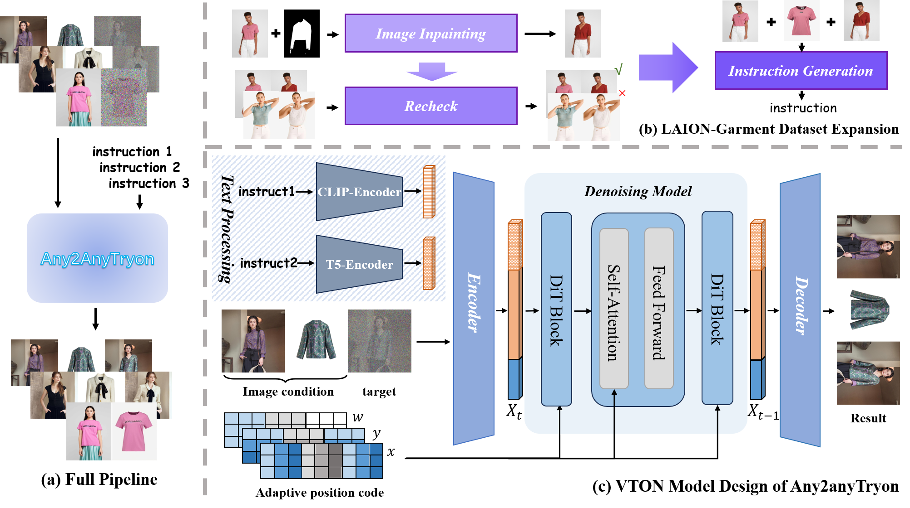

# PAPER: Any2AnyTryon 쉽게 읽기

## 0. 이 문서를 읽는 법

이 문서는 Any2AnyTryon 논문과 공개 코드를 보고, 처음 읽는 사람이 흐름을 놓치지 않도록 다시 정리한 리뷰입니다.

핵심 목표는 하나입니다.

> **Any2AnyTryon은 사람 사진, 옷 사진, 텍스트 지시문을 한 FLUX LoRA 모델에 넣어서 try-on, 옷 추출, 옷 입은 사람 생성 같은 여러 가상 피팅 작업을 처리하려는 방법이다.**

처음 읽을 때는 아래 순서로 보면 좋습니다.

1. 이 논문이 해결하려는 문제
2. 등장인물: `target`, `cond_spa`, `cond_sub`, `prompt`
3. Figure 2로 보는 전체 구조
4. 핵심 아이디어: Adaptive Position Embedding
5. 왜 Clean Latent가 중요한지
6. 코드에서는 실제로 어디서 일어나는지
7. 실험 결과와 한계
8. 자주 헷갈리는 질문

이 문서에서는 GitHub Markdown에서 깨지기 쉬운 LaTeX 수식 대신 일반 텍스트 표기를 씁니다.

```text
LaTeX 대신:
  x_t = (1 - sigma) * x_0 + sigma * noise
  loss = mean(weight * (pred - target)^2)
  pos_id = [role_id, y, x]
```

---

## 1. 메타 정보

| 항목 | 내용 |
|---|---|
| 논문 | Any2AnyTryon: Leveraging Adaptive Position Embeddings for Versatile Virtual Clothing Tasks |
| 저자 | Hailong Guo, Bohan Zeng, Yiren Song, Wentao Zhang, Chuang Zhang, Jiaming Liu |
| arXiv | https://arxiv.org/abs/2501.15891 |
| arXiv 버전 | v1: 2025-01-27, v2: 2025-03-26 |
| 코드 | https://github.com/logn-2024/Any2anyTryon |
| 프로젝트 | https://logn-2024.github.io/Any2anyTryon/ |
| 체크포인트 | https://huggingface.co/loooooong/Any2anyTryon |
| 데이터셋 | https://huggingface.co/datasets/loooooong/LAION-Garment |
| 베이스 모델 | FLUX.1-dev |
| 학습 방식 | FLUX는 frozen, attention LoRA만 학습 |
| 핵심 키워드 | VTON, mask-free try-on, Adaptive Position Embedding, RoPE, clean latent |

---

## 2. 한 문장 요약

> **Any2AnyTryon은 FLUX의 이미지 토큰 위치 좌표 `pos_id = [role_id, y, x]`에서 첫 번째 채널 `role_id`를 "이 토큰이 어떤 역할인지" 알려주는 표식으로 재활용해서, 사람 조건과 옷 조건을 한 시퀀스 안에서 구분하는 방법이다.**

조금 더 쉽게 말하면:

> **FLUX에게 이미지를 그냥 옆으로 붙여서 보여주는 것이 아니라, "이쪽은 만들 대상, 이쪽은 사람 참고 이미지, 이쪽은 옷 참고 이미지"라는 이름표를 위치 임베딩에 붙여준다.**

이 이름표 덕분에 모델은 별도 mask, pose, parsing 없이도 다음을 구분할 수 있습니다.

```text
target   = 새로 만들어야 하는 결과 영역
cond_spa = 사람의 자세와 위치를 알려주는 공간 조건
cond_sub = 옷의 모양과 질감을 알려주는 객체 조건
```

---

## 3. 이 논문이 해결하려는 문제

기존 가상 피팅(Virtual Try-On, VTON)은 보통 입력이 많습니다.

```text
사람 사진
+ 옷 사진
+ 옷 영역 mask
+ pose
+ human parsing
+ dense pose
-> 옷을 입은 사람 이미지
```

이 방식은 성능은 좋지만 사용하기 번거롭습니다. 또한 작업마다 모델이 나뉘는 경우가 많습니다.

```text
try-on 모델              : 사람 + 옷 -> 옷 입은 사람
garment reconstruction   : 옷 입은 사람 -> 옷만 추출
model-free try-on        : 옷 -> 그 옷을 입은 사람 생성
multi-garment extraction : 사람 -> 여러 옷 추출
```

Any2AnyTryon의 목표는 이것입니다.

```text
하나의 FLUX LoRA
+ 다른 입력 조합
+ 다른 prompt
-> 여러 가상 피팅 태스크 처리
```

중요한 점은 "모든 태스크를 완벽하게 SOTA로 이긴다"가 아닙니다. 논문의 핵심은 **한 모델이 여러 입력 형태를 이해하도록 만드는 좌표 설계**입니다.

---

## 4. 등장인물 정리

### 4.1 `target`

`target`은 모델이 새로 생성해야 하는 영역입니다.

표준 try-on에서는 최종 결과 이미지가 `target`입니다.

```text
사람 사진 + 옷 사진 -> target 영역에 "그 옷을 입은 사람"을 생성
```

학습 중에는 `target`에 noise를 섞습니다.

```text
x_t = (1 - sigma) * x_0 + sigma * noise
```

여기서:

| 기호 | 뜻 |
|---|---|
| `x_0` | 정답 target latent |
| `noise` | 랜덤 노이즈 |
| `sigma` | noise 비율 |
| `x_t` | noise가 섞인 target latent |

### 4.2 `cond_spa`

`cond_spa`는 spatial condition입니다.

쉽게 말하면:

> **"사람이 어디에 있고, 어떤 자세를 하고 있고, 몸의 비율이 어떤가"를 알려주는 이미지 조건**

표준 try-on에서는 사람 사진이 `cond_spa`입니다.

```text
cond_spa = 옷을 갈아입힐 사람 사진
```

`spa`는 spatial의 줄임말로 보면 됩니다.

### 4.3 `cond_sub`

`cond_sub`는 subject condition입니다.

쉽게 말하면:

> **"어떤 옷을 참고해야 하는가"를 알려주는 객체 조건**

표준 try-on에서는 평면 옷 사진이 `cond_sub`입니다.

```text
cond_sub = 입힐 옷 사진
```

`sub`는 subject의 줄임말로 보면 됩니다.

### 4.4 `prompt`

`prompt`는 텍스트 지시문입니다.

예:

```text
<MODEL> a man <GARMENT> t-shirt with pockets <TARGET> man wearing the t-shirt
```

중요한 점:

```text
<MODEL>, <GARMENT>, <TARGET>은 이미지 슬롯 인덱스가 아니다.
```

어떤 이미지가 사람이고 어떤 이미지가 옷인지는 prompt 안의 토큰이 아니라, 코드에서 어느 필드로 들어갔는지로 결정됩니다.

```text
model_image   -> condition_spatial_image -> cond_spa
garment_image -> condition_subject_image -> cond_sub
```

---

## 5. 태스크별 입력 구조

Any2AnyTryon은 입력 슬롯을 다르게 채워 여러 작업을 처리합니다.

| 태스크 | `target` | `cond_spa` | `cond_sub` | 결과 |
|---|---|---|---|---|
| 표준 try-on | 새 결과 이미지 | 사람 사진 | 옷 사진 | 사람이 그 옷을 입은 이미지 |
| garment reconstruction | 옷 이미지 | 없음 | 옷 입은 사람 사진 | 옷만 분리한 이미지 |
| model-free try-on | 사람 생성 결과 | 없음 | 옷 사진 | 그 옷을 입은 새 사람 |
| try-on in layers | 새 결과 이미지 | 이미 옷 입은 사람 | 추가할 옷 | 기존 옷 위에 한 벌 추가 |

가장 먼저 이해해야 할 기본형은 표준 try-on입니다.

```text
입력:
  cond_spa = 사람 사진
  cond_sub = 옷 사진
  prompt   = "이 사람이 이 옷을 입게 해라"

출력:
  target = 옷을 입은 사람 사진
```

---

## 6. Figure 2로 보는 큰 그림

Figure 2는 세 부분으로 보면 됩니다.



출처: Guo et al., "Any2AnyTryon", arXiv:2501.15891, Figure 2.

### 6.1 전체 파이프라인

```text
사람 이미지
+ 옷 이미지
+ instruction
-> Any2AnyTryon
-> 결과 이미지
```

논문은 같은 모델이 여러 instruction을 받아 다양한 결과를 만들 수 있다고 주장합니다.

여기서 instruction 1, 2, 3은 한 번의 추론에서 동시에 쓰는 세 문장이 아닙니다. 같은 모델에 다른 prompt와 다른 입력 조합을 넣으면 다른 태스크를 수행할 수 있다는 뜻입니다.

### 6.2 LAION-Garment 데이터 확장

논문은 paired garment-model 데이터가 부족하다는 문제를 합성 데이터로 보완합니다.

```text
원본 사람 사진
-> AutoMasker로 옷 영역 mask 생성
-> FLUX-Controlnet-Inpainting으로 옷 영역 다시 그림
-> GPT-4o로 품질 필터링
-> Florence2로 instruction 생성
-> LAION-Garment triple 구성
```

최종적으로 60,000개 이상의 triple을 만들었다고 설명합니다.

### 6.3 모델 구조

모델 내부는 크게 이렇게 움직입니다.

```text
텍스트 prompt
  -> CLIP encoder
  -> T5 encoder

target latent + cond_spa latent + cond_sub latent
  -> 한 시퀀스로 concat
  -> FLUX DiT block
  -> target 부분만 잘라서 decode
  -> 결과 이미지
```

핵심은 이미지 조건을 별도 branch로 넣는 것이 아니라, **target과 조건 이미지를 한 긴 이미지 토큰 시퀀스로 붙여서 FLUX에 넣는다**는 점입니다.

---

## 7. 핵심 아이디어 1: Adaptive Position Embedding

### 7.1 먼저 FLUX의 이미지 위치 좌표를 이해하기

FLUX는 이미지 토큰마다 위치 정보를 줍니다.

이 논문에서는 그 위치 정보를 다음처럼 이해하면 됩니다.

```text
pos_id = [role_id, y, x]
```

| 채널 | 의미 |
|---|---|
| `role_id` | 이 토큰의 역할 |
| `y` | 세로 위치 |
| `x` | 가로 위치 |

원래 RoPE는 위치를 알려주는 장치입니다. Any2AnyTryon은 여기서 첫 번째 채널을 단순 위치가 아니라 **역할 이름표**처럼 씁니다.

### 7.2 역할 이름표

Any2AnyTryon의 핵심 규칙은 이겁니다.

```text
target -> role_id = 0

조건 영역은 등장 순서대로 role_id가 붙는다.
  cond_spa가 있으면 cond_spa -> role_id = 1
  cond_sub가 있으면 cond_sub -> 다음 role_id
```

표준 try-on처럼 `cond_spa`와 `cond_sub`가 둘 다 있으면 다음과 같습니다.

```text
[0, y, x] = target token
[1, y, x] = spatial condition token
[2, y, x] = subject condition token
```

하지만 garment reconstruction이나 model-free try-on처럼 `cond_spa`가 없고 `cond_sub`만 있으면, `cond_sub`는 첫 번째 조건이므로 `role_id = 1`을 받습니다.

이것이 논문 제목의 Adaptive Position Embedding입니다.

### 7.3 `cond_spa`와 `cond_sub`의 x 좌표가 다르다

여기서 가장 중요한 차이가 나옵니다.

`cond_spa`는 target과 같은 x 좌표계를 씁니다.

```text
target   x = 0 ... W_tgt
cond_spa x = 0 ... W_spa
```

왜냐하면 `cond_spa`는 사람의 자세와 위치를 알려줘야 하기 때문입니다.

```text
target의 (y, x) 위치
cond_spa의 (y, x) 위치
-> 같은 신체 위치로 대응되기를 기대
```

반대로 `cond_sub`는 target 오른쪽으로 밀어서 별도 패널처럼 둡니다.

```text
target   x = 0 ... W_tgt
cond_sub x = W_tgt ... W_tgt + W_sub
```

왜냐하면 옷 사진의 평면 위치는 사람 몸의 위치와 직접 맞지 않기 때문입니다.

```text
옷 사진의 가운데에 있는 로고
사람 몸의 가운데에 있는 로고
-> 반드시 같은 픽셀 좌표일 필요는 없음
```

### 7.4 전체 좌표 규칙

정리하면 다음 표가 핵심입니다.

| 영역 | `role_id` | `y` | `x` |
|---|---:|---|---|
| `target` | 0 | 0 ... H | 0 ... W_tgt |
| `cond_spa` | 1, 있으면 | 0 ... H | 0 ... W_spa |
| `cond_sub` | 2, `cond_spa`도 있으면 | 0 ... H | W_tgt ... W_tgt + W_sub |
| `cond_sub` | 1, `cond_spa`가 없으면 | 0 ... H | W_tgt ... W_tgt + W_sub |

일반 텍스트 수식으로 쓰면:

```text
if condition is cond_spa:
  x_pos = x

if condition is cond_sub:
  x_pos = x + W_tgt
```

이 설계가 하는 일은 간단합니다.

```text
cond_spa는 target과 같은 자리의 정보로 읽히게 한다.
cond_sub는 target 옆에 놓인 독립 reference로 읽히게 한다.
```

---

## 8. 핵심 아이디어 2: Clean Latent

Any2AnyTryon에서 두 번째로 중요한 설계는 Clean Latent입니다.

학습할 때 target에는 noise를 섞습니다.

```text
target:
  x_t = (1 - sigma) * x_0 + sigma * noise
```

하지만 조건 이미지에는 noise를 섞지 않습니다.

```text
cond_spa:
  clean VAE latent 그대로 사용

cond_sub:
  clean VAE latent 그대로 사용
```

이게 왜 중요할까요?

조건 이미지는 모델에게 힌트입니다. 힌트까지 noise로 흐리면 모델은 초반 denoising step에서 옷의 패턴과 사람의 위치를 제대로 읽기 어렵습니다.

```text
나쁜 경우:
  target도 noisy
  condition도 noisy
  -> 모델이 참고해야 할 정보가 흐림

Any2AnyTryon:
  target만 noisy
  condition은 clean
  -> 모델이 매 step 선명한 참고 이미지를 봄
```

추론 중에도 조건 영역은 매 step clean latent로 유지됩니다.

```text
latents = condition 영역은 clean latent로 덮어쓰기
          target 영역만 denoise
```

Ablation에서도 Clean Latent 제거가 큰 성능 하락을 만듭니다. 이 문서에서는 Any2AnyTryon의 실제 성능을 이해할 때 **Adaptive PE와 Clean Latent를 한 쌍으로 봐야 한다**고 정리하는 편이 가장 쉽습니다.

---

## 9. 학습 목표

학습 목표는 FLUX의 flow matching 방식입니다.

복잡한 수식 대신 코드 관점으로 보면 이렇습니다.

```text
1. target latent x_0를 준비한다.
2. noise를 뽑는다.
3. x_t = (1 - sigma) * x_0 + sigma * noise 를 만든다.
4. cond_spa, cond_sub는 clean latent로 붙인다.
5. 모델이 velocity를 예측한다.
6. loss는 target 토큰에 대해서만 계산한다.
```

가장 중요한 줄:

```text
model_pred = model_pred[:, :target_length, :]
```

즉 모델 출력 전체 중에서 앞부분 `target_length`만 잘라 loss를 계산합니다.

일반 텍스트로 쓰면:

```text
target_velocity = noise - x_0
loss = mean(weight * (pred_target - target_velocity)^2)
```

조건 이미지 토큰은 모델 입력에는 들어가지만, 그 조건 이미지를 다시 복원하도록 loss를 걸지는 않습니다.

```text
조건 이미지는 정답으로 맞히는 대상이 아니라,
target을 만들기 위한 참고 자료다.
```

---

## 10. 코드에서 확인할 위치

### 10.1 입력 이미지를 가로로 붙이는 부분

코드:

```text
infer.py
```

핵심 흐름:

```python
concat_image_list = [blank_target]

if has_model_image:
    concat_image_list.append(model_image)      # cond_spa

if has_garment_image:
    concat_image_list.append(garment_image)    # cond_sub

image = concatenate_images_horizontally(concat_image_list)
```

즉 추론 시에도 다음처럼 한 장의 긴 캔버스를 만듭니다.

```text
+----------+----------+----------+
| target   | cond_spa | cond_sub |
+----------+----------+----------+
```

### 10.2 위치 ID를 만드는 부분

코드:

```text
src/utils.py
prepare_latent_image_ids(...)
```

핵심은 아래 세 가지입니다.

```python
# target: role_id = 0
latent_image_ids[..., 0] = 0
latent_image_ids[..., 1] = y
latent_image_ids[..., 2] = x

# cond_spa: 있으면 role_id = 1, x는 0부터 시작
condspa_image_ids[..., 0] = 1
condspa_image_ids[..., 2] = x

# cond_sub: 다음 role_id, x는 target width만큼 offset
#   cond_spa가 있으면 2
#   cond_spa가 없으면 1
condsub_image_ids[..., 0] = next_condition_id
condsub_image_ids[..., 2] = x + width_tgt
```

이 함수가 논문에서 말하는 Adaptive Position Embedding의 실제 구현입니다.

### 10.3 Clean Latent를 붙이는 부분

코드:

```text
train_lora_any2any.py
```

학습 중 target에는 noise를 섞고, 조건은 그대로 붙입니다.

```python
noisy_model_input = (1.0 - sigmas) * model_input + sigmas * noise

packed_noisy_model_input = pack(target_noisy)
packed_condspa_model_input = pack(cond_spa_clean)
packed_condsub_model_input = pack(cond_sub_clean)

packed_input = concat(target_noisy, cond_spa_clean, cond_sub_clean)
```

### 10.4 추론 중 조건 영역 유지

코드:

```text
src/pipeline_tryon.py
```

핵심 흐름:

```python
latents = (1 - init_mask) * init_latents_proper + init_mask * latents
```

뜻:

```text
condition 영역 = 원래 clean latent 유지
target 영역    = denoising으로 갱신
```

---

## 11. 데이터셋: LAION-Garment

### 11.1 왜 데이터셋을 새로 만들었나

VTON에서 가장 큰 병목은 paired 데이터입니다.

paired 데이터란:

```text
같은 사람, 같은 자세, 같은 배경에서
옷만 바뀐 이미지 쌍
```

이런 데이터는 구하기 어렵습니다. 그래서 논문은 합성 파이프라인으로 데이터를 늘립니다.

### 11.2 생성 파이프라인

```text
1. 사람 사진 수집
2. AutoMasker로 옷 영역 추정
3. FLUX-Controlnet-Inpainting으로 옷 영역 다시 생성
4. GPT-4o로 품질 검사
5. Florence2로 instruction 생성
6. target / cond_spa / cond_sub triple 구성
```

최종 규모는 60,000개 이상입니다.

### 11.3 공개 데이터의 실제 스키마

Hugging Face의 `loooooong/LAION-Garment` parquet에는 주로 다음 컬럼이 있습니다.

| 컬럼 | 뜻 |
|---|---|
| `LRVS_INDEX` | 원본 인덱스 |
| `URL` | 원본 이미지 |
| `INPAINT_BYTES` | 인페인팅으로 만든 이미지 bytes |
| `PRODUCT_ID` | 상품 ID |
| `INDEX_SRC` | 출처 인덱스 |
| `CATEGORY` | Upper Body, Lower Body, Whole Body |

중요한 주의점:

```text
공개 parquet에는 caption 또는 prompt 컬럼이 없다.
```

논문은 Florence2로 instruction을 만들었다고 설명하지만, 그 결과 prompt 텍스트까지 parquet에 들어 있지는 않습니다.

따라서 직접 학습하려면 사용자가 prompt를 만들어 jsonl로 구성해야 합니다.

---

## 12. 실험 결과를 쉽게 읽기

### 12.1 Garment Reconstruction

태스크:

```text
옷 입은 사람 사진 -> 옷만 분리한 이미지
```

결과:

| 지표 | TryOffDiff | Any2AnyTryon |
|---|---:|---:|
| SSIM, 높을수록 좋음 | 0.793 | 0.805 |
| LPIPS, 낮을수록 좋음 | 0.334 | 0.328 |
| FID, 낮을수록 좋음 | 20.346 | 13.367 |
| CLIP-FID, 낮을수록 좋음 | 8.371 | 3.872 |
| KID x1000, 낮을수록 좋음 | 6.8 | 3.5 |

해석:

```text
옷 추출에서는 Any2AnyTryon이 꽤 강하다.
특히 FID / CLIP-FID가 크게 좋아진다.
```

### 12.2 Model-Free Try-On

태스크:

```text
옷 사진만 주고 -> 그 옷을 입은 사람 생성
```

결과:

| 방법 | MP-LPIPS, 낮을수록 좋음 | CLIP-I, 높을수록 좋음 | DiffSim, 높을수록 좋음 | FFA, 높을수록 좋음 |
|---|---:|---:|---:|---:|
| Magic Clothing | 0.192 | 0.642 | 0.143 | 0.459 |
| StableGarment | 0.149 | 0.650 | 0.153 | 0.547 |
| Any2AnyTryon | 0.141 | 0.789 | 0.202 | 0.549 |

해석:

```text
옷만 주고 사람을 생성하는 작업에서도 좋은 편이다.
CLIP-I가 크게 높아서 옷 의미 보존이 강하다고 볼 수 있다.
```

### 12.3 표준 Try-On

태스크:

```text
사람 사진 + 옷 사진 -> 사람이 그 옷을 입은 이미지
```

결과 요약:

| 방법 | LPIPS, 낮을수록 좋음 | SSIM, 높을수록 좋음 | FID(U), 낮을수록 좋음 | KID(U), 낮을수록 좋음 |
|---|---:|---:|---:|---:|
| CatVTON | 0.0582 | 0.8653 | 9.083 | 1.130 |
| FitDiT | 0.1059 | 0.8298 | 10.340 | 1.648 |
| Any2AnyTryon | 0.0877 | 0.8387 | 8.965 | 0.981 |

해석:

```text
paired 픽셀 정합:
  CatVTON이 더 좋다.

unpaired 자연스러움:
  Any2AnyTryon이 더 좋다.
```

즉:

```text
정확히 GT와 같은 결과가 중요하면 CatVTON이 강하다.
mask-free, 통합성, 자연스러운 생성 다양성이 중요하면 Any2AnyTryon의 장점이 있다.
```

### 12.4 Ablation

| 설정 | LPIPS, 낮을수록 좋음 | SSIM, 높을수록 좋음 | CLIP-FID, 낮을수록 좋음 | KID, 낮을수록 좋음 |
|---|---:|---:|---:|---:|
| Clean latent 제거 | 0.3141 | 0.6892 | 9.648 | 6.403 |
| Adaptive PE 제거 | 0.3080 | 0.7088 | 9.434 | 5.658 |
| Full model | 0.2590 | 0.7373 | 9.293 | 5.407 |

해석:

```text
Clean latent가 특히 중요하다.
Adaptive PE도 성능에 기여한다.
둘 중 하나만으로 되는 것이 아니라, 둘이 같이 작동해야 한다.
```

---

## 13. LoRA 체크포인트 4종

| LoRA 이름 | 용도 |
|---|---|
| `dev_lora_any2any_alltasks.safetensors` | 통합 모델 |
| `dev_lora_any2any_tryon.safetensors` | 표준 try-on 특화 |
| `dev_lora_garment_reconstruction.safetensors` | 옷 추출 전용 |
| `dev_lora_any2any_multi.safetensors` | multi-garment 추출 전용 |

주의:

```text
multi-garment 추출은 "한 사람 이미지에서 여러 옷을 분리"하는 방향이다.
여러 옷을 동시에 사람에게 입히는 multi-garment try-on과는 다르다.
```

추론 예:

```bash
python infer.py \
  --model_image ./asset/images/model/model1.png \
  --garment_image ./asset/images/garment/garment1.jpg \
  --prompt "<MODEL> a man <GARMENT> t-shirt with pockets <TARGET> man wearing the t-shirt"
```

---

## 14. 핵심을 코드 없이 다시 설명하기

표준 try-on을 예로 들면:

```text
사람 사진 = cond_spa
옷 사진   = cond_sub
결과 영역 = target
```

모델에게는 세 이미지를 이렇게 보여줍니다.

```text
+----------------+----------------+----------------+
| target         | cond_spa       | cond_sub       |
| noisy latent   | clean latent   | clean latent   |
| role_id = 0    | role_id = 1    | role_id = 2    |
+----------------+----------------+----------------+
```

그다음 위치 좌표를 이렇게 붙입니다.

```text
target:
  pos_id = [0, y, x]

cond_spa:
  pos_id = [1, y, x]
  x는 target과 같은 좌표계

cond_sub:
  pos_id = [2, y, x + W_tgt]
  x는 target 오른쪽으로 offset
```

위 도식은 표준 try-on처럼 두 조건이 모두 있는 경우입니다. `cond_spa`가 없으면 `cond_sub`의 숫자는 2가 아니라 1이지만, x 좌표는 여전히 target 오른쪽으로 offset됩니다.

이 설계의 직관:

```text
cond_spa:
  "target의 이 위치에는 이런 몸과 자세가 있어야 해"

cond_sub:
  "참고할 옷은 오른쪽 패널에 따로 있어"

target:
  "이제 두 조건을 보고 결과를 만들어"
```

---

## 15. 자주 헷갈리는 질문

### Q1. 왜 `cond_spa`와 `cond_sub`를 다르게 배치하나?

두 조건의 의미가 다르기 때문입니다.

`cond_spa`는 사람의 자세와 위치를 알려줍니다. 그래서 target과 같은 좌표계를 공유해야 합니다.

```text
사람 사진의 팔 위치
-> 결과 이미지의 팔 위치와 대응되어야 함
```

`cond_sub`는 옷의 모양과 질감을 알려줍니다. 옷 사진의 픽셀 위치가 사람 몸의 픽셀 위치와 직접 대응되지는 않습니다.

```text
평면 옷 사진의 소매 위치
-> 사람이 입었을 때의 소매 위치와 1:1 픽셀 대응은 아님
```

그래서 `cond_sub`는 target 오른쪽에 놓인 별도 reference처럼 처리합니다.

### Q2. prompt의 `<MODEL>`, `<GARMENT>`, `<TARGET>`이 이미지 번호인가?

아닙니다.

이미지 슬롯은 prompt가 아니라 입력 필드로 정해집니다.

```text
--model_image   -> cond_spa
--garment_image -> cond_sub
```

`<MODEL>`, `<GARMENT>`, `<TARGET>`은 prompt 문장을 의미 단위로 나누기 위한 텍스트 convention에 가깝습니다.

이 결론을 뒷받침하는 실증 증거는 Q8 참조.

### Q3. CatVTON보다 항상 좋은가?

아닙니다.

CatVTON은 mask 기반 try-on에 강합니다. paired setting에서 LPIPS와 SSIM은 CatVTON이 더 좋습니다.

Any2AnyTryon의 장점은 다른 쪽입니다.

```text
1. mask 없이 쓸 수 있다.
2. 하나의 구조로 여러 태스크를 처리한다.
3. unpaired FID / KID가 좋다.
4. FLUX 기반이라 reference-driven 생성 확장성이 있다.
```

### Q4. Clean Latent가 왜 그렇게 중요한가?

조건 이미지는 모델이 참고해야 할 힌트입니다.

조건 이미지까지 noise를 섞으면:

```text
옷 디테일이 흐려짐
사람 자세 정보가 흐려짐
초기 denoising step에서 reference가 약해짐
```

Clean Latent를 쓰면:

```text
옷과 사람 조건은 항상 선명함
target만 denoise하면 됨
```

그래서 ablation에서 Clean Latent 제거의 성능 하락이 큽니다.

### Q5. 여러 옷을 동시에 입히는 것도 되나?

논문과 코드 기준으로는 **지원한다고 보기 어렵습니다.**

근거:

```text
1. condition_subject_image는 기본적으로 한 장 슬롯이다.
2. cond_sub 전체가 하나의 같은 role_id로 묶인다.
3. 옷별로 다른 role_id를 주는 구조가 아니다.
4. 공개 multi 체크포인트는 multi-garment "추출"용이다.
5. 논문 평가는 multi-item simultaneous try-on을 정량 평가하지 않는다.
```

실용적으로는 한 번에 한 벌씩 순차 적용하는 layered 방식이 더 안전합니다.

```text
1차: 사람 + 티셔츠 -> 티셔츠 입은 사람
2차: 티셔츠 입은 사람 + 자켓 -> 티셔츠 위에 자켓 입은 사람
```

이게 왜 구조적으로 막혀 있는지(`role_id` 측면)는 Q9 참조. layered 학습 방식은 Q7 참조.

### Q6. 학습 prompt는 어떻게 만들어야 하나?

공개 LAION-Garment parquet에는 prompt가 없으므로 직접 만들어야 합니다.

간단한 템플릿은 다음과 같습니다.

| 태스크 | `cond_spa` | `cond_sub` | prompt 예 |
|---|---|---|---|
| 표준 try-on | 사람 사진 | 옷 사진 | `Change her dress to a brown dress` |
| 하의 try-on | 사람 사진 | 바지 사진 | `Change her pants to plaid trousers` |
| garment reconstruction | 없음 | 옷 입은 사람 | `A plaid shirt` |
| model-free try-on | 없음 | 옷 사진 | `A smiling woman wearing the garment` |

jsonl 예:

```json
{
  "target_image": "/data/inpaint_00.jpg",
  "condition_spatial_image": "/data/src_00.jpg",
  "condition_subject_image": "/data/garment_flat_00.jpg",
  "prompt": [
    "Change her dress to a brown dress",
    "Replace the model's outfit with a brown long dress",
    "She is now wearing a brown dress"
  ]
}
```

코드에서는 prompt가 리스트면 epoch마다 랜덤으로 하나를 고를 수 있습니다.

### Q7. try-on in layers는 어떻게 학습했나?

논문 4.1과 4.5에 따르면 이렇게 처리했습니다.

**a. 2단계 학습 (curriculum)**

```text
1단계: layered 제외한 모든 태스크
         (표준 try-on, garment reconstruction, model-free) 학습
2단계: layered 데이터 + 1단계 태스크의 일부 subset 으로 fine-tune
```

layered 만 따로 학습한 게 아니라, **이미 잘 학습된 통합 모델 위에 layered 데이터를 끼얹어 추가 학습**합니다. 한꺼번에 학습하면 layered가 다른 태스크 학습을 흔드는 문제를 회피하려는 의도로 보입니다.

**b. 슬롯 구조는 표준 try-on과 동일**

새 슬롯을 추가하지 않습니다. 데이터와 prompt만 다릅니다.

```text
cond_spa = 이미 옷 A 를 입은 모델 사진
cond_sub = 위에 덧입을 옷 B 한 벌
prompt   = "옷 A 위에 옷 B 를 덧입혀라" 같은 자연어 지시
target   = 옷 A + 옷 B 를 같이 입은 모델
```

옷이 한 벌만 새로 들어가므로 Q9의 "여러 옷이면 role_id가 똑같다" 문제가 안 걸립니다.

**c. mask-free라서 더 어렵다**

논문 본문 인용:

> The try-on-in-layer task is very challenging, especially for mask-free try-on, as the method must identify specific editing locations only with text guidance.

```text
일반 try-on : 옷 영역이 명확 (상의 swap 이면 상의 영역만 바꿈)
layered     : 기존 옷을 어디까지 살릴지를 prompt 만으로 결정
              -> "안에 입은 옷은 그대로, 그 위에 덧입어라"
                 라는 의미를 자연어에서 모델이 읽어내야 함
```

mask가 없으니 어디에 옷을 추가할지를 prompt가 짚어줘야 합니다. 학습 난이도가 높아지는 이유입니다.

**d. 평가는 정성 비교만**

```text
비교 대상: DiOr (Cui et al., 2021), "dressing in order"
방식    : DiOr 원본 논문의 예시 입력을 가져와 본 모델로 재생성
결과    : Figure 7 의 정성적 비교
정량 지표: 없음
```

LPIPS·SSIM·FID 같은 정량 지표가 layered에 대해 표로 제시되지 않습니다.

**e. 추론 시 LoRA 선택**

체크포인트 4종 중 `dev_lora_any2any_alltasks.safetensors` 만 layered를 포함합니다. `_tryon` / `_garment_reconstruction` / `_multi` 에는 layered 능력이 없거나 약합니다.

### Q8. `<MODEL>`, `<GARMENT>`, `<TARGET>`이 진짜 이미지 슬롯 인덱스가 아니라는 실증

세 가지 증거가 있습니다.

**증거 1: validation_preset.jsonl의 실제 prompt에 등장 횟수 0번**

`asset/images/validation_preset.jsonl`은 저자가 학습·검증에 사용한 공식 prompt입니다.

```json
{"condition_spatial": "model3.png", "condition_subject": "garment3.png", "prompt": "Change her dress to brown dress"}
{"condition_spatial": "model4.png", "condition_subject": "garment4.jpg", "prompt": "Change her pants to plaid trousers."}
{"condition_spatial": null,         "condition_subject": "model1.png",   "prompt": "A plaid shirt"}
{"condition_spatial": null,         "condition_subject": "garment3.jpg", "prompt": "A smiling woman with the garment walking on the street"}
```

```text
<MODEL>   등장 횟수 : 0
<GARMENT> 등장 횟수 : 0
<TARGET>  등장 횟수 : 0
```

만약 정식 슬롯 토큰이었다면 학습·검증 prompt에 반드시 등장해야 합니다. 그런데 없습니다.

**증거 2: 이미지는 prompt가 아니라 별도 CLI 인자로 들어간다**

```text
infer.py CLI
  --model_image   -> condition_spatial_image -> cond_spa
  --garment_image -> condition_subject_image -> cond_sub
  --prompt        default=""  (비워도 추론 동작)
```

`--prompt`가 비어도 추론이 돕니다. `<MODEL>`이 진짜 슬롯 인덱스라면 prompt 없이는 슬롯 매칭이 깨져야 하는데, 그렇지 않습니다.

**증거 3: 코드상 special token 등록 근거가 없다**

이 토큰들이 진짜 이미지 슬롯이라면 보통 다음 중 하나가 있어야 합니다.

```text
1. tokenizer.add_special_tokens(...)
2. special token embedding resize
3. prompt parser가 <MODEL> / <GARMENT> / <TARGET>을 이미지 슬롯으로 해석
```

하지만 공개 코드의 입력 경로는 이미지 슬롯을 CLI 인자와 JSON 필드로 정합니다. 따라서 `<MODEL>`, `<GARMENT>`, `<TARGET>`은 정식 특수 토큰이라기보다 prompt 텍스트를 의미 단위로 나눈 시각적 separator로 보는 편이 안전합니다.

### Q9. `cond_sub` 슬롯에 옷이 여러 벌이면 role_id는 어떻게 되나?

핵심 결론: **모든 옷이 cond_sub 슬롯의 같은 role_id를 받습니다. 옷별로 다른 ID가 부여되지 않습니다.**

표준 try-on처럼 `cond_spa`도 있으면 cond_sub의 role_id는 2입니다. `cond_spa`가 없고 `cond_sub`만 있으면 cond_sub의 role_id는 1입니다.

**a. 코드의 실제 동작**

```text
src/utils.py 의 prepare_latent_image_ids:

cond_mark = 0

if width_spa > 0:
    cond_mark += 1                # -> 1
    cond_spa 영역 전체 role_id = 1

if width_sub > 0:
    cond_mark += 1                # -> cond_spa가 있으면 2, 없으면 1
    cond_sub 영역 전체 role_id = cond_mark
```

`cond_mark`는 **슬롯 영역 단위로 한 번만 증가**합니다. 그래서 cond_sub 영역 전체에 같은 값이 칠해집니다.

**b. 옷 N벌을 넣으려면 단일 cond_sub 슬롯에 가로로 이어 붙여야 한다**

```text
cond_sub 영역 = [ 옷1 | 옷2 | ... | 옷N ]  가로로 concat
                 W1     W2          WN
width_sub = W1 + W2 + ... + WN
```

이때 N벌 모두에 부여되는 좌표:

| 옷 | role_id | y | x |
|---|---:|---|---|
| 옷1 | same cond_sub id | 0 ... H | W_tgt ... W_tgt + W1 |
| 옷2 | same cond_sub id | 0 ... H | W_tgt + W1 ... W_tgt + W1 + W2 |
| 옷3 | same cond_sub id | 0 ... H | W_tgt + W1 + W2 ... |

```text
모든 옷의 role_id = cond_sub 슬롯 ID  (동일)
옷별로 다른 것은 x 좌표뿐
```

**c. 실제로 무엇이 일어나는가**

```text
서로 다른 카테고리 (옷1=셔츠, 옷2=바지)
  -> 옷의 모양 자체가 상의/하의 단서가 됨
  -> prompt 의 "shirt", "pants" 등이 시각적으로 매칭
  -> 그럭저럭 동작할 수 있음

같은 카테고리 (옷1=빨간 셔츠, 옷2=파란 셔츠)
  -> 둘 다 상의 모양, role_id 도 같음
  -> 모델 입장에서 두 옷은 거의 호환됨
  -> 한 옷이 다른 옷에 흡수되거나 두 옷이 섞이는 경향
```

**d. 진짜로 옷별 인덱싱을 하려면**

코드를 이렇게 고쳐야 합니다.

```python
# 현재 (단일 mark)
condsub_image_ids[..., 0] = cond_mark    # cond_sub 영역 전체가 같은 값

# 옷별 mark 부여
for k, (h_k, w_k) in enumerate(garment_sizes):
    block_ids[..., 0] = cond_mark + k    # 옷1=2, 옷2=3, ...
```

그러나:

```text
1. Any2AnyTryon 의 학습 데이터는 트리플 (target, cond_spa, cond_sub) 각 1장.
2. 따라서 모델은 "target + 최대 두 조건 슬롯" 패턴만 학습한 상태.
3. 옷별 role_id = 3, 4, ... 를 새로 주는 학습 신호가 없음.
4. 코드만 고쳐도 가중치가 무지함 -> 의미 있는 동작이 안 나옴.
5. 새 데이터 + 재학습이 필요.
```

이것이 Q5 (multi-item 동시 입히기 미지원) 의 가장 근본적인 구조적 이유입니다.

reference 이미지 자체의 N개 지원 한계는 Q10 참조.

### Q10. 이 연구는 reference 이미지가 여러 개인 경우를 지원하나?

**아닙니다.** 본 논문 전체에서 reference 이미지의 최대 개수는 **2장 (cond_spa 1장 + cond_sub 1장)** 이고, 그 이상이 들어가는 경로 자체가 존재하지 않습니다.

이름이 "any2any" 라 다중 reference 가 가능해 보이지만, 실제로는 **2-into-1 mapping** 의 우아한 사례입니다.

**a. 어디서 이게 확인되는가**

```text
[1] 학습 데이터셋 스키마
  jsonl 한 row =
    target_image            : 1장
    condition_spatial_image : 1장 (또는 null)
    condition_subject_image : 1장 (또는 null)
  -> 가변 N 슬롯 없음

[2] prepare_latent_image_ids 의 시그니처
  prepare_latent_image_ids(height, width_tgt,
                            height_spa, width_spa,
                            height_sub, width_sub, ...)
  -> spa / sub 각각 단일 (height, width) 한 쌍
  -> 슬롯이 가변 길이로 늘어나는 인터페이스가 아예 없음

[3] 4가지 태스크별 입력 개수
  표준 try-on            : cond_spa 1장 + cond_sub 1장
  garment reconstruction : cond_sub 1장
  model-free try-on      : cond_sub 1장
  layered try-on         : cond_spa 1장 + cond_sub 1장
  -> 어디에도 N장 reference 없음

[4] multi LoRA 도 입력은 1장
  dev_lora_any2any_multi.safetensors
  = "한 모델 사진(입력 1장) 에서 여러 옷을 분리해서 출력"
  -> 출력 쪽이 multi 이지 입력 쪽이 multi 가 아님
```

**b. 왜 본질적 한계인가**

Any2AnyTryon의 Adaptive Position Embedding은 우아하지만 **"2가지 종류 (spatial / subject) 의 reference 를 1장씩 받는다"** 라는 가정 위에서 우아합니다.

```text
학습된 구조가 target + 최대 두 조건 슬롯에 맞춰져 있음
  -> 타겟 / spa / sub 외 다른 의미 슬롯이 없음
  -> reference 이미지 2개 = 한계

진짜 multi-reference 를 지원하려면 필요한 것:
  - 가변 길이 N 슬롯을 받는 인터페이스         -> 없음
  - 옷마다 다른 role_id 학습                  -> 없음
  - multi-reference 페어 데이터셋             -> 없음
  - 평가 벤치마크                             -> 없음
```

**c. multi-reference 가 진짜 필요하면 봐야 할 연구**

```text
M&M VTO (CVPR 2024)
  -> 여러 옷 이미지 + 텍스트 layout 묘사
  -> "어떤 슬롯이 무엇인지" 를 텍스트로 매칭

MuGa-VTON (2025.08)
  -> GRM / PRM / A-DiT 모듈로 상의 + 하의 jointly model
  -> mask 기반 multi-garment, DiT 류

OmniGen / OmniGen2
  -> 가변 multi-reference 를 자연어 + 위치 인덱스로 처리

IP-Adapter Multi-Reference
  -> 여러 IP-Adapter 가중치를 합성

OminiControl (2024)
  -> ControlNet 분기를 다중 reference 로 확장
```

**d. 정리**

```text
Any2AnyTryon 의 디자인은 "1 spatial + 1 subject" 두 reference 모델이고,
이게 코드, 데이터, 위치 임베딩, 평가 모든 층에 일관되게 깔려 있다.

장점 : 단순하고 학습이 안정적이며 작은 LoRA 로 통합 처리.
단점 : 진짜 multi-reference 가 필요한 시나리오
       (멀티 옷 동시 입히기, 여러 인물 합성, 다중 IP 보존 등) 에는
       구조적으로 부적합.

이름이 "any2any" 라고 해서 입력 reference 가 가변이라는 뜻이 아니다.
"target 슬롯이 무엇이든, cond 슬롯이 무엇이든 통합 처리"
라는 의미의 any2any 다.
```

---

## 16. 한계와 주의점

1. paired LPIPS / SSIM은 CatVTON보다 약합니다.
2. 평가에서 `--repaint`를 쓰는 경우 mask 기반 후처리 또는 보조 절차가 다시 들어갑니다.
3. 데이터 생성에 GPT-4o 같은 closed model이 들어가 재현성이 약합니다.
4. 공개 데이터셋에는 caption/prompt가 없습니다.
5. 합성 데이터는 FLUX-Inpaint의 artifact를 포함할 수 있습니다.
6. LoRA-only 학습이므로 FLUX.1-dev의 기본 분포 편향을 그대로 물려받을 수 있습니다.
7. 여러 옷을 동시에 입히는 multi-garment try-on은 구조적으로 명확히 지원하지 않습니다.

---

## 17. 최종 정리

Any2AnyTryon을 가장 짧게 이해하면 다음입니다.

```text
문제:
  기존 VTON은 mask, pose, parsing 같은 보조 입력이 많고 태스크별 모델이 나뉜다.

해결:
  FLUX의 이미지 토큰 위치 좌표를 [role_id, y, x]로 보고,
  role_id를 target / spatial condition / subject condition 구분에 사용한다.

핵심 설계:
  target   = noisy latent, role_id 0
  cond_spa = clean latent, 있으면 role_id 1, target과 같은 x 좌표
  cond_sub = clean latent, 다음 role_id, target 오른쪽으로 x offset

학습:
  조건 이미지는 clean latent로 유지하고,
  loss는 target 토큰에만 건다.

결과:
  하나의 FLUX LoRA 구조로 try-on, 옷 추출, model-free try-on 등을 처리한다.

주의:
  표준 try-on의 픽셀 정합은 CatVTON이 더 강할 수 있고,
  여러 옷 동시 입히기는 지원한다고 보기 어렵다.
```

한 줄로 줄이면:

> **Any2AnyTryon은 "무엇을 만들지"와 "무엇을 참고할지"를 별도 모듈이 아니라 RoPE 위치 좌표의 역할 ID로 구분하게 만든 FLUX 기반 통합 가상 피팅 LoRA다.**
