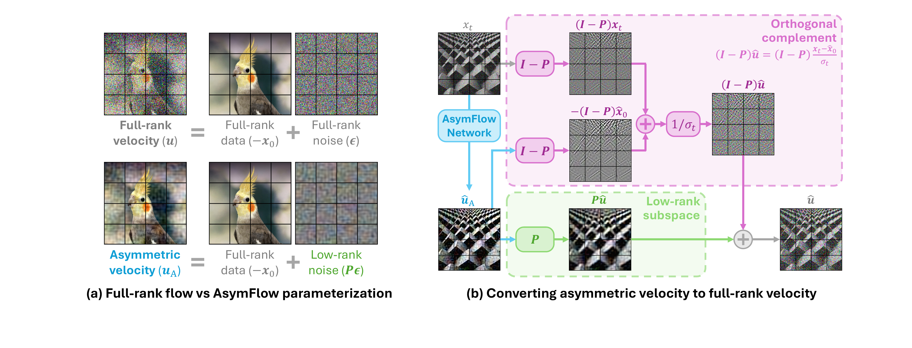
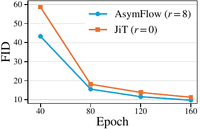

# PAPER: AsymFlow - 픽셀 공간 Flow Matching 쉽게 읽기

## 0. 이 문서를 읽는 법

이 문서는 **Asymmetric Flow Models** 논문과 공개 코드(`configs/asymflow/`)를 보고, 처음 읽는 사람이 흐름을 놓치지 않도록 다시 정리한 리뷰입니다.

핵심 목표는 하나입니다.

> **AsymFlow는 픽셀 공간 flow matching이 어려웠던 이유를 "노이즈 정답이 너무 고차원이라서"라고 보고, 학습 정답의 노이즈 부분만 저랭크로 줄여 픽셀 모델을 다시 강하게 만드는 방법이다.**

DMD/DMD2 문서와 같이 읽는다면 이렇게 보면 좋습니다.

```text
DMD/DMD2   = 느린 diffusion teacher를 빠른 student로 증류하는 방법
AsymFlow   = flow matching의 학습 타깃 자체를 더 배우기 쉽게 바꾸는 방법
```

이 문서는 아래 순서로 읽으면 편합니다.

1. AsymFlow가 해결하려는 문제
2. Flow Matching 기본 기호: x₀, ε, xₜ, u
3. 핵심 아이디어: u = ε - x₀를 u_A = Pε - x₀로 바꾸기
4. P가 무엇인지: PCA 기반 저랭크 사영
5. 왜 다시 full velocity로 복원해야 하는지
6. ImageNet scratch 학습과 FLUX pixel finetune
7. 실험 결과와 FAQ

---

## 1. 메타 정보

| 항목 | 내용 |
|---|---|
| 논문 | Asymmetric Flow Models |
| 저자 | Hansheng Chen, Jan Ackermann, Minseo Kim, Gordon Wetzstein, Leonidas Guibas |
| 공개일 | 2026-05-13, arXiv v1 |
| arXiv | https://arxiv.org/abs/2605.12964 |
| 공식 코드 | https://github.com/Lakonik/LakonLab (`configs/asymflow/`) |
| 분야 | 이미지 생성, Flow Matching, 픽셀 공간 생성 모델 |
| 주요 실험 | ImageNet-256 scratch 학습, FLUX.2 klein pixel-space finetune |
| 외부 모델 | FLUX.2 klein Base 9B, Qwen2.5-VL recaptioning |
| 데이터 | ImageNet-256, LAION-Aesthetics 3M subset |

---

## 2. 한 문장 요약

> **AsymFlow는 flow matching의 정답 velocity에서 데이터 항 -x₀는 그대로 두고, 노이즈 항 ε만 Pε로 저랭크 사영해서 네트워크가 쓸데없는 풀랭크 랜덤 노이즈를 배우지 않게 만드는 방법이다.**

조금 더 쉽게 말하면:

> **기존 픽셀 flow model은 이미지 자체를 배우는 동시에, 모든 픽셀 방향의 무작위 노이즈까지 정답처럼 맞춰야 했다. AsymFlow는 "이미지에 의미 있는 주요 방향의 노이즈만 남기자"라고 정답을 바꾼다.**

가장 중요한 식은 두 개입니다.

```text
u = ε - x₀
```

```text
u_A = Pε - x₀
```

여기서 u는 기존 flow matching의 정답 velocity이고, u_A는 AsymFlow의 새 정답입니다. 차이는 딱 하나입니다.

```text
기존:      ε 전체를 정답에 넣음
AsymFlow: Pε, 즉 중요한 r개 방향의 noise만 정답에 넣음
```

---

## 3. AsymFlow가 해결하려는 문제

### 3.1 왜 픽셀 공간 모델이 어려운가

이미지를 latent 공간이 아니라 픽셀 공간에서 바로 다룬다고 생각합니다.

예를 들어 256x256 RGB 이미지는 차원이 이만큼 큽니다.

```text
256 x 256 x 3 = 196,608 차원
```

Flow matching은 깨끗한 이미지 x₀와 랜덤 노이즈 ε 사이를 잇는 경로를 학습합니다.

```text
clean image x₀
      |
      |  중간 상태 xₜ
      v
random noise ε
```

기존 정답 velocity는 다음입니다.

```text
u = ε - x₀
```

문제는 ε입니다.

ε는 이미지와 달리 의미 있는 구조가 없습니다. 그냥 모든 픽셀 방향에 흩뿌려진 랜덤 노이즈입니다. 픽셀 공간에서는 이 랜덤 노이즈가 거의 20만 차원짜리 정답으로 들어갑니다.

그래서 네트워크 입장에서는 이런 일을 해야 합니다.

```text
해야 하는 일 1: 이미지의 의미 있는 구조 배우기
해야 하는 일 2: 모든 픽셀 방향의 랜덤 노이즈까지 정답처럼 맞추기
```

AsymFlow의 관점은 단순합니다.

> **2번은 너무 낭비다. 이미지가 실제로 많이 변하는 주요 방향만 남기고, 나머지 랜덤 노이즈는 정답에서 빼자.**

### 3.2 latent 모델이 유리했던 이유

Stable Diffusion이나 FLUX 같은 모델은 보통 VAE로 이미지를 latent로 압축한 뒤 diffusion/flow를 돌립니다.

```text
pixel image -> VAE encoder -> compact latent
```

latent 공간은 픽셀보다 훨씬 작고, 이미 어느 정도 압축되어 있습니다. 그래서 풀랭크 픽셀 노이즈를 직접 맞추는 부담이 줄어듭니다.

AsymFlow는 이 점을 다르게 해석합니다.

```text
latent가 좋은 이유:
  이미지 정보를 압축해서 노이즈 예측 부담이 줄어든다

AsymFlow의 질문:
  그러면 픽셀 공간에서도 노이즈 정답만 압축하면 되지 않을까?
```

이 질문에서 논문 전체가 시작됩니다.

---

## 4. Flow Matching 기본 기호

AsymFlow를 이해하려면 먼저 표준 flow matching의 기호를 잡아야 합니다.

### 4.1 등장하는 값

| 기호 | 뜻 |
|---|---|
| x₀ | 깨끗한 이미지, 데이터 |
| ε | 가우시안 랜덤 노이즈 |
| t | 시간 또는 noise level |
| xₜ | x₀와 ε를 섞은 중간 상태 |
| u | 표준 flow matching이 예측하는 velocity |
| u_A | AsymFlow가 예측하는 asymmetric velocity |
| P | 노이즈를 중요한 부분공간으로 떨어뜨리는 projector |

### 4.2 중간 상태 xₜ

표준 rectified flow / flow matching에서는 보통 다음처럼 clean image와 noise를 직선으로 섞습니다.

```text
xₜ = (1-t)x₀ + tε
```

직관적으로는 이렇습니다.

```text
t = 0   -> 거의 clean image
t = 0.5 -> image와 noise가 반반 섞임
t = 1   -> 거의 pure noise
```

### 4.3 정답 velocity u

이 직선 경로에서 정답 velocity는 다음입니다.

```text
u = ε - x₀
```

즉 네트워크는 xₜ와 t를 보고, "이 지점에서 noise 방향으로 가는 속도"를 예측합니다.

```text
network(xₜ, t) -> û
target          -> ε - x₀
```

AsymFlow는 여기서 네트워크 구조를 바꾸지 않습니다. 바꾸는 것은 target입니다.

---

## 5. 핵심 아이디어: 노이즈 항만 저랭크로 줄이기

### 5.1 기존 정답과 AsymFlow 정답

기존 flow matching 정답:

```text
u = ε - x₀
```

AsymFlow 정답:

```text
u_A = Pε - x₀
```

두 식을 나란히 보면 차이가 선명합니다.

| 항목 | 기존 Flow Matching | AsymFlow |
|---|---|---|
| 데이터 항 | -x₀ | -x₀ |
| 노이즈 항 | ε | Pε |
| 의미 | 모든 노이즈 방향 학습 | 중요한 r개 방향의 노이즈만 학습 |

중요한 점:

```text
데이터 x₀는 줄이지 않는다.
노이즈 ε만 줄인다.
```

그래서 이름이 **Asymmetric Flow**입니다. 데이터와 노이즈를 대칭적으로 다루지 않고, 노이즈에만 저랭크 사영을 겁니다.

### 5.2 Pε이 의미하는 것

P는 projector입니다. 어떤 벡터를 특정 부분공간으로 떨어뜨리는 선형 연산입니다.

```text
ε       = 모든 방향의 랜덤 노이즈
Pε      = 중요한 r개 방향에 남은 노이즈
(I-P)ε  = 잘라낸 나머지 노이즈
```

그림으로 생각하면 이렇습니다.

```text
원래 noise:
  모든 방향으로 삐죽삐죽한 고차원 랜덤 벡터

AsymFlow noise:
  이미지 데이터가 자주 변하는 주요 방향으로만 남긴 noise
```

즉 AsymFlow는 입력 노이즈를 없애는 방법이 아닙니다. **학습 정답 안에 들어가는 노이즈 항만 정리하는 방법**입니다.

### 5.3 무엇이 제거되는가

노이즈는 항상 다음처럼 나눌 수 있습니다.

```text
ε = Pε + (I-P)ε
```

이걸 기존 정답에 넣으면:

```text
u = ε - x₀
  = Pε + (I-P)ε - x₀
```

AsymFlow 정답은:

```text
u_A = Pε - x₀
```

따라서 차이는 정확히 이것입니다.

```text
u - u_A = (I-P)ε
```

말로 풀면:

> **AsymFlow는 표준 velocity target에서 P 바깥쪽 랜덤 노이즈 (I-P)ε만 제거한다.**

이게 논문의 핵심입니다.

---

## 6. P는 어떻게 만드는가: PCA basis

### 6.1 P = AAᵀ

논문에서는 projector를 다음처럼 둡니다.

```text
P = A Aᵀ
```

여기서 A는 중요한 방향들을 열로 모아둔 행렬입니다.

```text
A = [중요한 방향 1, 중요한 방향 2, ..., 중요한 방향 r]
```

r은 rank, 즉 몇 개 방향을 남길지입니다.

ImageNet scratch 실험에서는:

```text
patch size = 16 x 16 x 3 = 768 차원
r = 8
```

즉 768차원 patch noise를 8개 주요 방향으로만 남깁니다.

### 6.2 왜 PCA를 쓰는가

노이즈 자체는 모든 방향이 똑같습니다.

```text
ε ~ N(0, I)
```

그래서 노이즈만 보고는 "어떤 방향이 중요한가"를 고를 수 없습니다. 모든 방향이 같은 분산을 가지기 때문입니다.

대신 데이터 patch를 봅니다.

```text
ImageNet patch들을 많이 모음
-> PCA를 돌림
-> 이미지 patch가 실제로 자주 변하는 방향을 찾음
-> 그중 상위 r개를 A로 사용
```

이렇게 하면 P는 다음 의미를 가집니다.

```text
P = 이미지 데이터가 자주 변하는 주요 방향만 남기는 필터
```

### 6.3 ImageNet에서 PCA 절차

ImageNet scratch 학습에서는 대략 다음 과정을 한 번 수행합니다.

1. ImageNet 이미지를 16x16 RGB patch로 자릅니다.
2. patch 하나를 768차원 벡터로 펼칩니다.
3. 많은 patch를 모아 PCA를 합니다.
4. 고유값이 큰 상위 8개 방향을 고릅니다.
5. 그 방향들을 A로 저장합니다.
6. 학습 중에는 A를 업데이트하지 않고 고정합니다.

코드 기준으로는 PCA subspace가 checkpoint로 저장되어 사용됩니다.

```text
checkpoints/asymflow_subspace_pca_dit.pth
```

---

## 7. Figure 2로 보는 AsymFlow

### 7.1 Figure 2(a): 학습 target 바꾸기

<p align="center">
  
</p>

*Source: Chen et al., "Asymmetric Flow Models", arXiv:2605.12964 (2026), Fig. 2.*

Figure 2(a)는 기존 flow와 AsymFlow target을 비교합니다.

```text
기존:
  u = ε - x₀

AsymFlow:
  u_A = Pε - x₀
```

여기서 봐야 할 것은 하나입니다.

```text
노이즈 그림이 full-rank noise에서 low-rank noise로 바뀐다.
데이터 x₀ 항은 그대로다.
```

즉 AsymFlow는 이미지를 압축하는 방법이 아니라, **정답 velocity 안의 noise part를 압축하는 방법**입니다.

### 7.2 Figure 2(b): 다시 full velocity로 복원하기

학습 target은 u_A로 바꿨지만, 샘플링과 flow update에는 결국 full velocity가 필요합니다.

그래서 네트워크 출력 û_A를 다시 û로 바꿔야 합니다.

논문이 쓰는 복원 공식은 다음입니다.

```text
û
= Pû_A
+ (I-P)(xₜ + û_A) / σₜ
```

처음 보면 복잡하지만 의미는 단순합니다.

```text
P 안쪽:
  u_A가 원래 velocity u와 같으므로 그대로 사용

P 바깥쪽:
  u_A는 사실 -x₀처럼 생겼으므로,
  x₀ prediction을 velocity prediction 형태로 바꿔서 사용
```

### 7.3 왜 P 안쪽은 그대로 써도 되는가

AsymFlow target은 다음입니다.

```text
u_A = Pε - x₀
```

양쪽에 P를 곱하면:

```text
P u_A = P(Pε - x₀)
      = Pε - P x₀
```

기존 velocity u = ε - x₀에 P를 곱하면:

```text
P u = P(ε - x₀)
    = Pε - P x₀
```

따라서:

```text
P u_A = P u
```

즉 P 안쪽 부분공간에서는 AsymFlow target이 기존 velocity와 정확히 같습니다.

### 7.4 왜 P 바깥쪽은 x₀ prediction처럼 되는가

이번에는 I-P를 곱합니다.

```text
(I-P)u_A
= (I-P)(Pε - x₀)
```

P 안에 있는 것은 I-P로 보면 사라집니다.

```text
(I-P)Pε = 0
```

그래서:

```text
(I-P)u_A = -(I-P)x₀
```

즉 P 바깥쪽에서 AsymFlow target은 velocity가 아니라 **clean image x₀를 예측하는 형태**가 됩니다. 부호만 반대입니다.

정리하면:

| 영역 | AsymFlow가 하는 일 |
|---|---|
| P 안쪽, top-r 방향 | 기존 flow velocity와 동일하게 학습 |
| I-P 바깥쪽 | 랜덤 노이즈를 제거하고 x₀ prediction처럼 학습 |

그래서 AsymFlow는 u-prediction과 x₀-prediction을 섞은 family로 볼 수 있습니다.

---

## 8. rank r로 보는 통합 해석

AsymFlow는 r 값에 따라 기존 parameterization들을 포함합니다.

### 8.1 r = 0

P = 0이면:

```text
u_A = -x₀
```

즉 전체가 x₀ prediction과 비슷해집니다.

### 8.2 r = D

P = I이면:

```text
u_A = ε - x₀ = u
```

즉 기존 flow matching의 u-prediction과 완전히 같습니다.

### 8.3 0 < r ≪ D

AsymFlow가 실제로 쓰는 영역입니다.

```text
너무 작으면:
  velocity 정보를 거의 못 씀

너무 크면:
  다시 풀랭크 랜덤 노이즈를 많이 맞춰야 함

적당히 작으면:
  의미 있는 방향의 velocity만 배우고, 나머지 낭비를 줄임
```

ImageNet에서는 r=8 근처가 sweet spot으로 보고됩니다.

---

## 9. 두 가지 사용 시나리오

AsymFlow는 크게 두 방식으로 쓰입니다.

```text
1. ImageNet에서 픽셀 모델을 scratch로 학습
2. 이미 학습된 latent FLUX 모델을 pixel 모델로 옮겨 finetune
```

### 9.1 ImageNet scratch 학습

이 실험은 AsymFlow 자체가 효과가 있는지 가장 깨끗하게 보여줍니다. 사전학습 latent 모델을 가져오는 것이 아니라, 픽셀 공간에서 처음부터 학습합니다.

코드 기준:

```text
configs/asymflow/asymflow_h_16_r8_imagenet_8gpus.py
```

주요 설정:

| 항목 | 값 |
|---|---|
| 백본 | JiT-H/16 계열 pixel transformer |
| 입력 | 256x256 RGB image |
| patch size | 16 |
| patch dimension | 16x16x3 = 768 |
| rank | r=8 |
| optimizer | AdamW, lr 2e-4 |
| batch | 8 GPU x 128 = 1024 |
| training | 600 epoch, 약 750K iter |
| LoRA | 사용하지 않음 |

핵심은 이것입니다.

> **ImageNet 결과는 LoRA나 latent pretrained boost가 아니라, AsymFlow parameterization 자체의 효과를 보여주는 scratch 실험이다.**

### 9.2 FLUX.2 klein pixel-space finetune

두 번째 시나리오는 더 실용적입니다. 이미 학습된 latent T2I 모델을 버리지 않고, pixel-space 모델로 옮깁니다.

코드 기준:

```text
configs/asymflow/asymflux2_klein_32gpus.py
```

여기서는 PCA 대신 **Procrustes alignment**로 A를 만듭니다.

왜냐하면 목표가 단순 scratch 학습이 아니라:

```text
pretrained latent representation
        |
        v
pixel patch representation
```

이 둘을 잘 맞춰서 기존 FLUX.2 klein 가중치를 최대한 재사용하는 것이기 때문입니다.

주요 설정:

| 항목 | 값 |
|---|---|
| base model | FLUX.2 klein Base 9B |
| 공간 | latent -> pixel RGB |
| VAE | 제거 |
| 색공간 | Oklab 정규화 |
| rank | r=128 |
| A 구성 | latent-pixel Procrustes alignment |
| 학습 방식 | base frozen + rank-256 LoRA |
| 데이터 | LAION-Aesthetics 3M subset |
| caption | Qwen2.5-VL recaptioning |
| 학습 | 32 GPU, batch 256, 20K iter |
| sampling | UniPC + APG, 38 step |

여기서 LoRA와 AsymFlow의 low-rank는 서로 다릅니다.

| 구분 | 어디에 적용되는 low-rank인가 | 역할 |
|---|---|---|
| AsymFlow P = AAᵀ | 데이터/노이즈 target | noise 항을 저랭크로 줄임 |
| LoRA | 모델 weight update | 9B base를 적은 파라미터로 finetune |

---

## 10. 실험 결과 요약

### 10.1 ImageNet 256x256

AsymFlow는 픽셀 공간 모델로 latent baseline에 근접하거나 일부와 동급 결과를 냅니다.

| 모델 | 공간 | FID |
|---|---|---|
| DiT-XL/2 | latent | 약 2.27 |
| DiT-XL + RAE | latent | 1.50 |
| REPA-XL/2 | latent | 1.38 |
| AsymFlow JiT-H/16, r=8 | pixel | 1.76 |
| AsymFlow JiT-H/16, r=8 + REPA | pixel | 1.57 |

읽는 포인트:

```text
픽셀 공간 모델이 더 이상 크게 뒤처지지 않는다.
노이즈 target만 바꿔도 latent 모델과 경쟁 가능한 수준까지 올라간다.
```

### 10.2 수렴 속도

논문은 AsymFlow가 같은 FID에 더 빨리 도달한다고 보고합니다.

<p align="center">
  
</p>

읽는 포인트:

```text
per-step 계산이 크게 빨라지는 것이 아니다.
학습해야 하는 target이 쉬워져서, 같은 품질까지 필요한 epoch 수가 줄어든다.
```

논문에서는 비슷한 FID에 도달하는 데 약 40% 빠르다고 설명합니다.

### 10.3 rank r ablation

rank를 바꾸면 이런 경향이 나옵니다.

```text
r = 0:
  x₀ prediction에 가까움. 충분하지 않음.

r가 조금 증가:
  FID가 좋아짐.

r = 8 근처:
  ImageNet sweet spot.

r가 너무 큼:
  다시 불필요한 랜덤 노이즈를 많이 학습하게 되어 이득이 줄어듦.
```

즉 핵심은 "무조건 rank를 크게"가 아닙니다.

> **작지만 0은 아닌 rank가 좋다.**

### 10.4 T2I 결과

AsymFLUX.2 klein은 FLUX.2 klein 9B를 pixel-space로 옮긴 모델입니다.

논문은 HPSv3, DPG-Bench, GenEval 등에서 strong latent baseline과 비교합니다. 핵심 주장은:

```text
AsymFlow 방식으로 pixel-space conversion을 하면,
단순 latent finetune이나 DDT-style pixel finetune보다 좋은 품질과 prompt following을 얻는다.
```

정확한 수치는 논문 Table 3, Table 4를 보는 것이 좋습니다. 이 문서에서 기억할 점은 하나입니다.

> **AsymFlow는 ImageNet용 작은 트릭이 아니라, pretrained T2I latent model을 pixel model로 옮기는 데도 쓸 수 있다.**

---

## 11. 코드에서 어떤 부분을 보면 좋은가

공식 코드는 `Lakonik/LakonLab` 안의 `configs/asymflow/`를 중심으로 보면 됩니다.

### 11.1 ImageNet scratch

```text
configs/asymflow/asymflow_h_16_r8_imagenet_8gpus.py
```

여기서 확인할 것:

```text
base_rank = 8
patch_size = 16
in_channels = 3
pretrained_linear_proj / PCA subspace checkpoint
```

### 11.2 FLUX pixel finetune

```text
configs/asymflow/asymflux2_klein_32gpus.py
```

여기서 확인할 것:

```text
base_rank = 128
FLUX.2-klein-base-9B loading
pretrained_linear_proj = asymflow_subspace_procrustes.pth
LoRA rank = 256
Oklab preprocessing
```

### 11.3 코드 읽을 때의 핵심 질문

코드를 볼 때는 다음 세 가지를 찾으면 됩니다.

```text
1. target을 u에서 u_A로 바꾸는 곳은 어디인가?
2. P 또는 A를 적용하는 곳은 어디인가?
3. network output û_A를 full velocity û로 복원하는 곳은 어디인가?
```

AsymFlow의 본질은 모델 architecture가 아니라 이 세 지점에 있습니다.

---

## 12. 자주 헷갈리는 점

### Q1. 입력 노이즈 자체를 저랭크로 만드는가?

아닙니다.

입력 xₜ를 만들 때의 노이즈와 샘플링 초기 노이즈는 여전히 full-rank입니다. AsymFlow가 바꾸는 것은 **학습 target 안의 노이즈 항**입니다.

```text
바꾸는 것:
  target u = ε - x₀
  -> target u_A = Pε - x₀

바꾸지 않는 것:
  모델 구조
  optimizer
  sampler의 큰 틀
  입력 noise 자체
```

### Q2. 왜 x₀는 사영하지 않는가?

x₀는 이미지 정보입니다. 사영하면 정보가 손실됩니다.

반면 ε는 랜덤 노이즈입니다. 특히 데이터가 거의 변하지 않는 방향의 노이즈는 네트워크가 굳이 맞출 가치가 낮습니다.

그래서 AsymFlow는 비대칭입니다.

```text
데이터 항: full-rank 유지
노이즈 항: low-rank로 압축
```

### Q3. LoRA와 같은 low-rank인가?

아닙니다.

둘 다 low-rank라는 단어를 쓰지만 적용 위치가 다릅니다.

```text
AsymFlow:
  학습 target의 noise part를 줄임

LoRA:
  모델 weight update를 low-rank adapter로 제한
```

ImageNet scratch 실험은 LoRA 없이도 동작합니다.

### Q4. PCA denoising과 비슷한가?

비슷하게 볼 수 있습니다. 다만 일반적인 PCA denoising은 데이터 자체를 깨끗하게 만들 때 쓰고, AsymFlow는 **학습 정답**을 깨끗하게 만듭니다.

```text
일반 PCA denoising:
  noisy data -> PCA top components만 남김

AsymFlow:
  velocity target 안의 noise ε -> PCA top components만 남김
```

그래서 한 줄로 말하면:

> **AsymFlow는 PCA denoising을 flow matching target에 적용한 것처럼 볼 수 있다.**

### Q5. 왜 PCA의 큰 eigenvalue 방향에 노이즈를 남기는가?

PCA의 큰 eigenvalue 방향은 이미지 patch가 실제로 많이 변하는 방향입니다.

Flow matching은 noise에서 data로 가는 경로를 배우는 방식입니다. 그러려면 노이즈도 데이터가 의미 있게 변하는 방향에 있을 때 학습 가치가 큽니다.

반대로 작은 eigenvalue 방향은 데이터가 거의 가지 않는 방향입니다. 그쪽의 랜덤 노이즈는 target에 있어도 네트워크에게 유용한 학습 신호가 되기 어렵습니다.

```text
큰 eigenvalue 방향:
  데이터가 자주 변함 -> flow를 배울 가치 있음

작은 eigenvalue 방향:
  데이터가 거의 없음 -> 랜덤 노이즈를 맞추는 낭비가 큼
```

---

## 13. PCA 관점으로 다시 이해하기

이 절은 AsymFlow를 가장 직관적으로 이해하는 방법입니다.

한 줄로 말하면:

> **AsymFlow는 PCA denoising을 이미지 데이터가 아니라 flow matching의 학습 정답에 적용한 것이다.**

일반적인 PCA denoising은 noisy image에서 작은 주성분 방향을 버려 데이터를 깨끗하게 만듭니다.

```text
일반 PCA denoising:
  noisy data
  -> PCA top-r 방향만 남김
  -> 작은 eigenvalue 방향의 noise 제거
```

AsymFlow는 같은 생각을 학습 target에 적용합니다.

```text
AsymFlow:
  target u = ε - x₀
  -> target u_A = Pε - x₀
  -> target 안의 작은 eigenvalue 방향 noise 제거
```

### 13.1 표준 target을 PCA 방향으로 쪼개기

노이즈는 항상 두 조각으로 나눌 수 있습니다.

```text
ε = Pε + (I-P)ε
```

여기서:

```text
Pε:
  PCA top-r 방향에 남은 noise

(I-P)ε:
  PCA bottom 방향에 남은 noise
```

표준 flow target은:

```text
u = ε - x₀
```

여기에 위 분해를 넣으면:

```text
u = Pε + (I-P)ε - x₀
```

AsymFlow target은:

```text
u_A = Pε - x₀
```

둘을 비교하면:

```text
표준 u:
  Pε + (I-P)ε - x₀

AsymFlow u_A:
  Pε +        0       - x₀
```

즉 AsymFlow가 제거한 것은 정확히 이 부분입니다.

```text
(I-P)ε
```

말로 바꾸면:

> **데이터가 거의 변하지 않는 PCA bottom 방향의 랜덤 노이즈를 학습 정답에서 제거한다.**

### 13.2 top-r 방향과 bottom 방향의 역할 분담

PCA 관점에서는 이미지 patch 공간을 두 영역으로 나눠 볼 수 있습니다.

| PCA 영역 | 데이터 관점 | 표준 target에 들어있던 것 | AsymFlow가 하는 일 |
|---|---|---|---|
| top-r 방향 | 이미지가 실제로 많이 변하는 방향 | 의미 있는 데이터 변화 + 그 방향의 noise | 유지 |
| bottom 방향 | 데이터가 거의 가지 않는 방향 | 거의 무의미한 랜덤 noise | 제거 |

조금 더 직관적으로 쓰면:

```text
top-r 방향:
  이미지의 밝기, 색, 큰 패턴처럼 데이터가 자주 움직이는 방향
  -> 여기서는 flow를 배울 가치가 있음

bottom 방향:
  데이터가 거의 쓰지 않는 미세한 고차원 방향
  -> 표준 target에서는 랜덤 noise만 남기 쉬움
  -> 네트워크가 맞춰도 별 의미가 없음
```

그래서 AsymFlow의 효과는 이렇게 볼 수 있습니다.

```text
신호 방향에는 학습을 남긴다.
노이즈 방향에는 학습 부담을 없앤다.
```

### 13.3 왜 데이터 PCA를 노이즈에 적용하는가

처음 보면 이상할 수 있습니다.

```text
PCA는 데이터에서 구했는데,
왜 그 P를 노이즈 ε에 적용하지?
```

이유는 노이즈 자체에는 중요한 방향이 없기 때문입니다.

```text
ε ~ N(0, I)
```

가우시안 노이즈는 모든 방향의 분산이 같습니다. 그래서 노이즈만 보면 어떤 방향이 중요한지 고를 수 없습니다.

반면 데이터는 방향별로 분산이 다릅니다.

```text
이미지 patch:
  자주 변하는 방향이 있음
  거의 안 변하는 방향도 있음
```

AsymFlow는 데이터 PCA를 이용해 "이미지가 실제로 움직이는 방향"을 찾고, 노이즈를 그 방향 안에만 남깁니다.

즉:

```text
데이터 PCA = 이미지가 의미 있게 변하는 좌표계를 찾는 도구
Pε = 그 좌표계 안에만 남긴 noise
```

### 13.4 Fig.2를 PCA 언어로 읽기

Figure 2의 각 위치를 PCA 관점으로 읽으면 다음과 같습니다.

| Fig.2 위치 | 식 | PCA 관점 의미 |
|---|---|---|
| (a) Full-rank velocity | u = ε - x₀ | PCA denoising을 하지 않은 학습 정답 |
| (a) Full-rank data | -x₀ | 이미지 신호. 줄이지 않고 유지 |
| (a) Full-rank noise | ε | 모든 방향에 흩어진 랜덤 노이즈 |
| (a) Asymmetric velocity | u_A = Pε - x₀ | bottom noise를 제거한 학습 정답 |
| (a) Low-rank noise | Pε | PCA top-r 방향에만 남긴 노이즈 |
| (b) Low-rank subspace | Pû_A | top-r 방향. velocity로 그대로 사용 |
| (b) Orthogonal complement | (I-P)û_A | bottom 방향. x₀ prediction처럼 해석 |
| (b) Final sum | û | 두 방향을 합쳐 full velocity 복원 |

Figure 2(a)는 **학습 전에 target을 PCA denoising하는 단계**이고, Figure 2(b)는 **PCA top/bottom 방향에서 다르게 해석한 결과를 다시 합치는 단계**입니다.

### 13.5 이중 denoising으로 보면 더 쉽다

AsymFlow에는 denoising이 두 층으로 들어있다고 볼 수 있습니다.

```text
1. PCA denoising:
   학습 target에서 bottom 방향 랜덤 노이즈를 제거

2. Flow matching denoising:
   네트워크가 noise 상태에서 data 상태로 가는 velocity를 학습
```

이 둘은 같은 일을 반복하는 것이 아닙니다.

```text
PCA denoising:
  학습하기 전에 정답을 깨끗하게 만듦

Flow matching denoising:
  깨끗해진 정답을 보고 생성 경로를 배움
```

그래서 AsymFlow의 직관은 이렇게 정리할 수 있습니다.

> **먼저 PCA로 학습 정답의 쓸데없는 노이즈를 치우고, 그다음 flow matching이 의미 있는 방향의 노이즈-데이터 변환을 배운다.**

---

## 14. AsymFlow를 한 번에 다시 보기

전체 알고리즘을 가장 단순하게 쓰면 다음입니다.

### 학습 전

```text
1. 이미지 patch들을 모은다.
2. PCA를 한다.
3. 상위 r개 방향을 A로 저장한다.
4. P = A Aᵀ로 projector를 만든다.
```

### 학습 중

```text
1. clean image x₀를 뽑는다.
2. noise ε를 뽑는다.
3. xₜ = (1-t)x₀ + tε를 만든다.
4. 기존 target u = ε - x₀ 대신
   AsymFlow target u_A = Pε - x₀를 쓴다.
5. network(xₜ, t)가 u_A를 예측하도록 학습한다.
```

### 샘플링 또는 velocity 사용 시

```text
1. network가 û_A를 낸다.
2. P 안쪽 성분은 velocity로 그대로 쓴다.
3. P 바깥쪽 성분은 x₀ prediction처럼 해석해 velocity로 변환한다.
4. 둘을 합쳐 full velocity û를 만든다.
```

공식:

```text
û
= Pû_A
+ (I-P)(xₜ + û_A) / σₜ
```

---

## 15. 이 논문의 기여

1. **Asymmetric velocity parameterization**  
   u_A = Pε - x₀라는 새 target을 제안합니다.

2. **픽셀 공간 flow matching의 학습 부담 감소**  
   풀랭크 랜덤 노이즈를 모두 맞추지 않아도 되게 만듭니다.

3. **x₀-prediction과 u-prediction의 통합 해석**  
   r=0이면 x₀-prediction, r=D이면 기존 u-prediction이 됩니다.

4. **scratch와 pretrained finetune 둘 다 지원**  
   scratch 학습에서는 PCA, latent-to-pixel finetune에서는 Procrustes alignment로 A를 만듭니다.

5. **픽셀 공간 모델의 경쟁력 회복**  
   ImageNet 256에서 FID 1.57, FLUX.2 klein pixel finetune에서도 강한 T2I 결과를 보입니다.

---

## 16. 한 줄 요약

> **AsymFlow는 flow matching target u = ε - x₀에서 노이즈 항만 Pε로 바꿔, 네트워크가 의미 없는 풀랭크 픽셀 노이즈를 덜 배우게 하고 픽셀 공간 생성 모델의 품질과 수렴 속도를 끌어올린다.**
