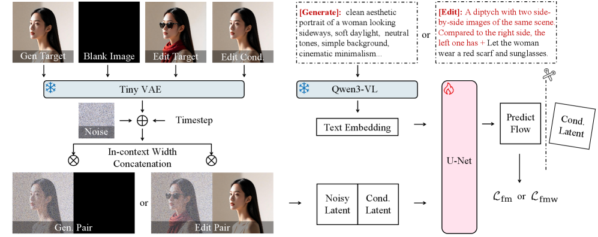

# PAPER: DreamLite — 0.39B UNet 한 개로 폰에서 1초 만에 끝내는 통합 T2I+편집 모델

## 📌 메타 정보

| 항목 | 내용 |
|---|---|
| **논문 제목** | DreamLite: A Lightweight On-Device Unified Model for Image Generation and Editing |
| **저자** | Kailai Feng 외 (ByteDance Vision Lab) |
| **공개일** | 2026-03 (arXiv v1) |
| **분야** | 이미지 생성/편집 · 온디바이스 (on-device) 효율 모델 |
| **논문 링크** | https://arxiv.org/abs/2603.28713 |
| **PDF** | https://arxiv.org/pdf/2603.28713 |
| **HTML** | https://arxiv.org/html/2603.28713 |
| **공식 코드** | https://github.com/ByteVisionLab/DreamLite |
| **가중치** | 이메일 신청 + 안전 검토 후 배포 (Early Access) |
| **사용 외부 모델** | Qwen3-VL-2B (텍스트+편집용 멀티모달 인코더), TinyVAE (AutoencoderTiny, 이미지 압축기), HPSv3 (생성 보상 모델, generation reward), EditReward (편집 보상 모델) |
| **라이선스** | 코드 Apache-2.0 / 가중치 CC BY-NC 4.0 |

---

## 📖 주요 용어 사전 (Glossary)

읽기 전 알아두면 좋은 용어의 *정의*만 모았습니다. 자세한 수치·메커니즘은 본문에서 한 번만 다룹니다.

### 아키텍처 관련

- **UNet (U자형 인코더-디코더)**: Stable Diffusion 계열의 표준 백본. 입력을 다운샘플(downsampling)했다가 다시 업샘플(upsampling)하면서 양쪽 같은 해상도 단계를 skip-connection으로 잇는 구조. 본 논문은 SDXL UNet을 출발점으로 깎음.
- **Depthwise Separable Convolution (깊이방향 분리 합성곱)**: 일반 conv를 두 단계로 쪼개는 기법. 채널별로 따로 conv한 뒤 (depthwise) 1×1 conv로 채널을 섞음 (pointwise). MobileNet에서 유래한 모바일 표준.
- **Multi-Query Attention (단일 KV-헤드 어텐션, MQA)**: Q는 헤드별로 따로 두지만 K·V는 *모든 헤드가 공유*하는 어텐션 변형. 메모리·KV cache가 헤드 수만큼 줄어 모바일에 유리.
- **QK-RMSNorm**: 어텐션 Q와 K에 RMSNorm을 추가로 적용해 깊은 학습에서 발산을 막는 안정화 기법.
- **TinyVAE (AutoencoderTiny)**: SD VAE의 경량판 (수십 MB). 1024² 이미지를 128×128 latent로 압축하는 데 ms 단위 시간만 듦.
- **Qwen3-VL-2B**: 알리바바가 공개한 20억 파라미터 비전-언어 모델 (Vision-Language Model). 본 논문은 이 모델을 *그대로 가져와* 텍스트 인코더 겸 편집용 이미지 인코더로 *동시에* 사용 — 둘로 분리 안 함.

### 핵심 개념 (본 논문 고유)

- **In-Context Spatial Concatenation (잠재 공간 가로 이어붙이기)**: 본 논문 핵심 아이디어. UNet 입력 latent를 **타겟 노이즈와 조건 이미지를 가로 축으로 concat(이어붙임)** 해서 한 장처럼 만들어 통과시킴. ControlNet/Reference-Net처럼 별도 가지 (branch) 없이 파라미터 추가 0개로 편집 기능 획득.
- **Task Token (`[Generate]` / `[Edit]`)**: 텍스트 프롬프트 맨 앞에 붙는 라우팅 토큰. 모델이 "이번 입력이 생성인지 편집인지"를 인지할 수 있게 해주는 가벼운 스위치 신호.
- **Foreground-Emphasis Mask (전경 강조 가중치)**: 편집 학습 시 변경 영역에 손실 가중치를 더 주는 mask. 작은 영역만 바뀌는 편집에서 "안 바뀐 큰 배경"이 학습 신호를 다 잡아먹는 문제를 막음. 가중치 함수는 로그형 w(x) = log₂(x)+1.
- **Task-Progressive Joint Pretraining (단계적 사전학습)**: T2I → 편집 → 통합의 3단계 커리큘럼. 처음부터 섞으면 둘 다 망가져서 순서를 강제함.

### 학습·후처리 관련

- **Flow Matching**: 디퓨전의 한 변종. 노이즈와 진짜 이미지를 t 비율로 섞은 점에서 *속도 벡터(velocity)*를 학습하는 방식. (예: x_t = t·x + (1-t)·ε 에서 모델은 x - ε 을 예측 — 즉 진짜 방향)
- **ReFL (Reward Feedback Learning)**: 강화학습으로 디퓨전 모델을 미세조정하는 단순한 알고리즘. PPO/GRPO와 달리 *보상 - 베이스라인이 양수인 샘플만* gradient를 흘림. 손실: -max(0, r(c,x̂) - b).
- **HPSv3**: Human Preference Score v3 — 사람 선호 점수를 흉내내는 생성 품질 보상 모델. 본 논문은 생성용 ReFL의 보상으로 사용 (베이스라인 b=11).
- **EditReward**: 편집 결과 품질을 평가하는 전용 보상 모델 (베이스라인 b=2.5).
- **DMD2 (Distribution Matching Distillation 2)**: 28-step teacher의 *분포 자체*를 4-step student가 흉내내도록 학습하는 증류 (distillation) 방식. 관련: [[paper_dmd2]].

### 평가 지표

- **GenEval**: T2I 능력 종합 점수. 개체 수 세기, 색·위치·속성 등 6개 카테고리.
- **DPG-Bench**: 긴 프롬프트의 *밀집 정보* 충실도 평가.
- **ImgEdit**: 편집 9개 유형(추가/제거/교체/조정/배경/스타일/추출/동작/하이브리드) 점수.
- **GEdit-EN-Q**: 편집을 Qwen-VL-2.5로 의미 일치·지각 품질로 채점하는 벤치.

### 비교 대상 (같은 체급)

- **SnapGen / SnapGen++**: Snap이 만든 온디바이스 T2I 모델. 0.4B 급, 512² 중심.
- **SANA-0.6B**: NVIDIA의 효율 DiT. linear attention 기반.

---

## 1️⃣ 논문 한눈에 보기 (TL;DR)

> "통합 모델(unified model)은 무조건 크다"는 통념을 깨고, **0.39B 단일 UNet** 하나로 T2I와 편집을 동시에 수행하면서 **Xiaomi 14 같은 폰에서 1024² 이미지 1장을 1초 미만에** 만드는 첫 온디바이스 통합 디퓨전 모델.

핵심 비결 세 가지:
1. **In-Context Spatial Concatenation** — 별도 conditioning 분기 없이 가로 concat 한 방으로 편집 기능 흡수
2. **3단계 점진 사전학습** — T2I → 편집 → 통합 순서로 학습 (직진 학습보다 GenEval 6점 ↑)
3. **DMD2로 4-step 압축 + ReFL로 품질 정렬** — base는 28-step CFG 사용, mobile은 4-step CFG-free

성능: GenEval 0.72 / DPG 85.8 / ImgEdit 4.11 / GEdit-EN 6.88 — **0.5B 미만 모델 중 최초로 편집까지 커버**.

---

## 2️⃣ 핵심 기여 (Contributions)

1. **0.5B 미만 unified diffusion 최초 사례** — T2I와 편집을 한 UNet에 통합한 가장 작은 모델.
2. **In-Context Spatial Concatenation** — 파라미터 추가 0개로 편집 기능을 흡수하는 latent 공간 가로 concat 메커니즘.
3. **Task-Progressive Joint Pretraining 커리큘럼** — T2I → 편집 → 통합 3단계로 두 작업이 서로를 망가뜨리지 않게 학습.
4. **모바일에 살아남는 SDXL UNet 압축 레시피** — 채널/블록/conv/attention을 단계별로 깎아 2.5B → 389M.
5. **온디바이스 실측 검증** — Snapdragon 8 Gen3 415ms / Dimensity 9300 490ms (4-step 1024² 기준, W8A8 양자화).

---

## 3️⃣ 알고리즘 상세

### 3.1 백본 압축 — SDXL UNet → 389M

*왜 이 절을 두는지: 폰에 들어갈 모델 크기·연산량을 줄이려면 어디를 어떻게 깎아도 품질이 무너지지 않는지가 가장 중요한 출발점이기 때문.*

원본 SDXL UNet은 약 2.5B 파라미터인데, 다음 표처럼 단계별로 깎아 0.39B로 줄였습니다.

| 항목 | 원본 SDXL | DreamLite |
|---|---|---|
| Transformer 블록 수 (해상도 단계별) | [0, 2, 10] | [0, 2, **4**] |
| 채널 폭 | [320, 640, 1280] | [256, 512, **896**] |
| 고해상도 단계 self-attention | 있음 | **제거** |
| Convolution | 표준 conv | **Depthwise + Pointwise 분리** |
| Attention | Multi-Head Attention (MHA) | **Multi-Query Attention (MQA, KV 헤드 1개)** |
| FFN 확장비 | 4 | **3** |
| 안정화 | — | **QK-RMSNorm** 추가 |
| 텍스트 인코더 | CLIP/T5 | **Qwen3-VL-2B** (편집 시 비전 토큰도 함께 입력) |
| VAE | SD VAE | **TinyVAE (AutoencoderTiny)** |
| Latent 해상도 | 128×128 | 128×128 (유지) |

**가장 결정적인 변경은 고해상도 단계의 self-attention 제거.** Attention은 토큰 수의 제곱으로 연산이 폭발하는데, 1024² 해상도에서 128×128 토큰은 16,384개 — 폰에서 이걸 self-attention 돌리면 죽습니다. 대신 cross-attention만 남기고 self는 더 깊은 (= 토큰 수 적은) 단계에만 둠.

코드에서 본체는 `dreamlite/models/unets/unet_2d_condition_mobile.py` 의 `DreamLiteUNetModel` 클래스.

### 3.2 In-Context Spatial Concatenation — 본 논문 핵심 트릭

*왜 이 방식을 쓰나: 편집 기능을 추가할 때 보통은 ControlNet/Reference-Net처럼 별도 가지를 다는데, 그러면 파라미터가 늘어남. 모바일에서는 그 여유가 없어서 "공짜로" 편집을 흡수할 방법이 필요했음.*

#### 전체 그림 (Fig. 2)

<p align="center">
  
</p>

*Source: Feng et al., "DreamLite: A Lightweight On-Device Unified Model for Image Generation and Editing", arXiv:2603.28713 (2026), Fig. 2 — "Overview of DreamLite architecture. It consists of three primary modules: a UNet backbone, a Variational Autoencoder (VAE), and a text encoder. To support unified generation and editing, an in-context conditioning framework is adopted that unifies both tasks at the input level."*

##### 그림 읽는 법 (좌→우)

그림은 입력에서 출력까지의 한 번의 forward pass를 따라가는 다이어그램입니다. 다섯 부분만 보면 됩니다.

1. **왼쪽 상단 — 두 가지 입력 모드**
   - **생성 모드 (Generate)**: `[타겟 이미지 | 검정 이미지]` 한 쌍. 학습 시엔 GT 타겟이 들어가지만, 추론에선 타겟 자리에 노이즈가 들어감.
   - **편집 모드 (Edit)**: `[타겟 이미지 | 소스 이미지]` 한 쌍. 두 패널이 가로로 나란히 놓임.
   - 즉 입력 자체가 "가로로 두 배 긴 한 장"의 모양을 띠게 강제됨 — 이게 in-context spatial concatenation의 시각적 핵심.

2. **TinyVAE로 압축** — 두 패널을 함께 가진 1024×2048 픽셀 (또는 학습 시 더 작은 해상도) 이미지를 latent로 압축. 출력 latent도 가로 2배 (128×256 형태).

3. **노이즈 추가 + In-context Concatenation** — flow matching 학습 규칙대로 `z_t = t·z + (1-t)·ε`. 그런데 여기서 *노이즈는 타겟 패널에만* 섞고, 조건 패널 (오른쪽 절반)은 깨끗한 latent 그대로 유지됨. 그래서 그림에서 "Noisy Latent + Cond Latent"가 가로로 이어진 한 텐서가 됩니다.

4. **오른쪽 상단 — Qwen3-VL이 텍스트 임베딩 생성** — 텍스트 프롬프트 앞에 `[Generate]` 또는 `[Edit]` 태스크 토큰이 prepend되어 들어감. 편집 모드에서는 *소스 이미지도 비전 토큰으로 함께* Qwen3-VL에 들어가서 한 인코더가 텍스트+이미지 양쪽을 같이 처리.

5. **UNet이 속도 벡터 (velocity) 예측** — 가로 2배 latent + timestep + 텍스트 임베딩을 받아 `v = z - ε`을 예측. 이 v로 다시 한 step 디노이징. 출력 latent의 *왼쪽 절반*만 잘라서 결과로 사용 (오른쪽 절반은 조건 정보 보조용).

##### 그림에서 놓치기 쉬운 디테일

- **타겟과 조건이 같은 텐서에 들어간다** = self-attention과 conv가 매 단계 두 패널 사이로 정보를 흘릴 수 있음 → 별도 cross-attention/branch 불필요. 이게 spatial concat이 채널 concat (InstructPix2Pix 방식) 보다 ImgEdit에서 0.21점 앞서는 구조적 이유.
- **노이즈는 한쪽에만 추가** = 손실은 타겟 패널 픽셀에서만 계산. 조건 패널은 "정답을 그대로 노출한 reference"로 동작.
- **태스크 토큰의 자리** = 텍스트 임베딩에 들어가지 latent에 안 들어감. 즉 UNet은 latent의 모양 (왼쪽이 노이즈인지 검정인지)으로 한 번, cross-attention의 task token으로 또 한 번 — *이중으로* 모드 신호를 받음.

#### 메커니즘

UNet에 들어가는 latent를 다음처럼 만듭니다.

```
z_pair = Concat(z_target, z_condition, dim=width)
```

- **생성 모드**: `z_condition`은 **검정 이미지의 latent** (다 0)
- **편집 모드**: `z_condition`은 **소스 이미지의 latent**

즉 UNet 입장에선 "가로로 두 배 긴 이미지 한 장"을 처리하는 것. 출력도 가로 2배 latent로 나오고, 왼쪽 절반만 잘라 디코딩하면 결과 이미지가 됩니다.

추가로 텍스트 프롬프트 맨 앞에 **`[Generate]` 또는 `[Edit]` 라우팅 토큰**을 붙여서, 같은 가중치가 두 모드를 명확히 구별할 수 있게 신호를 줍니다.

#### 코드에서의 확인

`dreamlite/pipelines/dreamlite/pipeline_dreamlite.py` 핵심 라인 (CFG 분기 포함):

```python
# line 397-399 (텍스트 CFG만)
latents_in = torch.cat([latents] * 2)
cond_img_in = torch.cat([image_latents] * 2)
model_input = torch.cat([latents_in, cond_img_in], dim=3)  # ← dim=3 = width 축

# line 403-405 (편집 모드, 텍스트+이미지 이중 CFG)
latents_in = torch.cat([latents] * 3)
cond_img_in = torch.cat([uncond_image_latents, image_latents, image_latents])
model_input = torch.cat([latents_in, cond_img_in], dim=3)
```

dim=3은 [B, C, H, W] 텐서의 마지막 축 → width 방향 concat. 코드 한 줄이면 끝납니다.

#### CFG 처리

편집 모드에서는 InstructPix2Pix 방식의 **이중 가이던스 (text + image guidance)** 를 씁니다.

```
noise_pred = noise_uncond
           + s_text  · (noise_text - noise_image)
           + s_image · (noise_image - noise_uncond)
```

세 갈래 (무조건부 / 이미지조건부 / 이미지+텍스트조건부) 를 한 배치로 돌려 합성. base는 `guidance_scale=3.5`, `image_guidance_scale=1.0`이 기본값 (`infer.py`).

#### 왜 잘 되는가

UNet의 **self-attention과 conv가 두 패널 사이로 정보를 자연스럽게 흘려보내기** 때문에, 별도 cross-attention 분기가 필요 없습니다. ViT/DiT의 시퀀스 concat과 사상이 같지만, UNet은 공간 구조를 보존하므로 spatial concat이 더 자연스러움.

#### 한계 (논문에 명시되진 않지만 구조적으로 자명)

가로 2배 latent = **메모리·연산 약 2배 증가**. 1024² 편집은 실질적으로 1024×2048 처리. 폰에서 편집은 생성보다 무거움.

### 3.3 Task-Progressive Joint Pretraining — 3단계 사전학습

*왜 단계를 나누나: T2I와 편집을 처음부터 섞으면 두 작업이 서로 학습 신호를 망가뜨림. 사람이 그림 그리는 법을 먼저 배우고, 그 다음 고치는 법을 배우는 것과 같은 순서가 필요함.*

| 단계 | 학습 대상 | 데이터 규모 | 손실 | 비고 |
|---|---|---|---|---|
| **1. T2I 사전학습** | 생성만 (z_cond = 검정) | 2000만 장 | flow matching | 해상도 커리큘럼 256 → 512 → 1024 |
| **2. 편집 사전학습** | 편집만 (z_cond = 소스) | 174만 장 | flow matching + **foreground-emphasis mask** | concat 메커니즘 활성화 |
| **3. 통합 학습** | 둘 다 (1:1 혼합) | 위 데이터 섞음 | flow matching + 태스크 토큰 라우팅 | 최종 단계 |

#### 데이터 구성

**T2I 2000만 장**:
- 일반 이미지 14.8M / 인물·초상화 0.4M / 그래픽 디자인 0.4M / scene text 1.5M / 예술 스타일 0.6M / 특수 2.4M

**편집 174만 장**:
- 의미 이해 (understanding) 429k / 로컬 편집 830k / 글로벌 편집 300k / 시점 (view) 편집 151k / 스타일 편집 31k

#### Foreground-Emphasis Mask (식 3의 핵심)

편집은 보통 작은 영역만 바뀝니다. 손실을 픽셀 평균 내면 *안 바뀐 큰 배경*이 학습 신호를 다 가져가서 변경 영역이 잘 안 배움.

해결책: 변경 영역과 비변경 영역의 비율로 가중치 mask `w`를 만들고, 로그 함수 `w(x) = log₂(x)+1` 로 부드럽게 키워서 변경 영역에 신호를 몰아줍니다.

손실식 (말로 풀어쓰면):
```
L_fmw = E[ ‖ w ⊙ (v_θ(z_t, t, y) - (z - ε)) ‖² ]
```
즉 *예측한 속도 벡터*와 *진짜 속도 벡터 (z - ε)* 의 차이를 픽셀별로 가중치 w 곱해서 L2 측정. (`⊙`는 픽셀별 곱)

이건 시간 축(t)에서 가중치를 조정하는 [[paper_min_snr]] (Min-SNR) 과 사상은 같고, 축이 다른 셈입니다 — 거긴 시간 가중, 여긴 공간 가중.

#### Task Token의 역할

3단계 통합 학습에서 한 모델이 두 모드를 모두 처리하려면 *어느 모드인지 알려주는 신호*가 필요. 텍스트 프롬프트 맨 앞에 `[Generate]` 또는 `[Edit]` 한 토큰을 prepend하는 것만으로 라우팅이 됩니다. 파라미터 추가 0개.

코드에서는 `pipeline_dreamlite.py`의 `encode_prompt` 함수에서 `mode='generate'` 또는 `mode='edit'` 으로 분기되어, 각각 다른 system 프롬프트 템플릿을 Qwen3-VL에 넣어 임베딩을 뽑습니다 (drop_idx 34 vs 64로 system 토큰을 잘라냄).

### 3.4 Post-training — SFT + ReFL

*왜 후처리가 필요한가: 사전학습이 끝난 모델은 "그럴듯한" 이미지를 만들 뿐, 사람이 보기에 *좋은* 이미지를 만드는 건 별개. 큐레이션 데이터로 한 번 더 다듬고 (SFT), 사람 선호 보상으로 한 번 더 정렬함 (ReFL).*

#### SFT (Supervised Fine-Tuning)

- 큐레이션된 **약 50만 장**의 고품질 샘플로 미세조정
- 사전학습으로 익힌 분포의 *피크*를 좋은 샘플 쪽으로 끌어당김

#### ReFL (Reinforcement Learning Stage)

알고리즘: **Reward Feedback Learning**. PPO/GRPO 같은 본격 RL이 아니라, *훨씬 단순한* 보상 기반 fine-tuning.

손실식 (말로 풀어쓰면):
```
L_rl = -max(0, r(c, x̂) - b)
```
- `r(c, x̂)`: 조건 c에서 생성된 이미지 x̂의 보상 점수
- `b`: 보상 모델별 베이스라인 (한계값)
- `max(0, ·)`: *베이스라인보다 잘 받은 샘플만* gradient 흘림 (= 못 받은 샘플은 무시)

보상 모델은 작업별로 다름:
- **생성용**: HPSv3 (베이스라인 b=11)
- **편집용**: EditReward (베이스라인 b=2.5)

DMD2와의 차이: [[paper_dmd2]]는 *분포 자체*를 흉내내는 distillation이고, ReFL은 *보상 점수*에만 기반한 가벼운 RL fine-tuning. DreamLite는 둘 다 씁니다 — ReFL은 base 모델 품질 끌어올리는 용도, DMD2는 모바일판 step 압축용.

### 3.5 Step Distillation — DMD2로 4-step 압축

*왜 step을 줄이나: 폰에서 28-step을 돌리면 1024² 한 장에 3초 넘게 걸림. 모바일 사용성을 위해서는 4-step 이하로 줄여야 함.*

[[paper_dmd2]] 알고리즘 그대로 적용:
- **Teacher**: base 모델 (28-step, CFG 사용)
- **Student**: mobile 모델 (4-step, **CFG 없음**)
- 학습 목표: student의 timestep별 분포가 teacher의 분포와 KL 발산이 작아지도록

핵심은 **CFG-free**라는 점. 일반 CFG는 추론 시 배치를 2배 (또는 편집은 3배) 늘려야 하는데, 폰 메모리에선 이 여유가 없어요. DMD2로 CFG 효과를 student가 *내재화*하게 학습시켜서, 추론 시 forward 한 번만 돌리면 됩니다.

코드: 모바일판 파이프라인은 `dreamlite/pipelines/dreamlite/pipeline_dreamlite_mobile.py` (별도 파일).

---

## 4️⃣ 실험 요약

*왜 표 형식인가: 본 논문의 의의는 "어떤 체급에서 어떤 점수냐"가 핵심. 숫자 한눈에 비교가 가장 빠른 정리.*

### 4.1 정량 비교 (같은 체급)

| 모델 | 파라미터 | GenEval ↑ | DPG ↑ | ImgEdit ↑ | GEdit-EN ↑ |
|---|---|---|---|---|---|
| SnapGen | ~0.4B | 0.70 | — | — | — |
| SANA-0.6B | 0.6B | 0.64 | — | — | — |
| SnapGen++ | ~0.4B | 0.66 | — | — | — |
| **DreamLite (base, 28-step)** | **0.39B** | **0.72** | **85.8** | **4.11** | **6.88** |
| DreamLite (mobile, 4-step) | 0.39B | 0.70 | — | — | — |

### 4.2 모바일 추론 지연 (1024², W8A8 양자화, 4-step)

| 구성요소 | Snapdragon 8 Gen3 | Dimensity 9300 |
|---|---|---|
| VAE Encoder | 22.17 ms | 26.16 ms |
| UNet × 4 step | 415.36 ms | 490.12 ms |
| VAE Decoder | 22.17 ms | 26.16 ms |
| **합계** | **~460 ms** | **~542 ms** |

- **모델 파일 크기**: 393.90 MB
- **Xiaomi 14 실측**: 1024² 한 장 생성/편집 < 1초 (시스템 오버헤드 포함)

### 4.3 Ablation 요약

| 변경 | GenEval | ImgEdit |
|---|---|---|
| In-Context concat 사용 | — | **3.88** |
| Pix2Pix 채널 concat 사용 | — | 3.67 |
| 직진 학습 (T2I → 통합) | 0.65 | — |
| 3단계 학습 (T2I → 편집 → 통합) | **0.71** | — |
| TPJ + RLHF (전체) | **0.72** | **4.11** |
| 4-step DMD2 압축 | 0.70 (–0.02) | — |

핵심 발견:
1. **Spatial concat이 채널 concat을 이긴다** (ImgEdit 0.21점 차) — UNet self-attention이 두 패널 사이로 자연스럽게 정보를 흘리기 때문.
2. **3단계 커리큘럼 효과 6점** — 직진 학습보다 GenEval이 큰 폭으로 개선됨. 절대 작지 않은 차이.
3. **DMD2 압축 비용 2점** — 7배 속도 가속에 비해 품질 손실은 작음.

---

## 5️⃣ 코드 구조 분석

*왜 이 절을 두는지: 논문 본문엔 추상적으로만 적힌 spatial concat·이중 CFG·태스크 라우팅이 실제 코드에서 어떻게 구현됐는지 확인하면 재현·이식이 쉬워짐.*

### 디렉토리 트리

```
DreamLite/
├─ infer.py                          # CLI (base 28-step)
├─ infer_mobile.py                   # CLI (mobile 4-step, CFG 없음)
├─ dreamlite/
│  ├─ models/
│  │  ├─ attention.py                # 55 KB - 커스텀 attention (MQA 등)
│  │  ├─ attention_processor.py      # 263 KB - diffusers 스타일 processor
│  │  ├─ resnet.py                   # 34 KB - depthwise separable conv
│  │  └─ unets/
│  │     ├─ unet_2d_blocks.py        # 191 KB - 다운/업 블록
│  │     └─ unet_2d_condition_mobile.py  # 72 KB - DreamLiteUNetModel 본체
│  └─ pipelines/dreamlite/
│     ├─ pipeline_dreamlite.py       # base (spatial concat 위치)
│     ├─ pipeline_dreamlite_lora.py  # LoRA 지원판
│     └─ pipeline_dreamlite_mobile.py  # CFG-free 4-step
├─ lora/                              # LoRA 미세조정 모듈
└─ tools/                             # GenEval·ImgEdit 벤치마크 + Gradio UI
```

### 흥미로운 디테일 두 가지

#### (1) 다중 해상도 버킷팅

`pipeline_dreamlite.py`의 `TARGET_BUCKETS_V54`, `TARGET_BUCKETS_V765` — 다양한 종횡비를 미리 정의된 17~20개 해상도로 스냅합니다. 폰에서는 임의 해상도 컴파일이 어려우니까 사전에 컴파일된 모양 (shape) 만 허용.

#### (2) Qwen3-VL 템플릿 분기와 `drop_idx`

`encode_prompt`에서 mode가 바뀌면 system 프롬프트 자체가 달라집니다.

- **generate 모드**: system 프롬프트가 짧음 (drop_idx=34) — 텍스트만 받음
- **edit 모드**: system 프롬프트에 비전 토큰 자리가 있음 (drop_idx=64) — 소스 이미지를 비전 토큰으로 같이 인코딩

`drop_idx`는 system 프롬프트 토큰을 잘라내는 위치 — Qwen3-VL이 만든 hidden state에서 system 부분을 잘라내고 실제 의미 토큰만 cross-attention에 넘깁니다. 영리한 토큰 관리 방식.

#### (3) Spatial concat의 정확한 위치

`pipeline_dreamlite.py:399` 한 줄:
```python
model_input = torch.cat([latents_in, cond_img_in], dim=3)
```

이게 전부입니다. ControlNet 같은 별도 모듈 없이 이 한 줄로 편집이 됩니다.

---

## 6️⃣ 💬 Q&A 섹션

### Q1. "통합 모델인데 왜 별도 conditioning branch가 없어도 되나? UNet은 텍스트만 받게 설계되지 않았나?"

*핵심 질문: 보통 편집 모델은 InstructPix2Pix처럼 *채널* concat을 하든 ControlNet처럼 *분기*를 달든 conditioning 경로가 추가됨. 본 논문은 둘 다 안 하는데도 작동한다고 주장.*

답: **UNet 입력 latent를 *공간적으로* 두 배 늘림으로써 self-attention이 두 패널을 같은 receptive field에 묶어주기 때문**. 즉:

1. UNet이 한 번 더 다운샘플될 때마다 두 패널의 정보가 같은 conv 커널 안에 들어옴 → 자연스러운 cross-talk
2. 깊은 단계의 self-attention은 두 패널 전체를 한 sequence로 보기 때문에 reference 정보 추출이 무료
3. text condition (cross-attention)은 단계와 무관하게 두 패널에 동일하게 작용 → 추가 분기 불필요

Ablation에서 채널 concat (Pix2Pix 방식) 대비 ImgEdit 0.21점 향상으로 검증됨. 채널 concat은 입력 layer에서만 정보가 섞이고 이후엔 *같은 feature map*에서만 처리되는데, spatial concat은 매 단계 conv·attention이 두 패널 사이로 정보를 흘릴 수 있다는 게 차이.

### Q2. "왜 ReFL인가? GRPO나 DPO를 안 쓴 이유?"

*핵심 질문: 2026년 시점에서 [[paper_z_image]]는 GRPO 기반 DMDR로 가고 있고, FLUX-Kontext는 Diffusion-DPO를 많이 씀. ReFL은 좀 더 옛날 방식인데 왜?*

답 (논문에 명시는 안 됐지만 합리적 추정):
1. **연산 단순성** — ReFL은 forward 한 번 + 보상 평가 한 번 + backward 한 번이 끝. PPO/GRPO는 같은 prompt에서 여러 샘플을 뽑아 그룹 비교가 필요해 메모리·시간이 큼.
2. **온디바이스 우선 + 작은 모델** — 0.39B는 RL noise에 민감해서 GRPO 같은 강한 알고리즘이 학습을 망가뜨릴 수 있음. ReFL의 "베이스라인 위 샘플만" 단순한 신호가 안전.
3. **두 보상 모델을 한 번에** — HPSv3 + EditReward를 작업별로 분기해 적용. ReFL이 알고리즘 단순해서 두 보상 모델을 따로 쓰기 쉬움.

단점: 보상 해킹 (reward hacking) 위험은 ablation에서 잘 다뤄지지 않음 — base 모델 점수가 SFT 단계에서 이미 0.71이라 RL이 가져온 +0.01의 진짜 가치가 통계적으로 유의한지 명확하지 않음.

### Q3. "왜 Qwen3-VL-2B 하나로 텍스트 인코더와 편집 인코더를 같이 쓰나? CLIP + Vision Encoder 분리가 더 일반적인데?"

*핵심 질문: Z-Image는 Qwen3-4B (텍스트) + SigLIP2 (이미지)를 분리해서 씀. DreamLite는 왜 한 모델로 통합?*

답: **모바일 메모리 제약 + Qwen3-VL이 이미 멀티모달 alignment가 잘 된 모델이기 때문**.

이점:
- 텍스트와 이미지 임베딩이 *애초에 같은 공간*에 있어 cross-modal alignment 추가 학습 불필요
- 두 인코더를 따로 두면 폰 메모리 2배 — 폰에선 치명적
- 편집 모드의 system 프롬프트에 "이미지의 특징을 묘사하고 텍스트 지시에 따라 어떻게 바꿀지 설명하라"는 *체인-오브-쏘트* 식 지시를 넣어 더 풍부한 임베딩을 얻음

단점:
- Qwen3-VL-2B 자체가 2B 파라미터 → UNet (0.39B) 보다 큼. 폰에서는 텍스트 인코딩을 *사전에* 서버에서 뽑아 보내거나 (cloud-edge split), 한 번 인코딩한 임베딩을 캐싱하는 방식이 필요할 가능성. 본 논문에 명확한 설명은 없음.

### Q4. "이 모델을 기존 워크플로우에 끼워넣고 싶다. 사전학습된 SDXL 가중치를 재사용할 수 있나?"

*핵심 질문: 0.39B로 from-scratch 학습하려면 [[paper_z_image]] 처럼 30만 GPU시간이 필요할 수 있는데, SDXL 가중치를 부분 활용할 길이 있나?*

답: **공식적으로는 명시 안 됨**. 다만 구조적으로:
- 채널 폭이 [256/512/896] vs SDXL의 [320/640/1280] → conv 가중치를 *서브샘플링*으로 초기화는 가능 (이론적으로)
- Transformer 블록 수가 [0/2/4] vs [0/2/10] → 깊은 단계 블록은 첫 4개만 가져오면 됨
- 텍스트 인코더가 Qwen3-VL로 통째로 바뀌었기 때문에 cross-attention 가중치는 *재학습 필수*

현실적으로는 SDXL → DreamLite로 가중치 이식보다 **DreamLite base를 그대로 받아서 LoRA fine-tuning** (저장소 `lora/` 디렉토리 참고)이 훨씬 효율적인 길.

### Q5. "Z-Image와 비교하면 모델 차이가 정확히 뭔가?"

*핵심 질문: 같은 시기 (2025-12 / 2026-03) 에 나온 두 효율 모델 [[paper_z_image]] 와 본 논문은 표제만 비슷해 보이는데 실제 설계 결정은 어떻게 다른가.*

답: **둘 다 "효율"을 내걸지만 타겟·체급·설계 철학이 완전히 반대 방향**. 한 줄로 요약하면 **Z-Image = "서버사이드 SOTA를 효율적으로 만들자" (6B로 20–80B 따라잡기)** / **DreamLite = "온디바이스에서 처음으로 통합 모델을 가능하게 하자" (0.39B로 폰에서 1초 미만)**.

#### 체급·포지셔닝

| 축 | Z-Image | DreamLite |
|---|---|---|
| 타겟 하드웨어 | 서버 GPU (H800) | **스마트폰** (Snapdragon 8 Gen3, Dimensity 9300) |
| 총 파라미터 | **6.15B** DiT + Qwen3-4B | **0.39B** UNet + Qwen3-VL-2B |
| 학습 비용 | 314K H800 GPU-시간 | 비공개 (체급상 훨씬 적음) |
| 벤치 위치 | Arena Elo 1161 (오픈소스 1위) / GenEval 0.84 | GenEval 0.72 (0.5B 미만 1위) |
| 비교 상대 | FLUX.2 32B, Qwen-Image, GPT-Image-1 | SnapGen, SANA-0.6B |

체급이 약 15배 차이라 같은 벤치에서 직접 붙이는 건 의미 없음. 다른 리그.

#### 백본 — DiT vs UNet (가장 근본적 차이)

| | Z-Image | DreamLite |
|---|---|---|
| 백본 종류 | **Single-Stream DiT** (S3-DiT, 30층 Transformer) | **Pruned SDXL UNet** (U자형 인코더-디코더) |
| 합성 방식 | 텍스트+이미지 토큰을 한 시퀀스로 concat → 같은 가중치가 두 모달리티 공동 학습 | SDXL UNet (2.5B)을 단계별로 깎아 0.39B로 압축 |
| 고해상도 attention | self-attention 그대로 (DiT는 모든 층 동일) | **고해상도 단계 self-attention 제거** (모바일 핵심) |
| Hidden dim / 헤드 | 3840 / head_dim 128 | 256·512·896 / **Multi-Query Attention (KV 헤드 1개)** |
| Conv | (DiT는 conv 거의 없음) | **Depthwise+Pointwise 분리** |

**왜 다른가**: DiT는 토큰 수가 늘면 어텐션이 제곱으로 폭발 → 폰에 부적합. UNet은 다운샘플 단계에서 토큰 수가 줄어 고해상도에서도 메모리가 관리 가능. 모바일에선 여전히 UNet이 유리하다는 게 DreamLite의 베팅.

#### 텍스트 인코더 / VAE

| | Z-Image | DreamLite |
|---|---|---|
| 텍스트 인코더 | **Qwen3-4B** (텍스트 전용 LLM) | **Qwen3-VL-2B** (비전-언어 멀티모달) |
| 편집용 이미지 인코더 | **SigLIP 2 따로** | **같은 Qwen3-VL이 같이 처리** (분리 안 함) |
| 가져오는 방식 | `hidden_states[-2]` 끝에서 두 번째 층 | system 프롬프트로 chain-of-thought 지시 후 사용 |
| VAE | **Flux VAE** (16채널, 8배 축소, 품질 우선) | **TinyVAE** (AutoencoderTiny, 폰 22ms 우선) |

DreamLite는 모바일 메모리 절약 때문에 텍스트·편집 이미지 인코더를 한 모델로 통합. Z-Image는 서버니까 둘을 따로 둠. 다만 DreamLite의 Qwen3-VL-2B는 UNet(0.39B) 보다 큰 2B라는 약점 — 폰에서 어떻게 처리하는지 명시 없음 (서버에서 미리 임베딩 뽑아 보내는 hybrid 운용 가능성).

#### Conditioning 방식 — 가장 흥미로운 대비

**둘 다 "별도 conditioning branch 없이 한 모델로 통합한다"는 같은 사상**이지만, 구현 방향이 정반대.

- **Z-Image (시퀀스 concat)**: 텍스트 토큰 + 이미지 토큰을 1차원 시퀀스로 이어붙임. Transformer 입장에선 그냥 긴 시퀀스 한 줄. 모달리티 구분 = **3D Unified RoPE** (텍스트는 t축, 이미지는 h·w축).
- **DreamLite (공간 concat)**: 타겟 latent + 조건 latent를 2차원 width 축으로 이어붙임. UNet 입장에선 가로 2배 이미지 한 장. 모드 구분 = `[Generate]`/`[Edit]` 태스크 토큰 + 조건 패널의 모양 (검정 vs 소스).

**구조적 비용**: Z-Image는 텍스트가 짧으면 sequence length 증가가 적음. DreamLite는 편집 시 latent가 **항상 2배**로 늘어남 → 메모리·연산 2배 (구조적 비용).

**왜 다른가**: Transformer는 시퀀스 friendly, UNet은 공간 friendly. 둘 다 자기 백본 구조에 가장 자연스러운 conditioning을 골랐음.

#### 학습 커리큘럼

| | Z-Image | DreamLite |
|---|---|---|
| 단계 구성 | 저해상도→고해상도 + 일반→능동 큐레이션 (더 세분화) | **3단계: T2I → 편집 → 통합** |
| 핵심 트릭 | **Active Data Curation** — 모델이 못 푸는 케이스를 모델 스스로 발굴 → 보충 → 재학습 (닫힌 루프) | **Foreground-Emphasis Mask** — 편집 시 변경 영역에만 손실 가중치 (§3.3) |
| 데이터 인프라 | 4-모듈 (프로파일링·벡터·지식그래프·능동큐레이션) | 데이터 양·카테고리 공개 (T2I 2000만 + 편집 174만) |

Z-Image는 **데이터 인프라가 핵심 기여**, DreamLite는 **학습 순서가 핵심 기여**.

#### Distillation — 둘 다 DMD 계열인데 다르게 사용

| | Z-Image | DreamLite |
|---|---|---|
| 알고리즘 | **Decoupled DMD** (자체 제안 — CA·DM 메커니즘 분리, 다른 노이즈 스케줄 적용) | **DMD2** ([[paper_dmd2]] 그대로 적용) |
| Step 압축 | 50-step → 8-step (Turbo) | 28-step → 4-step (Mobile) |
| CFG | Turbo도 CFG 없음 (CFG truncation/normalization 트릭) | Mobile은 CFG 없음 |

DreamLite는 distillation 알고리즘 자체엔 새 아이디어 없음 — 기여는 spatial concat과 커리큘럼에 집중.

#### RL 단계 — DMDR vs ReFL

| | Z-Image | DreamLite |
|---|---|---|
| 알고리즘 | **DMDR (DMD meets RL)** + 2단계 RLHF (본격 on-policy GRPO 기반, distill과 통합) | **ReFL** (Reward Feedback Learning — 가벼움, 베이스라인 위 샘플만 학습) |
| 보상 모델 | 자체 (비공개) | **HPSv3** (생성) + **EditReward** (편집) — 둘 다 공개 모델 |
| 적용 순서·인사이트 | distill 후 RL — distilled schedule이 깨지지 않는 원리가 핵심 기여 | base 모델에 RL → 그 후 DMD2 압축 |

Z-Image의 RL은 *어떻게 distill 후에도 schedule을 보존하느냐*가 핵심 인사이트 (메모리 [[paper_z_image]]). DreamLite는 RL을 단순한 후처리 정렬 도구로 사용 — 알고리즘 노벨티 없음.

#### 공통점 (오해 방지)

두 모델이 공유하는 사상:
1. **단일 모델로 통합** — 별도 ControlNet/Reference-Net 없이 한 백본에 conditioning 흡수
2. **Qwen 계열 텍스트 인코더 재활용** ([[reference_pretrained_backbone_reuse_landscape]] 의 VLM 분기)
3. **DMD 계열 distillation으로 step 압축**
4. **CFG-free 빠른 변종 제공** (Turbo / Mobile)
5. **사람 선호 기반 RL로 마지막 정렬**

#### 한 줄 비교 정리

| 측면 | Z-Image | DreamLite |
|---|---|---|
| 정체성 | **서버에서 가장 효율적** | **폰에서 처음 통합** |
| 핵심 발명 | S3-DiT + Decoupled DMD + DMDR + Active Curation | Pruned UNet + Spatial Concat + 3단계 학습 |
| Conditioning | 시퀀스 concat (1D) | 공간 concat (2D) |
| Distillation | 자체 (Decoupled DMD) | 기존 (DMD2) |
| RL | 본격 (DMDR, on-policy) | 가벼움 (ReFL) |
| 무기 | 알고리즘 노벨티 | 시스템 엔지니어링 |

**Z-Image는 "효율적인 SOTA 만드는 법"의 알고리즘 교과서**, **DreamLite는 "온디바이스 통합 모델의 첫 작품"의 시스템 데모**. 같은 효율 미션을 푸는 방식이 이만큼 달라질 수 있다는 게 두 논문을 나란히 보면 가장 흥미로운 점.

---

### Q6. "본 논문의 가장 큰 한계는?"

*핵심 질문: 어떤 약점이 다음 작업에서 개선될 여지인지.*

답: 세 가지를 꼽으면:

1. **편집 시 latent가 2배** — spatial concat의 구조적 비용. 1024² 편집은 사실상 1024×2048 처리. 시퀀스 concat (FLUX-Kontext 방식) 처럼 압축할 길이 없음. 더 큰 해상도로 가면 비례해서 비용 증가.
2. **학습 코드 비공개 + 데이터 큐레이션 비공개** — 보상 모델 베이스라인 (b=11, 2.5) 같은 핵심 hyperparameter는 알려졌지만, 데이터 큐레이션 기준이나 3단계 학습의 정확한 step 수 등 재현에 필요한 디테일은 빠짐.
3. **Qwen3-VL-2B 의존성** — 텍스트 인코더가 UNet보다 큰데 폰에서 이걸 어떻게 처리하는지 명확하지 않음. 실제 production에서는 텍스트 인코딩을 서버에서 미리 뽑아 보내는 방식일 가능성.

---

## 🪶 한 줄 요약

> "0.39B UNet + Qwen3-VL-2B 텍스트 인코더 + TinyVAE + 잠재 공간 가로 concat" 한 줄짜리 conditioning + 3단계 점진 사전학습 + ReFL + DMD2 — 폰에서 1초 안에 1024² T2I와 편집을 모두 처리하는 첫 통합 모델.

---

## 🔗 관련 메모리·논문

- [[paper_z_image]] — 같은 시기 정반대 극단 (6B 서버사이드 SOTA). 둘 다 Decoupled-DMD 또는 DMD2를 씀.
- [[paper_dmd2]] — DreamLite의 4-step 압축에 그대로 사용된 알고리즘.
- [[paper_min_snr]] — DreamLite의 foreground-emphasis mask와 사상이 같음 (공간 가중 vs 시간 가중).
- [[paper_any2anytryon]] — "별도 conditioning branch 없이 입력 차원에 흡수" 사상의 또 다른 예 (FLUX RoPE 3채널 재해석).
- [[reference_pretrained_backbone_reuse_landscape]] — Qwen3-VL을 텍스트 인코더로 재사용하는 패러다임의 대표 사례.
- [[very_deep_models_landscape]] — DreamLite는 정반대 (얕고 좁고 빠른) 모델 풍경에 속함.
