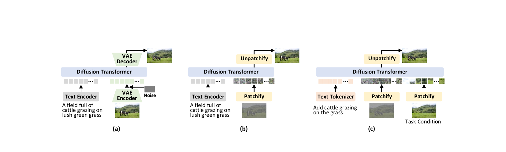
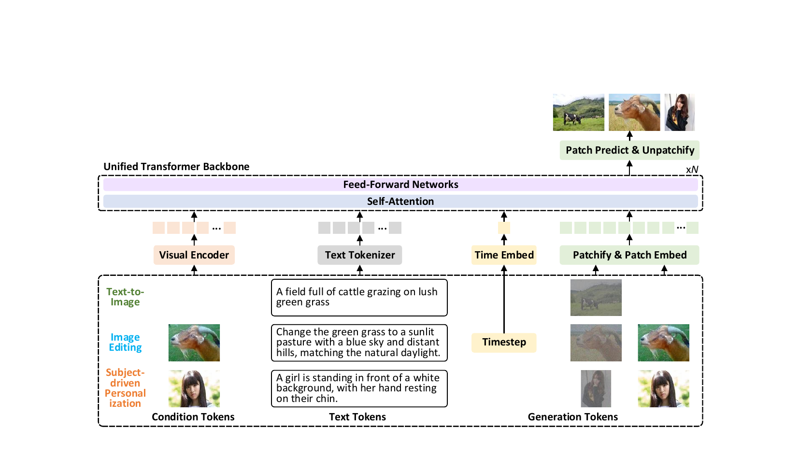

# HiDream-O1-Image: Pixel-level Unified Transformer 기반 통합 이미지 생성 파운데이션 모델

## 📋 메타 정보

| 항목 | 내용 |
|---|---|
| **논문 제목** | HiDream-O1-Image: A Natively Unified Image Generative Foundation Model with Pixel-level Unified Transformer |
| **저자/기관** | HiDream.ai |
| **공개일** | 2026-05-10 (technical report), 코드/가중치 2026-05-08 |
| **분야** | Text-to-Image / Image Editing / Subject-driven Personalization, Pixel-space Diffusion Transformer |
| **논문 링크** | [HiDream-O1-Image.pdf (GitHub assets)](https://github.com/HiDream-ai/HiDream-O1-Image/blob/main/assets/HiDream-O1-Image.pdf) (arXiv 미공개, 27p technical report) |
| **코드 (공식)** | https://github.com/HiDream-ai/HiDream-O1-Image (MIT License) |
| **체크포인트** | `HiDream-ai/HiDream-O1-Image` (8B, 50-step), `HiDream-ai/HiDream-O1-Image-Dev` (8B, 28-step distilled) |
| **Prompt Agent** | `google/gemma-4-31B-it` (or OpenAI-compatible API) |
| **Backbone 초기화** | Qwen3-VL-8B-Instruct (8B 변종) |
| **외부 비전 인코더** | SigLip-2 (조건 이미지/참조 이미지 임베딩 추출) |
| **외부 평가 도구** | Qwen-VL2.5-72B (UniSubject 평가), HPSv3 (인간 선호), VLM judges |
| **별칭** | "Peanut" (Artificial Analysis Arena 익명 출시명, 2026-05-05 #8 진입) |

---

## 📖 주요 용어 사전 (Glossary)

### 아키텍처
- **UiT (Unified Transformer)**: 이미지 픽셀(pixel)·텍스트(text)·참조 이미지(condition)를 **모두 같은 형태의 벡터로 바꿔서 (단일 공유 토큰 공간)** 하나의 Transformer 안에서 처리하는 방식. (decoder-only = 한 방향으로만 흐르는 LLM 형태). VAE 없음, 별도 텍스트 인코더 없음.
- **Pixel-space DiT**: 이미지를 **압축하지 않고 원본 RGB 픽셀 그대로 (raw RGB pixel)** 다루는 DiT. (다른 모델들은 VAE로 한 번 압축한 **잠재 공간 (latent space)** 에서 작업하지만, 이건 픽셀 자체를 직접 다룸. cf. FLUX/SD3는 VAE latent 사용)
- **Patch Embedding (BottleneckPatchEmbed)**: 이미지를 **32×32짜리 작은 사각형들 (patch)** 로 자른 뒤, 각 패치를 **중간에 차원을 한 번 좁혔다 다시 펴는 작은 신경망** (PCA 스타일 bottleneck, 차원이 hidden_dim의 1/4까지 좁아짐)을 통과시켜 벡터로 변환.
- **Hybrid Unified Attention**: **텍스트와 참조 이미지 부분 (text/condition 토큰, AR) 은 LLM처럼 앞쪽만 보고 (causal mask)**, **만들어낼 이미지 부분 (generation 토큰) 은 양쪽 모두 본다 (full attention)**. 한 Transformer 안에서 LLM의 **단방향 흐름 (autoregressive)** 과 DiT의 양방향 attention을 같이 쓰는 것.
- **DeepStack visual embeddings**: Qwen3-VL의 **이미지 인코더 (vision encoder)** 가 만드는 **여러 층의 시각 feature 묶음**. 초기 decoder layer들에 직접 더해져 시각 정보를 강화.
- **TMS token (`<|tms_token|>`)**: **시간 정보 (diffusion timestep)** 를 담는 **하나의 특수 토큰** (token_id=151673). 시퀀스 안의 이 자리에 `t_embedder1(timestep)` 값을 끼워 넣어 모델에 timestep을 알려줌.
- **BOI / BOR / EOR / BOT**: **이미지/참조 시작·끝을 표시하는 특수 토큰들** (begin/end-of-image, begin/end-of-reference). 시퀀스를 영역별로 구분하는 마커.

### 핵심 개념
- **Token Types** (0/1/2/3): 시퀀스 안의 **각 토큰을 역할별로 번호로 표시 (token type / token role)** 한 것. 0=텍스트(앞만 봄, AR text), 1=만들어낼 이미지(양쪽 봄, generation target), 2=참조 이미지 (reference image patches), 3=시간 표시 (timestep). 이 번호로 attention mask를 다르게 적용.
- **Reasoning-Driven Prompt Agent**: **사용자의 거친 입력을 한 번 더 가다듬어주는 "생각하는 LLM"** (Gemma-4-31B-it 기반). 사용자 raw prompt → **추론 과정 (chain-of-thought reasoning)** 을 거쳐 자기완결적 영어 prompt + resolved_knowledge로 변환.
- **SCALIST framework**: prompt rewriting 시 사용하는 **7가지 항목 체크리스트** — **S**ubject(주체), **C**omposition(구도), **A**ction(동작), **L**ocation(장소), **I**mage style(화풍), **S**pecs(촬영 스펙), **T**ext rendering(글자 렌더링).
- **In-context Visual Reasoning**: T2I/Editing/IP를 모두 **"공유 토큰 공간 안에서 attention으로 한 번에 푸는 in-context reasoning"** 한 가지 과정으로 통합. (LLM이 한 시퀀스 안의 예시들로 추론하듯 이미지 모델이 reference·target을 한 시퀀스에서 처리)
- **DMD (Distribution Matching Distillation)**: **50-step 큰 모델 (teacher) 의 생성 경로를 28-step 작은 모델 (student) 이 따라하도록 학습**시키는 distillation 기법. trajectory 분포 자체를 일치시킴.
- **Adversarial Diffusion Distillation**: 위 DMD + 표준 **diffusion loss** + **GAN loss** (teacher backbone의 중간 feature를 입력 받는 discriminator).

### 비교 기법
- **Latent DiT** (FLUX, SD3, Qwen-Image): **VAE로 압축한 잠재 공간에서 동작하는 DiT**. 흐름: VAE encoder → DiT → VAE decoder. 별도 텍스트 인코더(CLIP/T5) 사용.
- **Pixel-space DiT** (PixArt 등 일부): VAE는 없애 **원본 픽셀에서 동작**하지만, 여전히 **텍스트 인코더는 따로 (disjoint)** 사용.
- **HiDream-O1-Image (UiT)**: **VAE도 없고, 별도 텍스트 인코더도 없음**. raw pixel + text token + condition을 한 Transformer가 통째로 처리.

### 평가 지표
- **GenEval**: **요청한 구성요소들을 정확히 그리는지 (compositional generation)** 평가. 항목 — single-obj(객체 1개)/two-obj(2개)/count(개수)/color(색)/position(위치)/attribute(속성).
- **DPG-Bench**: **빽빽한 prompt를 얼마나 충실히 따르는지 (dense prompt alignment)** 평가.
- **HPSv3**: **인간 선호 점수** 12개 카테고리 (Characters/Arts/Design/Architecture/Animals/Natural Scenery/Transportation/Products/Plants/Food/Science/Others).
- **CVTG-2K**: **복잡한 이미지 내 텍스트 생성 (complex visual text generation)** 평가. 한 이미지 안에 2~5개 영역에 글자를 정확히 렌더링하는지. 지표: word accuracy, NED, CLIP score.
- **LongText-Bench EN/ZH**: **장문 텍스트 렌더링** (영어/중국어).
- **GEdit / ImgEdit**: **명령으로 이미지 편집 (instruction-based editing)** 평가. 9가지 편집 유형 (Add/Adjust/Extract/Replace/Remove/Background/Style/Hybrid/Action).
- **UniSubject (저자 신규)**: **여러 참조 이미지로 동일 인물·물체를 새 장면에 합성하는 능력 (multi-subject IP)** 평가용 신규 벤치. 300 케이스 × 총 1.8K subjects, 2-3 / 4-8 / 9-11 subjects 세 구간. 지표: Q-PF (prompt following, prompt 충실도), Q-SC (subject consistency, 참조 보존), Q-O (overall = 두 값 평균), HPSv3.

### 학습 관련
- **Flow Matching loss**: **노이즈에서 진짜 이미지까지 "곧은 경로"를 학습** 시키는 손실. 수식: x_t = t·x + (1-t)·ε (즉 진짜 이미지 x와 무작위 노이즈 ε를 t 비율로 섞은 값을 만든 뒤, 모델이 이를 보고 노이즈 방향 = velocity를 예측하도록 학습). 본 논문은 model이 clean image x_pred를 출력 → v = (x_pred - z) / σ.
- **GRPO (Group Relative Policy Optimization)**: **여러 후보 결과를 한꺼번에 뽑아 서로 상대 비교로 학습시키는 RLHF 알고리즘** (그룹 상대 정책 최적화). 후처리 단계(post-training)에서 사용.
- **Logit-Normal sampling**: **사전학습 단계의 timestep 샘플링 분포** (logit-normal 분포).
- **Uniform sampling (SFT)**: **post-training에서 timestep을 균등하게 뽑는 방식**. 결과적으로 고화질 디테일이 결정되는 **후반 step (late timestep)** 의 학습 비중을 높임.

---

## 🎯 논문 요약 (TL;DR)

**한 줄 요약**: 기존 VLM(**Qwen3-VL-8B-Instruct**) 가중치로 backbone을 초기화한 뒤 patch/timestep embedder와 final layer만 덧붙여 **diffusion 형태**로 확장한 구조 — VAE도, 별도 텍스트 인코더도 없이 **raw pixel + text + condition**을 단일 공유 토큰 공간에서 처리하는 **decoder-only Unified Transformer**로 T2I/편집/IP를 모두 통합한 8B 모델이며, 2048×2048 native 합성·SOTA급 텍스트 렌더링·Artificial Analysis Arena #8 달성.

**핵심 문제**:
1. 기존 LDM(SD3/FLUX/Qwen-Image)은 VAE compression으로 고주파 디테일을 잃고, 별도 text encoder(CLIP/T5)와 semantic misalign됨.
2. PixArt 류 pixel-space DiT도 텍스트 인코더는 여전히 disjoint하고, single-task T2I에 특화되어 편집/IP로 확장이 어려움.
3. 모듈식 파이프라인은 in-context reasoning을 못함.

**해결책**:
1. **Pixel-level Unified Transformer (UiT)**: Qwen3-VL-8B-Instruct backbone에 patch embedder/timestep embedder/final layer만 추가. raw pixel patch (32×32) → bottleneck embed → shared token space → decoder-only Transformer → pixel patch 예측.
2. **Hybrid Unified Attention**: condition/text는 causal, generation은 full. AR 능력 보존 + 공간 일관성 확보.
3. **Reasoning-Driven Prompt Agent**: Gemma-4-31B로 chain-of-thought reasoning 후 SCALIST 영어 prompt 생성. ("O1" 이름의 유래 — reasoning-driven generation.)
4. **3-stage progressive pretraining**: 512² → 1024² → 2048² + multi-task (T2I + LM + MMU + editing + IP).
5. **Post-training**: SFT (reasoning trajectory 포함) + GRPO RLHF (OCR/aesthetic/instruction/reasoning 복합 보상).
6. **DMD + GAN distillation**: 50-step → 28-step Dev 모델.

**검증**:
- GenEval 0.90 (8B), 0.92 (200B+) — Qwen-Image(27B)/FLUX.2 Dev(56B) 상회.
- DPG-Bench 89.83, HPSv3 10.37 (8B) — open-weights 1위.
- LongText-Bench 0.979 EN / 0.978 ZH — Nano Banana 2.0 동급.
- 200B+ scale 변종으로 scaling law 검증, closed-source(GPT Image 2 등) 초과.

---

## 🚀 핵심 기여 (Contributions)

1. **Natively Unified Generative Architecture**: VAE/disjoint text encoder를 완전히 제거하고 raw pixel + text + task condition을 단일 토큰 공간으로 통합하는 end-to-end UiT 제안.
2. **Reasoning-Driven Prompt Agent (오픈소스)**: chain-of-thought로 implicit knowledge / layout / 텍스트 렌더링까지 prompt에 명시화. 모델 입력으로 직접 사용.
3. **8B 스케일에서 SOTA-급 효율성·다재성**: T2I, 장문 텍스트 렌더링, instruction editing, IP, multi-panel storyboard, 15가지 cinematic shot까지 한 모델로 처리. 27B/56B 모델 초과.
4. **200B+ 확장으로 scaling law 검증**: HiDream-O1-Image-Pro로 새로운 SOTA 수립 (Nano Banana 2.0/GPT Image 2 등 closed-source 초과).
5. **UniSubject 벤치마크 공개**: 300 cases × 1.8K subjects, 2-3/4-8/9-11 multi-subject IP 평가용.

---

## 🏗️ 주요 알고리즘 설명

### 0. 단일 공유 토큰 공간 (Single Shared Token Space) — 본 모델의 본질

> *왜 이 절을 두냐: 본 모델의 모든 설계 결정은 "기존 디퓨전 파이프라인이 가진 분리(separation)를 어떻게 제거할 것인가"라는 한 질문에서 출발한다. Fig 5가 그 질문의 출발점 — 세 패러다임의 차이를 한 장에 시각화한 그림.*

<p align="center">
  
</p>

> **Figure 5** | Unlike (a) **latent DiTs** that use latent-space VAE compression and (b) **pixel-space DiTs** that typically rely on disjoint text encoder, (c) **Unified Transformer** in our HiDream-O1-Image natively encodes raw image pixels, texts, and task-specific conditions within a shared token space, and thus generalizes to broader and more complex generative tasks.
>
> *(한국어 요약): (a) 잠재 공간 DiT 는 VAE 로 압축한 잠재공간에서 동작, (b) 픽셀공간 DiT 는 VAE 는 없지만 여전히 별도 텍스트 인코더 사용, (c) HiDream-O1 의 UiT 는 raw RGB 픽셀·텍스트·task condition 을 모두 하나의 공유 토큰 공간에 매핑해 더 다양하고 복잡한 생성 작업으로 확장 가능.*

#### Fig 5 의 세 패널 자세히 읽기

같은 입력(*"A field full of cattle grazing on lush green grass"*)에 같은 결과 이미지(소가 풀밭에서 풀을 뜯는 사진)를 생성하는데, 그 **내부 흐름이 어떻게 다른지** 를 한 장에 모아 보여주는 그림.

**(a) Latent DiT (SD3 / FLUX / Qwen-Image 계열)**

```
Text Encoder ──▶ text embedding ─┐
                                  ├──▶ Diffusion Transformer ──▶ VAE Decoder ──▶ 이미지
VAE Encoder + Noise ──▶ z_t ─────┘
(이미지 → 잠재공간)
```

- **두 개의 별도 인코더**: 외부 텍스트 인코더 (T5/CLIP) 와 외부 VAE 인코더가 따로 존재.
- DiT 는 **잠재공간 (latent space)** 에서 동작 — 원본 이미지가 아니라 VAE 가 압축한 코드만 봄.
- 끝에 **VAE Decoder** 가 잠재 → 픽셀로 복원.
- 문제점:
  - **고주파 디테일 손실** (VAE 압축 단계에서 영구 손실, 텍스트·얇은 선·작은 글자 망가짐)
  - **텍스트와 이미지가 따로 학습된 두 공간** 에서 출발 → semantic misalignment

**(b) Pixel-space DiT (PixArt 등)**

```
Text Encoder ──▶ text embedding ─┐
                                  ├──▶ Diffusion Transformer ──▶ Unpatchify ──▶ 이미지
Patchify (raw image) ──▶ patches ┘
```

- VAE 는 제거 — **원본 픽셀을 patchify 만으로 잘라서 직접 사용** (무손실 reshape).
- 끝의 **Unpatchify** 도 단순 reshape (VAE decoder 와는 다름).
- 문제점:
  - **텍스트 인코더는 여전히 외부 (disjoint)**. 시각 공간과 텍스트 공간이 따로 학습됨.
  - 보통 T2I 한 가지 작업에만 특화 — 편집·IP 로 확장이 어려움.

**(c) Unified Transformer (HiDream-O1)**

```
Text Tokenizer ──▶ text tokens ─┐
                                 │
Patchify (target noise) ────────┼──▶ Diffusion Transformer ──▶ Unpatchify ──▶ 이미지
                                 │
Patchify (Task Condition) ──────┘
(편집소스/참조 이미지)
```

- **외부 텍스트 인코더 자체가 사라짐** — Text Encoder 가 아니라 **Text Tokenizer** (Qwen3-VL 자체 토크나이저 + 백본 내장 embedding table) 로 바뀜.
- VAE 도 없고, 텍스트도 외부 인코더 없음. **세 종류의 입력 (텍스트·생성 노이즈·task 조건) 이 모두 같은 patchify·tokenizer 만으로 같은 토큰 공간에 들어감**.
- **Task Condition 슬롯 (오른쪽 추가 입력)** 이 새로 생긴 점에 주목 — 같은 모델이 (텍스트만) 입력이면 T2I, (텍스트 + 소스 이미지) 입력이면 편집, (텍스트 + 참조 이미지들) 입력이면 IP 로 동작. **단일 모델로 모든 작업 처리** 의 시각적 표현.
- 결과적으로 **고주파 디테일 보존 + 텍스트·이미지 의미 정렬 + 다작업 통합** 세 마리 토끼를 한 번에 잡음.

#### Fig 5 가 전달하는 한 줄 메시지

> **"VAE 와 텍스트 인코더라는 두 개의 외부 분리를 모두 없애고, 패치화된 픽셀과 토큰화된 텍스트, 그리고 task 조건을 하나의 토큰 공간에 모두 던져 넣자."**

다음 절(§1, §2)은 이 한 줄을 **어떻게 구체적으로 구현했는가** 의 답.

---

Transformer는 **모든 입력을 같은 차원의 벡터 (token)** 로 바꿔서 처리한다. 이 벡터들이 모인 공간을 **"토큰 공간 (token space)"** 이라고 부르고, 그 차원은 hidden_size = 4096 (즉 R^4096 공간). HiDream-O1은 텍스트(text)도, 픽셀 패치(pixel patch)도, 참조 이미지(condition)도, 시간 정보(timestep)도 **전부 이 같은 4096차원 벡터로 만들어** 한 Transformer 안에서 함께 처리한다 (이를 **단일 공유 토큰 공간 (single shared token space)** 이라 부름). 모든 토큰이 같은 self-attention 안에서 직접 상호작용함.

#### 기존 패러다임과의 비교 (모두 self-attention 기반)

| 모델 | text 인코더 | VAE | 시퀀스 구성 | Q/K/V weight |
|---|---|---|---|---|
| PixArt-α | 외부 T5 | 사용 | image만 attention, text는 별도 conditioning | image용 단일 set |
| SD3 (MM-DiT) | 외부 T5 + CLIP | 사용 | text + image concat 후 self-attention | text/image **별도 weight** (parallel streams) |
| FLUX double-stream | 외부 T5 + CLIP | 사용 | 동일 concat | 별도 weight |
| FLUX single-stream | (위와 동일) | (위와 동일) | 동일 concat | **완전 공유** |
| Qwen-Image | 외부 Qwen2.5-VL | 사용 | concat | 별도 weight |
| Z-Image | 외부 Qwen2.5-VL | 사용 | concat | 완전 공유 |
| **HiDream-O1 (UiT)** | **없음** (Qwen3-VL embed 내장) | **없음** | text + tms + image + ref **모두 concat** | 완전 공유 + **hybrid causal/full mask** |

> ⚠️ **용어 주의**: 위 모델들은 **모두 self-attention만 사용**합니다. "cross-attention DiT"라는 표현은 부정확 — Q,K,V가 같은 시퀀스에서 나오면 모두 self-attention. cross-attention 모듈은 SDXL 이전 UNet 시대의 유물.

#### HiDream-O1의 세 가지 분리 제거

1. **외부 텍스트 인코더 제거** — T5/CLIP 없이 Qwen3-VL 토크나이저 + embedding table 그대로 사용
2. **VAE 분리 제거** — raw RGB pixel을 직접 모델링 (32×32 패치 + bottleneck embed)
3. **Stream 분리 제거** — text/image/ref/timestep 모두 같은 Q,K,V weight (single-stream)

여기에 **LLM의 causal 성질을 보존하는 hybrid mask**(§3 참조)까지 더한 것이 UiT의 본질.

### 1. Unified Multimodal Tokenization

세 가지 primitive token type을 공유 공간에 매핑:

| Token | 입력 | 변환 | 코드 위치 |
|---|---|---|---|
| **Text Tokens (y)** | refined prompt (Prompt Agent 출력) | Qwen3-VL native vocabulary tokenizer | `processor.apply_chat_template` → `tokenizer.encode` |
| **Condition Tokens (c)** | reference/edit source 이미지 | **SigLip-2** encoder → learnable projection → shared space | `Qwen3VLVisionModel.forward` → `get_image_features` |
| **Generation Token (x_t)** | noisy target = t·x + (1−t)·ε | 32×32 패치 분할 → `BottleneckPatchEmbed` (PCA-style bottleneck, dim/4) | `models/pipeline.py:317` (rearrange), `qwen3_vl_transformers.py:1045` (`x_embedder`) |
| **Timestep (`<|tms_token|>`)** | diffusion timestep t | `TimestepEmbedder` (sinusoidal) → tms_token 위치 치환 | `qwen3_vl_transformers.py:1518-1523` |

**Token type 마킹** (`models/pipeline.py:65-71, 294-302`):
```
0 = AR (text/condition tokens)
1 = generation target
2 = reference image patches (in vinputs)
3 = timestep token
```

#### patchify는 압축이 아닌 **무손실 reshape**

코드 (`pipeline.py:317`): `einops.rearrange(noise, 'B C (H p1) (W p2) -> B (H W) (C p1 p2)', p1=32, p2=32)`

```
[B, 3, H, W]                       [B, H/32·W/32, 3·32·32]
   = 3·H·W elements         ≡        = (HW/1024)·3072 elements
                                     ★ 총 element 수 완전히 동일
```

- VAE encoder는 **학습된 비선형 압축** (정보 손실 동반, decoder 필요)
- patchify는 **순수 view 변환** (같은 메모리 buffer를 다르게 인덱싱, 정보 손실 0)
- 따라서 추론 중 `z` 텐서는 **이미지와 동일한 정보량**을 그대로 담은 채 Transformer 안을 흐름. 끝나면 마지막에 `rearrange` 한 번으로 `[B, 3, H, W]` RGB로 복귀 — VAE decoder 불필요.

#### "VAE 없이 sequence length가 폭주하지 않는 이유 — patch_size 트릭"

| 해상도 | LDM (FLUX/SD3): VAE 8× + patch_size=2 | HiDream-O1: patch_size=32 only |
|---|---|---|
| 1024² → patches | 64×64 = **4,096** | 32×32 = **1,024** |
| 2048² → patches | 128×128 = **16,384** | 64×64 = **4,096** |
| Attention 비용 (L²) | 100% | **≈ 6%** (1/16) |

HiDream-O1은 **VAE의 spatial 축소 역할을 큰 patch_size로 대체**. 한 패치당 차원(3072)이 커지는 부담은 `BottleneckPatchEmbed`(3072 → 1024 → 4096)로 흡수.

### 2. Unified Transformer (UiT) Backbone

> *왜 이 절을 두냐: Fig 5 의 "단일 토큰 공간" 컨셉이 **실제 backbone 안에서 어떻게 흘러가는지** 를 보여줘야 코드의 의미가 잡힌다. Fig 7 이 그 흐름의 전체 청사진.*

<p align="center">
  
</p>

> **Figure 7** | Overview of HiDream-O1-Image that enables a structural unification of multimodal inputs by mapping task-specific conditions, the text prompts, and raw pixels into a shared token space. These corresponding heterogeneous tokens (i.e., condition tokens, text tokens, and generation tokens formulated as noisy target samples along with timestep embeddings) are fed into the Unified Transformer backbone. In this way, HiDream-O1-Image treats diverse tasks (text-to-image, image editing, and subject-driven personalization) as an in-context reasoning process in the shared token space. Finally, the Transformer backbone predicts clean image patches which are reassembled to produce the target images.
>
> *(한국어 요약): task-specific 조건·텍스트 prompt·raw pixel 을 모두 공유 토큰 공간에 매핑. 세 종류 토큰(condition / text / generation+timestep)이 Unified Transformer 에 들어가서, T2I·편집·IP 모두 "공유 토큰 공간 안에서 in-context reasoning" 한 가지 과정으로 통합. 마지막에 깨끗한 이미지 패치를 예측 → reassemble.*

#### Fig 7 의 구조 자세히 읽기

Fig 7 은 **세로 방향으로 입력 → backbone → 출력** 의 데이터 흐름을, **가로 방향으로 작업별 입력 차이** 를 함께 보여주는 2D 다이어그램.

**세로 흐름 (data flow, 아래 → 위)**

가로의 4 칸(condition / text / time / generation)을 각각 자기 인코더에 통과시켜 **모두 같은 4096차원 토큰** 으로 변환한 뒤, **하나의 시퀀스로 concat** 해서 UiT 에 흘려보냄.

| 단계 | 모듈 | 코드 위치 |
|---|---|---|
| **Visual Encoder** | SigLip-2 (Qwen3-VL 내장 vision encoder). 참조/편집소스 이미지 → condition tokens. | `Qwen3VLVisionModel.forward` |
| **Text Tokenizer** | Qwen3-VL 자체 토크나이저 + embedding table. prompt → text tokens. **외부 T5/CLIP 없음** — Fig 5(a/b) 와의 결정적 차이. | `processor.apply_chat_template` |
| **Time Embed** | sinusoidal timestep embedder. diffusion step `t` → 하나의 4096차원 벡터 → `<\|tms_token\|>` 자리에 끼워 넣음. | `t_embedder1`, transformers.py:1518-1523 |
| **Patchify & Patch Embed** | 32×32 패치 분할 + BottleneckPatchEmbed (PCA 스타일 2-layer). 노이즈 (생성) 와 참조 이미지 (condition) 둘 다 같은 방식으로 패치화. | `pipeline.py:317`, `x_embedder` |
| **Self-Attention + Feed-Forward × N** | RMSNorm + SwiGLU MLP 의 표준 LLM 디코더 블록 N층. **새로 학습한 게 아니라 Qwen3-VL-8B 의 가중치 그대로 재사용**. attention 안에서 hybrid mask 가 토큰 종류별로 다른 가시 범위 적용 (§3). | `Qwen3VLTextDecoderLayer.forward` |
| **Patch Predict & Unpatchify** | hidden 4096 → RGB 패치 (3·32·32=3072) 예측 → reassemble → 최종 이미지. **VAE Decoder 가 아니라 1-layer Linear + reshape 한 번**. | `final_layer2`, transformers.py:1613 |

> **xN 표시의 의미**: backbone 의 self-attention + FFN 블록이 **N층 (Qwen3-VL-8B의 경우 36 layer)** 반복된다는 표시.

**가로 흐름 (task-specific 입력 차이)**

같은 backbone 이 작업에 따라 **입력 시퀀스의 구성만 바꿔서** 세 가지 작업을 모두 처리하는 점이 본 그림의 핵심 메시지.

| 작업 (Fig 7 의 행) | Condition Tokens (좌) | Text Tokens (중) | Generation Tokens (우) |
|---|---|---|---|
| **Text-to-Image** | (없음) | "A field full of cattle grazing on lush green grass" | 노이즈 패치만 |
| **Image Editing** | 편집 소스 이미지 (잔디밭) | "Change the green grass to a sunlit pasture with a blue sky and distant hills, matching the natural daylight." | 노이즈 패치 |
| **Subject-driven Personalization** | 참조 인물 이미지 | "A girl is standing in front of a white background, with her hand resting on their chin." | 노이즈 패치 |

→ **task 종류에 따라 condition slot 이 채워지거나 비워지는 차이만 있을 뿐**, 모델 가중치도 forward 함수도 모두 동일. 이것이 *"in-context reasoning"* 표현의 실체 — 마치 LLM 이 같은 시퀀스 안에 예시 몇 개를 보여주면 그 패턴을 자동으로 따라가듯, 본 모델은 condition slot 의 존재 여부와 내용에 따라 자동으로 T2I / 편집 / IP 모드로 전환.

**우상단 출력 (Patch Predict & Unpatchify)**

세 작업 모두 같은 출력 헤드를 거쳐 **각자의 결과 이미지** 가 나옴 (Fig 7 의 작은 썸네일 3개 — 풀밭 소, 햇살 든 들판, 흰 배경의 여성). 출력 단계도 단일 — backbone 의 hidden state → 3·32·32 RGB 패치 → reshape 한 번.

#### Fig 7 이 전달하는 한 줄 메시지

> **"같은 backbone, 같은 forward, 같은 출력 헤드. 다른 건 condition slot 에 무엇이 들어가느냐뿐."**

이 단일성이 모델 크기 (8B 단독으로 27B Qwen-Image 추월) 와 다재성 (T2I·편집·IP·storyboard 통합) 을 동시에 달성한 이유.

---

- **베이스**: **Qwen3-VL-8B-Instruct (decoder-only)** — 알리바바가 공개한 80억 파라미터짜리 이미지/텍스트 **이해 모델 (Vision-Language Understanding, V&L)** (원래는 입력으로 이미지+텍스트를 받아 텍스트를 출력함. 이미지 생성 모델이 아님). HiDream-O1은 이 모델을 그대로 가져와 **학습된 가중치를 출발점으로 사용 (weight initialization)** 하고, 거기에 픽셀 입출력 모듈을 추가해 이미지 **생성 (text-to-image, T2I)** 능력을 새로 학습시킴 (Q5 참조).
- **추가 모듈** (`Qwen3VLModel.__init__`, transformers.py:1033-1053):
  - `x_embedder = BottleneckPatchEmbed(patch_size=32, in_chans=3, pca_dim=hidden//4, embed_dim=hidden)`
    - 구조: `Linear(3072→1024, no bias) → Linear(1024→4096, bias)` (PCA-style bottleneck, 2-layer)
  - `t_embedder1 = TimestepEmbedder(hidden_size)`
  - `final_layer2 = FinalLayer(hidden_size, patch_size=32, out_channels=3)` → clean pixel 예측
    - 구조: **단일** `Linear(4096 → 3·32·32=3072, bias=True)` **한 줄**. LayerNorm/Activation/AdaLN 없음.
    - 초기화: `nn.init.zeros_` (DiT의 Zero-init 그대로) — 학습 초기에 noise가 그대로 통과해 안정적 fine-tune.
    - 호출: `x_pred = self.final_layer2(hidden_states)` — `adaln_input` 인자 없이 호출되어 AdaLN 경로 사용 안 함.
  - 입력측은 2-layer 압축-복원, 출력측은 1-layer 직접 펼침의 **비대칭 설계**.
- **표준 구성**: RMSNorm, **SwiGLU**, **RoPE** (3D mRoPE: text + spatial H/W)
- **시퀀스 구조** (T2I 기준):
  ```
  [text tokens] [boi] [tms_token] [vision_start] [image_patch_tokens]
                 ↑    ↑
                 (timestep slot)
  ```
- **편집/IP** 시 condition tokens (SigLip-2 임베딩)이 텍스트 앞에 prepend, 추가로 reference patches가 generation patches 뒤에 concat됨 (`pipeline.py:388`).

### 3. Hybrid Unified Attention Mask

> **전제**: 본 모델은 **순수 self-attention만 사용** (Q,K,V가 같은 시퀀스에서 나오는 attention). `Qwen3VLTextAttention.forward` (line 405-477)에서 Q, K, V가 모두 동일한 `hidden_states` 하나로부터 projection됨 (line 448-450). **텍스트→이미지 정보 전달 (text→image conditioning)** 은 cross-attention 모듈이 아니라 **하나의 시퀀스에 텍스트와 이미지를 이어붙인 뒤 (concat), 아래 mask로 토큰 간 영향 범위를 다르게 주는 방식**으로 구현.

핵심 코드 (`qwen3_vl_transformers.py:1577-1589`, non-flash 표준 path):
```python
causal = torch.full((T, T), -inf)
causal = torch.triu(causal, diagonal=1)   # 기본 causal
gen_positions = token_types[b].bool()      # generation tokens
causal[gen_positions, :] = 0               # gen은 모든 토큰 attend
```

Flash-attn 경로 (`_run_decoder_flash`, line 1257~)는 **2-pass index_copy** 방식:
1. Pass 1 — AR 토큰만 추출해 causal attention (`flash_attn_func(..., causal=True)`)
2. Pass 2 — 전체에 full attention (`causal=False`)
3. AR 위치는 Pass 1 결과로 덮어쓰기 (`index_copy`)

→ 결과적으로 **AR은 causal, generation은 bidirectional**. LLM의 언어 능력을 유지하면서도 이미지의 양방향 spatial 의존성을 캡처.

#### 왜 텍스트는 "앞만", 이미지는 "양쪽 모두" 보게 하는가?

직관적으로 풀어 설명:

**(1) "앞만 본다 (causal mask)"가 LLM의 본성인 이유**

LLM은 **"다음 토큰 예측 (next-token prediction, autoregressive)"** 으로 학습된다. 학습 중 정답(다음 토큰)을 미리 보면 모델이 그냥 베끼면 끝나서 trivial 학습이 됨. 그래서 i번째 위치에서는 **1~i번 토큰까지만 보고 (i+1)번을 예측**해야 함. 이 가림막이 바로 **causal mask**.

```
1번 토큰 예측 → 입력: [<시작>]              (0개 봄)
2번 토큰 예측 → 입력: [<시작>, 1번]         (1개 봄)
3번 토큰 예측 → 입력: [<시작>, 1번, 2번]    (2개 봄)
```

학습 시 모든 위치를 한 번에 처리하면서도 위 규칙을 지키게 하는 것이 mask matrix의 역할. 추론 (inference) 시에도 토큰을 하나씩 생성하므로 자기 뒤는 아직 존재하지도 않음 → 학습/추론 모두 같은 mask 사용.

**(2) HiDream-O1이 텍스트 부분에 굳이 causal을 유지한 이유**

백본인 Qwen3-VL은 **causal mask로 사전학습된 LLM**. 그 학습된 가중치는 "앞만 보는 입력 패턴"에 최적화되어 있음. 만약 텍스트 부분도 full attention으로 바꾸면 → **사전학습 때 본 적 없는 입력 패턴**이 들어와 가중치가 제 역할을 못 함 → LLM의 언어 능력이 망가짐. 그래서 **사전학습된 능력을 그대로 살리려면 causal 유지가 필수**.

**(3) 이미지 부분만 full attention을 채택한 이유**

이미지는 **순서가 없는 2D 공간 (no inherent order)**. "눈은 코의 옆, 코는 입의 위"처럼 위치 관계가 사방으로 얽혀 있어서, 패치 1번이 패치 (마지막)번을 못 보면 한쪽 절반과 다른 절반이 따로 그려져 어색해짐 → **모두가 모두를 봐야 (full)** 일관된 이미지가 나옴. 게다가 이미지 부분은 **새로 학습**하는 영역이라 mask를 자유롭게 정해도 사전학습 가중치와 충돌하지 않음.

**(4) Hybrid의 본질 (비유)**

> LLM은 **"신문 칼럼 작가"** 처럼 학습됨 — 한 단어 쓰고 다음 단어 생각하고 다시 쓰는 식. 이 사람에게 "다음 단어를 미리 봐"라고 하면 글이 이상해짐. 그래서 그 작가를 데려와 그림도 그리게 시킬 때, **글 쓰는 습관 (앞만 보기)은 그대로 두고, 그림 그리는 부분만 새 습관 (양쪽 보기)을 추가**한 것 — 이게 HiDream-O1의 hybrid attention.

### 4. Overall Objective (Pretraining)

논문 §3.4 + §4.1에서 명시한 학습 손실 (loss) 3종:
- **L_FM** (Flow Matching, image prediction):  **노이즈에서 진짜 이미지로 가는 곧은 경로를 학습**시키는 손실. 픽셀 공간의 **속도 예측 (v-prediction)** 과 동등. 수식: x_t = t·x + (1-t)·ε (즉 진짜 이미지 x와 노이즈 ε를 t 비율로 섞은 값)에 대해 모델이 **깨끗한 이미지 (clean image)** 를 직접 예측 (코드 변수: `x_pred`), 그 뒤 v = (x_pred - z) / σ 로 속도를 계산.
- **L_LPIPS** (perceptual): **사람 눈에 보이는 디테일** 을 보존하기 위한 손실 (사전학습된 분류 네트워크의 feature 거리 기반).
- **L_DINO** (perceptual): **이미지 전체의 의미적 일관성 (semantic coherence)** 을 보존하기 위한 손실 (DINO 자가지도 모델의 feature 사용).

→ 픽셀 공간에서 **세밀한 공간 디테일 (fine-grained spatial detail)** 과 **장거리 의미 일관성 (long-range semantic coherence)** 을 동시에 잡기 위함 (latent DiT는 이 역할을 VAE에 맡겼지만, 본 모델은 VAE가 없으므로 loss로 직접 강제함).

### 5. Inference 전체 흐름 (코드 단계별 추적)

T2I 케이스 (refs 없음, full 모델 기준) 기준 호출 그래프:

```
inference.py:main()
  └─ generate_image (pipeline.py:107)
       │
       ├─[1] build_t2i_text_sample (pipeline.py:31)
       │       → input_ids = [text, boi, tms, vision_start, img_token×N]
       │       → token_types (0=AR / 1=gen / 3=timestep)
       │       → 3D mRoPE position_ids
       │
       ├─[2] noise z = 7.5·randn → patchify [B, N, 3072]   # pipeline.py:313-317
       ├─[3] build_scheduler (pipeline.py:80-97)
       │
       └─ for step in 50:
            ├─ forward_once(cond, z, t)   ─┐
            ├─ forward_once(uncond, z, t) ─┤ (CFG, pipeline.py:380-383)
            │                              ▼
            │  _forward_generation (transformers.py:1400)
            │   ├─[5-1] text embed       : Qwen3-VL embedding table (line 1429)
            │   ├─[5-3] timestep embed   : t_emb → tms_token 자리 치환 (line 1518-1523)
            │   ├─[5-4] noise embed      : x_embedder(z) → 시퀀스에 concat (line 1529-1530)
            │   ├─[5-6] hybrid mask      : AR=causal, gen=full (line 1577-1589)
            │   ├─[5-8] decoder stack    : N layer × (self-attn + SwiGLU + deepstack 주입)
            │   └─[5-9] final_layer2     : hidden 4096 → patch 3072 (line 1613)
            │
            ├─ v_guided = -v_uncond + 5.0·(v_cond - v_uncond)   # CFG
            └─ z = sched.step(-v_guided, step_t, z)
       │
       └─[7] depatchify (pipeline.py:432-435) → PIL.Image
```

#### [1] 시퀀스 구축 (`build_t2i_text_sample`, pipeline.py:31-78)

```python
# pipeline.py:40-46
template_caption = (
    processor.apply_chat_template(messages, ...) + boi_token + tms_token * 1
)
input_ids = tokenizer.encode(template_caption, ...)

# pipeline.py:52-54
vision_tokens = torch.zeros((1, image_len)) + image_token_id   # H/32 × W/32개
vision_tokens[0, 0] = vision_start_token_id
input_ids_pad = torch.cat([input_ids, vision_tokens], dim=-1)  # ★ text + image placeholder
```

생성되는 단일 1D 시퀀스:
```
[<im_start>user PROMPT <im_end>] [<boi>] [<tms>] [<vision_start>] [img_token × (image_len-1)]
                                          └─ t_embedder1 출력으로 대체될 자리
```

#### [2] 노이즈 패치화 (`pipeline.py:313-317`)

```python
noise = 7.5 * torch.randn((1, 3, H, W), ...)
z = einops.rearrange(noise, 'B C (H p1) (W p2) -> B (H W) (C p1 p2)', p1=32, p2=32)
# z: [1, H/32·W/32, 3072]   ← 4096 patches × 3072-dim 각
```

#### [5-1~5-4] 단일 토큰 공간으로 통합 (`_forward_generation`, transformers.py:1429-1530)

```python
# 텍스트 embedding (4096차원)
inputs_embeds = self.get_input_embeddings()(input_ids)                # [B, T_text, 4096]

# Timestep → tms_token 자리 치환
t_emb = self.t_embedder1(timestep)                                    # [B, 4096]
tms_mask = (input_ids == self.tms_token_id)                           # tms_token_id=151673
inputs_embeds = torch.where(tms_mask_3d, t_emb_expanded, inputs_embeds)

# 노이즈 패치 embedding + concat
vinputs_embedded = self.x_embedder(vinputs)                           # [B, N, 4096]
inputs_embeds = torch.cat([inputs_embeds, vinputs_embedded], dim=1)   # ★ 최종 4096차원 단일 시퀀스
```

#### [5-6] Hybrid Mask 구축 (transformers.py:1577-1589)

```
              text_0 ... tms  img_0  img_1 ...
text_0        ✓       ✗   ✗    ✗      ✗
text_1        ✓       ✓   ✗    ✗      ✗        ← AR: causal
tms           ✓       ✓   ✓    ✗      ✗
img_0         ✓       ✓   ✓    ✓      ✓        ← gen: full
img_1         ✓       ✓   ✓    ✓      ✓
```

#### [5-8] Decoder Stack — DeepStack 주입

각 decoder layer는 RMSNorm → self-attention(mask 적용) → SwiGLU MLP. **초반 layer엔 Qwen3-VL의 deepstack visual feature가 더해짐** (vision conditioning 강화, `visual_pos_masks` + `deepstack_visual_embeds` 인자).

#### [5-9] 픽셀 패치 직접 예측 (transformers.py:1613)

```python
x_pred = self.final_layer2(hidden_states)   # [B, T, 4096] → [B, T, 3072]
# 3072 = 3·32·32  ← VAE decoder 없이 RGB 패치 직접 예측
```

#### [step] Flow Matching + CFG (pipeline.py:372-421)

```python
for step_t in sched.timesteps:
    t_pixeldit = 1.0 - step_t.float() / 1000.0
    sigma     = step_t.float() / 1000.0

    x_pred_cond   = forward_once(samples[0], z, t_pixeldit)
    v_cond        = (x_pred_cond - z) / sigma           # velocity

    if guidance_scale > 1:                              # full: 5.0
        x_pred_uncond = forward_once(samples[1], z, t_pixeldit)
        v_uncond      = (x_pred_uncond - z) / sigma
        v_guided      = v_uncond + guidance_scale * (v_cond - v_uncond)
    else:
        v_guided = v_cond

    z = sched.step(-v_guided, step_t, z, ...)           # FlowUniPC / Flash / FlowMatchEuler
```

#### [7] 최종 디코딩 (pipeline.py:432-435)

```python
img = (z + 1) / 2
img = einops.rearrange(img, 'B (H W) (C p1 p2) -> B C (H p1) (W p2)',
                       H=H//32, W=W//32, p1=32, p2=32)
return Image.fromarray(arr).convert("RGB")
```

### 6. Scheduler 3종 (코드: `pipeline.py:80-97`)

| 이름 | 클래스 | 용도 | steps | shift | guidance |
|---|---|---|---|---|---|
| `default` | `FlowUniPCMultistepScheduler` | **full** 모델 기본 (T2I/IP) | 50 | 3.0 | 5.0 |
| `flash` | `FlashFlowMatchEulerDiscreteScheduler` | **dev** 모델 기본 (T2I/IP) | 28 (`DEFAULT_TIMESTEPS`) | 1.0 | 0.0 |
| `flow_match` | `FlowMatchEulerDiscreteScheduler` | dev 모델의 **editing(ref=1)** 권장 | 28 | 1.0 | 0.0 |

**Flash scheduler** (`flash_scheduler.py:282-362`)는 SDE-style noise injection:
```python
denoised   = sample - model_output * sigma                       # x_0 예측
noise      = randn(...); 
if noise_clip_std > 0: noise = noise.clamp(±noise_clip_std·std)  # 분산 클립
sample = sigma_next·noise·s_noise + (1-sigma_next)·denoised      # 재주입
```
- `s_noise`는 step별 linear interpolation (`noise_scale_start → noise_scale_end`, 기본 7.5).
- `noise_clip_std` 기본 2.5 — 노이즈 tail outlier를 잘라 안정성 ↑.

### 7. Distillation (HiDream-O1-Image-Dev, §5)

**큰 모델(teacher, 50-step) 의 능력을 작은 step의 작은 모델(student, 28-step) 이 따라하도록 학습** (distillation). 학습 손실 (objective):
```
L_total = L_DMD + λ_diff · L_diff + λ_adv · L_adv
```
- **L_DMD** (Distribution Matching Distillation): **teacher와 student가 생성하는 경로 분포 자체를 일치**시키는 손실.
- **L_diff**: 보조용 **표준 diffusion loss** (학습 안정화, 진동 완화).
- **L_adv** (Adversarial loss): **GAN 손실** — **판별자 (discriminator)** 는 학습이 끝나 가중치가 고정된 teacher backbone의 **여러 층 feature (multi-level feature)** 를 입력으로 사용. **사람 눈에 보이는 fidelity와 선명도 (perceptual fidelity·sharpness)** 보존.

### 8. Multi-reference 크기 자동 조정 (IP, `pipeline.py:198-202`)

**참조 이미지 개수 K가 늘어날수록 각 참조의 해상도를 자동으로 줄여서** 시퀀스 길이 폭주를 막는 트릭:

```
K=1:        max_size = max(H,W)         (편집 모드)
K=2:        max_size = max(H,W) × 48/64
K∈[3,4]:    max_size = max(H,W) / 2
K∈[5,8]:    max_size = max(H,W) × 24/64
K≥9:        max_size = max(H,W) / 4
```
+ **SigLip-2 이미지 인코더 입력 크기** (코드: `CONDITION_IMAGE_SIZE=384`)도 K에 따라 384 → 288 → 192로 축소. → 참조가 많아져도 토큰 시퀀스가 폭발적으로 길어지지 않도록 방지.

---

## 🧪 실험 요약

### 1. Text-to-Image (Table 1-3)

| Benchmark | HiDream-O1 8B | HiDream-O1-Pro 200B+ | 2위 모델 | 비고 |
|---|---|---|---|---|
| **GenEval** Overall | **0.90** | **0.92** | GPT Image 2 0.89, FLUX.2 Dev 0.87 | Position 0.93 (8B) — 최고 수준 |
| **DPG-Bench** Overall | **89.83** | **90.30** | Qwen-Image 88.32 | Global 95.15 (8B) — 압도적 |
| **HPSv3** All | 10.37 | **10.47** | GPT Image 2 10.21 | 12개 카테고리 전반에서 1-2위 |

→ 8B 단독으로 27B Qwen-Image / 56B FLUX.2 Dev를 능가. closed-source인 Seedream-4.0 / GPT Image 2도 일부 항목에서 추월.

### 2. Text Rendering (Table 4-5)

| Benchmark | 8B | Pro 200B+ | 의의 |
|---|---|---|---|
| **CVTG-2K** average | <u>0.9128</u> | **0.9222** | 다영역 중국어/영어 텍스트 모두 강함 |
| **LongText-Bench EN** | 0.979 | **0.982** | Nano Banana 2.0 0.980 동급 |
| **LongText-Bench ZH** | <u>0.978</u> | **0.980** | open-weights 최강. Qwen-Image 0.946, FLUX.2 Dev 0.757 압도 |

→ **VAE 제거로 텍스트 high-freq 디테일 보존** 효과가 직접 드러나는 영역.

### 3. Image Editing (Table 6-7)

| Benchmark | HiDream-O1 8B | Pro 200B+ | 1위 비교 |
|---|---|---|---|
| **GEdit** Q-O | 7.60 | **7.67** | GPT Image 2 7.67 동급 |
| **ImgEdit** Overall | 4.14 | <u>4.51</u> | GPT Image 2 **4.73** |

→ 8B로 16.8B FLUX.1 Kontext / 27B Qwen-Image-Edit과 동급 이상.

### 4. Subject-driven Personalization — UniSubject (Table 8)

| 구성 | 2-3 Subjects (Q-O / HPSv3) | 4-8 (Q-O / HPSv3) | 9-11 (Q-O / HPSv3) |
|---|---|---|---|
| Qwen-Image-Edit (27B) | 7.50 / 8.84 | 5.34 / 5.40 | 2.71 / 2.13 |
| Scone (7B) | 7.15 / 8.97 | 6.01 / 6.62 | 5.78 / 7.54 |
| Echo-4o (14B, GPT-4o distilled) | 7.46 / 9.99 | 7.19 / 8.61 | 6.73 / 8.78 |
| **HiDream-O1 8B** | 7.95 / 10.45 | <u>7.47</u> / 9.53 | 7.65 / 9.78 |
| **HiDream-O1-Pro 200B+** | 8.50 / 11.05 | **7.99** / **9.76** | **7.92** / **9.83** |

→ 9-11 subjects 같은 극단적 multi-subject에서도 성능 유지. shared token space가 다수 reference 간 disjoint encoder의 간섭을 완화한다고 주장.

### 5. Cinematic 제어 (§6.3)

다음을 native로 지원:
- **Shot scales** (7종): extreme full / full / medium full / medium / medium close-up / close-up / extreme close-up
- **Camera angles** (4종): high / low / eye-level / bird's-eye
- **Subject orientations** (4종): front / side / back / three-quarter
- **Multi-panel storyboard** (single-pass 생성)

→ video pre-production용 keyframe 생성에 적합하다고 주장.

---

## 💬 Q&A 섹션

> 이번 분석 세션에서 사용자가 실제로 제기한 질문들. 본문에 흡수된 부분은 cross-reference, 본문에 없는 추가 사항만 자세히 답함.

### Q1. "단일 공유 토큰 공간 (single shared token space)"이 정확히 무슨 의미인가?

→ 자세한 설명은 알고리즘 §0 참조.

**짧게**: Transformer의 hidden_size(=4096) 차원 벡터 공간 하나에 텍스트·픽셀 패치·시간 정보(timestep)·참조 이미지(condition)를 **모두 같은 형태의 4096차원 벡터로 변환한 뒤, 같은 self-attention 안에서 직접 상호작용**시키는 것. 기존 모델은 텍스트 인코더의 출력 공간과 VAE의 잠재 공간(latent space)이 따로 존재하고 self-attention block의 입력 단계에서 이어붙이거나(concat) 별도 모듈로 다리를 놓았다면, HiDream-O1은 그 분리를 **세 가지 차원에서 모두 제거**:
- **외부 텍스트 인코더 제거** (T5/CLIP 없음)
- **VAE 제거** (압축 없이 원본 RGB 직접 사용)
- **Stream 분리 제거** (텍스트와 이미지가 동일한 Q,K,V projection 가중치를 공유 — single-stream)

### Q2. DiT인데 cross-attention을 쓰는가?

**아니다. self-attention만 사용함** (Q,K,V가 같은 시퀀스에서 나오는 attention). 코드 전체에서 `cross-attention` 키워드는 0건이며, `Qwen3VLTextAttention.forward` (line 405-477)의 **질의(Q)·키(K)·값(V) 모두 동일한 `hidden_states` 하나에서 projection됨** (line 448-450):

```python
query_states = self.q_norm(self.q_proj(hidden_states)....)
key_states   = self.k_norm(self.k_proj(hidden_states)....)
value_states =             self.v_proj(hidden_states)....
```

**텍스트→이미지 정보 전달 (text→image conditioning)** 은 별도 cross-attention 모듈이 아니라 **하나의 시퀀스에 텍스트와 이미지를 이어붙이고 (concat) + 토큰별로 다른 attention mask (hybrid mask) 를 적용**해서 구현됨 (§3 참조). PixArt 이후 DiT 계열은 **모두 self-attention 기반**이며, 차이는 stream 수(text/image weight 분리 여부)와 mask 구조뿐 (§0의 비교표 참조). **"cross-attention DiT"라는 표현 자체가 부정확** — cross-attention 모듈은 SDXL 이전 UNet 시대의 유물.

### Q3. 추론 코드의 전체 흐름은?

→ 알고리즘 §5 ("Inference 전체 흐름") 참조. `inference.py:main` → `generate_image (pipeline.py:107)` → `_forward_generation (transformers.py:1400)` → `final_layer2` 까지 단계별 호출 그래프, 각 단계의 코드 스니펫, hybrid mask 시각화, depatchify까지 포함.

### Q4. 네트워크 구조가 MM-DiT (SD3) 와 동일한가?

**전혀 다르다.** 가장 큰 차이는 **출발점이 다르다는 점**:

- **MM-DiT (SD3, FLUX 등)**: 백지에서 **이미지 생성 전용으로 새로 설계하고 처음부터 학습한 Transformer (scratch-trained DiT)**.
- **HiDream-O1**: 이미 공개되어 있는 **학습된 거대 언어모델 (pretrained LLM, Qwen3-VL-8B-Instruct)** 을 통째로 가져온다. 이 모델 안의 Transformer 층 (논문은 이 한 층을 **"decoder block"** 이라고 부른다)을 손대지 않고 그대로 재사용하고, 앞뒤에 **픽셀을 받는 작은 모듈 (patch embedder)** 과 **픽셀을 내보내는 작은 모듈 (final layer)** 만 새로 붙였다.

코드로 확인 — `Qwen3VLTextDecoderLayer.forward` (line 519-538)는 **AdaLN-Zero modulation이 한 줄도 없는 평범한 pre-norm LLM block**:

```python
residual = hidden_states
hidden_states = self.input_layernorm(hidden_states)              # RMSNorm only
hidden_states, _ = self.self_attn(...)                            # ★ AdaLN 없음
hidden_states = residual + hidden_states
residual = hidden_states
hidden_states = self.post_attention_layernorm(hidden_states)
hidden_states = self.mlp(hidden_states)                          # SwiGLU
hidden_states = residual + hidden_states
```

| 항목 | MM-DiT (SD3 / FLUX double-stream) | **HiDream-O1 (UiT)** |
|---|---|---|
| **Backbone 출처** | scratch-trained DiT | **사전학습 LLM** (Qwen3-VL-8B-Instruct) 그대로 재사용 |
| **Block 종류** | MM-DiT block (전용 설계) | **Qwen3VLTextDecoderLayer** (LLM block 그대로) |
| **Stream 수** | **2개** (text/image stream, separate Q,K,V weight) | **1개** (single-stream, weight 공유) |
| **Timestep modulation** | **AdaLN-Zero**: 모든 block에 timestep + pooled text로 scale/shift/gate 주입 | **AdaLN 없음**. `<\|tms_token\|>` 자리 단 1개 토큰 embedding에 삽입 (LLM-style) |
| **Normalization** | LayerNorm (AdaLN-modulated) | RMSNorm (modulation 없음) |
| **Position Encoding** | 2D RoPE (image) + 1D positional (text) | **3D mRoPE** (text + spatial H + spatial W) |
| **Attention mask** | full (모두가 모두를 봄) | **Hybrid**: AR=causal, gen=full |
| **추가 conditioning** | pooled CLIP text → AdaLN | **DeepStack visual embeds** (Qwen3-VL 다층 vision feature를 초반 layer에 직접 더함) |
| **Final head** | AdaLN + linear → VAE latent patch | linear → 3·32·32 RGB patch 직접 |

**핵심 발상의 차이**:
- **MM-DiT**: "DiT를 multimodal로 만들자" → text/image stream 분리, AdaLN으로 timestep modulate
- **UiT**: "LLM이 이미 multimodal alignment를 학습했다 → block 구조에 손대지 않고 입출력만 픽셀로 바꿈"

### Q5. Qwen3-VL-8B-Instruct는 vision-language **understanding** 모델인데, 이걸로 어떻게 이미지를 **생성**하는가?

정확한 지적. Qwen3-VL은 원래 **[텍스트+이미지] → 텍스트 출력 모델 (V&L understanding)** 로, **이미지를 생성하지 못한다**. HiDream-O1은 이걸 **학습된 가중치를 출발점으로만 사용 (weight initialization)** 하고 새 모듈 + 새 학습으로 생성 능력을 부여:

**(1) 무엇을 가져오고, 무엇을 새로 붙였나** (`Qwen3VLModel.__init__`, transformers.py:1033-1053):

| 모듈 | 출처 | 역할 |
|---|---|---|
| `visual` (SigLip-2) | Qwen3-VL 그대로 | 참조 이미지를 hidden vector로 인코딩 (이해 능력) |
| `language_model` decoder stack | Qwen3-VL 그대로 | self-attention + SwiGLU MLP block들 |
| `x_embedder` (BottleneckPatchEmbed) | **신규** | RGB 패치(3·32·32=3072) → hidden(4096) |
| `t_embedder1` (TimestepEmbedder) | **신규** | diffusion timestep → hidden(4096) |
| `final_layer2` (FinalLayer) | **신규** | hidden(4096) → RGB 패치(3072) 예측 (원래는 token logits 출력) |
| `tms_token` (id=151673) | **신규 special token** | timestep 자리 표시자 |

**(2) 추론 경로(forward path)도 새로 작성**: `_forward_generation` (transformers.py:1400-1621) 함수 자체가 Qwen3-VL에는 없는 신규 코드. **노이즈 제거 단계 (denoising step)** 에 맞춰 timestep 처리, **노이즈 패치 임베딩 (noise patch embed)**, hybrid mask 구축, RGB 패치 출력까지 모두 새 경로.

**(3) Stage I부터 3가지 작업 (task) 을 한꺼번에 학습 (joint training) 시켜 생성 능력 부여** (§4.1):
- **T2I (text-to-image, 새 능력)**: 픽셀 패치 ↔ 텍스트 매핑 학습
- **LM (language modeling, 기존 능력 유지)**: 텍스트만으로 된 코퍼스로 언어 능력 보존
- **MMU (multimodal understanding, 기존 능력 유지)**: 이미지+텍스트 → 텍스트 이해 능력 유지

→ 즉 **"Qwen3-VL이 이미지를 생성한다"는 표현은 부정확**, 정확히는 "**Qwen3-VL의 사전학습된 텍스트-이미지 정렬 (vision-language alignment) 을 출발점으로 삼아 픽셀 입출력 모듈을 붙이고 T2I 학습으로 이미지 생성 능력을 새로 부여한 모델**". 이 **초기화 전략 (initialization strategy)** 덕에 백지부터 학습 (scratch training) 하는 것보다 훨씬 빠르게 수렴하며, 8B로 27B Qwen-Image (이쪽도 VLM init) 를 이기는 비결 중 하나.

### Q6. 이건 diffusion 모델인가? (backbone이 LLM인데?)

**예, flow matching 기반 diffusion 모델이 맞다.** backbone 출처 (학습 시작점) 만 LLM(Qwen3-VL)일 뿐, 학습/추론 **방식 (paradigm)** 은 완전히 diffusion.

코드/논문에서의 증거 4가지:
1. **순방향 과정 (forward process)**: `x_t = t·x + (1-t)·ε` (즉 진짜 이미지 x와 노이즈 ε를 t 비율로 섞는 flow matching의 선형 보간)
2. **반복적 노이즈 제거 루프 (iterative denoising loop)** 50 / 28 step (`pipeline.py:372-421`)
3. **Flow Matching scheduler** 3종 사용 (FlowUniPC / FlashFlowMatchEuler / FlowMatchEuler)
4. **DMD distillation** (`L_total = L_DMD + λ_diff·L_diff + λ_adv·L_adv`) — diffusion 전용 distillation 기법

다른 통합 multimodal 모델과의 분류상 위치:

| 생성 방식 (paradigm) | 모델 |
|---|---|
| **자기회귀 (Autoregressive)** — 이미지를 **이산 토큰 (discrete token)** 으로 한 토큰씩 순차 예측 | GPT-4o, Janus-Pro, Show-o, Emu3 |
| **Diffusion** — **연속 공간 (continuous space) 에서 반복적으로 노이즈 제거 (denoising)** | FLUX, SD3, Qwen-Image, Z-Image, **HiDream-O1** |

→ **"backbone은 LLM, 학습/추론 방식은 diffusion"** 인 하이브리드. GPT의 가중치를 가져와 그 위에 diffusion 학습을 다시 한 것과 비슷.

### Q7. VAE decoder 없이 어떻게 RGB 이미지가 나오는가?

핵심: **패치화 (patchify) 는 압축이 아니라 정보 손실 없는 단순 재배열 (lossless reshape)** 이라 별도의 **복원 모듈 (decoder) 이 필요 없음**. 자세한 비교는 알고리즘 §1의 "patchify는 압축이 아닌 무손실 reshape" 표 참조.

**추론 중 `z`의 정체**:
- **시작**: `z = patchify(pure noise)` — 모양(shape) `[B, N, 3072]`. 원본 `[B, 3, H, W]`와 **총 원소(element) 수가 완전히 동일** (메모리 view만 변환한 것).
- **매 step**: `z = sched.step(-v_guided, t, z)` — z를 노이즈 → 깨끗한 이미지 방향으로 한 단계씩 이동.
- **끝**: z가 정규화된 RGB 픽셀 값 `[-1, 1]` 범위에 도달.

**최종 변환** (`pipeline.py:432-435`):
```python
img = (z + 1) / 2                                  # [-1,1] → [0,1]
img = einops.rearrange(img, 'B (H W) (C p1 p2) -> B C (H p1) (W p2)', ...)
arr = (img.numpy().transpose(1,2,0) * 255).clip(0,255).astype(np.uint8)
return Image.fromarray(arr)
```

`einops.rearrange`는 같은 메모리 buffer를 다르게 인덱싱하는 view 변환 — 학습된 모듈 0개, 비선형 변환 0개. **z는 추론 내내 "이미지 정보 그대로의 텐서"** 였고, 마지막에 인덱싱 방식만 4D로 바꾸면 곧장 RGB.

### Q8. VAE 없이 raw pixel을 직접 모델링하면 계산량/메모리 폭주하지 않는가?

**오히려 attention 비용 측면에선 LDM보다 가볍다.** **VAE가 담당하던 공간 축소 (spatial reduction) 역할을 "큰 patch_size=32"가 대신 수행**하기 때문.

| 해상도 | LDM (VAE 8× + patch_size=2) | HiDream-O1 (patch_size=32) | Attention 비용 비 |
|---|---|---|---|
| 1024² | 4,096 patches (= 토큰) | 1,024 patches | **HiDream 1/16** |
| 2048² | 16,384 patches | 4,096 patches | **HiDream 1/16** |

Transformer attention 계산량은 **시퀀스 길이의 제곱에 비례** (`O(L²·d)`, L=sequence length). HiDream-O1은 **한 패치가 16배 큰 면적을 덮어서 패치 수가 16배 적음** → attention 비용 16배 적음.

**장단점 정리 (Trade-off)**:
- ✅ Attention 효율 ↑ (시퀀스 길이 ↓)
- ✅ VAE 인코딩/디코딩 비용 0
- ✅ z 자체에 정보 손실 없음 → **텍스트의 고주파 디테일 (high-frequency detail) 보존** (LongText-Bench 0.979의 비결)
- ❌ z의 **메모리 발자국 (memory footprint)** 은 12배 큼 (이미지 크기 그대로 들고 다님)
- ❌ 한 패치당 차원이 큼 (3072) → patch embedder / final layer 1개 호출 비용은 큼 (단, layer당 한 번이라 attention 대비 무시할 수준)
- ❌ 원본 RGB는 고주파 정보 밀도가 높아 모델 **수용 능력 (capacity) 부담** → **8B 백본, BottleneckPatchEmbed (PCA 스타일 압축), LPIPS+DINO loss** 로 흡수

→ **"VAE = 정보 압축"** 보다 본질은 **"Transformer가 처리할 시퀀스 길이를 줄이는 것"**. HiDream-O1은 그 수단을 VAE 대신 큰 patch_size로 대체한 것.

---

### Q9. Qwen3-VL 가중치 로드 없이 같은 구조를 스크래치로 학습해도 성공할 수 있나?

**결론: HiDream 규모의 데이터·컴퓨트 예산으로는 실패할 확률이 매우 높음.** Qwen3-VL-8B 초기화가 사실상 학습의 ~90%를 미리 끝내놓은 것이기 때문.

#### 1. 학습 부담의 비대칭

| 항목 | VLM init (HiDream 실제) | From scratch |
|---|---|---|
| 학습해야 할 것 | "VLM이 픽셀 토큰도 만들도록" 미세조정 | 언어 이해 + 비전 + 생성 + 정렬 동시 |
| 사전 학습 데이터 | Qwen3 학습 데이터(수조 토큰) **공짜** | 0 |
| 추정 GPU-days | ~수천 | 수십~수백만 (10~100배) |

#### 2. 구조적 의존성: 텍스트 인코더가 별도로 없다
HiDream은 **별도 텍스트 인코더가 없는** 구조. Qwen3-VL backbone 자체가 텍스트 인코더 역할까지 함. 스크래치로 가면 한 통에서 **(a) T2I 생성기 + (b) 텍스트 인코더 + (c) VLM 정렬**을 동시에 만들어야 함. SD3·FLUX·Z-Image도 텍스트 인코더는 사전학습 T5/CLIP을 쓰지, 완전 스크래치는 안 함.

#### 3. In-context reasoning 손실
논문 핵심 기여 중 하나인 **Reasoning Prompt Agent + 인스트럭션 기반 편집**은 VLM의 chain-of-thought·instruction-following 능력을 그대로 활용한 결과. 스크래치 학습은 이 능력을 0에서 출발 — 디퓨전 손실만으로 절대 학습되지 않음.

#### 4. 텍스트 렌더링
SOTA-급 텍스트 렌더링(LongText-Bench 0.979)은 Qwen3-VL이 가진 **문자 의미·철자 지식**을 픽셀로 옮긴 것. 스크래치로 "코카콜라 로고"의 정확한 철자를 그리려면 수십억 장의 OCR-aligned 데이터가 필요.

#### 5. 학습 안정성
8B decoder-only Transformer 스크래치 학습은 LLM 학습과 동급 난이도. Gradient 폭주·mode collapse·warm-up 튜닝이 동시 발생. 사전학습 가중치는 이 전부를 우회시키는 안정된 출발점.

#### 그럼 이론적으론?
**가능은 함**. 단지 자원이 10~100배 필요.
- **DALL-E 1 / Parti**: 사실상 스크래치 (텍스트 인코더만 제외). 수만 TPU-days 투입.
- **PixArt-α/σ**: 픽셀 DiT 스크래치, 텍스트 인코더는 사전학습 T5 사용.
- **HiDream의 선택**: 학습 코드/데이터 비공개 이유 중 하나가 "**우리 예산엔 VLM init이 필수**"라는 노하우 자체가 핵심 자산이기 때문일 가능성이 큼.

#### 한 줄 정리
> HiDream의 아키텍처는 **사전학습된 VLM이 있다는 전제 위에 설계된 구조**. Qwen3-VL을 빼면 "디퓨전을 붙일 LLM"이 없어지므로, 같은 컴퓨트·데이터로는 수렴 자체가 안 되거나 PixArt-α 수준에도 못 미칠 가능성이 높음. 이 모델의 본질은 **"Qwen3-VL을 픽셀 디퓨저로 fine-tune한 결과물"**이며, HiDream의 진짜 기여는 **adapter 부분(patch/timestep embedder, hybrid attention, Reasoning Agent)**.

### Q10. 기존 VLM 사용으로 학습 리소스(GPU·데이터셋)를 얼마나 줄였나? — 공개 수치 + 추정

#### 논문에 명시된 수치 (데이터만)

| 단계 | 명시 내용 |
|---|---|
| **Pretrain Stage I** (512²) | "**billions of image-text pairs** (수십억 장 이미지-텍스트 쌍)" + LM/MMU 코퍼스 + large batch size |
| **Pretrain Stage II** (1024²) | 미공개. T2I + LM + MMU + editing + IP 멀티태스크 데이터 |
| **Pretrain Stage III** (2048²) | "**ultra-high-resolution subset** (초고해상도 부분집합)" 만 |
| **Post-train SFT** | "**several hundred thousand samples** (수십만 장)" |
| **Post-train RLHF** | GRPO 학습 (샘플 수 미공개) |

→ **billion-scale 사전학습 + 수십만 SFT** 정도가 공개된 전부. **GPU 시간, GPU 종류 (H100/A100/H800), 학습 일수, 정확한 데이터 크기 모두 비공개**.

#### 비교용 — 다른 모델들의 공개 학습 자원

| 모델 | 학습 자원 (공개치) | 비고 |
|---|---|---|
| **Z-Image** (6B) | **314,000 H800 GPU-hours** | scratch 학습 + 정교한 데이터 큐레이션 |
| **FLUX.1 [Dev]** (12B + 4.8B T5) | 비공개 (수십만 GPU-hour 추정) | scratch 학습 |
| **SD3 Large** (8B + T5) | 비공개 | scratch 학습 |
| **Qwen-Image** (20B + 7B Qwen2.5-VL) | 비공개 | HiDream-O1과 같은 VLM init 전략 |
| **HiDream-O1-Image** (8B) | **전부 비공개** | VLM init (Qwen3-VL-8B-Instruct) |

#### 정성적 추정 — VLM init이 절감하는 부분

##### ① 학습 step 측면

| 학습 항목 | scratch 모델 | VLM-init 모델 (HiDream-O1) |
|---|---|---|
| **텍스트-이미지 정렬 (vision-language alignment)** | 처음부터 학습 (가장 큰 비용) | **사전학습 가중치로 무료 상속** |
| **픽셀 생성 능력 (image generation)** | 처음부터 학습 | 처음부터 학습 (변하지 않음) |
| **언어 이해 능력 (LM/MMU)** | 별도 학습 또는 외부 인코더 필요 | **무료 상속 + 유지 학습만 추가** |

→ 일반적으로 **사전학습 step 30~70% 절감** (사례별 다름). 특히 **text-image 정렬 비용**이 가장 크게 절감됨 (이 부분이 보통 scratch 학습의 가장 큰 부담).

##### ② 모델 크기 측면

| 모델 | 백본 파라미터 | 학습 GFLOPs 비례 |
|---|---|---|
| **HiDream-O1** | 8B | **1×** |
| **Qwen-Image** | 27B | ~3.4× |
| **FLUX.2 Dev** | 56B | ~7× |

→ 같은 데이터·step으로 학습해도 **27B Qwen-Image 대비 약 1/3 GPU 비용**, **56B FLUX.2 Dev 대비 약 1/7 비용**으로 추정.

##### ③ 데이터 측면

| 항목 | scratch DiT | HiDream-O1 |
|---|---|---|
| Text-image 정렬용 사전학습 데이터 | 보통 5~10억 쌍 필요 | **불필요** (Qwen3-VL이 이미 학습됨) |
| 이미지 생성 학습 데이터 | "billions" | **"billions"** (동일하게 필요) |
| 멀티태스크 (editing, IP) | 별도 fine-tune 단계 | 같은 사전학습에 포함 |
| Post-train SFT | 수십만~수백만 | **수십만** (이미 정렬돼 있어서) |

→ **alignment용 데이터는 절감**되지만, **이미지 생성 자체 학습 데이터는 여전히 billion 단위 필요**. VLM init이 데이터 양 자체를 극적으로 줄이지는 않음. 대신 **수십만 SFT만으로 인간 선호 정렬까지 끝낼 수 있는 점**이 큰 이점.

#### 정리표

| 질문 | 답 |
|---|---|
| **GPU 절감?** | **정확 수치 비공개**. 추정으론 사전학습 step 30~70% 절감 + 모델 크기 비례 → **27B Qwen-Image 대비 수배 이상 GPU 비용 절감 가능**. |
| **데이터셋 절감?** | **부분 절감**. text-image 정렬용 데이터는 사실상 불필요, 단 이미지 생성 학습 자체는 billion-scale 필요. SFT는 수십만으로 충분. |
| **결정적 효과** | **수렴 속도 + 멀티태스크 일반화**. 사전학습 alignment 덕에 적은 step으로 SOTA 도달 + LM/MMU 능력 동시 보유 (다른 T2I 모델은 이게 없음). |

→ Q9 (scratch가 가능한가?) 와 함께 읽으면 명확해짐: **scratch는 10~100배 자원이 필요**, **VLM init은 그 자원을 1/10~1/100로 줄이는 게 본질적 효과**.

### Q11. 텍스트 인코더가 따로 없다는데, 그 역할은 누가 가져갔나? (Figure 5 로 보기)

> *왜 이 질문이 중요한가: "텍스트 인코더가 사라졌다 (no separate text encoder)"는 본 모델의 가장 큰 광고 문구이지만, 가장 자주 혼동되는 지점이기도 함 — **사라진 것은 모듈(외부 분리된 박스)이지 텍스트 처리 능력 자체가 사라진 게 아니다.** Figure 5 가 그 차이를 시각적으로 가장 명확히 보여주므로 이 절은 Fig 5(a) vs (c) 의 박스 비교에서 출발한다.*

<p align="center">
  
</p>

> **Figure 5 다시 보기 (텍스트 처리 박스에 집중).**
> 같은 prompt *"A field full of cattle grazing on lush green grass"* 가 세 패러다임에서 어떻게 다르게 처리되는지를 보라.
> - **(a) Latent DiT**: `Text Encoder` 라는 **무거운 외부 박스** (T5/CLIP, 보통 수~수십억 파라미터) 가 prompt 를 먼저 의미 벡터로 인코딩해 DiT 에 전달.
> - **(b) Pixel-space DiT**: VAE 는 사라졌지만 `Text Encoder` 박스는 그대로 외부에 남아 있음.
> - **(c) UiT (HiDream-O1)**: 박스 이름이 `Text Encoder` → **`Text Tokenizer`** 로 바뀌었다는 점에 주목. 더 이상 **의미 인코딩 (encoding) 을 하는 외부 모델이 아니라, 그저 문자열을 토큰 ID로 쪼개주는 가벼운 lookup** 만 남았음.

#### 1. 기존 (LDM)에서 텍스트 인코더가 하던 두 가지 일

전통적인 외부 텍스트 인코더 (T5/CLIP) 가 하던 일을 두 단계로 쪼개면:

1. **토큰화 (tokenization)**: 문자열 → 토큰 ID 시퀀스 (예: "cattle" → 12345). **가벼운 lookup**.
2. **인코딩 (encoding)**: 토큰 ID → 의미를 담은 고차원 벡터 (예: 12345 → 4096차원 벡터). **무거운 작업 — 수십억 파라미터 모델이 한 일.**

LDM 에서는 두 단계 모두 외부 박스 안에서 끝나고, 그 결과 벡터만 DiT 가 받음 → 그래서 박스 이름이 "Text **Encoder**".

#### 2. HiDream-O1 에서 그 두 일을 누가 가져갔나 — 3 명의 대체자

| 기존 LDM 의 역할 | HiDream-O1 의 대체자 | 코드 위치 |
|---|---|---|
| **(1) 토큰화** | **Qwen3-VL 자체 토크나이저** — 그대로 가져옴 | `tokenizer.encode(prompt)` (pipeline.py:46) |
| **(2-a) 토큰 ID → 첫 4096차원 벡터** | **Qwen3-VL 의 vocabulary embedding table** (어휘 수 × 4096 의 거대 lookup 테이블, 백본에 내장) | `self.get_input_embeddings()(input_ids)` (transformers.py:1429) |
| **(2-b) 의미 인코딩 본체 (T5/CLIP 의 무거운 일)** | **Qwen3-VL 백본의 decoder 36 layer 자체** — 이미지 패치와 **동시에** 처리 | `Qwen3VLTextDecoderLayer.forward` × 36 |

**대체자 1 — Qwen3-VL 토크나이저** (역할 1을 그대로 가져감)
- 기존 텍스트 인코더의 토크나이저 부분만 그대로 들고 옴. 무거운 일을 하지 않으므로 "**박스 이름이 Encoder 에서 Tokenizer 로 다운그레이드**" 됐다고 볼 수 있음.

**대체자 2 — Qwen3-VL 의 vocabulary embedding table** (역할 2의 1단계, 가벼운 시작점)
- 토큰 ID → 4096차원 벡터로 바꾸는 **초기 변환**. 이게 T5/CLIP 의 입력 임베딩과 같은 역할.
- 거대 모델이 아니라 **단순 lookup table** 한 줄로 끝.

**대체자 3 — Qwen3-VL 백본의 decoder 36개 layer 자체** (역할 2-b, 핵심)
- **이게 진짜 핵심.** T5/CLIP 의 무거운 인코딩 일은 백본의 36개 layer 가 **이미지 처리와 동시에** 한다.
- Qwen3-VL 은 원래 vision-language 이해 모델 → 사전학습된 가중치가 **이미 텍스트 의미를 잘 인코딩하는 능력** 을 갖고 있음 → HiDream-O1 은 이 능력을 **공짜로 물려받음**.
- 차이점: 기존 T5 는 텍스트만 받아 인코딩 → 그 결과를 DiT 에 넘김 (**분리된 두 단계, 순차 실행**). HiDream-O1 은 텍스트와 이미지를 한 시퀀스에 섞어 36 layer 를 같이 통과 (**한 단계, 동시 실행**). "인코딩"이라는 별도 단계가 사라지고, **텍스트 의미가 layer 를 거치는 동안 점진적으로 추출되면서 동시에 이미지에 영향을 줌**.

#### 3. 핵심 비유

> 기존 LDM 은 **"통역사 (T5/CLIP) 가 따로 있어서 외국어를 한국어로 번역해주고, 그 한국어 결과를 다른 사람 (DiT) 이 받아 그림을 그린다"** 는 구조.
>
> HiDream-O1 은 **"통역사 + 화가를 한 사람이 겸한다 — 그 사람이 외국어를 들으며 동시에 그림을 그린다"** 는 구조.

통역사라는 직책 (외부 텍스트 인코더 박스) 이 사라진 게 아니라, **한 사람의 머리 안에서 동시에 처리되는 한 능력으로 흡수됨**.

#### 4. 왜 이렇게 해도 되나? — 8B 로 27B Qwen-Image 를 이긴 이유

**핵심 가정**: Qwen3-VL 의 가중치는 이미 "텍스트와 이미지를 함께 이해" 하도록 **정렬 (alignment)** 되어 있다. 따라서:

- T5 처럼 텍스트만 따로 인코딩하는 분리된 단계가 **불필요한 중복** 이었던 셈.
- 기존 LDM 이 텍스트 인코더와 DiT 를 따로 학습하면서 두 공간 사이에 발생하던 **semantic misalignment** (텍스트 임베딩 공간과 이미지 잠재공간이 학습 중 어긋남) 가 처음부터 없음 — Qwen3-VL 안에서 텍스트·이미지가 사전에 정렬되었기 때문.
- 결과: **같은 능력을 더 작은 파라미터로 달성** → 8B 단독으로 27B Qwen-Image (텍스트 인코더만 7B, DiT 20B 별도) 를 추월하는 결정적 이유 중 하나.

#### 5. "텍스트 인코더가 없다" 표현의 정확한 의미

| 잘못된 해석 | 정확한 의미 |
|---|---|
| 텍스트를 아예 안 본다? | ❌ — 텍스트는 여전히 입력으로 받음. |
| 텍스트 임베딩이 없다? | ❌ — vocabulary embedding 으로 첫 변환은 함. |
| 텍스트 의미 처리가 사라졌다? | ❌ — backbone 36 layer 가 이미지와 함께 처리. |
| **외부의 별도 텍스트 인코더 모듈이 없다.** | ✅ — 텍스트 처리가 **백본 안으로 흡수됨**. |
| **추론 시 텍스트 인코더 forward 가 별도로 실행되지 않는다.** | ✅ — backbone forward 한 번에 텍스트+이미지 동시 처리. |

#### 6. 한 줄 정리

> **텍스트 인코더 대체자 = Qwen3-VL 토크나이저 + 어휘 임베딩 테이블 + 백본의 36 decoder layer 자체.** 분리된 모듈이 통째로 백본 안에 흡수된 것 — Fig 5(c) 의 "Text Tokenizer" 박스 이름 다운그레이드가 그 시각적 표현.

연관: §0 (단일 공유 토큰 공간), §1 (Unified Multimodal Tokenization), §2 (UiT Backbone — Qwen3-VL embedding 내장), Q1 (토큰 공간 정의), Q5 (Qwen3-VL 이해 모델로 어떻게 생성).

### Q12. "in-context reasoning" 개념이 정확히 무엇인가? — LLM 의 in-context learning 을 이미지 생성에 이식

> *왜 이 질문이 중요한가: 본 논문 Introduction 에서 가장 자주 등장하는 표현이 "in-context (visual) reasoning" 이고 모델 이름 "O**1**" 도 여기서 따왔지만, 정작 이 개념이 LLM 의 어떤 현상에서 온 것인지, 이미지 생성에선 구체적으로 무엇을 의미하는지 명확히 정의된 곳이 없음. 본 절은 그 기원과 의미를 끝까지 풀어쓴다.*

#### 1. 출발점 — LLM 의 in-context learning (2020, GPT-3 논문)

LLM 에 prompt 로 예시 몇 개를 주면, **모델 가중치를 하나도 안 바꾼 채** 그 패턴을 따라 답하는 현상.

```
prompt: Translate English to French:
        sea otter → loutre de mer
        plush giraffe → girafe en peluche
        cheese → ???

LLM 출력: fromage
```

핵심 관찰:
- **추가 학습 (fine-tuning) 없음** — 가중치 동결 (frozen weights).
- prompt 안의 **문맥 (context)** 만으로 모델이 작업 규칙 ("→" 가 영-불 번역이라는 것) 을 **추론 (infer)** 해서 새 입력에 적용.
- 이 능력을 "in-**context** **learning** (문맥-내 학습)" 또는 "in-context **reasoning** (문맥-내 추론)" 이라 부름.

#### 2. HiDream-O1 이 이걸 이미지 생성에 가져온 방식 — "in-context visual reasoning"

LLM 처럼, **시퀀스 안에 어떤 토큰이 들어있느냐** 에 따라 같은 모델이 다른 작업을 자동으로 수행:

| 작업 | 시퀀스 구성 | 가중치 변경 |
|---|---|---|
| **T2I** (Text-to-Image) | `[text]` `[noise]` | ✗ |
| **편집** (Image Editing) | `[source image]` `[edit text]` `[noise]` | ✗ |
| **IP** (Subject-driven Personalization) | `[ref_face_1]` `[ref_face_2]` ... `[text]` `[noise]` | ✗ |
| **Layout 제어** | `[refs]` `[bbox layout]` `[text]` `[noise]` | ✗ |
| **Skeleton 제어** (try-on) | `[face]` `[bg]` `[openpose]` `[parts...]` `[text]` `[noise]` | ✗ |

→ **모델 가중치는 모두 동일.** `_forward_generation` 함수도 같은 한 줄. 단지 입력 시퀀스의 **토큰 구성** 만 바뀜.

이것이 Figure 7 가로축이 보여주는 메시지의 본질 — `Condition Tokens` 슬롯이 비어 있으면 T2I, 채워져 있으면 편집/IP. **시퀀스 구성이 작업을 결정.**

#### 3. 왜 "reasoning (추론)" 이라고 부르나? — 단순 mapping 이 아니기 때문

예: IP 케이스를 분석해보자.

```
시퀀스: [face_reference] [text "a girl drinking coffee in cafe"] [noise]

generation 토큰 (그릴 자리) 의 각 패치가 self-attention 안에서 하는 일:
1. face_reference 패치들을 봄        → "이 얼굴의 눈·코·입 특징을 보존해야 한다"
2. text 토큰들을 봄                  → "cafe 배경에, 커피잔, 앉아있는 자세"
3. 둘 사이의 관계를 attention 가중치로 종합
   → "이 face 의 정체성을 가진 사람이 cafe 에서 커피 마시는 그림"
```

모델 안에 명시적인 "얼굴 보존 모듈" 도, "배경 추가 모듈" 도 없음. **self-attention 가중치 한 번** 이 reference 의 어느 부분을 보존하고 text 의 어느 요청을 어디에 그릴지 모두 결정한다.

→ 사람처럼 단계적으로 추론하는 게 아니라, **attention 가중치 행렬이 그 추론을 통째로 표현** 한다는 뜻. "reasoning" 은 비유적 표현이지만, **시퀀스 안 토큰 간의 비자명한 관계를 풀어낸다는 의미** 에서 정당화됨.

#### 4. 기존 모델은 왜 in-context reasoning 을 못 하나?

기존 T2I 모델 (SD3, FLUX) 은 **작업별로 별도 모델·어댑터** 가 필요:

| 작업 | 기존 LDM 의 해결책 | HiDream-O1 |
|---|---|---|
| T2I | 본체 모델 | 본체만 |
| 편집 | + InstructPix2Pix 같은 별도 모델 / 별도 fine-tune | 시퀀스만 다름 |
| IP | + IP-Adapter 같은 별도 cross-attn 모듈 | 시퀀스만 다름 |
| Layout | + ControlNet 같은 별도 conditioning 네트워크 | 시퀀스만 다름 |
| Try-on | + 전용 try-on 모델 | 시퀀스만 다름 |

기존 모델이 못 하는 이유는 두 가지:

**(a) 구조적 이유 — 박스 분리 모델 (modular pipeline) 이라서**
- 텍스트 인코더 박스, DiT 박스, VAE 박스 사이의 인터페이스가 고정.
- 참조 이미지를 끼울 자리 (입력 슬롯) 가 없어서 새 모듈 (IP-Adapter) 을 별도 부착해야 함.
- HiDream-O1 은 모든 입력이 같은 토큰 공간 → 시퀀스에 끼워 넣기만 하면 됨.

**(b) 학습적 이유 — 단일 작업으로만 사전학습** 되어서
- T2I 만 본 모델은 시퀀스 안의 추가 토큰을 "추론에 쓸 단서" 로 인식하는 능력이 없음.
- HiDream-O1 은 **Stage II/III 사전학습에서 편집/IP/multi-panel/skeleton/layout 데이터를 모두 단일 시퀀스 형태로 함께 학습** → "시퀀스에 condition 토큰이 있으면 그걸 참조해서 그려야 한다" 는 패턴 자체를 모델이 학습.

#### 5. LLM in-context vs HiDream-O1 in-context — 직접 비교

| 항목 | LLM (GPT-3) | HiDream-O1 |
|---|---|---|
| 입력 시퀀스 토큰 | 텍스트 토큰만 | 텍스트 + 이미지 패치 + condition 패치 |
| context 단서 | prompt 안의 예시 (few-shot examples) | 시퀀스 안의 reference 이미지·layout·skeleton |
| 추론 메커니즘 | self-attention | self-attention (**완전히 동일**) |
| 출력 | 다음 텍스트 토큰 | 깨끗한 이미지 패치 (RGB 3·32·32) |
| 가중치 변경 | 없음 | 없음 |
| 새 작업 일반화 방식 | 새 prompt 형식 | 새 시퀀스 구성 |

핵심: **메커니즘은 동일 — self-attention 한 번으로 모든 토큰 관계를 풀어냄.** 다른 점은 출력 modality 뿐.

#### 6. 본 논문이 이 표현을 강조하는 이유 — "O1" 이라는 이름과 연결

본 논문 §1 Introduction:

> *"...we must dismantle the boundaries between disparate encoding modules and structurally unify multimodal inputs at the foundational level, transitioning from modular pipelines to an end-to-end architecture."*
>
> *"...treats diverse generation and editing tasks as a consistent **in-context visual reasoning process**, fostering deeper and more flexible multi-modal interaction among inputs."*

저자들이 강조하는 패러다임 시프트:
- **이미지 생성을 "조립식 파이프라인 (modular pipeline)" 에서 "통합 추론 엔진 (unified reasoning engine)" 으로 격상.**
- LLM 이 multimodal alignment 를 한 번 학습하면 그 위에서 무한히 새 작업으로 일반화 가능 → 이 paradigm 을 이미지 생성에도 그대로 적용할 수 있다는 비전.
- **모델 이름 "O1" 의 의미** — OpenAI o1 이 reasoning 강조 모델이듯, HiDream-O1 도 reasoning paradigm 을 이미지로 가져왔다는 brand 메시지. (Reasoning-Driven Prompt Agent 도 이 brand 의 일부.)

#### 7. "in-context reasoning" 의 두 층위 — Prompt Agent vs UiT Backbone

본 논문은 사실 **두 곳에서** in-context reasoning 을 한다 — 자주 혼동되므로 정리:

| 층위 | 누가 | 어떤 reasoning? |
|---|---|---|
| **Prompt-level reasoning** | Reasoning-Driven Prompt Agent (Gemma-4-31B-it 외부 LLM) | 사용자 raw prompt → SCALIST framework 로 명시적 추론 → refined prompt (영문 단락 + reasoning + resolved_knowledge JSON 출력). **명시적 chain-of-thought**. |
| **Token-level reasoning** | UiT backbone 의 self-attention (Qwen3-VL-8B 내) | 시퀀스 안 토큰 간 관계를 한 번의 attention 으로 풀어 이미지 패치 출력. **암묵적 (implicit) reasoning**. |

두 층위가 결합해서 HiDream-O1 의 reasoning 정체성을 만듦. 본 Q12 가 다룬 것은 주로 **token-level (UiT 안의 attention 기반)** — 본 모델의 핵심 contribution.

#### 8. 한 줄 정리

> **In-context reasoning = "시퀀스 구성만 바꿔서 새 작업을 처리하는 능력" — LLM 의 in-context learning 을 self-attention 기반으로 이미지 생성에 이식한 것.** condition 슬롯이 비어 있으면 T2I, 채워지면 편집/IP 가 되는 Figure 7 의 가로축 차이가 이 개념의 시각적 본질.

연관: §0 (단일 공유 토큰 공간), §2 (UiT Backbone), §3 (Hybrid Unified Attention — in-context reasoning 의 attention 메커니즘), Figure 7 (시퀀스 구성별 작업 분기).

---

## 📌 한 줄 요약 (전체)

**이미 학습된 거대 V&L 이해 모델 (pretrained LLM, Qwen3-VL-8B-Instruct) 의 가중치를 출발점으로 가져온 뒤, 픽셀을 받는 작은 모듈 (patch embedder) + 시간 표시 모듈 (timestep embedder) + 픽셀을 내보내는 작은 모듈 (final layer) 만 덧붙여 diffusion 형태로 확장한 구조 — 원본 RGB 픽셀(raw pixel)·텍스트(text)·참조 이미지(condition)를 한 시퀀스에서 처리하는 decoder-only Unified Transformer + 텍스트는 causal·이미지는 full로 다르게 보는 hybrid attention + Gemma-4-31B로 prompt를 가다듬는 Reasoning-Driven Prompt Agent + 512²→1024²→2048² 3-stage progressive pretraining + GRPO RLHF + DMD/GAN distillation으로, VAE도 별도 텍스트 인코더도 없이 T2I/편집/IP(subject-driven personalization)/장문 텍스트 렌더링/2048² native까지 8B로 처리하는 통합 이미지 생성 파운데이션 모델.**

---

## 🔗 관련 메모리

- [[reference-pretrained-backbone-reuse-landscape]] — **본 논문이 속한 분기 (A) VLM → Image Generator** 의 풍경. 직접 비교 대상: Qwen-Image, BAGEL, BLIP3-o (모두 VLM 백본 + diffusion). 다른 진영: Janus-Pro, Emu3, Show-o (AR token 방식).
- [[paper_z_image]] — 6B Single-Stream DiT, 314K H800h SOTA. **공통점**: 작은 8B/6B 규모로 27B+ 거대 모델 추월. **차이점**: Z-Image는 latent space + decoupled-DMD + on-policy RL + **scratch 학습** (분기 외), HiDream-O1은 pixel space + UiT + GRPO + reasoning agent + **VLM init** ((A) 분기).
- [[feedback-paper-summary-format]] — 본 문서 작성 규칙 (PAPER_*.md 형식, 5원칙).
- [[feedback-beginner-friendly-tone]] — 본 문서 표현 톤 (풀어쓴 한국어 + 학술 원어 괄호 매칭).
