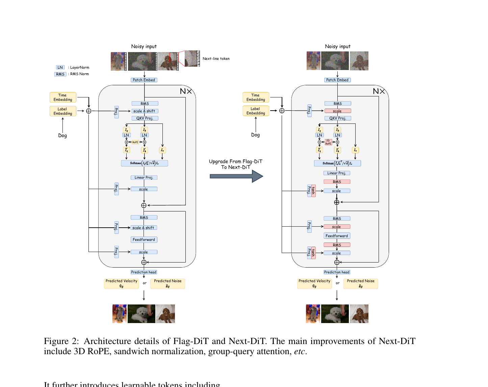

# PAPER: Lumina-Next — Making Lumina-T2X Stronger and Faster with Next-DiT

## 📌 메타 정보

| 항목 | 내용 |
|---|---|
| **논문 제목** | Lumina-Next: Making Lumina-T2X Stronger and Faster with Next-DiT |
| **저자/소속** | Alpha-VLLM (Shanghai AI Lab) + HKU + CUHK MMLab + 칭화대 |
| **공개일** | 2024-06-05 (arXiv v1) |
| **분야** | 이미지 생성 / Diffusion Transformer (DiT) / Flow Matching |
| **논문 링크** | https://arxiv.org/abs/2406.18583 |
| **공식 코드** | https://github.com/Alpha-VLLM/Lumina-T2X |
| **선행 논문** | Lumina-T2X — Flag-DiT (arxiv 2405.05945) |
| **본 문서 목적** | Lumina-Next 의 **동기·아키텍처·해상도 외삽·코드 전체 흐름** 을 한 페이지로 정리 |

### 위치 짚기 (왜 이 논문이 중요한가)

- **PixArt-α → SD3 → Lumina-Next** 라인의 *DiT 효율화* 흐름의 대표작.
- 후속 모델 (FLUX, Sana ([[paper_sana]]), Z-Image ([[paper_z_image]])) 의 *정규화·RoPE 전략* 의 직계 조상.
- "**2B 가 5B 를 이긴다**" — DiT 의 성능은 깊이·폭 보다 *정규화·위치임베딩 설계의 질* 에서 더 크게 결정된다는 메시지.
- LLM 의 **NTK-aware Scaled RoPE** 를 *t 의존 형태로 일반화* 한 거의 처음의 시도 → 후속 multi-resolution diffusion 작업에서 자주 인용.

---

## 📖 주요 용어 사전 (Glossary)

### 아키텍처 기본

- **DiT (Diffusion Transformer)**: 2023 Peebles 의 백본. U-Net 대신 ViT 류 트랜스포머가 latent diffusion 의 denoiser 역할.
- **AdaLN (Adaptive LayerNorm)**: 시간 임베딩 c 로부터 (γ, β) 또는 (scale, gate) 를 만들어 정규화 직후 modulate. DiT 의 정체성.
- **AdaLN-Zero**: AdaLN 의 modulation MLP 출력을 **0 으로 초기화** → 학습 시작 시 블록이 *identity 처럼* 동작 → 깊은 모델 안정화. *대신* residual path 의 norm 이 없어 *층마다 신호가 커질 수 있는 부작용* (Lumina-Next 가 푸는 문제 중 하나).
- **RMSNorm**: LayerNorm 에서 평균-빼기 제거 → 분산 정규화만. LLaMA 류 표준.
- **QK-Norm**: Q, K 를 각각 LayerNorm/RMSNorm 처리해 attention logit 폭주 방지. ViT-22B, Chameleon 등이 채택.
- **Sandwich Normalization**: attention/MLP 블록 *앞뒤로* norm 한 쌍을 끼우는 정규화 패턴. 본 논문의 핵심 트릭 ①.
- **GQA (Grouped-Query Attention)**: query head 는 많고, KV head 는 여러 query 가 공유. LLaMA-2 70B 가 처음 도입. Next-DiT 는 32 query → 8 KV.
- **Patchify**: 잠재 이미지 (C, H, W) 를 (p×p) 패치로 잘라 (p²·C) 차원 토큰 시퀀스로 만드는 연산.

### 위치 임베딩

- **RoPE (Rotary Position Embedding)**: 토큰 위치를 *복소수 회전 행렬* 로 Q, K 에 곱해 상대 위치 정보를 부여. LLaMA 부터 사실상 표준.
- **2D/3D RoPE**: head 차원을 (h, w) 또는 (t, h, w) 축으로 *분할* 해 각 축에 RoPE 적용. 이미지/비디오의 자연스러운 좌표 구조 반영.
- **Position Interpolation (PI)**: 학습보다 긴 시퀀스 입력 시 *모든 RoPE 주파수를 균등 압축* (s=L_new/L_train 배). 단점: 고주파(디테일) 정보가 뭉개져 *반복 패턴* 발생.
- **NTK-aware Scaled RoPE**: base θ → θ·s^(d/D). *저주파만 압축*, 고주파는 보존. 장점: 디테일 살아남. 단점: 저주파 영역에서 extrapolation 이 발생해 *전역 구도가 깨질 수 있음*.
- **Time-Aware Scaled RoPE**: 본 논문 핵심 ② — *denoising 진행도 t* 에 따라 위 두 모드를 자동 전환.
- **Proportional Attention**: 토큰 수 N 이 학습 분포 밖으로 폭증하면 softmax logit 의 분산이 비정상이 되므로 `softmax_scale ← √(log_L_train N / d_head)` 로 보정. LLM 의 logit scaling 과 같은 발상.
- **외삽 (Extrapolation)**: *학습 때 본 적 없는 범위의 입력* 에서도 모델이 그럴듯하게 동작하는 것. 본 논문에서는 **해상도 외삽** — 1024² 만 학습했지만 추론 시 2048², 1024×4096 패노라마 같은 *학습 분포 밖 해상도* 를 생성하는 것을 의미. 반대말은 *내삽 (interpolation)* = 학습 분포 안에서의 예측. 외삽 실패 시 ① 반복 패턴 (content repetition) ② 전역 구도 깨짐 (global incoherence) ③ 디테일 흐림 (texture loss) 의 세 증상이 전형적. Lumina-Next 의 *Time-Aware Scaled RoPE* 와 *Proportional Attention* 이 각각 ①·② 와 ③ 을 처방.

### Flow Matching

- **Flow Matching (FM)**: DDPM 의 score 학습 대신, *데이터→노이즈 의 경로* 를 직선 등으로 *고정* 하고 그 경로의 **속도장 (velocity field) u_t** 를 신경망이 학습. Lipman et al. 2023.
- **Linear / Rectified Flow path**: `x_t = t·x_1 + (1-t)·x_0`, 따라서 `u_t = x_1 − x_0` (상수 속도). SD3, FLUX, Lumina 가 채택.
- **Velocity prediction**: 모델이 직접 u_t 를 예측. ε-prediction 의 *t 의존 가중치 문제* ([[paper_min_snr]]) 를 자연스럽게 해소.
- **Probability Flow ODE**: 학습된 v_θ 를 미분방정식 `dx/dt = v_θ(x,t)` 로 적분해 샘플 생성. SDE 와 달리 결정론적.

### Diffusion Transformer 안정성 (선행 지식)

- **Mean Mode Screaming** ([[paper_mv_split_dit]]): 깊은 DiT 에서 residual path 의 평균값이 층마다 누적 증가해 발산하는 현상.
- **Unnormalized residual path**: AdaLN 직후가 아니라 residual *그 자체에는 norm 이 없는* DiT 의 구조적 약점. Lumina-Next 가 sandwich norm 으로 차단.

### 추론 가속

- **Sigmoid time schedule**: ODE 적분 시 t 의 분포를 균등 대신 시그모이드 형태로 *중간 영역에 step 을 집중* . 적은 step 으로 좋은 품질.
- **Context Drop** (= 토큰 머징의 한 형태): 매 attention 마다 Key/Value 토큰을 평균풀링으로 축소. ToMe 와 달리 *bipartite matching 없이* 단순 평균. **lumina_next_t2i 메인 코드엔 미구현 — `lumina_next_t2i_mini` 또는 별도 fork 에 존재.**
- **Classifier-Free Guidance (CFG)**: `v = v_uncond + s·(v_cond − v_uncond)`. 추론 시 텍스트 정렬 강도 조절.

---

## 1️⃣ 논문 한눈에 보기 (TL;DR)

> 자기네가 한 달 전(2024-05) 발표한 **Lumina-T2X (Flag-DiT, 5B)** 의 4가지 약점 — *학습 불안정 / 텍스트-이미지 정렬 약함 / 추론 느림 / 해상도 외삽 시 아티팩트* — 을 한 번에 처방한 후속 논문. 핵심 결과: **Next-DiT (2B) + Gemma-2B 가 5B Flag-DiT + LLaMA-7B 보다 더 좋은 품질을 더 적은 자원으로 달성.**

**핵심 문제** — Flag-DiT 의 4가지 진단:

| # | 문제 | 결과적 증상 |
|---|---|---|
| ① | **Unnormalized residual path** — DiT 의 AdaLN-Zero 는 residual 위에 norm 이 없어 *층마다 활성값이 누적적으로 커짐* | 깊어질수록 학습 발산 |
| ② | **1D RoPE 만 사용** — 이미지를 raster 로 펴서 1D 위치만 줌 | 공간 상관 표현 손실 → 텍스트-이미지 정렬 약함 |
| ③ | **[nextline]/[nextframe] 학습 가능 토큰** — 차원·모달리티마다 새 토큰 도입 | 설계 복잡, 모달리티 추가 비용 |
| ④ | **느린 추론 + 외삽 아티팩트** — 250 step 필요 + 학습 해상도 밖에서 *반복 패턴/구도 깨짐* | 실서비스 불가, 4K 생성 시 깨짐 |

**해결책** — 4가지 처방:
1. **Sandwich Normalization + tanh-gated AdaLN** — 활성값 폭주 차단.
2. **2D/3D RoPE** — 1D 위치 → 공간 좌표 직접 인코딩, 학습 가능 [nextline] 토큰 제거.
3. **Frequency- and Time-Aware Scaled RoPE** — PI/NTK 의 약점을 시간 t 의존 하이브리드로 해소.
4. **Sigmoid time schedule + Proportional Attention** — 10~20 step, 2K 해상도 외삽.

**검증**:
- Next-DiT 2B + Gemma-2B > Flag-DiT 5B + LLaMA-7B 품질 (정성 비교 Fig. 6)
- ImageNet 분류: Next-DiT-base 86M = **82.3% top-1** (DeiT-base 81.8% 능가)
- 학습 1024² 만으로 **2K 직생성 + 패노라마 1024×4096** 까지 외삽

---

## 2️⃣ 핵심 기여 (Contributions)

1. **Flag-DiT 약점의 명시적 진단** — DiT 류 백본의 *unnormalized residual* / *1D RoPE* / *학습 가능 모달리티 토큰* / *느린 추론* 의 4가지 구조적 한계를 정리.
2. **Sandwich Normalization + tanh gate** — DiT 블록 안에서 *attention/MLP 의 앞뒤 모두* RMSNorm 을 끼우고 gate 를 tanh 로 압축. 활성 크기를 layer 와 무관하게 안정화 (Fig. 4).
3. **2D/3D RoPE 도입** — head 차원을 (h, w) 또는 (t, h, w) 로 분할해 좌표 직접 인코딩. [nextline]/[nextframe] 같은 학습 가능 토큰을 *없애고* 모달리티 확장을 RoPE 축 추가로 환원.
4. **Frequency- and Time-Aware Scaled RoPE** — LLM 의 NTK-aware RoPE 를 *diffusion 시간 t 의 함수* 로 일반화. 학습 분포 밖 해상도에서 PI/NTK 의 단점을 동시에 회피 (논문이 가장 강조하는 기술적 기여).
5. **Sigmoid time + Context Drop 기반 추론 가속** — 10~20 step midpoint solver 로 250-step Euler 수준 품질. Proportional Attention 으로 2K 외삽 시 logit 분산 보존.
6. **2B 가 5B 를 이긴다** — Lumina-T2X 5B 대비 *학습·추론 비용 모두 감소* + 품질 향상. DiT 효율의 핵심이 *정규화·위치임베딩 설계* 에 있음을 실증.
7. **Zero-shot 멀티모달 확장** — 같은 백본으로 multi-view 3D, video, point cloud (16K pts), audio/music, ImageNet 분류 (82.3%) 까지 데모.

---

## 3️⃣ 주요 알고리즘 설명

### 3.0 Figure 2 — Flag-DiT vs Next-DiT 한눈에 비교

> **왜 이 그림을 먼저 보나:** 이후 §3.1 ~ §3.4 가 모두 *이 블록 다이어그램 위의 어느 위치를 바꿨는가* 의 이야기. 좌(Flag-DiT) ↔ 우(Next-DiT) 의 차이를 한 장에서 짚어두면 후속 식·코드 매핑이 훨씬 명확해진다.

<p align="center">
  
</p>

> **Figure 2 (논문 원문 caption):** *Architecture details of Flag-DiT and Next-DiT. The main improvements of Next-DiT include 3D RoPE, sandwich normalization, group-query attention, etc.*

#### 그림 구성 요약

- **좌측 (Flag-DiT, 전작):** Lumina-T2X 가 쓰던 블록.
- **우측 (Next-DiT, 본 논문):** Lumina-Next 가 새로 도입한 블록.
- **공통 외곽:** Noisy input → Patch Embed → N× block → Prediction head → (Predicted Velocity *or* Predicted Noise).
- **조건 입력 (왼쪽 막대):** Time Embedding + Label Embedding (또는 Caption Embedding) → Proj → 각 블록의 AdaLN modulation 으로 분기.

#### 좌↔우 다른 7가지 (위에서 아래로)

| 위치 | Flag-DiT (좌) | Next-DiT (우) | 어디서 자세히 |
|---|---|---|---|
| **Input 영역의 특수 토큰** | `[Next-line token]` 학습 가능 토큰을 *시퀀스에 끼워넣음* | **제거됨** — 좌표가 RoPE 에 직접 인코딩 | §3.2 |
| **Attention 직전 정규화** | RMS *한 번* (pre-only) | **RMS pre + RMS post 한 쌍** (Sandwich) | §3.1 |
| **AdaLN modulation 출력** | scale **& shift** (2 종류) | **scale 만** (1 종류) — 단순화 | §3.1 |
| **RoPE 종류** | 1D RoPE (raster flatten) | **2D RoPE** (h, w 축 분리; 비디오는 3D) | §3.2, 코드는 2D |
| **Gate** | scale 만 (clip 없음) | **tanh(scale) gate** — ±1 압축 | §3.1 |
| **MLP 직전·직후 정규화** | RMS pre-only + scale & shift | **RMS pre + RMS post + scale + tanh gate** | §3.1 |
| **Attention 종류 (그림엔 미명시, 본문 명시)** | MHA | **Grouped-Query Attention** (32→8 KV) | §3.1 |

#### 가장 눈에 띄게 다른 두 곳

1. **블록 안 RMS 박스가 *두 배* 로 늘었다** (Sandwich) — Flag-DiT 는 attention/MLP 각각 RMS 한 번씩, Next-DiT 는 *앞뒤로 한 쌍씩* 총 4 회. 활성값 폭주 차단 (Fig. 4 가 효과 검증).
2. **AdaLN modulation 의 출력 종류가 줄었다** — Flag-DiT 는 `scale & shift` 두 값, Next-DiT 는 `scale` 만. 대신 *gate 위치에 tanh* 가 새로 들어옴. 즉, *modulation 파라미터를 줄이고 더 부드럽게 만든* 디자인.

#### 그림에 *표시되지 않은* 변경 (본문에서 강조)

- **[nextframe] 학습 가능 토큰 제거** (그림은 [nextline] 만 보여줌).
- **Long-skip connection 제거** — 두 그림 모두 표시 안 됨이지만 본문에서 "U-DiT 류의 long-skip 은 *오히려 불안정* 하므로 안 씀" 명시.
- **GQA (Grouped-Query Attention)** — QKV Proj 박스가 그림상 동일하게 보이지만, 본문과 코드 (model.py:172-185) 에서 KV head 가 1/4 로 축소된다고 명시.

#### 한 줄 요약

> **Figure 2 = "Sandwich Norm + tanh Gate + 2D RoPE + 학습 가능 토큰 제거"** 의 네 변화를 한 도식에 모두 표시. 이후 §3.1~§3.4 는 이 그림의 *어느 한 블록* 을 자세히 푸는 구조.

---

### 3.1 Next-DiT 블록 — Sandwich Norm + tanh-gated AdaLN

**문제 (Flag-DiT 의 표준 DiT 블록)**:
```
x → AdaLN-Zero → Attn → + → AdaLN-Zero → MLP → + → ...
                          ↑                       ↑
                       residual                residual  ← norm 없음! 신호 누적
```

**처방 (Next-DiT 블록)**:

```
scale_msa, gate_msa, scale_mlp, gate_mlp = AdaLN(t_emb + cap_emb)

x = x + tanh(gate_msa) · RMSNorm_post(
        Attn( modulate(RMSNorm_pre(x), scale_msa), ... )
    )

x = x + tanh(gate_mlp) · RMSNorm_post(
        MLP(  modulate(RMSNorm_pre(x), scale_mlp) )
    )
```

핵심 4가지:
- **Pre-RMSNorm**: AdaLN modulate 직전에 norm → 입력 표준화.
- **Post-RMSNorm**: residual 에 더하기 직전에 한 번 더 norm → *누적 폭주 차단*.
- **AdaLN-Zero 의 modulation MLP 를 norm 뒤가 아니라 *scale 연산 앞* 에 배치** → 학습 시작 시 scale=0 이라 norm 입력이 all-zero 되는 문제 회피.
- **tanh gate**: post-norm 직후의 gate 출력을 `tanh()` 로 압축 → ±1 범위, *큰 modulation 값으로 인한 폭주 방지*.

> **Long-skip connection (U-DiT 류)** 은 *오히려 불안정* 하다고 명시 제거.

**코드 매핑 (`lumina_next_t2i/models/model.py`)**:

| 식 요소 | 코드 라인 |
|---|---|
| `attention_norm1` (pre)  | model.py:554 |
| `attention_norm2` (post) | model.py:557 |
| `ffn_norm1/2`            | model.py:555, 558 |
| `adaLN_modulation` (4·dim, **init=zeros**) | model.py:560-569 |
| `tanh(gate_msa) · attention_norm2(...)` | model.py:597 |
| `tanh(gate_mlp) · ffn_norm2(...)`       | model.py:606 |

---

### 3.2 2D RoPE — 좌표 직접 인코딩

head 차원 d 를 h-축, w-축으로 절반씩 나눠 각각 RoPE 적용 후 concat:

```
freqs_cis = concat[ freqs_h(d/2),  freqs_w(d/2) ]
q̃_m = q_m · freqs_cis[h(m), w(m)]
k̃_n = k_n · freqs_cis[h(n), w(n)]
```

**코드 (`model.py:915-963 precompute_freqs_cis`)**:
```python
freqs = 1.0 / (theta ** (torch.arange(0, dim, 4)[:dim//4] / dim))
freqs_cis = polar(ones, outer(timestep, freqs))            # 1D RoPE 기본 단위
freqs_cis_h = freqs_cis.view(end, 1, dim//4, 1).repeat(1, end, 1, 1)
freqs_cis_w = freqs_cis.view(1, end, dim//4, 1).repeat(end, 1, 1, 1)
freqs_cis   = torch.cat([freqs_cis_h, freqs_cis_w], dim=-1).flatten(2)
```

> **주의:** 논문 본문은 "3D RoPE" 라 표현하지만, T2I 메인 코드 `lumina_next_t2i/models/model.py` 의 구현은 **2D**. 3D 는 `lumina_video`, `Next-DiT-MoE` 디렉토리에 있음.

---

### 3.3 Frequency- and Time-Aware Scaled RoPE (해상도 외삽 핵심)

#### 왜 단순 NTK 로 안 되나

| 방법 | 식 | 약점 |
|---|---|---|
| **PI** (Position Interpolation) | 모든 θ_d → θ_d / s | 고주파 디테일 뭉개짐, *반복 패턴* |
| **NTK-aware** | b → b · s^(d/D) | 저주파에서 extrapolation 발생, *전역 구도 깨짐* |

#### 본 논문 식 (Frequency-Aware)

```
d_target = d_head · log_b(L / 2π)         # 경계 차원
b'       = b · s^(d_head / d_target)
θ_d^freq = max( b'^(-6d/d_head),  b^(-6d/d_head) · s )
```

직관: **저주파 차원 (전역 구도)** 은 학습 분포 안에 유지, **고주파 차원 (디테일)** 만 PI 식으로 압축. → 반복 패턴 ✗ + 구도 깨짐 ✗.

#### Time-Aware 확장

관찰: denoising 시간 t 에 따라 *어떤 주파수가 중요한가가 바뀐다*.
- **t≈1 (노이즈 많음, 전역 레이아웃 단계)**: 저주파 우세 → PI 가 유리
- **t≈0 (디테일 단계)**: 고주파 우세 → NTK 가 유리

```
d_t          = (d_head - 1) · t + 1
b'_t         = b · s^(d_head / d_t)
θ_{d,t}^time = max( b'_t^(-6d/d_head),  b^(-6d/d_head) · s )
```

t=1 에서 모든 차원 PI, t=0 에서 NTK 와 동등. **denoising 진행에 따라 자동 모드 전환**.

#### 코드에서의 실제 구현

논문의 부드러운 식과 달리, 코드는 *watershed 한 점에서 hard switch*:

```python
# model.py:944-952  precompute_freqs_cis 안
if timestep < scale_watershed:
    linear_factor = scale_factor;  ntk_factor = 1.0     # PI 모드
else:
    linear_factor = 1.0;           ntk_factor = scale_factor  # NTK 모드

theta = theta * ntk_factor
freqs = 1.0 / (theta ** (arange(0,dim,4)[:dim//4] / dim)) / linear_factor
```

→ **t < watershed (예: 0.3) 이면 PI, 아니면 NTK**. 추론 시 `scale_factor = √(target_area / train_area)`.

---

### 3.4 Proportional Attention Scale

해상도 외삽 시 풀어야 할 **두 가지 실패 모드** 중 *attention sharpness 손실* 을 담당. (위치 정보 손실은 §3.3 Time-Aware RoPE 가 담당.)

#### 왜 필요한가 — 토큰 수 L 이 커지면 softmax 가 평평해진다

표준 attention:
```
A = softmax( Q K^T / √d_head ) V
```
`/√d_head` 가 *default softmax scale*. Q, K ~ N(0,1) 일 때 `QK^T` 의 한 원소 분산은 `d_head`, 그래서 `√d_head` 로 나누면 logit 분산 ≈ 1 이 된다.

문제는 logit 의 *값* 이 아니라 *softmax 의 모양*:
```
softmax(z)_i = exp(z_i) / Σ_{j=1..L} exp(z_j)
```
**분모의 항 개수가 L** — 같은 logit 분산이라도 L 이 커지면 *softmax 가 더 uniform 해진다*. 학습 시 L_train, 추론 시 L_test 이고 L_test > L_train 이면 attention 이 *분산되어 sharpness 손실* → 디테일·텍스트 정렬 깨짐.

#### Entropy 식으로 보면

attention entropy 의 small-var 근사:
```
H(softmax(z)) ≈ log L - var(z) / 2
```
표준 설정 (var(z)=1) 에서 H_train = log L_train − 1/2. 추론에서 같은 H 를 유지하려면 새 scale `s` 에 대해 `var(logit) = d · s²` 이므로:
```
d · s² = 2 · log(L_test / L_train) + 1   ← entropy invariance 정식 (Su et al. 2022)
```

Lumina-Next 는 이걸 *학습 분포에서 정확히 표준값과 일치* 하도록 단순화한 식을 채택:
```
softmax_scale = √( log_{L_train}(L_test) / d_head )
             = √( log L_test / (d_head · log L_train) )
```
- `L_test = L_train` → `log_L(L)=1` → **정확히 표준값** (학습 모드 보존)
- L 이 커질수록 *온건하게* scale up

| L_test / L_train | log_{L_train}(L_test) | scale up |
|---|---|---|
| 1× | 1.000 | 0% (표준) |
| 2× | 1.083 | +4% |
| 4× | 1.167 | +8% |
| 16× | 1.333 | +15% |

> **공통 시그니처:** `s ∝ √(log L)` — Su et al. 2022 의 logn-scaled attention, YaRN, NTK-YaRN 등과 같은 family.

#### 구체 예시 — 1024² → 2048²

| | 1024² (학습) | 2048² (외삽) |
|---|---|---|
| latent (VAE/8) | 128×128 | 256×256 |
| patch=2 토큰 수 L | 64×64 = **4096** | 128×128 = **16384** |
| `log_4096(L)` | 1.000 | **1.167** |
| `softmax_scale` | `√(1/d_head)` | `√(1.167/d_head)` |
| effective logit var | 1.000 | 1.167 |

attention pattern 이 *학습 시와 거의 같은 sharpness* 로 유지.

#### 코드 매핑

```python
# model.py:222-224 (정의)
self.base_seqlen      = None      # 학습 시퀀스 길이
self.proportional_attn = False    # default OFF

# model.py:373-374 (계산)
if self.proportional_attn:
    softmax_scale = math.sqrt(math.log(seqlen, self.base_seqlen) / self.head_dim)
else:
    softmax_scale = math.sqrt(1 / self.head_dim)
```
`math.log(seqlen, base_seqlen)` 가 Python 의 *밑이 base_seqlen 인 로그* — 정확히 `log L_test / log L_train`.

```python
# model.py:891-899 (forward_with_cfg 에서 24 layer 에 동기 세팅)
if proportional_attn:
    for layer in self.layers:
        layer.attention.base_seqlen      = base_seqlen
        layer.attention.proportional_attn = True

# sample.py:220-225 (호출자)
if args.proportional_attn:
    model_kwargs["proportional_attn"] = True
    model_kwargs["base_seqlen"]       = (train_args.image_size // 16) ** 2
    # 1024 학습이면 (1024/16)² = 4096
```

> **추론 옵션**. 학습 시엔 항상 표준 scale. 학습 분포에서 `log_L(L)=1` 이므로 학습 모드 동작을 깨지 않는 *안전한 추론 보정*.

#### 한계 / 주의점

1. **QK-Norm 가정 의존** — entropy 유도가 Q, K 의 분산이 일정하다는 가정을 사용. QK-Norm (model.py:211-220) 이 이 가정을 강제하므로 두 기법은 *함께* 작동해야 효과적.
2. **극단 외삽엔 부족** — L_test/L_train 이 매우 크면 log 보정만으로 부족. *Time-Aware Scaled RoPE 와 동시* 사용이 권장.
3. **학습 시 OFF** — 가변 해상도 학습이어도 default 표준 scale 만 사용. 학습 분포 entropy 를 보존하는 게 더 안전.

---

### 3.5 Flow Matching 손실

Linear (Rectified) path:
```
x_t = t · x_1 + (1 - t) · x_0,        x_0 ~ N(0, I)
u_t = ẋ_t   = x_1 - x_0               # 상수 속도장
L   = E_t,x ‖ v_θ(x_t, t, cap) - u_t ‖²
```

**코드 매핑**:
- `compute_xt` : `transport/path.py:126`
- `compute_ut` : `transport/path.py:131`
- 손실        : `transport/transport.py:158` — `mean_flat((model_output - ut)**2)`

학습 entry 에서 한 번에 호출:
```python
# train.py:433
transport = create_transport("Linear", "velocity", None, None, None, snr_type=args.snr_type)
# train.py:567
loss_dict = transport.training_losses(model, x_mb, model_kwargs)
```

---

### 3.6 추론 — Time-Aware RoPE + CFG + ODE 적분

```python
# model.py:866  forward_with_cfg
self.freqs_cis = precompute_freqs_cis(
    dim // n_heads, 384,
    scale_factor=scale_factor,        # √(area_target / area_train)
    scale_watershed=scale_watershed,  # ≈ 0.3
    timestep=t[0].item(),             # ← Time-Aware switch
)

# Classifier-free guidance (3 채널에만)
combined = cat([half_cond, half_uncond], dim=0)
model_out = self(combined, t, cap_feats, cap_mask)
eps, rest = model_out[:, :3], model_out[:, 3:]   # ← 핵심: rest 는 guidance 안 받음
half_eps = uncond_eps + cfg_scale * (cond_eps - uncond_eps)
```

ODE 적분기 (`transport/integrators.py`): Euler / Heun / RK4 / dopri5 / midpoint. 시그모이드 time-shifting (`args.time_shifting_factor`) 으로 중간 t 영역에 step 집중.

---

## 4️⃣ 코드 전체 흐름도

### 4.1 file map (`lumina_next_t2i/`)

```
├── train.py           ← 학습 entry            (756 lines)
├── sample.py          ← 추론 entry            (341 lines)
├── demo.py            ← Gradio 데모           (561 lines)
├── parallel.py        ← FSDP/Model-Parallel
├── imgproc.py         ← 이미지 전처리
├── models/
│   ├── model.py       ← NextDiT 본체          (999 lines, 메인)
│   └── components.py  ← RMSNorm (Apex Fused)
├── transport/
│   ├── transport.py   ← Flow Matching 손실/드리프트
│   ├── path.py        ← α_t, σ_t, u_t (Linear/VP/GVP)
│   ├── integrators.py ← Euler/Heun/RK4/dopri5
│   └── __init__.py    ← create_transport, Sampler
└── data/
    └── dataset.py     ← T2I 데이터셋 (img, caption) 페어
```

### 4.2 학습 한 step

```
[batch]  x: List[Tensor(C,H,W)] (가변 해상도)   caps: List[str]
   │
   ├─① VAE encode (frozen)        train.py:544
   │   z = (vae.encode(x).sample - shift) * scale     ← (C=4, H/8, W/8)
   │
   ├─② 텍스트 인코딩 (Gemma-2B, frozen)   train.py:547 → encode_prompt
   │   tokenizer + Gemma-2B Decoder
   │   prompt_embeds = hidden_states[-2]              ← penult. layer
   │   → cap_feats (B, L_text, 2048), cap_mask (B, L_text)
   │
   ├─③ Flow Matching loss        transport/transport.py:130
   │   t  ~ U(ε, 1-ε)            (또ance snr_type 별 분포)
   │   x0 ~ N(0, I)               (같은 shape)
   │   xt = t·x1 + (1-t)·x0       Linear path
   │   ut = x1 - x0               GT velocity
   │   pred_v = model(xt, t, cap_feats, cap_mask)
   │   loss = mean((pred_v - ut)²)
   │
   └─④ Backward + AdamW + EMA(0.9999)     train.py:571
       loss.backward → grad_clip → opt.step → update_ema()
```

### 4.3 NextDiT 한 forward (model.py:836)

```
INPUT:  x (B,C,H,W) or List[(C,H,W)],  t (B,),  cap_feats (B,L_t,Dc),  cap_mask (B,L_t)

ⓐ patchify_and_embed                     model.py:770
   • patch p=2 로 (H/p, W/p) 그리드 자르기
   • Linear (p·p·C → D=2304)      ← x_embedder
   • 가변 해상도면 pad_token 으로 max_seq_len 까지 패딩 + mask
   • RoPE freqs_cis 도 동일 슬라이스+패딩
   → tokens (B, L, 2304),  mask (B, L),  freqs_cis (B, L, head_dim/2)

ⓑ AdaLN 입력 구성                         model.py:846
   t_emb       = TimestepEmbedder(t)                       # SiLU MLP
   c_pool      = masked mean of cap_feats over L_t         # 텍스트 풀링
   c_emb       = LayerNorm + Linear(c_pool)  ← cap_embedder (init zeros)
   adaln_input = t_emb + c_emb                # (B, min(D,1024))

ⓒ 24×TransformerBlock (Sandwich-Norm + tanh-gated AdaLN)   model.py:573
   for block in self.layers:
       scale_msa, gate_msa, scale_mlp, gate_mlp =
            adaLN_modulation(adaln_input).chunk(4, dim=1)

       # Attention sub-layer
       x = x + tanh(gate_msa) · attention_norm2(
               Attention(
                   modulate(attention_norm1(x), scale_msa),
                   mask, freqs_cis,
                   attention_y_norm(cap_feats), cap_mask        ← cross-K/V
               )
           )

       # MLP sub-layer
       x = x + tanh(gate_mlp) · ffn_norm2(
               FeedForward(modulate(ffn_norm1(x), scale_mlp))
           )

ⓓ ParallelFinalLayer                      model.py:627
   scale = adaLN_modulation(adaln_input)
   x = LayerNorm(x) · (1+scale)
   x = Linear(x → p·p·C_out)

ⓔ unpatchify                              model.py:743
   토큰 → (B, C_out, H, W)
   learn_sigma=True 이면 첫 채널 절반 (velocity) 만 반환

OUTPUT:  pred velocity v_θ(xt, t, cap)
```

### 4.4 Attention 블록 내부 (model.py:337)

```python
xq, xk, xv = wq(x), wk(x), wv(x)
xq = q_norm(xq);  xk = k_norm(xk)            # ← QK-Norm
xq = apply_rotary_emb(xq, freqs_cis)         # ← 2D RoPE
xk = apply_rotary_emb(xk, freqs_cis)

# Proportional attention scale (해상도 외삽 시)
softmax_scale = sqrt(log(seqlen, base_seqlen) / head_dim) if proportional_attn \
                else sqrt(1 / head_dim)

# Self-attention (variable-length flash attention)
out_self = flash_attn_varlen_func(xq, xk, xv, ...)         # GQA: 32 → 8 KV

# Text cross-attention (한 layer 안에 합쳐짐)
yk = ky_norm(wk_y(cap_feats));   yv = wv_y(cap_feats)
out_cross = sdpa(xq, yk, yv, mask=cap_mask) * tanh(self.gate)   # gate init=zeros
output    = wo(out_self + out_cross)
```

**디자인 포인트**:
- 셀프·크로스 attention 이 *한 attention 레이어* 안에서 결합.
- Cross-attention gate 가 **zero-init** → 학습 초기 텍스트 영향 없음에서 점진적으로 켜짐 (bypass-friendly).

### 4.5 추론 한 step (sample.py)

```
caption ─► encode_prompt(Gemma) ─► cap_feats, cap_mask
z ~ N(0,I), shape (1, 4, H/8, W/8)
   │
   ├─ args.scaling_method == "Time-aware" 이고 res > 1024 면:
   │     scale_factor    = √(w·h / train_size²)
   │     scale_watershed = args.scaling_watershed         (예: 0.3)
   │
   ├─ Sampler.sample_ode(method, num_steps, ...)         transport/integrators.py:79
   │     # 매 step 마다:
   │     model.forward_with_cfg(z, t, cap, mask,
   │                            cfg_scale, scale_factor, scale_watershed,
   │                            base_seqlen, proportional_attn)
   │     ┌─ freqs_cis 를 t·해상도에 맞춰 재계산                          ─┐
   │     │   if t<watershed: PI 모드  else: NTK 모드                       │
   │     │   (Time-Aware Scaled RoPE 의 실제 hard-switch)                  │
   │     ├─ proportional_attn=True 면 모든 layer 의 base_seqlen 세팅       │
   │     ├─ CFG: half=cond, half=uncond batch 합쳐 forward                 │
   │     └─ eps = uncond + cfg·(cond − uncond)   (3 채널에만)              ─┘
   │     z_{n+1} = z_n + dt · v_θ(z_n, t_n, cap)         # ODE step
   │
   └─ vae.decode(z / factor) → 이미지
```

### 4.6 코드 ↔ 논문 매핑 표

| 논문 §  | 코드 위치 | 한 줄 설명 |
|---|---|---|
| Sandwich Norm           | model.py:554-558       | `attention_norm1/2`, `ffn_norm1/2` 두 쌍 |
| tanh-gated AdaLN        | model.py:597, 606      | `gate_msa.tanh()`, `gate_mlp.tanh()` |
| QK-Norm                 | model.py:211-220, 361-362 | LayerNorm on Q,K |
| 2D RoPE (h,w)           | model.py:915-963       | `freqs_cis_h ∥ freqs_cis_w` |
| Time-Aware Scaled RoPE  | model.py:944-952       | `if t<watershed: linear else ntk` |
| Proportional Attention  | model.py:373-374       | `√(log_L_train(L) / d_head)` |
| Text Cross-attention    | model.py:420-434       | `wk_y/wv_y` + `gate.tanh()` (gate zero-init) |
| Flow Matching loss      | transport/transport.py:158 | `‖model_out − u_t‖²` |
| Linear path α,σ,u_t     | transport/path.py:25-46 | `α=t, σ=1-t, u=x1-x0` |
| ODE sampler             | transport/integrators.py:79-115 | torchdiffeq odeint |
| Time shifting (sigmoid) | transport/__init__.py, Sampler arg | `time_shifting_factor` |
| CFG (3 채널만)          | model.py:866-913       | `uncond + s·(cond−uncond)` |

### 4.7 모델 설정 한 줄

```python
# model.py:994
NextDiT_2B_GQA_patch2:
    patch_size = 2,  dim = 2304,  n_layers = 24,  n_heads = 32,  n_kv_heads = 8

# 입력 latent  : C=4, H=W=128  (1024 / 8)
# 시퀀스 길이  : 64×64 = 4096 토큰 (1024²), 가변
# 텍스트 인코더: Gemma-2B (penult. hidden 2048-d)
# VAE         : sd-vae-ft-mse 또는 sdxl-vae
```

---

## 5️⃣ 실험 요약

| 비교 | 결과 |
|---|---|
| **Next-DiT 2B + Gemma-2B vs Flag-DiT 5B + LLaMA-7B** | 더 적은 파라미터로 더 빠른 수렴 + 더 좋은 품질 (Fig. 6) |
| **Next-DiT 86M vs DeiT-base 86M (ImageNet 분류)** | **82.3% vs 81.8%** top-1 |
| **Next-DiT 2B vs SDXL 2.6B / PixArt-α 0.6B** | midpoint solver 10~20 step 에서 일관되게 우수한 정성 품질 (Fig. 12) |
| **2K 직생성 vs DemoFusion / ScaleCrafter** | 추가 inference 트릭 없이 직접 2K 가능 |
| **Zero-shot 다국어** | 중·일·아랍어·이모지 prompt 처리 (Gemma-2B / Qwen-1.8B / InternLM-7B 비교) |

> 정량 GenEval/T2I-CompBench 표는 본문에 없음. 정성 그림과 수렴 곡선 위주.

---

## 6️⃣ 💬 Q&A 섹션

### Q1. Flag-DiT 와 Next-DiT 의 *블록 다이어그램* 차이만 한 번에?

| 요소 | Flag-DiT (전작) | Next-DiT (본 논문) |
|---|---|---|
| Norm 패턴 | AdaLN-Zero 한 번 (pre only) | **Sandwich** (pre + post) |
| Gate | scale 직접 (clip 없음) | **tanh(gate)** 로 ±1 압축 |
| RoPE | 1D | **2D/3D** |
| 모달리티 토큰 | `[nextline]`, `[nextframe]` 학습 가능 | **제거** — RoPE 좌표가 대체 |
| Attention | MHA | **GQA** (32 → 8) |
| Long-skip | 일부 사용 | **명시적 제거** (불안정) |
| Cross-attn | 별도 layer | **셀프와 같은 layer**, gate zero-init |

### Q2. "3D RoPE" 라고 하는데 T2I 코드는 왜 2D 인가?

`lumina_next_t2i/models/model.py` 의 `precompute_freqs_cis` 는 정확히 *h-축, w-축 두 개* 만 만든다 (model.py:959-961). 3D RoPE 는 비디오 (`lumina_video`) / 멀티뷰 (`Next-DiT-MoE`) 에서 time/view 축이 추가될 때 사용. 본 논문의 멀티모달 데모는 별도 디렉토리에서 구현.

### Q3. Time-Aware Scaled RoPE 가 논문 식과 코드에서 다른 점?

논문의 부드러운 식은:
```
d_t = (d_head - 1)·t + 1    (선형 보간)
```

코드는 **단일 watershed 값에서 hard switch**:
```python
if timestep < scale_watershed: PI 모드 (linear=scale, ntk=1)
else                         : NTK 모드 (linear=1, ntk=scale)
```
*경계 차원을 시간에 따라 부드럽게 옮기는* 게 아니라, *전체 모드를 두 가지 중 하나로 토글*. 실용적으로는 효과가 비슷하다는 판단인 듯하나, 논문의 이상화된 식과 정확히 같지는 않다.

### Q4. Context Drop 은 어디 구현돼 있나?

본 `lumina_next_t2i` 메인 코드 → **없음**. 논문이 말한 토큰 머징은
- `lumina_next_t2i_mini` 또는
- README 의 *Inference Acceleration* 섹션에서 별도 fork·flag 로 토글

메인 학습/추론 루프엔 미적용. 즉 "Context Drop 으로 추론 가속" 은 *기본값이 아닌 추가 옵션*.

### Q5. 왜 텍스트 인코더의 **penultimate** hidden 을 쓰나? (`hidden_states[-2]`)

코드 (`train.py:246`):
```python
prompt_embeds = text_encoder(...).hidden_states[-2]
```
- 마지막 layer 는 LM head 와 너무 가까워 noise (다음 token 예측에 특화된 신호) 가 강함.
- 한 단계 앞은 *문맥 정보가 더 풍부* — Stable Diffusion 류에서도 CLIP/T5 의 penult. 사용이 흔함.

### Q6. Cross-attention gate 가 zero-init 인 의미?

```python
# model.py:201
self.gate = nn.Parameter(torch.zeros([n_heads]))
# model.py:433
output_y = output_y * self.gate.tanh().view(1, 1, -1, 1)
```
- 학습 초기 텍스트 영향이 **정확히 0** → 모델이 먼저 visual reconstruction 을 배운 뒤 텍스트 conditioning 이 점진적으로 켜짐.
- AdaLN-Zero 와 같은 *bypass-friendly init* 패턴.

### Q7. 왜 CFG 를 *3 채널에만* 적용하나?

```python
# model.py:908
eps, rest = model_out[:, :3], model_out[:, 3:]    # rest 는 가이드 안 받음
```
- `learn_sigma=True` 일 때 출력 채널이 `in_channels * 2`. 앞 절반 = velocity (또는 ε), 뒤 절반 = variance.
- *variance 채널은 guidance 와 무관* — GLIDE/DiT 의 관례를 그대로 계승.
- "3" 이라는 magic number 는 in_channels=4 라서 `:3` 이 아니라 *시각화·재현 목적의 fixed slicing*. 주석에서도 "exact reproducibility 를 위해" 라고 언급.

### Q8. 학습 시 가변 해상도를 어떻게 batch 안에서 다루나?

- `patchify_and_embed` (model.py:790-834) 가 *이미지마다 다른 H, W* 를 처리.
- 각 이미지의 토큰 수가 다르므로 `pad_token` 으로 max_seq_len 까지 패딩.
- `mask` 로 패딩 토큰 attention 제거.
- `freqs_cis` 도 같은 방식으로 슬라이스+패딩.
- variable-length flash attention 사용 (`flash_attn_varlen_func`, model.py:392).

### Q9. Lumina-T2X 의 [nextline] 토큰이 Next-DiT 에선 정확히 어떻게 사라졌나?

- T2X: 줄바꿈 위치마다 `[nextline]` 임베딩을 시퀀스에 끼워넣어 *"여기서 H 축이 끝남"* 을 명시.
- Next-DiT: 각 토큰이 `freqs_cis[h, w]` 로 *직접 (h, w) 좌표* 를 갖고 있어 줄바꿈 표시 불필요. 패딩만으로 다양한 크기 batch 처리.
- 결과: 모달리티 추가 시 *RoPE 축만 추가* 하면 되며, 학습 가능 토큰 (마치 BERT [CLS] 같은) 을 새로 정의할 필요가 없음.

### Q10. 추론 속도 최적화 옵션 정리

| 옵션 | flag | 효과 |
|---|---|---|
| Sigmoid time-shifting | `--time_shifting_factor` | 중간 t 영역 step 집중 → 10~20 step |
| Higher-order solver  | `--sampling_method dopri5/heun/midpoint` | 같은 step 수에서 더 정확 |
| Time-Aware RoPE      | `--scaling_method Time-aware` | 학습 외 해상도에서 품질 보존 |
| Proportional Attn    | `--proportional_attn` | softmax_scale 보정 (외삽 시 자동 ON 권장) |
| Context Drop         | 메인 코드 없음 | mini fork 또는 별도 PR |

### Q11. 학습 자원 / 데이터?

- 정확한 A100-hours 표는 논문에 없음. README 가 *"Lumina-T2X 대비 학습·추론 비용 모두 감소"* 만 명시.
- Lumina-T2X 5B 가 PixArt-α 0.6B 대비 35% 의 비용 — Next 는 그보다 더 적다는 *상대적* 진술.
- 학습 데이터: README 의 `data/` 디렉토리 구조 + 별도 caption pretraining set (구체적 출처 불명).

### Q12. 외삽 (Extrapolation) 이란?

**학습 때 본 적 없는 범위의 입력** 에서도 모델이 잘 동작하길 기대하는 것. 이 논문에서는 *해상도 외삽* — 1024² 만 학습했지만 추론 시 2048², 4K 패노라마를 생성하는 것.

| 구분 | 학습 분포 | 추론 시 | 비고 |
|---|---|---|---|
| **내삽 (interpolation)** | 1024² | 512², 768² | *학습보다 작은* 해상도 |
| **외삽 (extrapolation)** | 1024² | 2048², 1024×4096 | *학습보다 큰* — 이 논문이 푸는 것 |

외삽 시 전형적 3 실패:
1. **반복 패턴** — RoPE 주파수가 학습 영역 밖에서 *주기적 반복* 되어 같은 얼굴/물체 다중 등장 → **Time-Aware Scaled RoPE** 가 처방.
2. **전역 구도 깨짐** — NTK-only 였다면 저주파에서 extrapolation 발생, PI-only 였다면 고주파에서 정보 손실 → **Frequency-Aware** 가 처방.
3. **디테일 흐림 / sharpness 손실** — 토큰 수 폭증으로 softmax 평평해짐 → **Proportional Attention Scale** 이 처방.

> "외삽" 은 일반화 (generalization) 와 다름. *같은 분포* 의 처음 보는 sample 에서 잘 동작 = generalization. *분포 밖의 더 큰/긴/먼 값* 에서 잘 동작 = extrapolation. LLM 의 context length extrapolation (YaRN 등) 과 본 논문의 resolution extrapolation 이 같은 family.

### Q13. 다른 modern T2I (SD3, FLUX) 와의 위치 차이?

| 모델 | RoPE | Norm | Path | 차별점 |
|---|---|---|---|---|
| **Lumina-Next** | 2D RoPE + Time-Aware Scaled | **Sandwich + tanh AdaLN** | Linear FM | 해상도 외삽 + 단일 backbone 멀티모달 |
| SD3 (MMDiT) | 2D RoPE (later) | AdaLN-LoRA | Linear FM | Dual-stream image/text + 9 분포 t |
| FLUX | 3D RoPE | AdaLN | Linear FM | Distillation 친화 + GitHub 무공개 |
| Z-Image ([[paper_z_image]]) | RoPE + S3-DiT | Sandwich 변형 | Linear FM + DMD | 6B Single-Stream, RLHF |

Lumina-Next 가 *가장 먼저* sandwich + 시간 의존 RoPE 를 공개했고, 이후 SD3/Z-Image 가 비슷한 줄기를 흡수.

---

## 7️⃣ 한 줄 요약 (전체)

> **Lumina-Next = "DiT 의 정규화·위치임베딩·시간 인지를 다시 설계해 2B 가 5B 를 이긴다" + "PI 와 NTK 의 약점을 t-의존 하이브리드로 해소해 학습 외 해상도까지 외삽"** — Sandwich Norm, 2D/3D RoPE, Time-Aware Scaled RoPE, Proportional Attention, Sigmoid time schedule 의 다섯 처방으로 Flag-DiT 의 4가지 약점을 한 번에 정리한 후속 작품.

---

## 8️⃣ 관련 메모리 링크

- [[paper_mv_split_dit]] — 동일 계열 *깊은 DiT 안정화* 문제 (Mean Mode Screaming) 와의 해법 비교
- [[paper_z_image]] — Lumina-Next 의 Sandwich/AdaLN 디자인을 발전시킨 후속 (S3-DiT + DMD)
- [[paper_min_snr]] — Flow Matching 의 velocity prediction 이 *왜 ε-prediction 의 t 가중치 문제를 자동 해소* 하는지의 배경
- [[paper_pixart_alpha]] — Next-DiT 가 "2B 가 5B 를 이긴다" 메시지로 계승한 *작고 강한 DiT* 흐름의 시작
- [[paper_sana]] — Lumina-Next 와 같은 줄기의 후속 *효율형 DiT*
- [[reference_pretrained_backbone_reuse_landscape]] — Gemma-2B / LLaMA-7B 텍스트 인코더 재사용 패러다임의 분류
