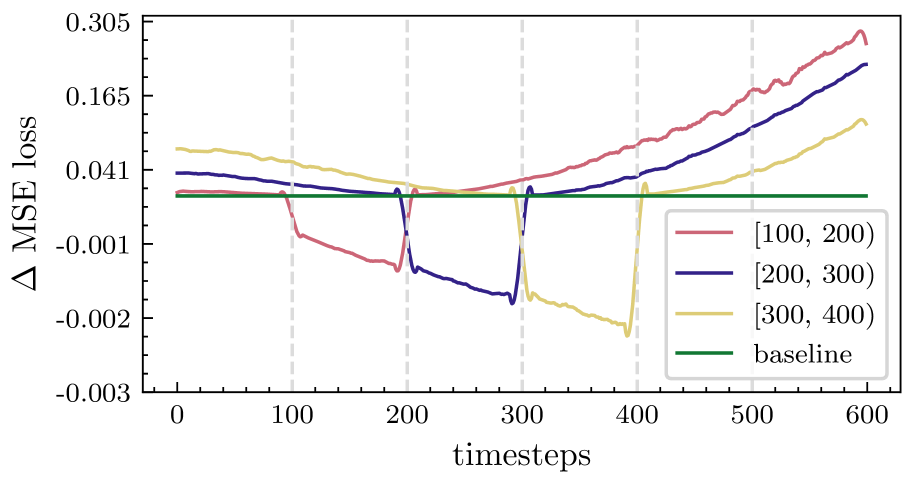

# PAPER: Min-SNR — Diffusion 학습 속도를 3.4× 가속하는 timestep loss weighting

## 📌 메타 정보

| 항목 | 내용 |
|---|---|
| **논문 제목** | Efficient Diffusion Training via Min-SNR Weighting Strategy |
| **저자** | Tiankai Hang, Shuyang Gu, Chen Li, Jianmin Bao, Dong Chen, Han Hu, Xin Geng, Baining Guo (Microsoft Research Asia + Southeast University) |
| **공개일** | 2023-03-16 (arXiv v1) / **ICCV 2023** |
| **분야** | 이미지 생성 / Diffusion Training / cs.CV |
| **논문 링크** | https://arxiv.org/abs/2303.09556 |
| **공식 코드** | https://github.com/TiankaiHang/Min-SNR-Diffusion-Training |
| **본 문서 목적** | Min-SNR-γ loss weighting 의 동기·수식·코드·실험을 한 페이지로 정리 |

### 위치 짚기 (왜 이 논문이 중요한가)

- **Diffusion 학습 손실 가중치 설계의 표준 baseline.** 후속 Stable Diffusion 3, DiT 계열, EDM2 등의 가중치 비교에서 거의 항상 등장.
- **Hugging Face Diffusers, k-diffusion 에 통합.** `snr_gamma=5` 같은 옵션이 모두 이 논문에서 유래.
- **"어느 parameterization(ε / x₀ / v)이 좋은가" 라는 오래된 논쟁을 "어떤 loss weight를 쓰느냐의 문제"로 환원** 시킴.

---

## 📖 주요 용어 사전 (Glossary)

### Diffusion 기본 (이 논문에서 가정)

- **Forward process**: 깨끗한 이미지 `x₀` 에 노이즈를 점점 더해 `x_T` (거의 가우시안 노이즈) 로 만드는 과정. 한 시점에서 `x_t = α_t · x₀ + σ_t · ε`, ε ~ N(0,I).
- **α_t, σ_t**: timestep t 의 신호 계수와 노이즈 계수. 보통 `α_t² + σ_t² = 1` (variance-preserving) 을 만족.
- **SNR (Signal-to-Noise Ratio, 신호 대 잡음 비율)**: `SNR(t) = α_t² / σ_t²`. t=0 에서 ∞ (깨끗), t=T 에서 ≈0 (순수 노이즈).
- **Cosine schedule**: α_t, σ_t 를 cos/sin 함수로 정의 — 이 논문에서 채택한 noise schedule.

### Parameterization (모델이 무엇을 예측하느냐)

- **ε-prediction (noise prediction)**: 모델이 더해진 노이즈 ε 를 예측. 원조 DDPM 방식.
- **x₀-prediction (start prediction)**: 모델이 깨끗한 이미지 x₀ 자체를 예측. 이 논문이 권장.
- **v-prediction (velocity prediction, 속도 예측)**: 모델이 `v = α_t · ε − σ_t · x₀` 를 예측. **Progressive Distillation** (Salimans & Ho 2022 — diffusion step 수를 2의 거듭제곱으로 단계적으로 줄이는 증류 기법) 논문에서 제안된 *ε 와 x₀ 의 혼합형* 예측 대상.
- **세 parameterization 의 핵심 사실**: 셋은 **수학적으로 동등** — 한쪽 출력을 다른 쪽으로 변환 가능. 차이는 **각각의 L = ‖target − pred‖² 가 자동으로 갖는 timestep 가중치가 다르다** 는 점뿐.

### Loss weighting (본 논문 핵심)

- **Loss weight w(t)**: timestep 별 mse loss 에 곱하는 스칼라. 학습이 어느 노이즈 구간을 더 중요시할지 결정.
- **Min-SNR-γ weighting**: `w(t) = min(SNR(t), γ)`. γ 는 상한 (clamp) 값, 본 논문에서 **γ=5 권장**.
- **Truncated SNR** (비교 baseline): `max(SNR(t), 1)`. low noise (큰 SNR) 는 SNR 그대로, high noise (작은 SNR) 는 1 로 *아래쪽을 받쳐줌* (floor — clamp 의 반대, 최저값 보장). Min-SNR 과는 반대 방향의 자르기.
- **Multi-task learning view**: 각 timestep 의 손실을 별개 task 로 보고, task 간 gradient 충돌 (conflict) 을 줄이는 weight 를 찾는 관점.
- **Pareto optimality (파레토 최적성)**: 한 task 를 더 개선하려면 다른 task 가 반드시 나빠지는 균형점. 본 논문은 stationary (고정) Pareto-aware 가중치를 제안.

### 부록: 본문에서 자주 등장하는 추상 용어

- **DDPM (Denoising Diffusion Probabilistic Models)**: 2020년 Ho et al. 의 원조 diffusion 논문. 본 논문이 baseline 으로 쓰는 *1000-step + ε-prediction* 의 기준.
- **Variance-preserving (VP, 분산 보존 형식)**: forward process 에서 `α_t² + σ_t² = 1` 을 유지해 `x_t` 의 분산이 단계와 무관하게 약 1 로 고정되는 설정. DDPM 의 기본 가정.
- **Clamp (상한 컷, 위쪽 자르기)**: 값이 어떤 임계치를 넘으면 그 임계치로 *잘라내는* 연산. `min(x, γ)` = "x 가 γ 보다 크면 γ 로 잘라낸다".
- **Stationary (시간 무관·고정)**: 가중치가 학습 진행 중에 바뀌지 않고 *t 의 함수로만 결정* 되는 형태. Min-SNR-γ 는 매 iter 마다 새로 계산할 필요 없는 stationary 가중치 → 비용 0.
- **Saturate (포화)**: 학습이 진행돼 손실이 더 줄어들지 않고 *학습 신호가 거의 안 나오는 상태* 에 도달함.
- **Effective learning rate (실효 학습률)**: 명목 lr 이 아니라, gradient 분산·충돌 등을 고려한 *실제로 모델이 한 step 에 얼마나 움직이는지* 의 척도.
- **Ablation (제거 실험)**: 모델·기법의 한 요소만 빼거나 바꿔보고 성능 변화를 보는 분석 방식.

---

## 1️⃣ 논문 한눈에 보기 (TL;DR)

> Diffusion 학습은 1000개의 노이즈 단계 (timestep) 를 한 모델로 동시에 학습하는 *다중 과제 학습* (multi-task learning) 인데, **단계마다 모델을 미는 방향 (gradient) 이 서로 엇갈려** 수렴이 느림. 이 엇갈림을 줄이기 위해 단계별 손실 가중치를 **`min(SNR(t), γ)`** 로 *위쪽만 잘라내면* (clamp = 상한 컷), ImageNet 256×256 에서 동일 step 기준 **FID=10 까지 3.4× 빠르게** 도달하고, ViT-XL 로 **FID 2.06** 달성 (당시 SOTA, DiT-XL/2 의 2.27 을 더 작은 모델로 능가).

**핵심 문제** — Diffusion 학습에서 모든 timestep 의 손실을 *똑같은 비중* 으로 더하면 (또는 ε-prediction 의 자연 가중치 1 로 두면) 왜 학습이 느린가?

**해결책** — 3 단계:
1. **문제 진단**: 특정 timestep 구간만 따로 학습시키면 인근 구간은 좋아지지만 먼 구간은 오히려 나빠진다 (Figure 2). 즉 단계들이 *서로의 진전을 깎아먹는 경쟁 과제* (conflicting task).
2. **이론적 정식화** (이론 framing): 이를 *각 단계를 별개 과제로 보는 다중 과제 학습* 으로 보고, *어느 과제도 더 불리해지지 않는 균형점* 의 가중치 (Pareto-optimal weights) 를 찾는 문제로 환원.
3. **실용 해법**: `w(t) = min(SNR(t), γ)` 로 *위쪽만 자르는* (상한 clamp) 가중치. 노이즈가 적은 단계 (low noise, SNR 큼) 가 손실을 압도하는 걸 막으면서, 노이즈 많은 단계 (high noise) 의 학습 신호도 보호. γ=5 권장.

**검증**:
- ImageNet 256×256 (LDM latent, ViT-XL) : **FID 2.06** (~7M iter)
- 3.4× faster to FID=10 vs 종래 가중치
- ε / x₀ / v 어느 parameterization 에서도 일관된 가속 효과

---

## 2️⃣ 핵심 기여 (Contributions)

1. **Timestep 간 gradient 충돌 진단** — *특정 단계만 따로 추가 학습시키는 제거 실험* (finetuning ablation) 으로 "한 단계의 손실을 줄이면 다른 단계가 나빠진다" 는 현상을 명시적으로 입증 (§3.1, Fig 2).
2. **다중 과제 학습 관점의 정식화** (Multi-task learning view) — Diffusion 학습을 T 개 timestep 과제의 가중합으로 보고, 가중치 설계를 *어느 과제도 더 불리해지지 않는 균형점* (Pareto optimality) 을 찾는 문제로 환원.
3. **Min-SNR-γ 가중치 제안** — `min(SNR(t), γ)` 라는 극도로 단순한 *위쪽 잘라내기* (clamp) 형태. 추가 계산 비용 0, 코드 두 줄.
4. **Parameterization 통합** — *모델이 무엇을 예측하느냐* (ε / x₀ / v 중 어느 것; parameterization) 의 차이를 "자동으로 따라붙는 timestep 가중치 차이" 로 해석하고, Min-SNR-γ 적용 시 셋이 모두 비슷한 성능으로 수렴함을 보임 (parameterization 논쟁 해소).
5. **SOTA on ImageNet 256×256** — ViT-XL (451M 파라미터) 로 **FID 2.06** 달성. 당시 SOTA 였던 DiT-XL/2 (675M, FID 2.27) 보다 *더 작은 모델로* 능가.

---

## 3️⃣ 주요 알고리즘 설명

### 3.1 문제: 왜 timestep 들이 충돌하는가

<p align="center">
  
</p>

> **Fig. 2 — Timestep 간 충돌 증거.** 사전학습된 baseline 모델 (초록 가로선, Δ MSE = 0) 위에서 시작해, **특정 timestep 구간만 골라 추가 학습**시킨 뒤 전 구간의 MSE 변화를 측정한 결과.
> - 빨강 = [100,200)만 학습 / 파랑 = [200,300)만 학습 / 노랑 = [300,400)만 학습.
> - 각 색은 **자기 구간(점선 영역)에서는 0 아래로 내려가 손실 감소(개선)**, **하지만 멀리 떨어진 t (특히 t > 400) 에서는 위로 올라가 손실 증가(악화)**.
> 즉 "timestep A 를 잘 학습시키면 timestep B 의 성능이 떨어지는" — **단계 사이에 학습 방향이 엇갈리는 충돌** (multi-task gradient conflict) 이 실험적으로 확인됨. 이 충돌이 Min-SNR 이 풀려는 핵심 문제.

| t 구간 | 학습이 시키는 것 | 모델에게 필요한 능력 |
|---|---|---|
| **High noise (t ≈ T)** | 대략적 구조·색·텍스트 정합 만들기 | 의미적·전역적 정보 (coarse layout) |
| **Mid noise** | 형태·경계 다듬기 | 중간 주파수 |
| **Low noise (t ≈ 0)** | 픽셀 수준 세부 디테일 | 고주파수 (high-frequency) |

같은 네트워크의 *한 벌의 파라미터* (one set of weights) 로 이 셋을 *모두* 잘 하라고 요구 → 각 단계에서 나오는 gradient 가 서로 다른 방향을 가리킴 → 여러 step 평균을 내면 서로 상쇄돼 진전이 느림.

### 3.2 손실 함수와 자연 가중치

세 parameterization 각각의 MSE 손실 (모델 예측과 정답의 제곱 오차) 을, *모두 깨끗한 이미지 x₀ 기준 픽셀 오차로 통일해서 환산하면* 자동으로 따라붙는 timestep 가중치가 다음과 같이 다름. 즉 각자의 raw loss 안에 이미 *암묵적인 timestep 가중치* 가 들어있다는 뜻.

| Parameterization (예측 대상) | Raw loss — 모델이 직접 줄이는 제곱 오차 `‖target − pred‖²` | x₀ 기준 유효 가중치 — 깨끗한 이미지 픽셀 오차로 환산했을 때 자동으로 곱해지는 비중 `w(t)` |
|---|---|---|
| ε-prediction | `‖ε − ε̂‖²` | **1** (constant, 모든 t 동등) |
| x₀-prediction | `‖x₀ − x̂₀‖²` | **SNR(t)** (저노이즈일수록 폭주) |
| v-prediction | `‖v − v̂‖²` | **SNR(t) + 1** (중간 형태) |

→ ε 학습은 *모든 t 를 똑같이* 보고, x₀ 학습은 *노이즈가 적은 단계 (큰 SNR) 를 압도적으로 강조* — 한 단계의 손실이 전체를 차지해 다른 단계 학습이 묻혀버림 (low noise 폭주). 둘 다 극단.

### 3.3 Min-SNR-γ 가중치 (논문의 제안)

**아이디어**: x₀ 공간 기준 *유효 가중치* (앞 절에서 정의한 w(t)) 를 `min(SNR(t), γ)` 로 만든다. 즉 SNR 이 γ 보다 크면 γ 로 *위쪽을 잘라낸다* (clamp).

- **High noise (SNR 작음, 노이즈가 많은 단계)**: SNR 이 γ 보다 작으므로 그대로 적용 → ε-prediction 의 균등 가중치 (w=1) 보다 *상대적으로* 비중 ↑
- **Low noise (SNR 큼, 노이즈가 거의 없는 단계)**: γ 로 잘라냄 → x₀-prediction 의 폭주 ↓

세 parameterization 각각에서 *모델이 직접 줄이는 raw loss 에 곱해줄* `mse_loss_weight` (실제 코드 변수명):

| Parameterization | `mse_loss_weight` 공식 | 의미 |
|---|---|---|
| **x₀-prediction** | `min(SNR, γ)` | 기본 형태 |
| **ε-prediction** | `min(SNR, γ) / SNR` = `min(1, γ/SNR)` | ε 의 자연 가중치(1)를 x₀ 공간으로 변환 후 clamp |
| **v-prediction** | `min(SNR, γ) / (SNR + 1)` | v 의 자연 가중치(SNR+1)로 나눠줌 |

**권장 γ**: **5** (실험상 가장 안정적).

### 3.4 Pareto-optimal 관점 (Theorem 1 요약)

이상적인 가중치는 매 학습 step 마다 다음 최적화 문제를 풀어야 함.
*(즉: 모든 timestep 에서 나온 gradient 를 가중합 했을 때 그 합 벡터의 크기를 최소로 만드는 가중치 w 를 찾자. 합 벡터 크기가 작다 = 서로 반대 방향이던 grad 들이 잘 상쇄됐다 = 충돌이 작다는 의미. 단, 한 timestep 에만 가중치를 몰빵하지 못하게 정규화 항도 같이 둠.)*

```
min_{w_t}   ‖Σ_t w_t · ∇_θ L_t(θ)‖₂² + λ · Σ_t ‖w_t‖₂²
                                                                                              
              (1) 모든 단계 gradient 합의 노름 ↓  (서로 상쇄 → 충돌 약화)
              (2) 가중치 정규화 (한 단계에 몰빵 방지)
```

이걸 매 step 마다 정확히 풀려면 비용이 큼. Min-SNR-γ 는 이 최적화를 **학습 내내 변하지 않는 고정 가중치** (stationary approximation) 로 대체 — `w(t) = min(SNR(t), γ)` 가 *평균적으로* 충돌을 잘 완화한다는 경험적 발견.

### 3.5 코드 매핑 (공식 repo)

`guided_diffusion/gaussian_diffusion.py:846-895` — 손실 계산 함수 `training_losses` 안에서, *모델의 예측 대상* (parameterization; `predict_xstart` / `predict_v` 인자로 결정) 과 *weight type 문자열* (`min_snr_5`, `vmin_snr_5` 등) 을 보고 분기해 `mse_loss_weight` 를 계산. 큰 그림은 두 갈래로:
- **분기 1** (모델이 ε 또는 v 를 예측): 가중치를 *x₀ 공간 기준으로 환산해서* 적용 → 분모에 `SNR` 또는 `SNR+1` 이 들어감.
- **분기 2** (모델이 x₀ 를 직접 예측): 환산 없이 `min(SNR, γ)` 그대로 곱함.

두 분기 모두 핵심 식은 `min(SNR, γ)` 동일 — 차이는 분모뿐.

```python
# guided_diffusion/gaussian_diffusion.py (요지 발췌)
alpha = _extract_into_tensor(self.sqrt_alphas_cumprod, t, t.shape)
sigma = _extract_into_tensor(self.sqrt_one_minus_alphas_cumprod, t, t.shape)
snr = (alpha / sigma) ** 2          # SNR(t) = α²/σ²

# 분기 1: 모델이 ε 또는 v 를 예측하거나 weight type 이 constant 일 때
#         → raw loss 에 곱할 가중치를 x₀ 공간 기준으로 환산
if self.model_mean_type is not ModelMeanType.START_X or weight_type == 'constant':
    if weight_type.startswith("min_snr_"):
        k = float(weight_type.split('min_snr_')[-1])
        mse_loss_weight = th.stack([snr, k*th.ones_like(t)], dim=1).min(dim=1)[0] / snr
        # ε 예측용: min(SNR, k) / SNR  = min(1, k/SNR)
    elif weight_type.startswith("vmin_snr_"):
        k = float(weight_type.split('vmin_snr_')[-1])
        mse_loss_weight = th.stack([snr, k*th.ones_like(t)], dim=1).min(dim=1)[0] / (snr + 1)
        # v 예측용: min(SNR, k) / (SNR+1)

# 분기 2: 모델이 x₀ 를 직접 예측할 때
else:
    if weight_type.startswith("min_snr_"):
        k = float(weight_type.split('min_snr_')[-1])
        mse_loss_weight = th.stack([snr, k*th.ones_like(t)], dim=1).min(dim=1)[0]
        # x₀ 예측용: min(SNR, k)  ← 가장 단순한 본가지

# zero-terminal SNR (last step) 안전장치
mse_loss_weight[snr == 0] = 1.0

# raw loss 에 곱해서 최종 mse
terms["mse"] = mse_loss_weight * mean_flat((target - model_output) ** 2)
```

**키 포인트**:
- 한 함수 안에 세 가지 parameterization (모델이 무엇을 예측하느냐) 의 변환을 모두 처리. `weight_type` 문자열로 분기 (`min_snr_5`, `vmin_snr_5` 등).
- `snr == 0` 위치 (마지막 timestep) 는 가중치를 1 로 보정 — **zero-terminal SNR schedule** (마지막 step 에서 신호가 완전히 0 이 되도록 설계된 noise schedule. SD2.1 등에서 사용. 이 경우 SNR = α²/σ² 가 0/1 = 0 이 되어 나눗셈에서 무한대 발생 위험) 대응.
- Truncated SNR (`trunc_snr` = `max(SNR, 1)`), inverse SNR (`inv_snr` = `1/SNR`), max-SNR-γ (`max_snr_k`) 등 비교용 baseline 가중치 식도 모두 같은 함수에 구현돼 있어 ablation 이 편함.

### 3.6 학습 config (재현용)

`configs/in256/vit-b_layer12_lr1e-4_099_099_pred_x0__min_snr_5__fp16_bs8x32.sh` 에서:

| 항목 | 값 |
|---|---|
| 모델 | `vit_base_patch2_32`, depth 12 (ViT-B/2 — Vision Transformer, base 크기, 패치 2×2) |
| 입력 | 잠재 공간 표현 32×32×4 (LDM latent — Latent Diffusion Model 의 잠재공간; 원본 image 256×256 을 **AutoencoderKL** (Stable Diffusion 에서 쓰는 KL-정규화 오토인코더) 로 8× 압축한 결과) |
| Diffusion steps | 1000, **cosine schedule** (앞 절 Glossary 참조) |
| Parameterization | `--predict_xstart True` → x₀-prediction (모델이 깨끗한 이미지 자체를 예측) |
| Loss weight | `--mse_loss_weight_type min_snr_5` → γ=5 의 Min-SNR-γ |
| Optimizer | AdamW, lr=1e-4, β₁=0.99, β₂=0.99, weight_decay=0.03 |
| 배치 | GPU 8 × per-GPU 32 = **256** (글로벌 배치 크기) |
| Mixed precision | fp16 (혼합 정밀도 — 메모리 절약·속도 향상) |
| Class drop prob | 0.15 (학습 중 클래스 조건을 15% 확률로 비워 *조건부/무조건부 모두 학습* — **CFG** (Classifier-Free Guidance, 분류기 없는 가이던스) 추론을 가능하게 함) |

v-prediction 버전은 같지만 `--predict_v True`, `--mse_loss_weight_type vmin_snr_5`.

---

## 4️⃣ 실험 요약

### 4.1 ImageNet 256×256 (LDM latent, ViT-XL, class-conditional)

| 모델 | 파라미터 | FID ↓ | 비고 |
|---|---|---|---|
| LDM | 400M | 3.60 | |
| ADM | 554M | 7.49 | |
| ADM-G | 608M | 3.94 | classifier guidance |
| DiT-XL/2 | 675M | 2.27 | 동시기 SOTA |
| **Min-SNR (ours, ViT-XL)** | **451M** | **2.06** | **더 작은 모델로 SOTA 갱신** |

### 4.2 수렴 속도 (vs 가중치 종류)

- FID = 10 도달까지 기준: **Min-SNR-5 가 baseline 가중치 (균등 weighting) 대비 3.4× 빠름**.
- Max-SNR-γ (위쪽 대신 *아래쪽을 잘라낸* 반대 형태) 는 학습이 발산함 — low noise 만 강조한 결과 high noise 학습이 망가짐.
- 세 parameterization (ε / x₀ / v) 어디에 적용해도 Min-SNR-γ 가 가장 빠른 수렴 곡선을 보임.

### 4.3 γ 민감도

- **γ=5** 가 일관되게 최고.
- **γ=1**: 너무 강한 위쪽 자르기 (clamp) → 가중치가 거의 균등에 가까워져 high noise 만 학습되는 쪽으로 치우침.
- **γ=∞**: 사실상 clamp 가 없어짐 → 원래 x₀-prediction 의 *low noise 폭주* 로 회귀.

---

## 5️⃣ 💬 Q&A — 직관적 이해

### Q1. ε-prediction 은 자연 가중치가 1 (=constant, 균등) 인데, 왜 그래도 학습이 잘 안 되는가?

x₀ 공간 (깨끗한 이미지 픽셀 기준) 으로 환산하면 ε-prediction 의 유효 가중치는 1 — 즉 *모든 timestep 의 픽셀 오차를 동등 비중으로* 본다는 뜻. 그런데 인간이 보기에 *노이즈가 많은 단계 (high noise) 의 픽셀 오차* 와 *노이즈가 거의 없는 단계 (low noise) 의 픽셀 오차* 는 의미가 다름. low noise 쪽은 세부 디테일이라 픽셀 오차가 작아도 시각적 임팩트가 있고, high noise 쪽은 큰 구조라 픽셀 오차가 커도 *전체 그림 차원* 에서 영향. 단순 동등 가중치는 이 *단계별 중요도 비대칭* 을 무시 → 비효율적. 게다가 학습 후반에 low noise 쪽이 *먼저 포화* (saturate) 돼 미니배치 일부 샘플이 학습 진전에 거의 기여 안 함.

**Min-SNR-γ** 는 "low noise 는 SNR 에 비례해 비중을 키우되 γ 에서 위쪽을 잘라냄 (cap)" 으로 이 비대칭을 적절히 반영.

### Q2. 왜 max 가 아니라 min 인가?

- `max(SNR, γ)` (아래쪽을 γ 로 받쳐주는 형태) 는 *높은 SNR 을 더 강조* → low noise 가중치 폭주, 학습이 한쪽으로 쏠려 불안정.
- `min(SNR, γ)` (위쪽을 γ 로 잘라내는 형태) 은 *큰 SNR 의 폭주를 막고 작은 SNR (= 노이즈 많은 단계) 의 비중을 상대적으로 살림* → 균형.

직관적으로 high noise (어려운 단계의 학습 과제) 는 가뜩이나 학습이 더디므로 *작은 SNR 쪽 손실이 더 큰 손실에 묻히지 않게* 보호해줘야 한다.

### Q3. γ=5 의 의미는?

`SNR(t) > 5` 인 timestep — 즉 *노이즈가 거의 없는 low-noise 영역* — 의 손실 가중치를 5 로 *위쪽에서 잘라냄* (cap). 그보다 노이즈가 많은 t 는 SNR 값 그대로. cosine schedule + 1000 step 기준 대략 `t < 100` 정도가 잘라내기 (clamp) 영역에 해당.

### Q4. 이 가중치를 다른 schedule (rectified flow, EDM) 에도 쓸 수 있나?

원논문은 cosine schedule + DDPM (Denoising Diffusion Probabilistic Models, 2020 원조 diffusion) 을 가정. **EDM** (Karras et al., 2022 — noise sigma 를 직접 다루는 elucidated diffusion) 은 σ 기반 표현이라 SNR 정의가 달라지지만 같은 철학 적용 가능 (실제로 후속 EDM2 가 자체 가중치 제안). **Rectified Flow / Stable Diffusion 3** (flow matching 기반) 도 자체 *로짓-정규 가중치* (logit-normal weighting — timestep 을 로짓 정규분포로 샘플링해 자연스럽게 mid-noise 강조하는 방식) 를 쓰지만, **Hugging Face Diffusers 라이브러리는 SD2/SDXL fine-tuning 시 Min-SNR-γ 옵션 (`snr_gamma`) 을 그대로 제공**.

### Q5. DMD 같은 distillation (증류) 과 직접 관련 있나?

직접 관련은 없음. Min-SNR 은 **선생 모델** (teacher = base diffusion model) *자체를 더 빠르게 학습* 시키는 기법. *증류* (distillation) 는 이미 학습된 teacher 를 *작은/빠른 학생 모델* (student) 로 옮기는 별개 단계. 단, [[paper-dmd]] 의 *가짜-스코어 비평기* (fake-score critic, μ_fake) 도 *student 출력에 다시 노이즈를 더해* (forward-diffuse) 학습되는 일종의 diffusion 모델이라, 그쪽에서도 Min-SNR 가중치를 쓸 수 있음.

### Q6. 한 줄로: 무엇이 이 논문의 진짜 새로움인가?

> "Parameterization 논쟁 (ε vs x₀ vs v 중 무엇을 예측해야 하나) 은 사실상 *가중치 논쟁* 이었고, 가중치를 `min(SNR, γ)` 로 위쪽만 잘라내기 (clamp) 만 해도 셋이 모두 비슷한 최적값에 도달한다" 는 **통합 관점** (unified view).

---

## 6️⃣ 한 줄 요약 (전체)

> Diffusion 학습 손실에 `w(t) = min(SNR(t), γ=5)` 한 줄을 곱하면 *단계별 gradient 가 서로 엇갈리는 충돌* 이 완화돼 수렴이 3.4× 빨라지고, *모델이 무엇을 예측하느냐* (ε / x₀ / v 중 어느 parameterization) 와 상관없이 비슷한 SOTA (ImageNet 256² FID 2.06) 에 도달한다.

---

## 7️⃣ 관련 메모리 링크

- [[paper-dmd]] — 본 논문은 *teacher 학습* 가속, DMD 는 *student 추론* 가속. 상보적.
- [[paper-z-image]] — Z-Image 도 자체 loss weighting (SNR-aware) 를 채택. Min-SNR 의 후예 격.
- [[reference-pretrained-backbone-reuse-landscape]] — 본 논문의 ViT-XL latent diffusion 은 backbone 재사용 분기 C (from-scratch DiT) 의 대표 baseline.
