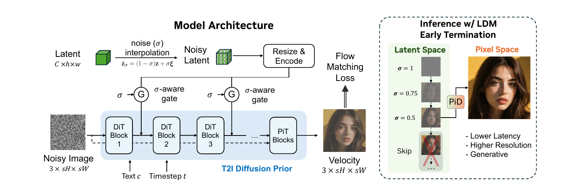

# PAPER: PiD - VAE 디코더를 픽셀 확산으로 바꿔 고해상도를 빠르게 뽑는 디코더

## 0. 이 문서를 읽는 법

이 문서는 PiD 논문과 공개 추론 코드(nv-tlabs/PiD)를 처음 읽는 사람이 흐름을 놓치지 않도록 정리한 리뷰입니다.

핵심은 한 문장입니다.

> **PiD는 이미지 생성의 마지막 단계인 "잠재(latent) → 픽셀" 디코딩을, 단순 복원이 아니라 작은 확산 모델(diffusion)로 바꿔서 "없던 디테일을 만들며 동시에 4배 키우는" 디코더다.**

이 문서는 논문의 서사(문제 제기 → 기여 → 방법 → 실험)를 뼈대로 삼고, 공개 코드는 각 주장 밑에 "→ 코드 확인" 형태로 종속시켜 배치했습니다. 수식은 GitHub에서 깨지지 않도록 LaTeX 대신 일반 텍스트로 적었습니다.

읽는 순서:

1. **메타 정보 / 용어 사전**: 배경 깔기
2. **한 줄 요약 + 기여**: 논문이 무엇을 주장하나
3. **전체 구조 §6 (Figure 3)**: 그림 한 장으로 큰 그림 잡기
4. **방법 §7~§10**: 픽셀 확산 재정의 → 아키텍처(PiT 블록) → sigma 어댑터/조기종료 → 4스텝 증류
5. **학습 절차 §11**: 기반 모델 freeze, PiD만 학습 (오해 방지)
6. **코드 흐름도 §12**: 개념도가 실제 코드로 어떻게 도는지
7. **실험 §13**: 속도/메모리 숫자
8. **Q&A §14**: 대화에서 나온 질문들 (학습·FLUX.2 적용·만능 여부 등)

---

## 1. 메타 정보

| 항목 | 내용 |
|---|---|
| 논문 | PiD: Fast and High-Resolution Latent Decoding with Pixel Diffusion |
| 저자 | Yifan Lu, Qi Wu, Jay Zhangjie Wu, Zian Wang, Huan Ling, Sanja Fidler, Xuanchi Ren (NVIDIA Spatial Intelligence Lab) |
| 공개일 | 2026-05-22 |
| arXiv | https://arxiv.org/abs/2605.23902 |
| PDF | https://arxiv.org/pdf/2605.23902 |
| 프로젝트 | https://research.nvidia.com/labs/sil/projects/pid/ |
| 공식 코드 | https://github.com/nv-tlabs/PiD |
| Hugging Face | `nvidia/PiD` (체크포인트) |
| 분야 | Latent Decoding, Super-Resolution, Pixel-space Diffusion |
| 공개 범위 | 추론 코드 + 백본별 체크포인트 공개. **학습 스크립트는 미공개(README "[Planned]")** |
| 지원 백본 | FLUX, FLUX.2, SD3, Z-Image / Z-Image-Turbo, DINOv2, SigLIP |

---

## 2. 한 문장 요약

> **PiD는 무거운 VAE 디코더와 별도 초해상도(super-resolution) 모델을 하나의 4스텝 픽셀 확산 디코더로 합쳐, 512×512 잠재를 2048×2048 픽셀로 1초 안에(소비자 GPU) 풀어내는 모델이다.**

조금 더 풀어 말하면:

> **기존 디코더는 "원본을 똑같이 되살리기"만 해서 디테일을 못 만들고 고해상도에서 느렸다. PiD는 디코딩을 "노이즈에서 그림을 그리는 생성 문제"로 바꿔, 디코딩과 확대를 한 번에 처리한다.**

---

## 3. 주요 용어 사전 (Glossary)

처음 등장하는 용어를 미리 풀어둡니다. 본문에서는 약식으로만 씁니다.

### 큰 그림 관련

- **잠재공간 (latent space)**: 이미지를 VAE(자동 인코더)로 한 번 압축해 만든 작은 표현. 예를 들어 1024×1024 RGB 이미지가 128×128×16 짜리 숫자 묶음으로 줄어듦. 생성 모델은 보통 이 작은 공간에서 그림을 그림.
- **디코딩 (decoding)**: 잠재공간의 압축된 표현을 다시 사람이 보는 픽셀(pixel) 이미지로 펼치는 과정. 지금까지는 VAE 디코더가 담당.
- **복원 지향 (reconstruction-oriented)**: 디코더의 학습 목표가 "원본과 최대한 똑같이"라는 뜻. 그래서 원본 잠재에 없던 새로운 디테일은 못 만든다 — 이게 논문이 지적하는 한계.
- **초해상도 (super-resolution, SR)**: 작은 이미지를 크게 키우면서 디테일을 채우는 기술. 기존 파이프라인은 디코딩 후 별도 SR 모델을 또 돌렸다(캐스케이드, cascade).

### 방법 관련

- **픽셀 확산 (pixel diffusion)**: 잠재공간이 아니라 **원본 RGB 픽셀 공간에서 직접** 노이즈를 점점 걷어내며 이미지를 만드는 확산 모델. 토큰 수가 많아 보통 느리지만, PiD는 아래 PixDiT 구조로 비용을 낮춤.
- **흐름 매칭 / 속도장 (flow matching / velocity field)**: 확산의 한 방식. "지금 노이즈 낀 이미지에서 깨끗한 이미지 쪽으로 어느 방향으로 얼마나 움직여야 하나(속도)"를 네트워크가 예측하고, 그 방향으로 조금씩 이동.
- **조건 (condition / LQ)**: PiD가 그림을 그릴 때 참고하는 입력. 여기서는 저품질·저해상도 잠재(LQ = low-quality latent)나 저해상도 이미지. "이런 그림을 그려라"는 가이드 역할.
- **sigma (노이즈 수준)**: 조건으로 들어온 잠재가 "얼마나 노이즈에 절었는가"를 나타내는 값. 0이면 완전히 깨끗, 1에 가까우면 거의 노이즈. PiD의 핵심 장치가 이 값을 활용.
- **조기 종료 (early termination)**: 원래 끝까지(예: 28스텝) 돌려야 깨끗해지는 잠재 확산(예: FLUX)을 **중간에 멈추고**, 덜 깨끗한 잠재를 PiD에 넘겨 픽셀 공간에서 마무리하는 것. 비싼 후반 스텝을 절약.
- **DMD2**: 여러 스텝 확산 모델을 소수(여기선 4) 스텝으로 압축하는 증류(distillation) 기법. 자세히는 [[paper_dmd2]] 참고.

### 아키텍처 관련

- **PixDiT**: PiD가 쓰는 픽셀 공간 트랜스포머. 패치 단위 무거운 블록(MMDiT)과 픽셀 단위 가벼운 블록(PiT)으로 나눠 비용을 통제. §8에서 설명.
- **MMDiT 블록 (patch block)**: 16×16 패치를 한 토큰으로 묶어 텍스트와 함께 전역 attention을 도는 무거운 블록.
- **PiT 블록 (pixel block)**: 패치 *내부* 픽셀들만 다루는 가벼운 블록 (내부 차원이 64로 매우 작음).
- **의미 잠재 (semantic latent)**: VAE 잠재가 아니라 SigLIP·DINOv2 같은 이해 모델이 뽑은 특징. PiD는 이런 잠재도 픽셀로 디코딩할 수 있음(기여 4).

---

## 4. 논문이 제기하는 문제

*왜 이 절을 두는가: PiD가 무엇을 고치려는 모델인지 알아야 이후 설계가 납득되기 때문.*

논문은 기존 잠재→픽셀 디코더의 한계를 한 문장으로 못 박습니다.

> "디코더는 복원 지향(reconstruction-oriented)이라, 인코더를 역으로 되돌리는 데 최적화돼 있을 뿐 디테일을 합성하지 못하며, 메가픽셀 규모에서 점점 더 비싸진다."

정리하면 두 가지 병목입니다.

1. **디테일을 못 만든다**: VAE 디코더는 "원본 그대로 복원"이 목표라, 잠재에 없던 고주파 디테일(머리카락, 피부 질감)을 새로 그리지 못함.
2. **고해상도에서 느리다**: 2K, 4K로 갈수록 디코더 연산이 폭발. 그래서 업계는 "생성 → 디코딩 → 별도 SR"로 캐스케이드를 쌓아왔는데, 이 사슬이 느림.

PiD는 이 사슬 자체를 단일 모듈로 접는 것이 목표입니다.

---

## 5. 핵심 기여 (Contributions)

논문이 직접 나열하는 기여는 넷입니다.

1. **통합 프레임워크**: 잠재 디코딩을 "조건부 픽셀 확산(conditional pixel diffusion)"으로 재정의해 **디코딩과 업샘플링을 하나의 생성 모듈로 통합**.
2. **Sigma-aware 어댑터**: 노이즈 낀 잠재를 픽셀 확산 백본에 주입하는 경량 장치. 이걸로 **잠재 확산을 도중에 끊을 수 있음(조기 종료)**.
3. **증류**: DMD2로 추론을 **4스텝**까지 압축.
4. **넓은 적용 범위**: VAE 잠재뿐 아니라 **의미 잠재(SigLIP·DINOv2)** 까지 디코딩.

---

## 6. 전체 구조 한눈에 보기 (Figure 3)

*왜 이 절을 두는가: 아래 §7~§10의 방법들이 하나의 그림 안에서 어떻게 맞물리는지 큰 그림을 먼저 잡아야, 뒤의 세부 수식이 헷갈리지 않기 때문.*



> **논문 Figure 3 캡션(번역)**: "PiD는 잠재 디코딩과 업샘플링을, 타깃 해상도의 픽셀 공간 속도장(velocity field)을 예측하는 단일 '잠재 조건부 픽셀 확산' 모델로 통합한다. 노이즈를 섞은 잠재로 학습(noise-corrupted latent training)하고 sigma-aware 게이팅을 쓰기 때문에, 디코더가 부분적으로만 디노이즈된(partially denoised) 잠재에도 견고해져 기반 LDM에서 조기 이탈(early exit)하면서도 고해상도 출력 품질을 유지한다."

그림은 크게 두 덩어리입니다. 왼쪽은 "어떻게 학습/동작하나(구조)", 오른쪽은 "왜 빠른가(추론 시 조기 종료)"입니다.

### 6.1 왼쪽 — Model Architecture (학습/순전파 흐름)

이 그림은 **아래쪽 '픽셀 줄기'와 위쪽 '잠재 줄기'가 가운데에서 만나는** 구조로 읽으면 됩니다.

- **아래 줄기 (픽셀 = 메인 생성기)**: 맨 왼쪽 `Noisy Image (3 × sH × sW)` — 타깃 *고해상도* 크기의 노이즈 이미지가 입력입니다 (s = 업스케일 배율, H·W = 원래 크기, 채널 3 = RGB). 여기에 텍스트 c와 타임스텝 t가 조건으로 붙어, `DiT Block 1·2·3 … → PiT Blocks` 로 이어지는 **T2I Diffusion Prior**(파란 박스 = §8의 PixDiT)를 통과합니다. 최종 출력은 `Velocity (3 × sH × sW)` — 픽셀 공간 속도장이고, 이걸 정답과 비교하는 게 우측 상단 `Flow Matching Loss`입니다.
- **위 줄기 (잠재 = 밑그림 조건)**: 맨 왼쪽 `Latent (C × h × w)` — 저해상도 잠재가 입력입니다. 먼저 `noise(σ) interpolation` 박스에서 일부러 노이즈를 섞어(식 3) `Noisy Latent` 를 만들고, `Resize & Encode`(식 4: 패치 격자에 맞춰 nearest 업샘플 → ResBlock → Linear)로 토큰화합니다.
- **두 줄기가 만나는 지점 = σ-aware gate (G)**: 잠재 토큰이 픽셀 줄기의 DiT 블록 *사이*로 주입되는데, 그 주입 세기를 노이즈 수준 σ가 조절하는 게이트가 G입니다(식 5·6, §9). 그림에 G가 두 번 그려진 건 "**여러 블록마다 반복 주입**"(논문은 두 블록마다)을 뜻합니다.

한 줄 메시지: **메인 생성은 픽셀 공간에서 일어나고, 잠재는 '밑그림'으로 옆에서 끼어든다 — 그 끼어드는 강도를 σ로 자동 조절한다.**

### 6.2 오른쪽 — Inference w/ LDM Early Termination (추론 시 조기 종료)

- 세로의 `σ = 1 → 0.75 → 0.5 …` 는 기반 LDM(예: FLUX)이 노이즈를 점점 걷어내는 중간 단계들입니다. 원래는 σ=0(완전히 깨끗)까지 끝까지 가야 합니다.
- 그런데 `Skip` 화살표가 보여주듯, **σ가 아직 0.5쯤인 '덜 익은' 잠재에서 멈추고**(Latent Space) 그 잠재를 PiD에 넘기면, PiD가 단번에 `Pixel Space` 의 고해상도 결과를 그려냅니다. 즉 LDM의 비싼 후반 스텝들을 건너뜁니다.
- 오른쪽 효익 3줄: **Lower Latency**(LDM 후반 스텝 생략) · **Higher Resolution**(디코딩과 동시에 4·8배 확대) · **Generative**(없던 디테일 합성).

이 오른쪽 그림이 §9의 sigma-aware 게이트가 "왜 쓸모 있는가"를 압축해 보여줍니다 — **학습 때부터 다양한 σ를 겪었기 때문에(왼쪽 그림의 noise interpolation), 추론 때 임의 지점에서 끊어도 견고**한 것입니다.

> **→ 수식/코드 일치 확인**: 그림의 σ가 코드의 `degrade_sigma`, 게이트 G가 `SigmaAwareGatePerTokenPerDim` 와 정확히 대응합니다. 수식 식 (3)~(6)의 의미와 코드 매핑은 §9에서 자세히 다룹니다.

---

## 7. 방법 ① — 디코딩을 조건부 픽셀 확산으로 재정의

*왜 이 절을 두는가: "복원" 대신 "생성"으로 문제를 바꾼 것이 PiD의 출발점이고, 나머지 설계가 모두 여기서 파생되기 때문.*

논문은 디코딩을 이렇게 다시 정의합니다.

> "PiD는 잠재 디코딩과 업샘플링을, **타깃 해상도의 픽셀 공간 속도장(velocity field)을 예측하는, 잠재로 조건화된 픽셀 확산 모델** 하나로 통합한다."

즉 디코더가 "압축을 역산하는 함수"가 아니라, **순수 노이즈에서 출발해 고해상도 이미지를 그려내는 생성기**가 됩니다. 저해상도 잠재는 "이런 그림을 그려라"는 조건으로만 들어갑니다.

> **→ 코드 확인** (`pid/_src/models/pid_distill_model.py`):
> 시작 노이즈가 `torch.randn(B, 3, img_h, img_w)` — 잠재공간이 아니라 **풀 해상도 RGB 픽셀**에서 출발합니다. 네트워크는 속도(velocity)를 예측하고, 이를 깨끗한 이미지 x0로 변환하는 식은 다음과 같습니다(일반 텍스트 표기):
> ```text
> x0 = x_t - t * v        (velocity → x0 변환, _net_output_to_x0)
> ```
> 즉 "지금 위치 x_t에서 예측 속도 v를 시간 t만큼 빼면 깨끗한 이미지"라는 흐름 매칭의 표준 관계입니다.

---

## 8. 방법 ② — 픽셀 공간 비용을 죽인 아키텍처 (PixDiT)

*왜 이 절을 두는가: 픽셀 공간 확산은 "토큰이 너무 많아 느리다"는 게 정설인데, PiD가 이를 어떻게 실용 속도로 만들었는지가 핵심 엔지니어링이기 때문.*

### 8.1 두 스트림 분업 — 패치(구도)와 픽셀(디테일)

PixDiT는 연산을 **두 층위(스트림)로 분업**합니다.

- **패치 스트림 (MMDiT 블록, 26층)**: 16×16 픽셀을 한 토큰으로 *뭉쳐서*(해상도 1/16) 텍스트와 함께 전역 attention(joint attention). "**무엇을 어디에**"(구도·의미)를 정함. 출력 `s`는 최종 그림이 아니라 **픽셀 스트림에 넘기는 조건**.
- **픽셀 스트림 (PiT 블록, 2층, 맨 끝)**: 잔차를 **픽셀 해상도 그대로 유지**한 채, 패치 스트림의 결론 `s`를 받아 실제 출력(velocity)을 생성. "**어떻게 세밀하게**"(픽셀 합성)를 담당.

핵심은 **"비싼 전역 연산은 패치 단위로 듬성듬성, 픽셀 해상도 디테일은 따로 싸게"** 라는 분업입니다.

> ⚠️ 흔한 오해: "픽셀 블록은 한 패치 *안*의 픽셀끼리만 attention한다"는 틀립니다. 실제로 PiT의 attention은 **패치들 *사이*(전역)** 에서 일어나고(아래 8.2), 픽셀 단위 작업은 attention이 아니라 MLP가 담당합니다.

> **→ 코드 확인** (`pid/_src/networks/pixeldit_official.py`):
> 패치 블록 내부 차원 `hidden_size=1152` vs 픽셀 블록 `pixel_hidden_size=64`(약 18배 작음). 패치 26층(`patch_depth=26`) + 픽셀 2층(`pixel_depth=2`). forward 순서: ① 이미지 unfold → s_embedder → 패치 블록 26개 → 조건 `s` → ② 픽셀 임베더 → PiT 블록 2개 → final_layer → ③ fold로 이미지 복원.

### 8.2 PiT 블록 내부 구조 (한 곳에서만 자세히)

*왜 이 절을 두는가: "픽셀 해상도를 유지하면서 attention은 어떻게 싸게 하나"가 PiD를 실용 속도로 만든 트릭이라, 한 번 정확히 짚어야 흐름도가 이해되기 때문.*

입력은 픽셀 해상도 그대로입니다: `x = [B·L, P², 64]` — 패치 L개마다 P²(=16×16=256)픽셀, 픽셀당 64차원. 조건 `s_cond`는 패치 스트림 출력(1152차원).

한 블록의 흐름(DiT의 adaLN-Zero 형태를 픽셀 해상도용으로 감싼 구조):

```text
s_cond(패치 출력) ─▶ adaLN_modulation(Linear) ─▶ 픽셀별 shift/scale/gate 6종

x [B·L, 256, 64]                              ← 처음부터 끝까지 픽셀 해상도 유지
 │
 │   ┌─ (곁가지: attention 경로) ─────────────────────────┐
 │   │  norm1(RMSNorm) + adaLN(shift,scale)               │
 │   │  compress_to_attn:  256·64=16384 → 1152  ★압축      │  패치당 토큰 1개
 │   │  → RotaryAttention(2D RoPE): L개 패치끼리 전역      │
 │   │  expand_from_attn:  1152 → 16384  ★픽셀로 복원       │
 │   └───────────────────────┬──────────────────────────┘
 ├──────────────────────────▶ x = x + gate_msa ⊙ attn_exp   ★잔차(원본 픽셀 보존)
 │
 ├─ norm2 + adaLN → MLP(픽셀별 64→256→64) → x = x + gate_mlp ⊙ mlp_out
 ▼
최종 x [B·L, 256, 64] → final_layer(64→3) → fold → 고해상도 픽셀
```

구성 부품(블록당): RMSNorm ×2, RotaryAttention(2D RoPE) ×1, MLP ×1, 핵심인 **compress/expand Linear 2개**, adaLN 변조 Linear 1개. 조건 `s_cond`는 **adaLN**(픽셀별 shift/scale/gate)로 주입됩니다.

**compress_to_attn / expand_from_attn 의 정체와 목적**: 한 패치의 256픽셀×64채널(=16384값)을 `Linear`로 1152차원 토큰 **하나로 압축**해 attention에 넣고(`compress`), 끝나면 다시 256픽셀로 **펼칩니다**(`expand`). 이유는 비용입니다 — 픽셀 단위로 그냥 attention하면 토큰 수가 `L×256`이 되어 attention(토큰 수의 제곱)이 256²≈6.5만 배 폭발합니다. 그래서 **패치마다 대표 토큰 1개로 요약**해 attention은 L개끼리만(=패치 블록과 같은 길이) 돌립니다.

### 8.3 압축하는데 어떻게 고해상도가 나오나 (핵심 직관)

*왜 이 절을 두는가: "attention에 압축해 넣었는데 어떻게 고해상도냐"가 가장 헷갈리는 지점이라, 따로 정리.*

**압축은 attention 곁가지에만 적용되고, 메인 잔차(residual) 경로는 한 번도 압축되지 않습니다.** `x`는 블록 내내 `[B·L, 256, 64]` = 픽셀 해상도이고, attention 결과는 `x`를 *대체*하는 게 아니라 `x = x + gate·attn_exp`로 **더해지는 보정값**일 뿐입니다.

고해상도 정보는 attention이 아니라 세 군데서 옵니다:

1. **입력부터 고해상도**: 노이즈 입력 `x[B,3,sH,sW]`가 이미 타깃 크기. `pixel_embedder`가 픽셀마다 `Linear(3→64)` + 2D 위치임베딩을 줘 256픽셀 각각이 고유 토큰 → 잔차로 끝까지 보존.
2. **MLP가 픽셀별 디테일 생성**: `MLP(64→256→64)`가 각 픽셀에 독립 적용 → 고주파 질감.
3. **expand가 전역 문맥을 픽셀별로 분배**: 압축된 전역 정보를 256픽셀 각 위치에 다르게 펼치도록 학습.

즉 **attention = "전역 일관성(옆 패치와 색·경계 맞추기, 저주파)"만 압축적으로 전달**, **해상도·디테일 = "압축 안 한 잔차 + 픽셀별 MLP"가 보존·생성**. 역할을 나눴기 때문에 압축하고도 고해상도가 나옵니다.

비유: 256차선 고속도로(잔차)는 그대로 흐르고, attention은 잠깐 "전체 교통상황 1줄 요약"을 만들어 옆 도로와 비교한 뒤 그 결론을 다시 256차선에 나눠주는 **안내방송**일 뿐 — 차선 수(해상도)를 줄이지 않습니다.

### 8.4 PiT 블록의 역할 한 줄

> **패치 스트림이 정한 "저해상도 구도(s)"를 실제 "고해상도 픽셀"로 펼쳐 출력(velocity)을 만들어내는, PiD의 실질적 디코딩 헤드.** (VAE 디코더가 하던 "잠재→픽셀 펼치기"를 트랜스포머로 대체한 셈. 없으면 PiD는 패치당 1토큰의 저해상도 모델에 그침.)

---

## 9. 방법 ③ — Sigma-aware 어댑터와 조기 종료

*왜 이 절을 두는가: 이게 PiD가 "단순 디코더"를 넘어 파이프라인 전체를 빠르게 만드는 가장 영리한 기여이기 때문.*

### 9.1 아이디어

논문 주장: 경량 sigma-aware 어댑터가 **부분적으로만 디노이즈된(노이즈 낀) 잠재**를 백본에 주입합니다. 덕분에 PiD는 "완전히 깨끗한 잠재"를 기다릴 필요 없이, **잠재 확산(예: FLUX)을 중간에 멈추고** 덜 익은 잠재를 받아 픽셀 공간에서 마무리할 수 있습니다.

비유하면: 원래는 요리사(FLUX)가 28단계를 다 끝내야 디코더가 접시에 담는데, PiD는 16단계쯤 익은 재료를 받아 **나머지 조리를 자기가 더 잘, 더 싸게** 끝냅니다. 확산에서 제일 비싼 후반 스텝을 PiD가 대신 처리하니 전체가 빨라집니다.

### 9.2 수식 4종 (논문 식 3~6, 한 곳에서만 자세히)

논문이 제시하는 네 식을 일반 텍스트로 옮기고 코드와 매핑합니다.

**(1) 노이즈 낀 잠재 만들기 — 식 (3)** *깨끗한 잠재만 주면 디코더가 잠재를 맹신해 디테일 생성을 억제하므로, 일부러 노이즈를 섞어 학습.*
```text
z̃_σ = (1 − σ)·z + σ·ξ ,   ξ ~ N(0, I) ,   σ ~ U(0, σ_max)      ... (식 3)
```
(즉 깨끗한 잠재 z와 무작위 노이즈 ξ를 σ 비율로 섞은 것. σ는 0~σ_max 사이에서 무작위 추출.) → 코드의 `degrade_sigma`.

**(2) 잠재를 토큰으로 정렬 — 식 (4)** *저해상도 잠재를 패치 격자에 맞춰 토큰화.*
```text
ẑ_σ = Resize(z̃_σ) ,   l_i = Linear_i( Flatten( ResBlock(ẑ_σ) ) )      ... (식 4)
```
(Resize = nearest 업샘플로 패치 격자에 정렬, ResBlock = 합성곱 특징 추출, Linear_i = i번째 블록 차원으로 투영.) → `LQProjection2D`.

**(3) 두 블록마다 주입 — 식 (5)**
```text
h_i ← h_i + g_i(h_i, l_i, σ) ⊙ l_i      ... (식 5)
```
(h_i = i번째 트랜스포머 블록의 hidden 토큰, l_i = 거기에 맞춘 잠재 토큰, g_i = 주입 세기 게이트, ⊙ = 원소별 곱.) 논문은 **두 블록마다** 주입 → 코드 `lq_interval`.

**(4) Sigma-aware 게이트 — 식 (6, 핵심)**
```text
g_i(h_i, l_i, σ) = sigmoid( Linear_i([h_i, l_i]) − α·σ )      ... (식 6)
```
읽는 법:
- `Linear_i([h_i, l_i])`: 현재 상태 h와 잠재 l을 보고 "얼마나 섞을지"를 *내용 기반*으로 판단(토큰별·채널별 스칼라).
- `− α·σ`: 잠재가 노이즈에 절수록(σ↑) 게이트를 끌어내리는 *단조* 바이어스. 학습되는 `α > 0` 가 그 기울기.

초기화 값이 직관을 보여줍니다(코드 주석 기준):
- σ=0 (깨끗한 잠재) → gate ≈ 0.88 : 잠재를 강하게 신뢰
- σ=0.4 → gate ≈ 0.5
- σ=1 (거의 노이즈) → gate ≈ 0.05 : 잠재를 거의 무시하고 PiD 자체 생성력으로 채움

> **→ 코드 확인** (식 6과 정확히 일치):
> - 게이트 본체: `pid/_src/networks/lq_projection_2d.py`의 `SigmaAwareGatePerTokenPerDim`. 코드의 `sigmoid(content_logit − exp(log_alpha)·σ)` 에서 `exp(log_alpha)`가 식 6의 `α > 0` 를 보장(항상 양수 → 단조 감소). 초기화 `content_proj.bias=2.0`, `log_alpha=log(5)` → 위 0.88/0.5/0.05 수치가 그대로 나옴.
> - 주입 위치: `pid/_src/networks/pid_net.py`의 `_run_patch_blocks`가 블록마다 게이트로 LQ 특징을 더함(식 5, controlnet 방식). 투영 헤드는 전부 zero-init이라(논문: "zero-initialize the latent injection heads") 학습 시작 시점엔 원본 T2I 프라이어와 동일하게 출발.

### 9.3 조기 종료의 실증

> **→ 코드 확인** (`pid/_src/inference/from_ldm_flux.py`, `_demo_common.py`):
> 데모 명령이 FLUX를 28스텝 끝까지가 아니라 `--save_xt_steps 16 18 20 22 24 26`에서 중간 잠재를 가로채도록 합니다. 그때의 스케줄러 sigma를 함께 캡처(`_capture_steps`)해 `degrade_sigma`로 PiD에 넘깁니다. 즉 "어느 스텝에서 끊고, 그 시점 노이즈 수준이 얼마인지"를 PiD가 알고 디코딩합니다.

---

## 10. 방법 ④ — 4스텝 증류와 통합 출력

*왜 이 절을 두는가: 픽셀 공간 확산이 아무리 똑똑해도 스텝이 많으면 느려서 실용성이 없으므로, 4스텝으로 줄이는 증류가 속도 주장을 뒷받침하기 때문.*

- **통합 출력(decode+upsample)**: 디코딩과 4배·8배 확대를 별도 단계가 아니라 하나의 속도장 예측으로 동시에 수행 → 별도 SR 모델 불필요.
- **DMD2 증류**: 다단계 확산을 4스텝으로 압축. 기법 자체는 [[paper_dmd2]] 참고.

> **→ 코드 확인** (`pid/_src/models/pid_distill_model.py`):
> `_student_sample_loop`이 정해진 시점 리스트(`student_t_list`)를 4번 밟습니다. 기본은 SDE 방식 — 매 스텝 ① 깨끗한 이미지 x0 예측 → ② 다시 노이즈를 섞어 다음 시점으로 이동. 학습용 teacher·discriminator·DMD 손실은 추론 버전에서 제거돼 student 네트워크만 남아 있습니다.

---

## 11. 학습 절차 — 기반 모델은 freeze, PiD만 학습

*왜 이 절을 두는가: "PiD가 기존 모델(FLUX 등) 뒤에 블록을 끼워 함께 학습한 것"이라는 오해를 막기 위해. 실제로는 기반 LDM은 동결(freeze)되고, 그 latent를 입력으로 받는 독립 디코더 PiD만 학습된다.*

### 11.1 한 장 요약

```text
 기반 LDM (예: FLUX.2 DiT) ──▶ latent z ─────┐   ← freeze (gradient 안 흐름)
 (동결)                                       │
   VAE (동결, 인코딩에만 사용)                 ▼
                                   PiD (독립 디코더) ──▶ 픽셀 이미지
                                            │
                                            └─ 고해상도 정답과 flow matching loss
                                               → PiD 가중치만 업데이트
```

- **입력**: DiT가 만든 latent z (학습 땐 노이즈 섞은 z̃_σ → §9.2 식 3)
- **학습 대상**: PiD 하나 (픽셀 prior backbone + LQ projection 어댑터)
- **freeze**: 기반 LDM(DiT)과 VAE 전부. latent를 *입력으로 받을 뿐*, 연결된 한 그래프가 아님(gradient가 DiT로 흐르지 않음).

### 11.2 두 단계 학습 (논문 §3.2)

논문은 PiD를 처음부터 디코더로 학습하지 않고 2단계로 만든다.

- **Stage 1 — 자체 픽셀 T2I prior 학습**: PixDiT(패치+PiT 듀얼 스트림, §8)를 *텍스트→고해상도 이미지* 생성기로 먼저 학습. 논문 표현 "high-resolution pixel diffusion prior". 이게 강한 초기화(initialization)가 됨.
- **Stage 2 — latent 디코더로 전환**: 그 prior에 ControlNet식 경량 어댑터(LQ projection + σ-aware gate, §9)를 **zero-init으로 삽입**하고, latent 조건을 받도록 prior와 **함께 파인튜닝**. 논문: *"adding a lightweight ControlNet-style adapter and jointly fine-tuning it with the pixel diffusion backbone."*

여기서 "삽입"되는 건 PiT 블록이 아니라 **어댑터**이고, 삽입 위치는 기반 LDM이 아니라 **PiD 자신의 픽셀 prior 안**(패치 블록 사이)이다.

> **→ 코드 근거** (`pid/_src/networks/pid_net.py`):
> - `PidNet(PixDiT_T2I)` — 픽셀 prior를 상속해 어댑터만 추가.
> - 주석 *"Loading pretrained T2I checkpoint: use strict=False"* — 여기 T2I는 FLUX가 아니라 **PiD 자체 픽셀 prior**.
> - `zero_init_lq=True` — 어댑터 zero-init → "처음엔 prior와 동일 → 점차 latent 사용". 논문 *"zero-initialize the latent injection heads"* 와 일치.
> - `train_lq_proj_only` 옵션 — base를 freeze하고 어댑터만 학습하는 모드도 존재.

### 11.3 노이즈 섞은 latent로 학습 → 조기 종료가 가능해지는 이유

깨끗한 최종 latent 하나만 주지 않고, **σ를 0~σ_max로 무작위로 섞은 z̃_σ**(§9.2 식 3)를 입력으로 줘서 학습한다. 그래서 PiD는 "어떤 노이즈 수준의 latent든" 픽셀로 펴는 법을 익히고, 추론 때 **DiT를 중간에 끊은 덜 익은 latent도 받아낼 수 있다**(조기 종료, §9.3). 즉 §9의 조기종료는 *추론 트릭*이 아니라 *이 학습 방식의 결과*다.

### 11.4 그래서 백본마다 전용으로 학습된다

PiD는 "이 DiT가 만드는 latent의 형식·분포"에 맞춰 학습되므로, 한 가중치가 모든 백본에 작동하지 않는다(→ §14 Q5). FLUX.2 latent(128채널·BN)로 학습한 PiD는 FLUX.2 전용. 손실은 픽셀 공간 flow matching loss이며, 4-step 압축은 그 위에 DMD2 증류(§10)로 얹는다.

---

## 12. 코드로 보는 전체 흐름 (개념 ↔ 구현)

*왜 이 절을 두는가: §6의 개념도(Figure 3)가 실제 추론 코드에서 어떤 함수·파일로 돌아가는지 짝지어야, "그림 ↔ 코드"가 한눈에 연결되기 때문.*

세 층위로 봅니다: ① 최상위 파이프라인(두 진입 모드) → ② PiD 샘플러(4-step) → ③ PiD 네트워크 내부(듀얼 스트림).

### 12.1 최상위 파이프라인 — 두 진입 모드

```text
[모드 A] from_ldm_*.py  (텍스트 → LDM 조기종료 → PiD)
 prompt ─▶ LDM 파이프라인(FluxPipeline 등)  N스텝 중 일부만 실행
                │  --save_xt_steps 로 중간 step 지정
                │  xt_callback 가 중간 latent + 그 시점 sigma 캡처
                ▼
       중간 latent z̃_σ + degrade_sigma σ ─┐   (_demo_common.py: _capture_steps)
                                          │
[모드 B] from_clean_*.py  (이미지 → PiD 업스케일)
 image ─▶ VAE.encode ─▶ latent z (옵션 노이즈 주입) ─┤  σ=0 기본
                                          │   (pid_model.py: encode_lq_latent)
                                          ▼
                                  ┌──────────────┐
                                  │ PiD 디코더(②③)│ ─▶ 고해상도 이미지, clamp[-1,1]
                                  └──────────────┘
```

### 12.2 PiD 샘플러 — 4-step student loop

`pid_distill_model.py : generate_samples_from_batch → _student_sample_loop`

```text
초기화: x ← noise [B, 3, sH, sW]     ← 잠재가 아니라 "타깃 고해상도 RGB"에서 출발
        t_list = [1.0, …, 0.0] (4스텝)

for (t_cur, t_next) in t_list:
    v  ← net(x, t_cur, caption_embs, lq_latent, degrade_sigma)   ← ③ 네트워크 호출
    x0 ← x − t_cur·v                       (velocity → 깨끗한 이미지 추정)
    if t_next > 0:  x ← (1−t_next)·x0 + t_next·ε   (SDE: 다음 시점으로 재노이즈)
    else:           x ← x0                 (마지막 = 결과)
return x0.clamp(-1, 1)
```

매 스텝 lq_latent와 σ는 **고정 조건**으로 다시 들어갑니다.

### 12.3 PiD 네트워크 내부 — 듀얼 스트림

`pid_net.py : PidNet.forward` (= PixDiT_T2I.forward + LQ 주입). 이 그림이 §6 개념도의 코드 대응입니다.

```text
입력: x[B,3,sH,sW]  t  y(텍스트)  lq_latent  σ
  │
  │  ★ LQ 분기 (lq_projection_2d.py)
  │     lq_latent ─▶ nearest upsample ─▶ ResBlock×4 ─▶ Linear ─▶ lq_features[블록별]   (식 4)
  │
  ├─ ▼ 패치 스트림 (전역 구도, 26층)
  │   x ─▶ unfold(16×16) ─▶ s_embedder
  │        for i in 26:
  │          σ-aware gate:  s ← s + g_i(s, lq_i, σ) ⊙ lq_i   (식 5·6, 2블록마다)
  │          MMDiT block_i (텍스트 y 와 joint attention)
  │        ─▶ s  (1152-d 패치 특징) ───────────────┐ 조건(adaLN)
  │                                                │
  └─ ▼ 픽셀 스트림 (고해상도 디테일, 2층)          ▼
      x ─▶ pixel_embedder(Linear 3→64 + 2D pos)  s_cond
           for blk in PiT(2):
             adaLN(s_cond) → compress(256·64→1152) → 전역 attention(2D RoPE) → expand(→256·64)
             + gate 잔차 → MLP(픽셀별 64→256→64) + gate 잔차
           ─▶ final_layer(64→3) ─▶ fold(16×16)
                                      │
                                      ▼
                              velocity [B,3,sH,sW] → ②의 샘플러로 반환
```

**역할 분담 요약**: 패치 스트림 = "무엇을 어디에"(잠재+텍스트로 구도), 픽셀 스트림 = "어떻게 세밀하게"(픽셀 합성). 잠재는 패치 스트림에만 σ-게이트로 들어가고, 픽셀 스트림은 패치 스트림 결론 `s`를 adaLN으로 받습니다.

---

## 13. 실험 요약

*왜 이 절을 두는가: PiD의 핵심 셀링 포인트가 "품질 유지하며 빠르다"이므로, 속도·메모리 숫자로 검증하는 절.*

| 항목 | 수치 |
|---|---|
| 512² → 2048² 지연시간 | **210 ms** (GB200) / **1초 미만** (RTX 5090) |
| 캐스케이드 SR(SeedVR2) 대비 | **5.9배 빠름** (211.2 ms vs 1237.5 ms) |
| 피크 메모리 | **13 GB** (RTX 5090, 소비자 GPU) |
| 추론 스텝 | **4** (DMD2 증류 후) |
| 업스케일 배율 | 4배 · 8배 |
| 출력 해상도 | 2048×2048 (2k), 최대 ~3840 (2kto4k) |

논문은 또한 "**저해상도 LDM(FLUX.2) + PiD** 조합이 native 2K 모델보다 훨씬 빠르면서 품질은 대등하거나 더 낫다"고 주장합니다.

> ⚠️ **미확인**: 구체적 FID/지각 품질 표는 PDF 본문(파일 용량 초과로 직접 추출 실패)에서 확인이 필요. 프로젝트 페이지·초록에는 속도/메모리 중심 수치만 공개됨. 추후 PDF 본문 확인 시 이 표에 FID 행 추가 예정.

---

## 14. 💬 Q&A

### Q1. 이걸 내가 직접 학습시킬 수 있나? 백본마다 따로 학습해야 하나?

**현재는 학습 불가, 그리고 백본마다 별도 학습이 맞다.**

- **학습 코드 미공개**: README에 "[Planned] Training scripts"로 명시. 공개된 코드는 추론 서브셋이라 degrade 파이프라인·LPIPS·DMD2 teacher/discriminator 손실이 모두 제거됨. `training_step` 같은 진입점 자체가 없음.
- **백본 종속성**: sigma 게이트와 LQ projection은 특정 백본의 잠재공간 통계(채널 수·의미)에 맞춰 학습됨. FLUX 잠재(16채널)와 SD3, DINOv2/SigLIP 특징은 서로 호환 안 됨. 그래서 레포에도 백본별 설정(`configs/pid/experiment/flux.py`, `sd3.py`, `flux2.py` …)과 해상도별(`2k` / `2kto4k`) 체크포인트가 따로 존재.

**실무 정리**:

| 상황 | 가능 여부 |
|---|---|
| 지원 백본 6종(FLUX/FLUX.2/SD3/Z-Image/DINOv2/SigLIP) 사용 | ✅ 공개 체크포인트로 바로 추론 |
| 내 커스텀 백본(다른 잠재공간)에 붙이기 | ❌ 학습 스크립트 공개 전까지 불가 |
| 논문 결과 재현 학습 | ❌ 불가 (training machinery 제거됨) |

### Q2. 그냥 VAE 디코더 쓰는 것과 뭐가 다른가? (충실도 문제)

VAE 디코더는 "원본 복원"이라 안전하지만 디테일을 못 만들고 느림. PiD는 "디테일을 생성"하지만 그게 양날의 검 — 원본 잠재에 없던 텍스처를 그려내므로, **정확한 복원이 중요한 용도(문서, 얼굴 신원, 텍스트 렌더링)에서는 환각(hallucination) 위험**이 있음. 논문이 PSNR류 복원 지표보다 속도·지각 품질을 앞세우는 이유와 맞닿아 있음.

### Q3. 조기 종료 지점은 어떻게 정하나?

현재는 **사람이 수동 지정**(`--save_xt_steps`). 백본·스케줄러마다 "어디서 끊는 게 최적인지"가 달라 재튜닝이 필요. 자동화 여지가 남은 부분.

### Q4. FLUX.2(또는 Klein)에 적용한다는 건 어느 부분을 적용한 건가?

**PiD는 FLUX.2 본체(트랜스포머)를 건드리지 않고, 마지막 "잠재 → 픽셀" 디코딩 단계(원래 VAE 디코더 자리)만 교체합니다.** FLUX.2가 잠재를 만들면, 그 잠재를 받아 PiD가 픽셀로 디코딩 + 4배 업스케일.

PiD의 핵심 백본(PixDiT 듀얼 스트림 + σ-게이트 + 4-step 샘플러)은 백본 무관하게 **동일**합니다. 백본마다 새로 맞추는 건 **잠재 입력부 + 전용 가중치**뿐인데, FLUX.2는 잠재 규격이 FLUX.1과 꽤 달라서 다음을 손봅니다(코드 근거: `pipeline_registry.py`, `configs/pid/experiment/flux2.py`, `checkpoint_registry.py`):

| 항목 | FLUX.1 / SD3 | **FLUX.2** |
|---|---|---|
| 잠재 채널 수 | 16채널 | **128채널** (`state_ch=128`, `lq_latent_channels=128`) |
| 잠재 정규화 | affine(scale·shift) | **BatchNorm** (`raw = z·bn_std + bn_mean`, `uses_bn_normalization=True`) |
| 잠재 형식 | — | **packed (B,seq,C)** → position ID로 unpack |
| LDM 스텝 / 조기종료 | 28스텝, ~16에서 끊음 | **50스텝, step 46에서 끊음** (`save_xt_steps 44 46 48`) |
| 전용 체크포인트 | `..._flux_...` | `PiD_res2k_sr4x_official_flux2_distill_4step` |

즉 손보는 곳은 ① 128채널 잠재를 받는 LQ projection 입력부, ② BN·packed 잠재의 denorm/unpack, ③ 그 잠재공간에 맞춰 DMD2로 4-step 재학습한 가중치 — Q1에서 말한 "백본마다 별도 학습"의 실체입니다.

**Klein에 대해**: 공개 코드/README에는 `flux2 = black-forest-labs/FLUX.2-dev`만 등록돼 있고 "Klein" 항목은 **없습니다**. 다만 PiD가 끼어드는 지점이 "FLUX.2가 뱉는 잠재의 디코딩"이라, Klein이 같은 FLUX.2 VAE(128채널·BN 잠재)를 공유한다면 **동일한 `flux2` 디코더가 그대로 호환**됩니다. 즉 "Klein에 적용" = PiD가 Klein의 트랜스포머가 아니라 그 **출력 잠재를 픽셀로 바꾸는 디코더**로 붙는 것 = 논문이 강조한 "저해상도·빠른 LDM + PiD가 native 2K보다 빠르다" 시나리오의 한 예. (Klein 호환은 코드 명시가 아닌 잠재공간 공유에 근거한 추론)

### Q5. PiD가 독립 네트워크면 모든 백본에 호환되나? ("plug-and-play"의 정확한 의미)

**아니다. 한 PiD 가중치는 한 백본에만 작동한다.** "독립"은 "만능"이 아니다 — 두 개를 구분해야 헷갈리지 않는다.

| 구분 | 의미 | PiD |
|---|---|---|
| **연산 그래프 독립** | 기반 DiT와 텐서로 이어 붙어 함께 backprop되지 않음 | ✅ 그렇다 (latent를 *입력으로* 받을 뿐) |
| **가중치 만능(호환)** | 한 가중치가 FLUX.2·SD3·FLUX.1 다 작동 | ❌ 불가능 |

PiD는 기반 LDM의 DiT 블록 *중간*에 연결된 게 아니라, **DiT가 완성한 latent를 밖에서 입력으로 받는** 별도 네트워크다(→ §11). 그래서 "연산은 분리"지만, **학습은 그 백본의 latent 분포 전용**이라 만능이 아니다. 이유는 구조적으로 강제된다 — PiD 입력부(LQ projection)의 채널 수부터 백본마다 다르다(FLUX.2=128, SD3/FLUX.1=16, Q4). 입력 텐서 모양이 달라 **가중치를 바꿔 끼우는 게 물리적으로 불가능**하다.

그래서 `checkpoint_registry.py`에 **백본별 .pth가 따로** 있고, "지원 백본 6종"은 만능 PiD 1개가 아니라 **전용 PiD 6개를 따로 학습해 제공**한다는 뜻이다. "plug-and-play"는 **추론 코드에서 디코더를 한 줄로 갈아끼울 수 있다**는 사용성 의미지, "한 가중치가 모든 백본에 작동"이 아니다.

---

## 15. 한 줄 요약 (전체)

> **PiD는 "복원 전용 VAE 디코더 + 별도 초해상도"라는 느린 사슬을, 노이즈 낀 잠재를 sigma로 가늠해 받아들이는 4스텝 픽셀 확산 디코더 하나로 접어, 소비자 GPU에서 2K 디코딩을 1초 안에 끝내는 모델이다. 단, 충실도는 생성의 양날이고 백본마다 별도 학습이 필요하며 학습 코드는 아직 비공개다.**

---

## 16. 관련 메모리 / 문서 링크

- [[paper_dmd2]] — PiD가 4스텝 증류에 사용하는 DMD2 기법
- [[paper_dmd]] — DMD 원본
- [[paper_z_image]] — PiD가 지원하는 백본 중 하나(Z-Image), 효율 설계 계열
- [[paper_asymflow]] — 픽셀 공간 생성을 실용권으로 끌어온 계열 (관점 비교용)
- [[reference_pretrained_backbone_reuse_landscape]] — 백본 재사용 관점에서 PiD를 "디코더 계층 표준화"로 분류
