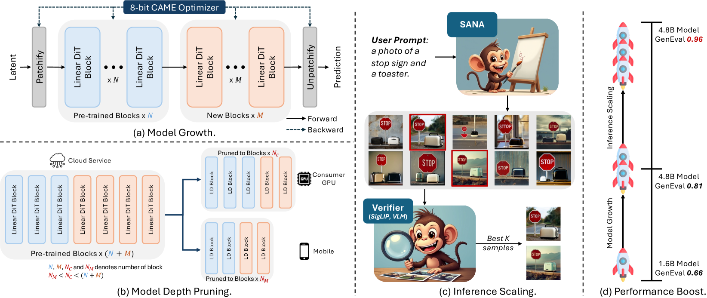

# PAPER_SANA-1.5

> SANA 1.5: Efficient Scaling of Training-Time and Inference-Time Compute in Linear Diffusion Transformer
> NVIDIA · MIT HAN Lab · Tsinghua, 2025-01-30

---

## 📋 메타 정보

| 항목 | 내용 |
|---|---|
| **논문 제목** | SANA 1.5: Efficient Scaling of Training-Time and Inference-Time Compute in Linear Diffusion Transformer |
| **저자** | Enze Xie, Junsong Chen, Yuyang Zhao, Jincheng Yu, Ligeng Zhu, Chengyue Wu, Yujun Lin, Zhekai Zhang, Muyang Li, Junyu Chen, Han Cai, Bingchen Liu, Daquan Zhou, Song Han (총 14명) |
| **소속** | NVIDIA · MIT HAN Lab · Tsinghua University |
| **공개일** | 2025-01-30 (v1, arXiv) — v3 |
| **분야** | Text-to-Image Generation, Diffusion Transformer, Model Scaling, Inference-Time Compute |
| **논문 링크** | [arxiv abstract](https://arxiv.org/abs/2501.18427) · [PDF](https://arxiv.org/pdf/2501.18427) · [HTML](https://arxiv.org/html/2501.18427v3) |
| **코드/가중치** | [github.com/NVlabs/Sana](https://github.com/NVlabs/Sana) (1.5 통합, Apache-2.0) |
| **선행 논문** | SANA 1.0 ([arxiv 2410.10629](https://arxiv.org/abs/2410.10629)) — 본 논문은 그 아키텍처를 그대로 두고 *스케일링 방법*만 새로 제안. PAPER_Sana.md 참조 |
| **외부 모델** | Gemma-2-2B-IT (텍스트 인코더, SANA 1.0 그대로) · NVILA-2B (Inference-time 심판 모델로 fine-tune) · Flux-Schnell (VILA-Judge 학습용 이미지 생성기, 데이터 누수 차단용) |
| **외부 데이터** | 사전학습 50M 이미지-텍스트 쌍 (SANA 1.0 확장 추정, 출처 비공개) · SFT 3M 큐레이션 쌍 (CLIP score > 25) · GenEval-style SFT 144K 이미지 (18,240 프롬프트 × 평균 7.91장) · VILA-Judge 학습 2M 매칭 쌍 (15,654 unique 프롬프트 × 160 이미지) · **다국어 SFT 약 300K 캡션** (GPT-4가 영문 프롬프트 100K를 *순수 중국어 / 영-중 혼합 / 이모지 강화* 3종으로 번역, Appendix C) |
| **캡션 파이프라인** | 사전학습은 SANA 1.0의 4-캡션 파이프라인 (VILA-3B/13B + InternVL2-8B/26B + CSS) 을 *암묵 계승* — 1.5 본문에 별도 언급 없음. 추가로 다국어 잠금해제 SFT는 **GPT-4 번역 3종** 사용 (이미지당 4 캡션이 아니라 *프롬프트당 3 다국어 변환*). |
| **학습 자원** | NVIDIA A100 64장 (DGX 8노드, PyTorch DDP). 4.8B 모델 사전학습 ~100K step + SFT ~10K step |
| **백본 분류** | SANA 1.0과 동일 — DiT 본체 scratch + 텍스트 인코더 (Gemma-2-2B) 만 (C) 분기 LLM 재사용. 본 논문 자체는 모델 사이즈 *키우기/줄이기* 처방전. |

---

## 📚 주요 용어 사전 (Glossary)

### 모델 확장 · 축소

- **깊이 성장 (Depth Growth)** — 사전학습된 작은 모델 위에 새 Transformer 블록을 더 쌓아 큰 모델로 *확장* 시키는 기법. SANA 1.5는 1.6B (20 블록) → 4.8B (60 블록) 으로 가는 데 사용. *너비 (hidden dim) 는 그대로 두고 깊이만 늘림*.
- **부분 보존 초기화 (Partial Preservation Init, PPI)** — 깊이 성장의 초기화 방법. 사전학습된 N개 블록은 그대로 두고, 새로 추가하는 M개 블록은 무작위 가우시안 (random Gaussian) 으로 초기화하되 **출력 projection을 0으로 만들어** 처음에는 "통과 (identity mapping)" 역할만 하도록 함.
- **항등 매핑 (Identity Mapping)** — 새 블록이 학습 초기에 입력을 그대로 출력하게 만드는 트릭. self-attention·cross-attention의 출력 projection과 MLP 마지막 conv의 가중치를 모두 0으로 초기화 → `block(x) = x + 0 = x`.
- **순환 복제 (Cyclic Replication)** — 비교군 1. 새 블록 i를 `θᵢ = θ(i mod N)` 으로 사전학습 블록을 순환시켜 채움. SANA 1.5에선 학습 불안정으로 탈락.
- **블록 복제 (Block Replication)** — 비교군 2. 사전학습 블록 각각을 r번 (r=3) 반복 복사. 역시 분포 불일치로 탈락.
- **블록 중요도 (Block Importance, BI)** — 모델 축소 (model pruning) 의 기준. *블록 i의 입력 X와 출력 X' 사이 코사인 유사도가 클수록 그 블록은 거의 안 한 거나 마찬가지* 라는 직관. 공식: `BIᵢ = 1 − E[cos(X_i, X_{i+1})]`. 작을수록 안 중요 → 잘라도 됨.
- **캘리브레이션 셋 (Calibration Set)** — 블록 중요도를 계산하기 위한 작은 검증용 데이터. 본 논문은 *프롬프트 100개* 를 모든 timestep에 걸쳐 평균.
- **회복 미세조정 (Recovery Fine-tuning)** — 블록을 잘라낸 직후 떨어진 성능을 되살리는 짧은 학습 단계. 단일 GPU에서 *100 step* 만으로 충분.

### 추론 시간 스케일링

- **추론 시간 스케일링 (Inference-time Scaling)** — denoising step을 늘리는 대신 *후보 이미지를 N장 다 만들고 가장 잘 맞는 한 장을 고르는* 전략. LLM의 reasoning-time compute scaling을 이미지 생성에 이식. SANA 1.5의 가장 화제가 된 기여.
- **Best-of-N 샘플링** — 같은 프롬프트로 서로 다른 noise seed의 N장을 생성하고 그중 최선을 선택. N=2048까지 실험됨.
- **VILA-Judge** — Best-of-N의 *심판 (judge)* 으로 쓰는 비전-언어 모델 (Vision-Language Model, VLM). NVILA-2B를 "이 이미지가 이 프롬프트와 매칭됨? yes/no" 이진 분류 (binary classification) 로 fine-tune한 버전.
- **데이터 누수 차단 (Data Leakage Prevention)** — VILA-Judge 학습 이미지를 *SANA가 아닌 Flux-Schnell* 로 생성. 안 그러면 심판이 자기 모델 스타일에만 후한 점수를 매기게 됨.
- **토너먼트 선발 (Tournament Selection)** — Best-of-N 안에서 쌍쌍 비교 (pairwise comparison) 로 우승자를 뽑는 방식. 두 답이 다르면 "yes" 쪽, 같으면 logprob (확률 신뢰도) 이 높은 쪽 채택.

### 옵티마이저 · 메모리

- **CAME-8bit** — 옵티마이저 (optimizer) 의 메모리를 줄이기 위해 weights·states를 8비트로 양자화 (quantization) 한 버전. AdamW-32bit 대비 8배, AdamW-8bit 대비 25% 추가 절감.
- **블록 단위 양자화 (Block-wise Quantization)** — 16,000개 이상의 큰 가중치 행렬을 2,048개씩 묶어 각 블록의 min·max로 따로 양자화. 양자화 식: `q(x) = round((x − min) / (max − min) × 255)`.
- **하이브리드 정밀도 (Hybrid Precision)** — 1차 moment는 8bit, 2차 moment는 32bit (CAME의 factorization 덕에 메모리는 `O(d_in + d_out)`).
- **CAME의 분해 (Factorization)** — 2차 moment를 행 방향·열 방향 두 벡터로 분해 저장 → 메모리 `O(d_in × d_out)` → `O(d_in + d_out)`.

### 안정화

- **Q/K 정규화 (RMSNorm on Q/K)** — Linear attention이 FP16에서 logit이 65만까지 튀어 오버플로우 (overflow) 나는 문제를 막기 위해 self-attention과 cross-attention의 query·key에 RMSNorm을 끼움.

### 다국어 잠금해제

- **다국어 자동 라벨링 (Multilingual Auto-labeling Pipeline)** — Appendix C에 추가된 데이터 증강 (data augmentation) 파이프라인. 영어로만 학습된 SANA 1.5에 다국어 입력 능력을 *잠금해제 (unlock)* 하는 용도.
- **3종 변환 (Three Caption Variants)** — GPT-4가 영문 프롬프트 1개를 → (1) 순수 중국어 (pure Chinese), (2) 영-중 혼합 (English-Chinese mixed, *코드 스위칭 (code-switching)* 형태), (3) 이모지 강화 (emoji-enriched, 🍎🪑 같은 리터럴 유니코드) 의 3종으로 번역·변형.
- **잠금해제 SFT (Unlocking Fine-tuning)** — *모델 자체는 안 바꾸고* 약 10K SFT step만으로 다국어 입력 능력을 켜는 미세조정. 핵심 가정: Gemma-2-2B-IT 텍스트 인코더는 이미 다국어를 이해하지만 SANA가 *영어 캡션에만 노출* 되어 학습됐기 때문에 그 능력이 *얼어붙어 (frozen)* 있었던 것뿐. 짧은 fine-tune으로 Gemma의 잠자던 다국어 표현과 SANA의 이미지 생성 경로를 다시 연결.
- **번역 vs 4-캡션 (Translation vs 4-Captioning)** — SANA 1.0이 *이미지 1장당 4개 영어 캡션* (서로 다른 VLM이 생성) 으로 캡션 다양성을 확보했다면, SANA 1.5의 다국어 라벨링은 *영문 프롬프트 1개당 3개 언어 변형* 으로 *언어 다양성* 을 확보. 목적도 단계도 다름.

### 평가 지표 (SANA 1.0과 동일)

- **GenEval** — 텍스트-이미지 정합성 (단일 객체·두 객체·counting·colors·position·color attribution 6항목) 자동 평가.
- **DPG-Bench** — 긴 프롬프트에 대한 정합성 평가.
- **FID / CLIP score** — 화질·텍스트 정합성 기본 지표.

---

## 🎯 논문 요약 (TL;DR)

**SANA 1.0의 Linear DiT 아키텍처를 그대로 두고, "한 번 학습한 모델을 값싸게 키우고, 값싸게 줄이고, 작은 모델로도 큰 모델 품질을 흉내 내는" 세 가지 스케일링 방법을 제안.**

핵심 아이디어 4가지:

1. **깊이 성장 (Depth Growth)** — 1.6B 모델 (20 블록) 위에 40 블록을 *부분 보존 초기화 (Partial Preservation Init)* 로 얹어 4.8B 모델을 만든다. 새 블록의 출력 projection을 0으로 두는 *항등 매핑* 덕에 처음엔 1.6B 출력을 그대로 보존하다가 점진 학습됨. 같은 GenEval 0.70 도달까지 scratch 대비 **60% 적은 step**.

2. **블록 중요도 가지치기 (Block Importance Pruning)** — 큰 모델의 *입출력 유사도가 높은 가운데 블록을 잘라내고* 단일 GPU 100 step의 짧은 회복 학습으로 임의 크기 (4.8B → 3.2B → 1.6B) 의 모델을 뽑아낸다. 잘라낸 1.6B가 SANA 1.0 1.6B를 미세하게 추월 (0.672 vs 0.664).

3. **추론 시간 스케일링 + VILA-Judge** — denoising step 늘리기 대신 N장 생성 후 fine-tune된 NVILA-2B 심판이 토너먼트로 한 장 선택. **GenEval 0.81 (N=1) → 0.96 (N=2048)** 로 SOTA. Position 0.59→0.96, Color Attr 0.65→0.87 약점이 폭증.

4. **CAME-8bit + Q/K RMSNorm** — 옵티마이저 메모리 25% 절감 + FP16 logit 오버플로우 차단. 1.6B 학습 메모리 57GB → 43GB.

검증: 4.8B 단일 샘플로 GenEval 0.81, FLUX-dev (12B, 0.67) · Playground v3 (24B, 0.76) 추월. 추론 스케일링으로 0.96 SOTA. *"1.6B + 많은 샘플 > 4.8B + 단일 샘플"* 이라는 inference compute scaling 메시지.

---

## ⭐ 핵심 기여 (Contributions)

1. **깊이 성장 학습법 (Depth Growth)** — Diffusion Transformer를 *작은 모델 위에 새 블록을 얹어 크게 확장* 하는 첫 성공 사례. 세 가지 초기화 (순환 복제·블록 복제·부분 보존) 를 실증 비교해 **PPI (Partial Preservation Init)** 가 유일하게 안정적임을 보임. 사전학습된 20 블록 + 새 40 블록 + 출력 projection 0 초기화 + RMSNorm on Q/K. Scratch 대비 60% 적은 step으로 같은 품질 도달.

2. **블록 중요도 가지치기 (Block Importance Pruning)** — *블록 입출력의 코사인 유사도* 라는 한 줄 기준으로 모델을 임의 크기로 줄이는 방법. 머리·꼬리 블록 (latent ↔ diffusion 공간 변환) 은 중요도 높고 가운데 블록 (점진 refinement) 은 잘라도 됨. 100 step 회복 미세조정만으로 4.8B → 1.6B 압축 후 SANA 1.0 1.6B 추월.

3. **추론 시간 스케일링 (Inference-time Scaling)** — 이미지 생성에 LLM의 reasoning-time compute 아이디어를 적용한 본격 사례. Best-of-N + 토너먼트 + Flux-Schnell로 학습 데이터 누수 차단된 VILA-Judge. **"작은 모델 + many samples > 큰 모델 + 1 sample"** 라는 새 trade-off 축 제시. GenEval 0.81 → 0.96 SOTA.

4. **CAME-8bit 옵티마이저** — Diffusion 학습용 메모리 효율 옵티마이저. 블록 단위 8비트 양자화 + 하이브리드 정밀도. AdamW-32bit 대비 8배, AdamW-8bit 대비 25% 추가 메모리 절감. 1.6B 학습 GPU 메모리 57GB → 43GB. 동일 수렴.

5. **다국어 잠금해제 (Multilingual Unlocking, Appendix C)** — GPT-4로 영문 프롬프트 100K를 *순수 중국어 / 영-중 혼합 / 이모지 강화* 3종으로 번역해 약 300K 다국어 캡션을 만들고, 단 10K SFT step으로 다국어 입력 능력을 켜는 가벼운 데이터 증강. *모델 아키텍처·텍스트 인코더 변경 없음.* 핵심 가정은 *"Gemma-2-2B-IT는 이미 다국어를 이해하지만, SANA 1.0이 영어 캡션에만 노출돼 그 능력이 얼어붙어 있었을 뿐"*. 다만 다국어 정량 벤치마크는 없고 Figure 14의 질적 시연만 제공.

6. **End-to-end 스케일링 처방전** — 위 다섯 가지를 묶은 *"한 번 학습 → 자유 자재 사이즈 변형 → 추론에서 더 짜내기 → 다국어로 확장"* 흐름. 동일 backbone (Linear DiT + DC-AE 32× + Gemma) 위에서 1.6B·3.2B·4.8B 라인업과 N=1~2048 추론 모드, 영어·중국어·이모지 입력을 동시에 제공.

---

## 🖼️ 전체 프레임워크 (Figure 1)

> *왜 이 절을 두냐: 본 논문의 *세 기여 + 그 누적 효과* 가 한 장에 다 들어있어서, 본문을 읽기 전에 이 그림을 먼저 익히면 나머지 절들의 역할이 명확해짐.*

<p align="center">
  
</p>

> **Fig. 1 — The overall framework of SANA-1.5.**
> *(a) Model Growth: We initialize the large model with a pre-trained small model, and train the large model with 8-bit CAME, which largely accelerates the training convergence and reduces VRAM requirements. (b) Model Pruning: After training the large model, smaller models of different sizes are pruned and fine-tuned for different situations. (c-d) Inference Scaling: We repeat generating many samples with SANA and use VLM as a verifier to select the best-of-N samples, which largely boosts the quality.*

### 네 패널 읽는 법

| 패널 | 보이는 것 | 본문 매핑 |
|---|---|---|
| **(a) Model Growth** | `Latent → Patchify → Linear DiT Block × N (사전학습, 파란색) → Linear DiT Block × M (새로 추가, 주황색) → Unpatchify → Prediction`. 위에 **8-bit CAME Optimizer** 가 학습 루프 전체를 감싸고 있음. Forward (실선) / Backward (점선) 화살표로 *깊이 성장 + 양자화 옵티마이저가 한 흐름* 임을 강조. | §1️⃣ 깊이 성장 + §4️⃣ CAME-8bit |
| **(b) Model Depth Pruning** | 위쪽: 사전학습된 `(N+M)` 블록의 큰 모델 1줄. 아래쪽: 같은 모델을 잘라낸 세 가지 디플로이 타깃 — *Cloud Service (큰 모델)* / *Consumer GPU (중간)* / *Mobile (작은 모델)*. N₁ > N₂ > N₃ 가 디플로이 환경별 모델 사이즈를 의미. | §2️⃣ 블록 가지치기 |
| **(c) Inference Scaling** | `User Prompt: "a photo of a stop sign and a toaster"` → **SANA가 동일 프롬프트로 여러 장 생성** (격자 시연) → **Verifier (SigLIP, VLM)** 가 각 이미지를 평가 → `Best K samples` 선별. *Verifier 라벨이 "SigLIP, VLM"* 으로 표기됨 — 본문의 VILA-Judge 외에도 일반 VLM(SigLIP 등) 으로 일반화 가능하다는 시각적 메시지. | §3️⃣ 추론 스케일링 |
| **(d) Performance Boost** | 세로축 GenEval 누적 향상을 우주로켓 그래픽으로 표현: **1.6B (0.66) → Model Growth → 4.8B (0.81) → Inference Scaling → 4.8B (0.96)**. *세 기여가 곱셈으로 쌓인다*는 시각적 한 줄 요약. | 전체 메인 클레임 |

### 그림이 전달하는 세 가지 메시지

1. **세 기여가 직교 (orthogonal) 한다** — Growth (학습), Pruning (디플로이), Inference Scaling (추론) 이 서로 다른 단계라 *동시에 다 켜도 충돌 없음*. (d)의 누적 GenEval (0.66→0.81→0.96) 이 이 점을 수치로 보여줌.
2. **8-bit CAME은 학습 인프라의 "공기"** — 별도 절로 다루지 않고 (a)의 상단을 *감싸는* 박스로 그려 *모든 학습 단계에 깔린 전제* 임을 표현.
3. **Verifier는 교체 가능** — (c)에서 SigLIP·VLM 둘 다 적혀 있음. 본문은 VILA-Judge를 채택했지만 *프레임워크 자체는 어떤 VLM judge에도 일반화 가능*.

---

## 🛠️ 주요 알고리즘 설명

### 1️⃣ 깊이 성장 (Depth Growth) — 1.6B → 4.8B 확장

> *왜 이 절을 두냐: 큰 모델을 scratch부터 학습하면 GPU 시간이 3배 가까이 들기 때문에, 사전학습된 가중치를 *출발점*으로 재활용해 학습 비용을 절반 이하로 떨어뜨리는 게 본 논문의 첫 기둥.*

#### 1.1 비교한 세 가지 초기화 방식

| 방식 | 공식 | 결과 |
|---|---|---|
| **순환 복제 (Cyclic)** | `θᵢ = θ_{i mod N}^pre` (i ≥ N) — 새 블록을 사전학습 블록 0,1,2,... 순환으로 채움 | ❌ 학습 불안정 — feature 분포 불일치로 GenEval 곤두박질 |
| **블록 복제 (Block Replication)** | 각 사전학습 블록을 r=3번 반복 | ❌ 마찬가지로 불안정 |
| **부분 보존 (Partial Preservation Init, PPI)** ⭐ | 앞 18 블록은 그대로, 끝 2 블록 *버리고* (이유는 §1.2 참조), 새 42 블록을 가우시안 + 출력 projection 0 | ✅ 채택. 안정적 수렴 |

#### 1.2 왜 끝 2 블록을 버리는가 — skip connection 지배 문제

> *왜 이 절을 두냐: PPI의 가장 비직관적인 결정. "이미 학습된 좋은 블록을 굳이 왜 버리나?" 의 답이 본 논문의 핵심 통찰 중 하나.*

##### 논문의 명시적 이유 (§3.3 인용)

> *"During model scaling, we initially attempted to append new blocks directly after all the pre-trained blocks. However, we observed that **the newly added blocks failed to learn effective information and became stuck in local minima**. The primary reason is that **the well-learned pre-trained features dominate the feature representation through skip connections**. Therefore, we remove the last two blocks, which are more task-relevant, before adding new blocks."*

##### 메커니즘 — 새 블록이 일을 안 하는 이유

PPI 직후 (학습 step 0) 의 흐름을 *끝 2 블록을 남긴 경우* 와 *버린 경우* 로 비교.

**❌ 끝 2 블록을 남기면**:

```
[사전학습 1~18] → refinement → [사전학습 19, 20] → ★ task-relevant 변환 완성
   → [새 21~60: PPI 통과] → unpatchify
```

- 끝 19, 20 블록이 이미 *task에 거의 완성된 표현* 을 만듦
- 새 40 블록은 residual connection 덕에 *그 출력을 그대로 통과*
- 최종 prediction이 *이미 정답에 가까움* → **loss 작음** → **gradient 신호 약함**
- 결과: 새 40 블록의 weight가 거의 업데이트 안 됨 → **local minima 갇힘**

**✅ 끝 2 블록을 버리면**:

```
[사전학습 1~18] → refinement *일부만* 완성 → [새 19~58: PPI 통과] → unpatchify
```

- 끝 2 블록이 없으니 *task-relevant 변환이 비어 있음*
- 새 40 블록이 통과만 시키면 prediction이 정답과 멀어짐 → **loss 큼** → **gradient 신호 강함**
- 새 40 블록이 *task 완성 역할을 떠맡을 수밖에 없음* → 빠르게 학습

##### 비유 — 일부러 자리를 비워두기

> 새 블록 40명을 견습 요리사로 새로 고용한 상황. 끝 2 블록을 남기면 *선임이 밥상을 이미 다 차려둔* 상태라 견습은 옆에 서 있기만 함 → 평생 칼질 못 배움. 끝 2 블록을 버리면 *재료까지만 손질되어 있고 마무리는 비어 있는* 상태 → 견습이 *어쩔 수 없이 요리를 완성해야* 함 → 빠르게 학습.

##### 왜 *2개* 인가 — 논문의 빈자리

- **정량 ablation 없음**: 0, 1, 2, 3개 drop 비교는 논문에 없음.
- **추정 근거**: §3.3의 Block Importance Figure 5(c) 에서 *마지막 약 2개* 블록의 BI가 시각적으로 *튀어 오른* 것에 근거. "task-relevant" 라고 판단되는 블록 수 = 2.
- **너무 적게 (0~1개)**: skip connection 지배 문제 여전. **너무 많이 (3~5개)**: 1.6B의 학습된 refinement 능력까지 버려 출발점 우위 약화.

#### 1.3 PPI의 출력 projection 0 초기화 (= 항등 매핑)

새로 추가한 블록에서 *입력을 그대로 출력하게* 만들기 위해 다음 가중치를 모두 0으로 둠:

- self-attention 의 출력 projection (W_out^attn)
- cross-attention 의 출력 projection (W_out^cross)
- MLP 블록 마지막의 point-wise convolution

즉 학습 시작 시점에서 새 블록 i는:

```
block_i(x) = x + Attn_out(...) + MLP_out(...) = x + 0 + 0 = x
```

이렇게 하면 *초기 모델 출력 = 사전학습 1.6B 모델 출력* 이라 학습이 부드럽게 출발.

#### 1.4 안정화 보조: Q/K RMSNorm

FP16 학습 시 Linear attention의 logit이 65만 (6.5e5) 까지 튀어 오버플로우 발생. self-attention·cross-attention 모두 query·key에 RMSNorm을 끼워 안정화.

#### 1.5 학습 스케줄

- **확장 시점**: 한 번에 (one-shot) 20 블록 → 60 블록 (점진 확장이 아님).
- **사전학습 (4.8B)**: 약 100K step, LR 1e-4, 동적 배치 1024~4096.
- **효과**: scratch부터 학습한 4.8B와 *같은 GenEval 0.70* 도달까지 step 수 60% 절감.

#### 1.6 공식 코드 매핑 (model_growth_utils.py)

> *왜 이 절을 두냐: 논문이 *PPI* 라고 부른 게 코드에선 *`init_constant`* 로 이름이 다르게 구현돼 있어 처음 보면 혼동되기 쉬움. 본 절은 논문 ↔ 코드 매핑 + 코드에만 있는 추가 디테일 정리.*

##### 핵심 파일

| 파일 | 역할 |
|---|---|
| [diffusion/model/model_growth_utils.py](https://github.com/NVlabs/Sana/blob/main/diffusion/model/model_growth_utils.py) | `ModelGrowthInitializer` + 6개 init 전략 |
| [train_scripts/train.py](https://github.com/NVlabs/Sana/blob/main/train_scripts/train.py) | 학습 진입점. `config.model_growth` 가 있으면 위 클래스 호출 |
| [diffusion/utils/config.py](https://github.com/NVlabs/Sana/blob/main/diffusion/utils/config.py) | `ModelGrowthConfig` dataclass |

##### InitStrategy enum 전체 비교

코드 [model_growth_utils.py:25-33](https://github.com/NVlabs/Sana/blob/main/diffusion/model/model_growth_utils.py#L25-L33):

| Enum 값 | 동작 | 논문 매핑 |
|---|---|---|
| `CYCLIC` | 1,2,...20, 1,2,...20, 1,2,...20 (순환 복제) | 비교군 (탈락) |
| `BLOCK_EXPAND` | 1,1,1, 2,2,2, ..., 20,20,20 (블록 복제, expand_ratio=3) | 비교군 (탈락) |
| `PROGRESSIVE` | 앞 20 복사 + 이후는 *직전층 + noise(0.01)* | 논문 미언급 |
| `INTERPOLATION` | 새 층은 두 사전학습 층의 *선형 보간* | 논문 미언급 |
| `RANDOM` | 앞 20 복사 + 나머지 *model 기본 init* | 논문 미언급 |
| `CONSTANT` ⭐ | 앞 20 복사 + 나머지 *0/작은값 차등 초기화* | **= PPI (논문 채택)** |

> ⚠️ **이름 함정**: 논문 *Partial Preservation Init (PPI)* = 코드 *init_constant*. 코드 주석은 *"partial random init strategy: keep the first N layers, random init the remaining layers"* 라 적혀 있어 의미는 일치하지만 이름이 misleading.

##### "끝 2 블록 drop" 의 코드 구현

논문이 §1.2에서 명시한 "끝 2 블록 제거"는 코드에서 **`source_num_layers` config 값으로 구현**. [model_growth_utils.py:56-64](https://github.com/NVlabs/Sana/blob/main/diffusion/model/model_growth_utils.py#L56-L64):

```python
assert config.source_num_layers <= self.pretrained_layers
# 사용자 의도: source_num_layers=18, pretrained_layers=20

if config.source_num_layers < self.pretrained_layers:
    self.pretrained_layers = config.source_num_layers  # 20 → 18로 줄임
```

이후 모든 복사 루프가 `range(18)` 만 돌기 때문에 **사전학습 모델의 layer 0~17만 복사, layer 18·19는 암묵적 폐기**. drop 로직이 *별도 함수 없이* config로 자연스럽게 구현됨.

##### init_constant 의 차등 초기화 (PPI 정확한 동작)

[model_growth_utils.py:240-280](https://github.com/NVlabs/Sana/blob/main/diffusion/model/model_growth_utils.py#L240-L280):

| key 패턴 | 초기화 값 | 의미 |
|---|---|---|
| `attn.proj.weight` | randn × **0** | self-attn 출력 → 항등 매핑 시작 |
| `cross_attn.proj.weight` | randn × **0** | cross-attn 출력 → 항등 매핑 시작 |
| `mlp.point_conv.conv.weight` | randn × **0** | Mix-FFN 마지막 conv → 항등 매핑 시작 |
| `q_norm.weight`, `k_norm.weight` | **ones** | Q/K RMSNorm을 항등 함수로 시작 (§1.4와 연결) |
| `*.proj.bias`, `cross_attn.*.bias` | **zeros** | bias도 0 |
| `mlp.depth_conv.conv.weight` | randn × **0.2** | Mix-FFN 내부 depthwise conv는 *완전 0이 아님* (논문 미언급 디테일) |
| 그 외 모든 새 layer 가중치 | randn × **0.02** | 일반적인 작은 init |

> 🔍 **논문에 없는 코드 디테일 2가지**:
> 1. **`depth_conv.conv` 가중치는 0.2 스케일**: 완전 통과가 아닌 *살짝 변형* 으로 시작. Mix-FFN의 3×3 depthwise conv가 *공간 정보를 섞는 핵심 모듈* 이라 0으로 두면 학습 신호가 약할 수 있어서 추정됨.
> 2. **`q_norm/k_norm.weight = 1`**: Q/K RMSNorm이 처음엔 *항등 함수* 로 시작 → 사전학습 모델 출력 보존에 기여.

##### Non-transformer 파라미터 처리

[model_growth_utils.py:122-132](https://github.com/NVlabs/Sana/blob/main/diffusion/model/model_growth_utils.py#L122-L132) `_copy_non_transformer_params`:

```python
def _copy_non_transformer_params(self):
    skip_keys = {"pos_embed"}  # SANA는 NoPE라 어차피 미사용
    for key in self.pretrained_state:
        if "blocks." not in key and key not in skip_keys:
            self.target_state[key] = self.pretrained_state[key]
```

- **그대로 복사**: text embedder, time embedder, patchify, unpatchify, final norm 등
- **명시적 skip**: `pos_embed` (SANA의 NoPE 설계상 어차피 미사용)
- **외부 frozen**: Gemma-2-2B-IT 텍스트 인코더, DC-AE VAE는 build_model 단계에서 따로 frozen load

##### 학습 진입 흐름

[train_scripts/train.py](https://github.com/NVlabs/Sana/blob/main/train_scripts/train.py):

```python
# 4-2. model growth
if config.model_growth is not None:
    assert config.model.load_from is None  # 일반 load와 배타적

    from diffusion.model.model_growth_utils import ModelGrowthInitializer
    initializer = ModelGrowthInitializer(model, config.model_growth)
    model = initializer.initialize(
        strategy=config.model_growth.init_strategy,  # "constant" = PPI
    )
```

설정 (yaml) 예시:

```yaml
model_growth:
  pretrained_ckpt_path: "/path/to/sana1.0_1.6B.pth"
  source_num_layers: 18         # = 끝 2개 drop (20 - 2)
  target_num_layers: 60         # 새 42 블록 추가 (60 - 18)
  init_strategy: "constant"     # = PPI
```

##### 코드가 보여주는 추가 사실

- **scratch와 배타적**: `config.model.load_from is None` assert. 즉 *model growth 와 일반 fine-tune은 동시에 쓸 수 없음*.
- **비교 ablation이 코드로 재현 가능**: `init_cyclic`, `init_block_expand` 등 *논문이 탈락시킨 전략들도 모두 구현* → strategy 이름 한 줄 바꾸면 재현 가능. NVIDIA의 재현성 노력.
- **`progressive`·`interpolation`은 논문 외 추가 실험**: 내부에서 더 폭넓게 탐색했음을 시사. 그러나 본문 채택은 PPI(constant).

### 2️⃣ 블록 중요도 가지치기 (Block Importance Pruning)

> *왜 이 절을 두냐: 크게 키운 모델을 *역으로 다양한 사이즈* (3.2B·1.6B 등) 로 잘라 쓸 수 있어야 디플로이가 자유로움. 매번 다른 크기로 처음부터 학습하는 비용을 피하는 게 본 절의 목표.*

#### 2.1 중요도 공식

블록 i의 중요도:

```
BIᵢ = 1 − E_{X,t} [ ⟨X_{i,t}, X_{i+1,t}⟩ / (‖X_{i,t}‖₂ · ‖X_{i+1,t}‖₂) ]
```

(즉 *블록 입력 X_{i,t} 와 출력 X_{i+1,t} 사이의 코사인 유사도를 1에서 뺀 값*. 입출력이 거의 같으면 BI≈0, 크게 변형하면 BI≈1.)

- 캘리브레이션: 100개 프롬프트 × 모든 diffusion timestep에 걸쳐 평균.
- 직관: 블록이 입력을 거의 안 바꾸면 → "안 한 거나 마찬가지" → 잘라도 됨.

#### 2.2 관찰된 패턴

| 위치 | BI 값 | 역할 |
|---|---|---|
| 머리 (Layer 1~few) | 높음 | latent → diffusion 공간 변환 (큰 분포 변화) |
| 꼬리 (마지막 few) | 높음 | diffusion → 출력 공간 역변환 |
| 가운데 | 낮음 | 점진적 refinement (작은 변화 누적) → **자르기 후보** |

#### 2.3 가지치기 + 회복

1. BI가 낮은 가운데 블록부터 순서대로 제거.
2. 단일 GPU에서 **100 step만 fine-tune** → 회복.

#### 2.4 결과

| 사이즈 | GenEval (cut 직후) | GenEval (FT 후) |
|---|---|---|
| 4.8B (원본) | 0.81 | — |
| 3.2B | — | 0.673 |
| 1.6B | 0.571 | **0.672** ← SANA 1.0 1.6B (0.664) 추월 |

### 3️⃣ 추론 시간 스케일링 (Inference-time Scaling) + VILA-Judge

> *왜 이 절을 두냐: denoising step을 무한히 늘려도 *초기 오류를 자기 수정 못 한다* 는 한계 (20 step 이후 정체) 가 있음. step이 아니라 *완전한 후보 N장* 을 만들어 그중 가장 잘 맞는 한 장을 고르는 게 새 자유도.*

#### 3.1 전체 파이프라인

```
프롬프트 P
  ├─ SANA-4.8B로 N장 생성 (서로 다른 noise seed)
  ├─ N장을 VILA-Judge가 "P와 매칭?" yes/no 평가
  └─ 토너먼트로 우승 한 장 반환
```

#### 3.2 VILA-Judge 만들기

- **베이스 모델**: NVILA-2B (NVIDIA 비전-언어 모델).
- **학습 태스크**: (이미지, 프롬프트) → yes/no 이진 분류 (GenEval-style).
- **학습 데이터**: 15,654 unique 프롬프트 × 160 이미지 ≈ **2백만 매칭 쌍**.
- **데이터 누수 차단**: 학습 이미지는 *SANA가 아닌 Flux-Schnell* 로 생성 → 심판이 자기 모델 스타일에만 후한 점수 매기는 것 방지.

#### 3.3 토너먼트 선발 규칙

쌍쌍 비교 (pairwise comparison) 로 우승 한 장 결정:

```
for 두 이미지 (img_a, img_b):
    ans_a, lp_a = VILA-Judge(P, img_a)   # yes/no + logprob
    ans_b, lp_b = VILA-Judge(P, img_b)
    if ans_a != ans_b:
        winner = (yes 쪽)
    else:
        winner = (logprob 더 높은 쪽)
```

#### 3.4 성능 (GenEval, N별)

| N | 종합 | Single | Two-obj | Counting | Colors | **Position** | **Color Attr** |
|---|---|---|---|---|---|---|---|
| 1 | 0.81 | 0.99 | 0.97 | 0.86 | 0.86 | 0.59 | 0.65 |
| 2048 | **0.96** | 1.00 | 1.00 | 0.97 | 0.94 | **0.96** | **0.87** |

Position·Color Attr 같은 약점이 폭증. 정합성 평가의 최상단을 거의 풀려는 추세.

#### 3.5 비용

- N장 생성: `N × 49,140G FLOPs` (SANA-4.8B).
- N장 평가: `2N × 4,518G FLOPs` (NVILA-2B, 토너먼트 비교 수).
- 실시간 서비스용 N은 4~16 정도, 벤치마크용 N은 256~2048.

#### 3.6 인사이트: "small + many > big + one"

Figure 8 메시지 — 같은 추론 FLOPs 예산에서:

- 4.8B × 1 샘플 (0.81)
- vs 1.6B × ~5 샘플 (0.83~)

즉 *작은 모델로 여러 번 뽑는 게 큰 모델 한 번보다 낫다*. LLM의 inference-time compute scaling과 같은 구조.

### 4️⃣ CAME-8bit 옵티마이저

> *왜 이 절을 두냐: 4.8B 학습을 64장 A100으로 끝내려면 옵티마이저 상태 메모리를 줄여야 함. 모델은 못 줄여도 옵티마이저는 줄일 수 있다는 게 본 절의 처방.*

#### 4.1 양자화 식 (블록 단위)

```
q(x) = round( (x − min(x)) / (max(x) − min(x)) × 255 )
```

- 적용 대상: 16,000개 이상 파라미터를 가진 큰 행렬만.
- 블록 크기: 2,048개 단위로 묶어 각 블록의 (min, max) 따로 계산.

#### 4.2 메모리 절감

| 옵티마이저 | 1.6B 학습 메모리 | 절감률 |
|---|---|---|
| AdamW-32bit | ~340GB (참고) | baseline |
| AdamW-8bit | 57GB | 6× |
| **CAME-8bit (본 논문)** | **43GB** | **8× vs AdamW-32, 추가 25% vs AdamW-8** |

#### 4.3 하이브리드 정밀도

- 1차 moment (m): 8bit
- 2차 moment (v): 32bit. CAME 분해 (factorization) 로 `O(d_in × d_out)` → `O(d_in + d_out)`.

수렴 곡선은 AdamW-32bit와 동일.

### 5️⃣ 다국어 잠금해제 (Multilingual Unlocking, Appendix C)

> *왜 이 절을 두냐: 영어로 학습된 모델을 다른 언어로 다시 학습시키는 비용은 크다. 본 절은 *"모델은 그대로 두고 SFT 캡션만 바꿔서 새 언어를 켤 수 있다"* 라는 가벼운 대안을 보여줌.*

#### 5.1 동기 — 왜 "잠금해제" 라는 단어를 쓰나

SANA 1.5의 텍스트 인코더는 SANA 1.0에서 그대로 가져온 **Gemma-2-2B-IT**. Gemma는 *이미* 다국어 코퍼스로 사전학습된 LLM이라 중국어·일본어·기타 다국어 표현을 알고 있음. 그런데 SANA 1.0이 *영어 캡션* 만으로 학습됐기 때문에:

- Gemma는 다국어를 *이해* 함.
- 그러나 SANA의 cross-attention은 *영어 임베딩에만 노출* 되어 학습됨.
- 결과적으로 Gemma의 *다국어 임베딩 → SANA 이미지 생성* 경로가 *얼어붙음 (frozen)*.

본 파이프라인의 핵심 가정: **이 얼어붙은 경로를 짧은 SFT로 *녹이기만* 하면 다국어 입력이 작동한다**. 그래서 "추가 학습"이 아니라 "잠금해제 (unlocking)" 라는 단어를 씀.

#### 5.2 3종 변환 파이프라인

```
영문 프롬프트 100K (1.5의 기존 영어 데이터에서 추출)
    ↓ GPT-4 (번역기로 사용)
    ├─ 순수 중국어 100K       (예: "一个红苹果放在桌子上")
    ├─ 영-중 혼합 100K        (예: "a 红色 apple on the 桌子" — code-switching 형태)
    └─ 이모지 강화 100K       (예: "a 🍎 on the 🪑" — 리터럴 유니코드)
                                                    
    합계 약 300K 다국어 캡션 + 원본 100K 영문 = 400K SFT 데이터
    ↓
SANA 1.5 4.8B 에 약 10K SFT step (LR 낮춤, 기존 SFT와 비슷한 설정 추정)
    ↓
다국어 입력 가능 (Figure 14 시연)
```

#### 5.3 왜 GPT-4 인가

논문은 GPT-4 선택 이유를 *명시하지 않음*. 추정 근거:

- 2024년 12월 시점 *번역 품질* 최상위.
- *코드 스위칭과 이모지 변환* 같은 까다로운 변형을 단일 프롬프트로 처리 가능.
- API 비용도 100K 샘플 1회 호출이면 작음 (~$200~500 추정).

대안 (Claude, Qwen, GPT-4o) 과 비교 ablation은 없음.

#### 5.4 4-캡션 (1.0) 과의 차이를 도식으로

| 축 | SANA 1.0의 4-캡션 + CSS | SANA 1.5의 다국어 라벨링 |
|---|---|---|
| **다양화 대상** | 같은 이미지의 *영어 캡션* | 같은 영문 프롬프트의 *언어 변형* |
| **이미지 ↔ 캡션 비율** | 이미지 1장 : 영어 캡션 4개 | 영문 프롬프트 1개 : 다국어 변환 3종 |
| **생성 도구** | VILA-3B/13B + InternVL2-8B/26B (4개 VLM) | GPT-4 (번역 1회) |
| **선택 방식** | 매 step CLIP score 기반 확률 샘플링 (CSS) | 그냥 다 학습 |
| **학습 단계** | 사전학습 (50M 쌍) | SFT (10K step) |
| **목적** | 캡션 *품질·다양성* 으로 텍스트 정합성 ↑ | *새 언어 잠금해제* |
| **SANA 1.5에서의 운명** | 사전학습 단계 *암묵 계승* (논문 명시 없음) | 새로 추가 |

#### 5.5 다국어 벤치마크의 빈자리

가장 큰 약점:

- **정량 평가 없음** — GenEval은 영어 전용. 중국어판 GenEval (ChineseWord 같은) 이나 multilingual CLIP score 미보고.
- **시연만** — Figure 14가 *qualitative showcase*. 영-중 혼합 프롬프트에서 시계·고양이·도시 풍경 등을 생성한 사례 모음.
- **이미지 안 한자 렌더링 미평가** — LongCat-Image의 ChineseWord 90.7 같은 *"이미지 안에 한자 새기기"* 능력이 작동하는지 알 수 없음. *프롬프트로 중국어를 받는 능력* (이건 잠금해제로 가능) 과 *이미지 안에 중국어 글자를 그리는 능력* (이건 시각 토크나이저·데이터 자체에 한자 시각 정보가 있어야 함) 은 다른 문제인데, 본 파이프라인은 *전자만* 다룸.

#### 5.6 위치 정리

본 파이프라인은 SANA 1.5의 *주력 기여가 아니라 Appendix C의 보너스 트랙*. 본문 (메인 4 기여) 은 학습·축소·추론 3축 스케일링을 다루고, 본 절은 *"덤으로 다국어도 됩니다"* 정도의 위치. 다국어를 본격적으로 노리는 LongCat-Image · HiDream-O1과는 결이 다름.

---

## 📊 실험 요약

### Table 1 — 메인 비교 (T2I 벤치마크)

> *왜 이 표를 두냐: 4.8B SANA가 동시대 12B~24B 모델보다 GenEval에서 *앞선다* 는 본 논문 메인 클레임을 검증.*

| 모델 | 파라미터 | GenEval ↑ | FID ↓ | CLIP ↑ | DPG ↑ | 1024² 지연시간 |
|---|---|---|---|---|---|---|
| SD3-medium | 2B | 0.62 | — | — | — | — |
| SDXL | 2.6B | 0.55 | — | — | — | — |
| FLUX-dev | 12B | 0.67 | 10.15 | 27.47 | 84.0 | 23s |
| Playground v3 | 24B | 0.76 | — | — | 87.0 | 15s |
| SANA 1.0 0.6B | 0.6B | 0.64 | — | — | 83.6 | 0.9s |
| SANA 1.0 1.6B | 1.6B | 0.66 | 5.76 | 28.67 | 84.8 | 1.2s |
| **SANA 1.5 4.8B (Pre)** | 4.8B | 0.72 | 5.42 | 29.16 | 85.0 | 4.2s |
| **SANA 1.5 4.8B (Ours)** | 4.8B | **0.81** | 5.99 | 29.23 | 84.7 | 4.2s |
| **+ Inference Scaling N=2048** | 4.8B | **0.96** | — | — | — | N × 4.2s |

### Table 2 — GenEval 세부 (SANA 1.5 + N=2048)

| 항목 | N=1 | N=2048 |
|---|---|---|
| Single | 0.99 | 1.00 |
| Two objects | 0.97 | 1.00 |
| Counting | 0.86 | 0.97 |
| Colors | 0.86 | 0.94 |
| Position | 0.59 | **0.96** |
| Color Attribution | 0.65 | **0.87** |
| **종합** | 0.81 | **0.96** |

### Table 3 — 깊이 성장 ablation (4.8B 학습)

| 초기화 | 안정성 | GenEval 0.70 도달까지 step |
|---|---|---|
| Scratch (baseline) | ✅ | 100% (기준) |
| Cyclic Replication | ❌ 불안정 | — |
| Block Replication | ❌ 불안정 | — |
| **Partial Preservation Init** | ✅ | **40% (60% 절감)** |

### Table 4 — 가지치기 ablation

| 사이즈 | 잘라낸 직후 GenEval | 100 step FT 후 |
|---|---|---|
| 4.8B (원본) | 0.81 | — |
| 3.2B | — | 0.673 |
| 1.6B | 0.571 | **0.672** |
| (참고) SANA 1.0 1.6B | — | 0.664 |

### Table 5 — CAME-8bit ablation (1.6B 학습)

| 옵티마이저 | GPU 메모리 | 수렴 |
|---|---|---|
| AdamW-32bit | ~340GB (이론) | baseline |
| AdamW-8bit | 57GB | 동일 |
| **CAME-8bit** | **43GB** | **동일** |

### Table 6 — SFT 단계별 GenEval

| 단계 | step | GenEval |
|---|---|---|
| Pre-training (4.8B) | ~100K | 0.69~0.72 |
| + 일반 SFT (CLIP>25 3M) | +10K | 0.72 |
| + GenEval-style SFT (144K 이미지) | — | **0.81** |
| + Inference Scaling N=2048 | — | **0.96** |

---

## 💬 Q&A 섹션

### Q1. SANA 1.0과 SANA 1.5의 본질적 차이는?

> SANA 1.0이 *새 아키텍처* (Linear DiT + DC-AE 32× + Gemma 텍스트 인코더) 논문이라면, SANA 1.5는 *그 아키텍처 위에 얹는 스케일링 처방전* 논문.

| 범주 | SANA 1.0 (2024-10) | SANA 1.5 (2025-01) |
|---|---|---|
| **본질** | 새 아키텍처 ("작고 빠른 4K T2I") | 새 스케일링 방법론 ("같은 모델을 키우고 줄이고 골라쓰기") |
| **모델 라인업** | 0.6B / 1.6B | 1.6B / **4.8B** / pruned 1.6B·3.2B |
| **블록 수 (대형)** | 20 (1.6B) | **60** (4.8B) ← *깊이만* 늘림 |
| **Hidden dim** | 2240 | 2240 (불변) |
| **Linear Attention / Mix-FFN / Gemma / DC-AE** | 도입 | **그대로 계승** |
| **Q/K 안정화** | (없음) | RMSNorm on Q/K 추가 |
| **큰 모델 학습** | scratch | **Depth Growth** (PPI, 60% step 절감) |
| **모델 축소** | 별도 사이즈 따로 학습 | **Block Importance Pruning** (100 step FT 회복) |
| **옵티마이저** | CAME (32bit) | **CAME-8bit** (메모리 25% 추가 절감) |
| **품질 향상 수단** | denoising step 늘리기 (20 step 정체) | **Best-of-N + VILA-Judge** |
| **1샘플 GenEval (대형)** | 0.66 (1.6B) | **0.81** (4.8B) |
| **Best-of-N GenEval** | — | **0.96 (N=2048)** SOTA |

요약하면 *"건축물 자체를 가볍게 짓는 법"* (1.0) vs *"같은 건축물을 값싸게 증축하고 다시 깎고 손님 응대하는 법"* (1.5).

### Q2. 왜 "깊이만" 늘렸나? 너비 (hidden dim) 는 왜 그대로?

부분 보존 초기화 (PPI) 의 작동 조건이 *사전학습 블록의 입출력 차원이 새 블록과 일치해야 함* 이기 때문. hidden dim을 늘리면 *블록 안의 가중치 행렬이 통째로 모양이 달라져* PPI를 쓸 수 없음. 깊이 확장이 *재활용 가능한* 유일한 자유도. 단점은 representation capacity에 천장이 있다는 것 (Q9 참조).

### Q3. 추론 스케일링은 단순히 "더 좋은 거 뽑기" 아닌가? 무엇이 새로운가?

세 가지 측면에서 단순 cherry-pick이 아님:

1. **자동화** — VILA-Judge가 사람 없이 N=2048에서 최선을 뽑음.
2. **데이터 누수 차단** — 학습 데이터를 Flux-Schnell로 만들어 자기 모델 편향 차단. 인기 있는 best-of-N 변형들이 자주 빠지는 함정.
3. **새 trade-off 축** — *모델 크기 vs 샘플 수* 의 명시적 trade-off를 보여줌 ("small + many > big + one"). 같은 추론 FLOPs에서 1.6B × 5장이 4.8B × 1장을 이김. LLM의 reasoning-time compute scaling과 같은 구조의 *이미지 생성판*.

### Q4. VILA-Judge의 한계는?

- **심미성 미평가**: GenEval-style 매칭만 학습됐기 때문에 *프롬프트와 매칭은 잘 되지만 보기 흉한* 이미지를 거를 능력이 없음. 0.81 → 0.96은 정합성 점수일 뿐.
- **천장**: 0.96이 GenEval의 한계에 가까움 — 추가로 짜낼 여지가 작음.
- **자기 회수 (self-distillation) 위험**: 만약 후속 SANA가 자기 출력으로 다시 VILA-Judge를 학습시키면 누수가 부활할 수 있음.

### Q5. 실제 서비스에서 쓸 수 있는 N은?

- N=2048: 벤치마크 SOTA용. 한 장 만드는 비용 약 ~5분 (4.8B × 2048 × 4.2s를 병렬화 가정 시 ~수십 초~수 분).
- **N=4~16: 실용권**. 0.81 → 0.85~0.88 정도 향상으로 cost-effective.
- N=1: 그대로 SOTA급 0.81. 추론 스케일링 없이도 동시대 12~24B 모델 추월.

### Q6. PPI에서 왜 "마지막 2 블록을 버리는가"?

논문이 §3.3에서 *명시적 이유* 를 줌 (§1.2에서 자세히 풀이):

> *"the newly added blocks failed to learn effective information and became stuck in local minima. The primary reason is that the well-learned pre-trained features dominate the feature representation through skip connections."*

핵심 메커니즘:

- 끝 2 블록이 *task-relevant* 변환을 *이미 완성* 함 → 새 블록이 통과만 시켜도 prediction이 정답에 가까움.
- residual connection (skip connection) 덕에 *사전학습 feature가 출력을 지배* → loss 작음 → **gradient 신호 약함**.
- 결과: 새 40 블록이 *local minima에 갇혀* 학습 안 됨.

해결: 끝 2 블록을 *일부러 비워두면* 새 블록이 *그 일을 떠맡아야* 하므로 학습 신호가 강해짐. 정량 ablation (drop 0/1/2/3 비교) 은 없고, Block Importance Figure 5(c) 의 *끝 2개 BI가 튀어 오른* 시각적 관찰에 근거. 자세한 비유와 코드 매핑은 §1.2, §1.6 참조.

### Q7. CAME가 뭐고 왜 AdamW 대신 쓰나?

CAME = Confidence-guided Adaptive Memory-Efficient. AdamW가 *2차 moment v* 를 full matrix로 저장하는 데 비해 (`O(d_in × d_out)` 메모리), CAME는 이를 *행 방향·열 방향 두 벡터로 분해* 저장 (`O(d_in + d_out)`). 이미 메모리 친화적인 옵티마이저인데, 거기에 8-bit 양자화까지 얹어 메모리를 최대로 짜낸 것. AdamW를 그대로 두고 8-bit만 적용한 AdamW-8bit보다 25% 더 절감되는 이유.

### Q8. "BI = 1 − cos(X_i, X_{i+1})" 이 정말 충분한 기준인가?

장점:
- *간단하고 해석 가능*: 데이터 한 번 흘려보내면 100 step에 끝남.
- *위치별 패턴이 명확*: 머리·꼬리는 변환 부담 큼 → BI 높음. 가운데는 점진 refinement → BI 낮음.

단점:
- *코사인 유사도는 크기 (magnitude) 무시*: 방향은 같지만 노름 (norm) 이 크게 바뀌는 블록은 "안 변한 듯" 보일 수 있음.
- *task-specific bias 무시*: 어떤 블록이 *특정 GenEval 항목* 에 필수일 수 있음 (예: position 담당). 코사인 평균은 이를 못 잡음.

논문의 실증 결과 (4.8B → 1.6B 압축 후 SANA 1.0 추월) 가 이 단순한 기준이 *실용적으로는 충분함* 을 증명하지만, 더 정교한 기준 (예: per-task gradient sensitivity) 의 여지는 남음.

### Q9. SANA 1.5의 한계는?

논문에 *dedicated limitations 섹션 없음*. 다만 본문/실험에서 추정 가능:

1. **추론 스케일링 비용**: N=2048일 때 `2048 × 49,140G + 4096 × 4,518G` ≈ 0.12 PFLOPs. 한 장 만드는 데 100B+ 모델 한 번 돌리는 비용.
2. **너비 확장 부재**: hidden dim 2240에서 멈춰 *representation capacity 천장*. 더 키우려면 PPI 외의 방법 필요.
3. **데이터 출처 비공개**: 50M 사전학습 / 144K GenEval-style SFT의 출처를 공개 안 함 → 재현성 불완전.
4. **VILA-Judge 천장**: 위 Q4 참조.
5. **학술 벤치마크 편향**: 0.81 → 0.96이 GenEval 점수일 뿐 *심미성·일관성·디테일* 은 안 봄.

### Q10. SANA 1.0의 "이미지당 4개 캡션 (VILA + InternVL + CSS)" 은 1.5에서도 쓰나?

**부분적으로만**. 정리하면:

| 단계 | SANA 1.0의 4-캡션 사용 | SANA 1.5 |
|---|---|---|
| 사전학습 (50M 쌍) | ⭕ 핵심 기여로 사용 | *암묵 계승 추정* — 본문에 별도 언급 없음 |
| SFT (3M) | 해당 없음 | 별도 언급 없음 (캡션 생성법 미명시) |
| GenEval-style SFT (144K) | 해당 없음 | Flux-Schnell이 이미지 생성, 캡션은 *GenEval 스타일* 로 자동 |
| 다국어 SFT (100K) | 해당 없음 | **GPT-4 번역 3종** (4-캡션과 무관, 새 파이프라인) |

다시 말해, SANA 1.5는 *4-캡션 파이프라인을 대체한 게 아니라 그 위에 다국어 SFT를 얹은 것*. 1.0의 데이터를 50M으로 확장하면서 그 데이터 안에서 4-캡션 + CSS가 *살아 있을 가능성이 큼* 이지만 논문은 이를 명시하지 않음.

**왜 1.5가 다시 강조하지 않을까**: 캡션 다양화 (1.0의 기여) 는 이미 *해결된 문제* 로 본 것. 1.5의 새 자유도는 *캡션 다양성* 이 아니라 *모델 크기 변형 + 추론 샘플 수 + 언어 다양성* 으로 옮겨감.

### Q11. 다국어 잠금해제 (Appendix C) 가 그렇게 가벼운데 왜 다국어 모델들은 비싸게 사전학습을 다시 하나?

본 파이프라인이 *모든 상황에 충분한가*에 대한 질문. 답은 *"입력만 다국어로 받는다면 충분, 출력 안에 다국어 글자를 새기려면 부족"*.

| 능력 | SANA 1.5 잠금해제로 가능? | 필요한 추가 자원 |
|---|---|---|
| 중국어 프롬프트 → 사물·풍경 이미지 | ✅ 10K SFT로 충분 | (이미 됨) |
| 영-중 혼합 프롬프트 처리 | ✅ | (이미 됨) |
| 이모지 입력 처리 | ✅ | (이미 됨) |
| **이미지 안에 한자 텍스트 새기기** | ❌ | *시각 토크나이저가 한자 픽셀 패턴 학습 + 한자 텍스트 이미지 대량 데이터* 필요 (LongCat-Image의 길) |
| 일본어·한국어 입력 | △ 추정 가능 | GPT-4 번역으로 확장 가능, 하지만 미실험 |
| 다국어 *정확한 정합성* (counting 등) | ❌ 미평가 | 다국어 GenEval 학습/평가 데이터 필요 |

즉 SANA 1.5의 잠금해제는 **"입력 인터페이스의 언어 확장"** 까지. *출력 (이미지 안 글자)* 의 다국어화는 별 문제고, 본 파이프라인 범위 밖.

### Q12. 다른 DiT 모델에도 적용 가능한가?

세 기법 모두 SANA-specific이 *아님*. 분기별로:

| 기법 | 다른 DiT에 이식 | 조건 |
|---|---|---|
| **Depth Growth (PPI)** | ✅ | 새 블록 추가가 hidden dim 변화 없이 가능해야. 거의 모든 DiT 가능 (FLUX, SD3, PixArt 등). |
| **Block Importance Pruning** | ✅ | 어떤 transformer-based diffusion에도 적용 가능. 코사인 유사도만 계산하면 됨. |
| **Inference Scaling + VILA-Judge** | ✅ | 모델 종류 무관. 단 VILA-Judge를 *대상 모델 분포 밖* 의 이미지로 학습해야 함. |
| **CAME-8bit** | ✅ | 모든 PyTorch 학습. 일반 LR scheduler/loss 변경 불필요. |

이 점이 SANA 1.5를 *일반 처방전 논문* 으로 만드는 핵심.

---

## 🎬 한 줄 요약 (전체)

**Linear DiT (SANA 1.0) 아키텍처를 그대로 두고, "한 번 학습한 1.6B 모델 위에 40 블록을 항등 매핑 초기화로 얹어 4.8B로 확장 (60% step 절감) → 코사인 유사도 기반 블록 가지치기로 임의 크기로 다시 줄임 → 추론 시엔 N장 best-of-N + VILA-Judge로 GenEval 0.81→0.96 SOTA → 덤으로 GPT-4 번역 100K 캡션 + 10K SFT로 다국어 (중국어·이모지) 입력까지 잠금해제" 라는 *학습·축소·추론·언어* 4축 스케일링 처방전을 제시한 SANA 후속작.**

---

## 🔗 관련 메모리 · 논문 링크

- [[paper-sana]] — 본 논문의 출발점. 같은 backbone, 같은 텍스트 인코더, 같은 VAE.
- [[reference-pretrained-backbone-reuse-landscape]] — DiT 본체 scratch + 텍스트 인코더만 (C) 분기 LLM 재사용. 1.5는 그 (C) 분기 안에서 *모델 자체의 사전학습된 가중치를 다시 출발점으로 재활용* 하는 새 패턴.
- [[paper-dmd2]] — 같은 efficiency 계열. DMD2가 *step 수 압축* 으로 추론을 빠르게 만든다면, SANA 1.5는 *N장 생성 후 고르기* 로 정확도를 짜냄. 두 축은 직교.
- [[paper-z-image]] — 또 다른 효율 SOTA T2I (6B Single-Stream DiT). SANA 1.5는 *작은 모델 + scaling* 노선, Z-Image는 *중간 크기 + 정교 학습* 노선.
- [[paper-dreamlite]] — 같은 *모바일 디플로이* 지향. DreamLite는 SDXL UNet pruning, SANA 1.5는 자체 가지치기. 가지치기 방법론 비교 대상.
- [[very-deep-models-landscape]] — SANA 1.5의 60층 DiT는 일반적 DiT (30~40층) 보다 의미 있게 깊음. 같은 *세로 확장* 흐름.
