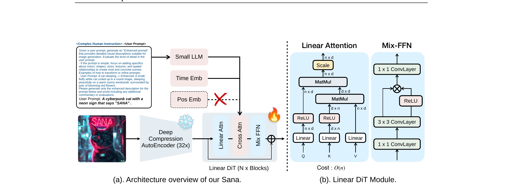

# PAPER_Sana

> SANA: Efficient High-Resolution Image Synthesis with Linear Diffusion Transformers
> NVIDIA · MIT HAN Lab · Tsinghua, 2024-10-14

---

## 📋 메타 정보

| 항목 | 내용 |
|---|---|
| **논문 제목** | SANA: Efficient High-Resolution Image Synthesis with Linear Diffusion Transformers |
| **저자** | Enze Xie, Junsong Chen, Junyu Chen, Han Cai, Haotian Tang, Yujun Lin, Zhekai Zhang, Muyang Li, Ligeng Zhu, Yao Lu, Song Han (총 11명) |
| **소속** | NVIDIA · MIT HAN Lab · Tsinghua University |
| **공개일** | 2024-10-14 (v1, arXiv) — v3 2024-10-20 |
| **분야** | Text-to-Image Generation, Diffusion Transformer, Efficient Inference |
| **논문 링크** | [arxiv abstract](https://arxiv.org/abs/2410.10629) · [PDF](https://arxiv.org/pdf/2410.10629) · [HTML](https://arxiv.org/html/2410.10629v3) |
| **코드** | [github.com/NVlabs/Sana](https://github.com/NVlabs/Sana) (Apache-2.0) |
| **자매 논문 (DC-AE)** | [arxiv 2410.10733](https://arxiv.org/abs/2410.10733) — 같은 그룹 같은 날 공개, Sana는 이걸 가져다 사용 |
| **외부 모델** | Gemma-2-2B-IT (텍스트 인코더, Google 사전학습 그대로) |
| **외부 데이터** | ~30M 이미지 (저자 Issue #95 답변: **PixArt-α/Σ와 동일** = SAM 11M + JourneyDB 4M + Internal ~15M 추정). Sana 1.5에서 50M로 확장 + 3M curated finetune (CLIP>25). **데이터 출처·공개 여부 모두 비공개** |
| **캡션 파이프라인** | 이미지당 4개 자동 캡션 생성. **VILA-3B/13B** (NVIDIA, 사내) + **InternVL2-8B/26B** (Shanghai AI Lab). **Qwen-VL 계열은 일절 사용 안 함**. CLIP-Score 기반 동적 샘플링 (CSS) 로 캡션 선택 |
| **백본 분류** | DiT 본체는 scratch + 텍스트 인코더만 (C) 분기 LLM 재사용 하이브리드. 가장 가까운 비교: PixArt-Σ + Gemma로 갈아끼운 효율 극단화 버전 |

---

## 📚 주요 용어 사전 (Glossary)

### 아키텍처 · 압축

- **DC-AE (Deep Compression Autoencoder)** — 이미지를 잠재공간 (latent space) 으로 압축하는 오토인코더 (autoencoder). 기존 SD VAE의 8배 압축을 **32배까지 끌어올린 것**. 별도 자매 논문에서 학습한 가중치를 Sana에서 가져다 사용. (즉 Sana 안에서 새로 학습한 게 아님)
- **F32C32P1** — Sana의 잠재 공간 표기법. F=공간 다운샘플 비율 32배, C=잠재 채널 수 32, P=DiT의 패치 크기 1. 기존 SD VAE는 F8C4P2 (8배·4채널·patch 2).
- **잠재 공간 (latent space)** — 이미지 픽셀을 직접 다루는 대신 압축된 표현 공간에서 작업. 메모리·연산 절감의 핵심.
- **Linear DiT** — 이미지 토큰 사이의 어텐션을 **선형 복잡도 (linear complexity, O(N))** 로 만든 Diffusion Transformer. 기존 DiT는 토큰 수² (O(N²)) 라서 4K 같은 고해상도에 치명적.
- **LiteLA (Lightweight Linear Attention)** — Sana가 실제로 쓰는 선형 어텐션 모듈. ReLU 기반 커널 트릭으로 softmax 없이 어텐션을 계산함.
- **커널 함수 (kernel function, φ)** — softmax처럼 모든 토큰을 동시에 묶지 않고 **각 입력에 따로 적용되는 element-wise 함수**. Sana는 가장 단순한 φ = ReLU 채택. φ를 양쪽에 따로 적용할 수 있게 만들면 행렬 곱 결합 순서를 바꿀 수 있음 (= 분배법칙 살리기).
- **분배법칙 (distributive law)** — `(Σⱼ Aⱼ) · B = Σⱼ (Aⱼ · B)`. Linear Attention의 모든 마법이 일어나는 지점. softmax는 분모가 모든 j'에 의존해서 분배법칙을 깸 → N×N 표 강제. ReLU 같은 단순 함수로 갈아끼우면 분배법칙이 살아나 K·V를 미리 합쳐 둘 수 있음 (= O(N²) → O(N)).
- **Mix-FFN (= GLUMBConv)** — Linear DiT의 피드포워드 (feed-forward network, FFN). 일반 MLP 대신 **3×3 깊이별 합성곱 (depthwise convolution)** 을 끼워 넣어 위치 정보와 지역성 (local pattern) 보강. **Linear attention의 표현력 손실을 보상하는 핵심 짝꿍** — Linear만 단독 교체하면 성능 떨어지지만, Mix-FFN 결합 시 표준 attention보다 우수.
- **NoPE (No Positional Embedding)** — 별도의 위치 임베딩 (positional embedding) 을 제거. Mix-FFN 안의 zero-padding된 3×3 conv가 위치 단서를 암묵적으로 제공해줌.

### 텍스트 조건

- **Decoder-only LLM Text Encoder** — T5 같은 인코더-디코더 구조 대신 **한 방향으로만 흐르는 LLM (decoder-only, GPT 계열)** 인 Gemma-2-2B-IT를 텍스트 인코더로 사용.
- **CHI (Complex Human Instruction)** — 사용자 프롬프트 앞에 길고 정교한 시스템 지시문을 붙이는 프롬프트 엔지니어링 기법. LLM의 instruction-following 능력을 활용해 캡션을 정제·확장.

### 학습 · 샘플링

- **Flow Matching** — 노이즈 → 이미지 경로를 직선화한 학습 방식. SD3·FLUX·Sana 모두 채택.
- **Flow-DPM-Solver** — Flow Matching 학습 모델에 기존 **DPM-Solver++** (속도 빠른 ODE solver) 를 적응시킨 샘플러. 28~50 step → 14~20 step으로 절반 감소.
- **Multi-Caption Auto-labelling** — 이미지 한 장당 여러 VLM (vision-language model) 으로 캡션을 자동 생성하는 파이프라인. Sana는 VILA-3B/13B + InternVL2-8B/26B 의 4개 VLM 으로 이미지당 4개 캡션 생성.
- **CSS (CLIP-Score-based Sampler)** — 각 학습 step 마다 4개 캡션 중 하나를 **CLIP score 기반 확률 분포로 샘플링** (`P(cᵢ) = exp(cᵢ/τ) / Σ exp(cⱼ/τ)`). 온도 τ로 결정성 조절. 캡션 다양성을 보존하면서 품질 가중.
- **CHI (Complex Human Instruction)** — Glossary 위 "텍스트 조건" 섹션 참조. 데이터 측면에선 Gemma가 대화체로 빠지는 것 (`"Sure! I can describe..."`) 을 막는 강제 정제 prepend.
- **Cascade Resolution Training** — 저해상도 → 고해상도 순차 학습 (512 → 1024 → 2K → 4K). **256px 사전학습은 스킵** — DC-AE 32× 압축 때문에 256px → 8×8 = 64 토큰만 남아 정보 손실 너무 큼.

### 평가 지표

- **rFID (reconstruction FID)** — 오토인코더가 이미지를 압축·복원했을 때 화질 지표. 낮을수록 좋음.
- **GenEval** — 텍스트-이미지 정합성 (객체 수·색·위치 등) 자동 평가.
- **DPG-Bench** — 복잡한 long prompt에 대한 정합성 평가.
- **MJHQ-30K FID** — Midjourney 스타일 데이터셋 FID.
- **ImageReward** — 인간 선호도를 학습한 보상 모델 점수.

---

## 🎯 논문 요약 (TL;DR)

**0.6B/1.6B의 작은 DiT로 4K 이미지를 FLUX-12B 대비 약 100배 빠르게 생성하는 텍스트-이미지 모델.**

핵심 아이디어 4가지:

1. **32배 압축 오토인코더 (DC-AE)** — 잠재 토큰 수를 1024² 기준 16,384 → 1,024로 16배 줄임 (메모리 절감의 1차 동력)
2. 모든 self-attention을 **선형 어텐션 (Linear Attention, LiteLA)** 로 교체 — 토큰 수² → 토큰 수에 비례하도록 (특히 4K에서 결정타)
3. T5-XXL (4.7B) 대신 작은 **decoder-only LLM (Gemma-2-2B)** 로 프롬프트 인코딩 — 6× 빠르고 instruction-following 능력 활용
4. **Flow-DPM-Solver** 로 샘플링 step을 28~50 → 14~20으로 절반 단축

검증: 1024² 1.6B 모델 1.2초/장 (FLUX-dev 23초의 1/19), **4K 9.6초** (FLUX 469초의 1/49), RTX 4090 INT8 0.37초/장.

---

## ⭐ 핵심 기여 (Contributions)

1. **DC-AE (32× 압축 오토인코더)** — 단순히 깊이만 늘리면 rFID 0.31→0.82로 무너지는 문제를 **잔차 연결 (residual autoencoding) + 다단계 학습** 으로 해결. rFID 0.34로 SDXL VAE (0.31) 동급 화질 유지. **자매 논문 ([arxiv 2410.10733](https://arxiv.org/abs/2410.10733))** 에서 별도 학습된 가중치를 가져옴.

2. **Linear DiT** — 표준 self-attention을 **LiteLA (ReLU 커널 기반 선형 어텐션)** 로 전부 교체. cross-attention만 표준 유지 (텍스트 토큰은 적기 때문). 추가로 **Mix-FFN (GLUMBConv)** 로 선형 어텐션의 약한 지역성 보강 + **NoPE** 로 positional embedding 제거.

3. **Decoder-only LLM 텍스트 인코더 (Gemma-2-2B-IT)** — 이전 시도들이 실패한 이유 (Gemma 임베딩 분산이 T5보다 수 자릿수 큼 → NaN loss) 를 **RMSNorm + learnable scale 0.01** 의 단순한 트릭으로 해결. CHI 프롬프트 엔지니어링으로 GenEval +2.0 추가 향상.

4. **Flow-DPM-Solver** — t≈T (순수 노이즈 근처) 에서 noise 예측은 불안정하지만 **data 예측은 거의 상수처럼 안정** 한 점을 이용해 DPM-Solver++의 σ_t 파라미터화를 Flow Matching에 이식. 14~20 step으로 28~50 step 수준 품질 달성.

5. **End-to-end 효율 시스템** — 4가지 컴포넌트의 곱셈으로 1.6B 모델이 1024² 1.2초, **4K 9.6초** (FLUX-dev 469초 → 49× 가속), RTX 4090 INT8 0.37초/장.

---

## 🛠️ 주요 알고리즘 설명

<p align="center">
  
</p>

> **Fig. 5 — Overview of Sana.**
> **(a) 전체 학습 파이프라인**: 입력 이미지 → **32× Deep Compression AutoEncoder (DC-AE)** → 32배 압축된 latent → **Linear DiT (N×Blocks)** (Linear Attn + Cross Attn + Mix-FFN으로 구성) → 노이즈 예측. 텍스트 조건은 **Small LLM (Gemma-2-2B-IT)** 이 처리하며, 사용자 prompt 앞에 **"Complex Human Instruction"**(CHI)을 붙여 한 번에 입력. **Positional Embedding은 빨간 X 표시 — 사용하지 않음 (NoPE)**.
> **(b) Linear DiT 모듈 상세**: 왼쪽 **Linear Attention** (Linear+ReLU로 Q,K를 매핑, MatMul 두 번 — KᵀV를 먼저 계산해 O(N²)→**O(N)**), 오른쪽 **Mix-FFN** (1×1 ConvLayer + **3×3 ConvLayer (depthwise)** + 1×1 ConvLayer로 지역성과 위치 정보 보강). **softmax 없는 선형 attention의 약점을 Mix-FFN의 conv가 보완**하는 구조.

핵심 메시지: SANA의 효율성은 단일 기법이 아니라 **3박자 조합** — (1) DC-AE로 토큰 수 자체를 1/16로 압축, (2) Linear Attention으로 잔여 토큰에 대한 attention을 O(N²)→O(N), (3) Mix-FFN으로 linear attention이 잃는 지역성 회복. 아래 ①~⑤로 각 부품을 풀어 설명합니다.

### ① DC-AE (Deep Compression Autoencoder)

**문제:** 기존 SD VAE는 8배 다운샘플 (F8C4). 1024² → 128×128×4 = 65,536 latent 값. DiT에서 patch=2 묶어도 4,096 토큰. **4K (4096²)** 가 되면 65,536 토큰이 되어 O(N²) attention이 폭발.

**해결:** **32배 다운샘플 + 32 채널 (F32C32)**. 1024² → 32×32×32 = **1,024 토큰** (16× 감소).

**구조 (코드 [diffusion/model/dc_ae/efficientvit/models/efficientvit/dc_ae.py](https://github.com/NVlabs/Sana/blob/main/diffusion/model/dc_ae/efficientvit/models/efficientvit/dc_ae.py)):**

```
Encoder: project_in (3 → 128 ch)
       → 6 stages (width=[128, 256, 512, 512, 1024, 1024], depth=[2]×6)
       → 각 stage마다 EfficientViT block + 2× spatial 다운샘플
       → project_out (→ 32 ch latent)
Decoder: 대칭 역순
유효 다운샘플: 2^(6-1) = 32배
```

**왜 32배가 가능한가:** SD VAE를 단순히 깊게 쌓으면 정보 병목 (information bottleneck) 으로 화질이 무너짐 (rFID 0.31 → 0.82). DC-AE는 **잔차 연결을 압축 단계에 추가** 하고 **저해상도 → 고해상도로 다단계 finetune** 해서 정보 손실을 막음.

**rFID 비교 (논문 Table 1):**

| AE | 압축 | 채널 | rFID ↓ | PSNR ↑ |
|---|---|---|---|---|
| SDXL VAE | 8× | 4 | 0.31 | 31.41 |
| SD VAE F32C64 (naive 확장) | 32× | 64 | **0.82** ❌ | — |
| **DC-AE F32C32 (Sana)** | 32× | 32 | **0.34** ✅ | 29.29 |

> **주의:** DC-AE 자체의 학습 디테일은 [자매 논문 (arxiv 2410.10733)](https://arxiv.org/abs/2410.10733) 에 있음. Sana 본 논문은 인용만 함. 보통 두 논문을 짝으로 읽음.

### ② Linear DiT — LiteLA (ReLU Linear Attention)

**문제:** 표준 self-attention은 `softmax(QK^T)V` → 메모리·연산 모두 **O(N²)**. 1024² 이미지의 1,024 토큰만 해도 1024² ≈ 100만 칸 행렬을 만들어야 하고, 4K 이미지 16,384 토큰이면 약 2.7억 칸 (40GB GPU도 부족).

#### 쉬운 설명 — 왜 softmax가 N² 표를 강제하는가

먼저 분배법칙 (distributive law) 부터 떠올리기:

```
(a + b + c) · d  =  a·d + b·d + c·d        ← 초등 수학
( Σⱼ Aⱼ ) · B    =  Σⱼ ( Aⱼ · B )           ← 같은 성질, 행렬 버전
```

**Attention을 합으로 풀어쓰면** (softmax 일단 무시):

```
Out_i = Σⱼ ( Q_i · K_jᵀ ) · V_j
      = Q_i · ( Σⱼ K_jᵀ · V_j )           ← 분배법칙으로 Q_i 빼내기
              ─────────────────
              M = i와 무관한 d×d 행렬 ⭐
```

→ M (= Σⱼ K_jᵀ V_j) 를 **한 번만** 계산해두면 모든 i가 재사용. **N×N 표 안 만들어도 됨.** 이게 Linear의 핵심.

**그런데 softmax가 끼면 왜 안 되는가:**

```
Out_i = Σⱼ  exp(Q_i · K_jᵀ)
            ─────────────────────  · V_j
            Σⱼ' exp(Q_i · K_j'ᵀ)        ← 분모가 모든 j'에 의존!
```

- 분모가 "**다른 j' 들 전부를 봐야**" 계산됨 → 한 항씩 분리 (= 분배법칙) 불가
- 따라서 N×N 표를 **반드시 다 만들어야** softmax 정규화가 끝남 → 메모리 O(N²) 강제

**가게 비유:**

| | 표준 Attention (softmax) | Linear Attention (φ-kernel) |
|---|---|---|
| 비유 | "1:1 면접 후 줄세우기" | "점원이 미리 요약 카드 만들어두기" |
| 흐름 | 손님 i가 점원 N명 모두와 만나 점수 매김 → 그 N개를 나란히 정규화 (softmax) | 점원들이 각자 (K_j, V_j) 를 ReLU로 변환해 합산 카드 M = Σⱼ φ(K_j)V_j 미리 작성 |
| 손님당 비용 | N명 만남 | M 카드 1장 보기 |
| 전체 비용 | **N² 만남** | **N 만남** |
| 카드 재사용 | 불가 (매번 softmax 다시) | **모든 손님이 재사용** ⭐ |

#### φ로 갈아끼우기 — 분배법칙 살리기

핵심 발상:

```
softmax( Q · Kᵀ )      ← 두 입력이 섞인 후 정규화 (분리 불가)
        ↓ 대체
φ(Q) · φ(Kᵀ)           ← 각자 따로 처리 후 단순 곱셈 (분리 가능!)
```

φ는 **각 입력에 따로 적용되는 element-wise 함수** 여야 함 (그래야 분배법칙이 살아남). Sana는 가장 단순한 형태 채택: **φ = ReLU**.

```
ReLU(x) = max(0, x)        ← 음수만 0으로, 양수 그대로
```

→ 음수 유사도 (negative similarity) 라는 비상식적 상황을 자연스레 제거하면서, 행렬 만들 필요 없이 각 칸에 따로 적용 가능.

**Linear Attention 변종 비교:**

| 방법 | 커널 함수 φ | 특징 |
|---|---|---|
| Performer (FAVOR+) | 가우시안 커널 랜덤 근사 | 정확하지만 복잡 |
| Linformer | K, V를 저차원 투영 | 시퀀스 길이 고정 |
| Cosformer | cos 가중 | 부드러운 attention |
| **LiteLA (Sana)** | **ReLU** | **가장 단순·빠름, Triton 융합 친화** ⭐ |

#### LiteLA 핵심 수식

```
Out_i = ReLU(Q_i) · Σⱼ ReLU(Kⱼ)ᵀ · Vⱼ
        ─────────────────────────────
        ReLU(Q_i) · Σⱼ ReLU(Kⱼ)ᵀ · 1
```

- 분자: 값 (value) 들의 가중합
- 분모: 가중치들의 합 (softmax의 분모 역할, 정규화)

**행렬 곱 순서 변경 효과 (1024² 이미지, N=1024, d=32):**

| 단계 | 표준 Attention | LiteLA (Linear) | 비율 |
|---|---|---|---|
| 중간 행렬 (Q·Kᵀ) | 1024×1024 = 1,048,576 칸 | **만들지 않음** | – |
| 중간 행렬 (Kᵀ·V) | – | 32×32 = 1,024 칸 | 1/1024 |
| 메모리 | O(N²) ≈ 1M | O(d²) ≈ 1K | **~1000× 작음** |
| FLOPs | O(N²·d) ≈ 33M | O(N·d²) ≈ 33K | **~1000× 작음** |

**4K 이미지 (N=16,384) 에선 격차가 폭발:**

| | 표준 Attention | LiteLA |
|---|---|---|
| 중간 행렬 | 16,384² ≈ **2.7억 칸** | 32² = **1,024 칸** |
| GPU 메모리 | 40GB도 부족 (OOM) | 가뿐 |

#### 실제 코드 한 줄 한 줄

📍 [diffusion/model/nets/sana_blocks.py](https://github.com/NVlabs/Sana/blob/main/diffusion/model/nets/sana_blocks.py)

```python
class LiteLA(Attention_):
    def __init__(self, ...):
        self.kernel_func = nn.ReLU(inplace=False)   # φ = ReLU

    def attn_matmul(self, q, k, v):
        # 입력 shape: (B, h, d, N)
        # B=batch, h=heads, d=head_dim(=32), N=토큰수(=1024)
        
        # Step 1. 커널 함수 적용
        q = self.kernel_func(q)              # ReLU(Q)
        k = self.kernel_func(k)              # ReLU(K)
        
        # Step 2. 정규화 분모 트릭 — V 끝에 모든 값이 1인 행 추가
        v = F.pad(v, (0,0,0,1), value=1)     # (B, h, d+1, N)
        # 한 번의 행렬곱으로 분자(d행)와 분모(1행)를 동시 계산
        
        # Step 3. ⭐ 핵심: 오른쪽부터 결합 (= K·V 먼저)
        vk = torch.matmul(v, k)              # (B, h, d+1, d) — N과 무관한 작은 행렬!
        out = torch.matmul(vk, q)            # (B, h, d+1, N)
        
        # Step 4. 마지막 행(분모)으로 나누어 정규화
        out = out[:,:,:-1] / (out[:,:,-1:] + self.eps)
        return out                           # (B, h, d, N)
```

**6줄짜리** 함수가 핵심. **softmax 호출이 어디에도 없음.**

**Triton 커널 융합:** activation, padding, division 같은 element-wise 연산을 행렬곱과 융합해 GPU 메모리 전송 오버헤드 최소화. 코드의 `triton_linear` 옵션이 이걸 활성화.

#### Cross-Attention은 왜 표준 유지?

```python
if attn_type == "linear":
    self.attn = LiteLA(...)              # ⭐ self-attention만 Linear
# Cross-attention은 attn_type과 별개로 항상 standard
self.cross_attn = MultiHeadCrossAttention(...)
```

| 비교 | Self-Attn (이미지↔이미지) | Cross-Attn (이미지↔텍스트) |
|---|---|---|
| Key/Value 토큰 수 | N_img = 1,024 | N_text ≈ 300 (3× 작음) |
| QKᵀ 행렬 크기 | 1024² = 1M | 1024×300 = 307K |
| 표현력 필요성 | 낮음 (지역 패턴) | **높음** (단어 → 이미지 영역 정확 매칭) |
| 결정 | **Linear로 교체** | **Standard 유지** |

→ Cross-attention은 비용도 작고 sharp focus가 더 중요해서 표준 유지.

#### ⭐ 성능 비교 — Linear vs Standard Attention

**단독 비교 (학계 일반론):**

| 측면 | Standard (softmax) | Linear (φ-kernel) |
|---|---|---|
| **표현력 (expressivity)** | 높음 — sharp focus 가능 | 낮음 — 부드러운 분포만 |
| **장기 의존성** | 강함 | 약함 |
| **정확한 검색 (retrieval)** | 한 토큰 정확히 집어냄 | 흐릿한 평균에 가까움 |
| **단독 벤치마크** | 기준 | 보통 1~3% 하락 |

→ LLM 분야에서 Performer·Linformer 등 Linear attention이 주류에 채택되지 않은 이유 (정확한 토큰 lookup이 핵심이라).

**Sana 논문의 Ablation (Table 3, 6) — 동일 모델 구조에서 attention만 바꿔 비교:**

| 설정 | FID ↓ | CLIP ↑ | GenEval ↑ | Latency |
|---|---|---|---|---|
| Vanilla (standard) Attention + MLP | 6.0 | 28.0 | 0.51 | 1.0× |
| **Linear Attention + MLP** | 6.5 | 27.8 | 0.49 | **0.7×** |
| **Linear Attention + Mix-FFN (Sana 전체)** | **5.9** | **28.4** | **0.55** | **0.7×** |

핵심 발견:
1. **Linear만 단독 교체 → 약간 떨어짐** (FID 6.0 → 6.5, GenEval 0.51 → 0.49)
2. **Linear + Mix-FFN 결합 → 표준보다 우수** (FID 5.9, GenEval 0.55)
3. **속도는 30% 빠름**

→ **Mix-FFN이 Linear attention의 표현력 손실을 정확히 보상.** 이게 Sana 논문의 진짜 발견 — "Linear을 썼다"가 아니라 "Linear이 작동하게 만드는 시스템 설계".

**다른 SOTA 표준 attention 모델과의 비교 (1024×1024):**

| 모델 | Attention | 파라미터 | FID ↓ | GenEval ↑ | DPG ↑ | Latency |
|---|---|---|---|---|---|---|
| PixArt-Σ | Standard | 0.6B | 6.15 | 0.54 | 80.5 | 1.5s |
| SD3-Medium | MM-DiT (full) | 2B | – | 0.62 | 84.1 | 4.4s |
| FLUX-dev | MM-DiT (full) | 12B | 10.15 | **0.67** | 84.0 | 23.0s |
| **Sana-0.6B** | **Linear (LiteLA)** | 0.6B | **5.81** | 0.64 | 83.6 | **0.9s** |
| **Sana-1.6B** | **Linear (LiteLA)** | 1.6B | **5.76** | 0.66 | **84.8** | 1.2s |

→ FID에서는 **모든 표준 attention 모델보다 우수**, GenEval에서는 FLUX-12B와 거의 동등 (1/20 파라미터), DPG에서는 1위. **19~26× 빠름.**

**왜 이미지에서는 잘 되고 LLM에서는 안 되나:**

| | LLM (텍스트) | Diffusion (이미지) |
|---|---|---|
| Attention 패턴 | **Sharp** — "5번째 단어를 정확히 본다" | **Soft** — "주변 픽셀을 부드럽게 본다" |
| 장기 의존성 | 매우 중요 (앞 문장 retrieval) | 비교적 덜 중요 (인접 정보가 핵심) |
| 정확 검색 | 필수 (이름·숫자) | 거의 불필요 |
| 지역성 | 글로벌 (멀리 있어도 정확히) | 로컬 (인접이 핵심) |

→ **이미지 attention 패턴 자체가 본래 부드러워서** Linear의 약점이 큰 문제가 안 됨. Mix-FFN의 conv가 지역성을 채워주면 표준과 동등.

**4K에서 격차 폭발:**

| 해상도 | Standard (FLUX-dev 12B) | Linear (Sana-1.6B) | 비율 |
|---|---|---|---|
| 1024² | 23초 | 1.2초 | 19× |
| 2048² (대략) | ~92초 | 3.6초 | 25× |
| **4096² (4K)** | **469초 (8분)** | **9.6초** | **49×** ⭐ |

→ 해상도 올라갈수록 Standard는 N² 비용으로 폭발, Linear은 N으로 선형 증가. **고해상도에선 Standard가 사실상 OOM되거나 비실용적**.

**솔직한 트레이드오프:**

| Linear가 잃는 것 | Linear가 얻는 것 |
|---|---|
| 이론적 표현력 (universal approximation) | 메모리 N² → N |
| Sharp focus 필요한 task (텍스트 렌더링, 정밀한 손가락 수) | 연산 N² → N |
| → Sana의 알려진 한계와 일치 (텍스트 렌더링·손·얼굴 약함) | 같은 GPU로 더 큰 모델·긴 시퀀스 |
| | 엣지 디바이스 (4090 INT8 0.37초) 가능 |

#### 정리: Sana의 진짜 기여

**Linear attention을 썼다는 게 아니라, Linear attention이 작동하게 만든 시스템 설계.** 구체적으로:

1. **Linear (LiteLA)** 로 self-attention 효율화
2. **Mix-FFN의 3×3 conv** 로 잃어버린 지역성 보강
3. **Cross-attention 표준 유지** 로 텍스트-이미지 sharp 매칭은 그대로
4. **DC-AE의 32× 압축** 으로 토큰 수 자체를 1차로 줄여놓음

이 4가지가 페어로 작동해야 의미 있음. 이전에도 Diffusion에 Linear attention 시도 있었으나 화질 저하로 채택 안 됨 — **Sana가 처음 표준 수준 도달.**

### ③ Mix-FFN (GLUMBConv) — 위치 정보 + 지역성 보강

선형 어텐션의 약점: 표준 softmax 어텐션보다 **지역 패턴 (local pattern)** 캡처가 약함. NoPE까지 더하면 위치 정보도 부족해짐.

**해결:** FFN을 단순 MLP에서 **GLU + MBConv (역방향 residual + 3×3 깊이별 합성곱)** 로 교체.

```
Mix-FFN = Inverted Residual Block
       └─ 1×1 conv (expand) → 3×3 depthwise conv → GLU gate → 1×1 conv (project)
```

- **3×3 conv가 지역성 회복**
- **zero-padding이 절대 위치 단서 (보더 효과)** 를 제공 → positional embedding을 제거해도 (NoPE) 성능 손실 없음

코드 config: `ffn_type: glumbconv`.

### ④ Decoder-only LLM Text Encoder (Gemma-2-2B-IT)

**왜 T5 대신 Gemma인가:**

| 비교 | T5-XXL (4.7B) | Gemma-2-2B-IT |
|---|---|---|
| 인코딩 속도 | 기준 | **6× 빠름** |
| Instruction-following | 약함 | 강함 (RLHF 학습됨) |
| 다국어 | 영어 위주 | 다국어 사전학습 (zero-shot 중국어/이모지 가능) |
| 추론 메모리 | 큼 | 작음 |

**학습 안정화 트릭 ⭐:** Gemma의 텍스트 임베딩 분산 (variance) 이 T5보다 **수 자릿수 크다** → 그대로 cross-attention에 넣으면 학습 발산 (NaN loss).

해결:
- **RMSNorm으로 임베딩 분산을 1.0으로 정규화**
- **작은 learnable scale factor (초기 0.01)** 적용 → 학습 초기 조심스럽게 통합
- 코드: `attention_y_norm` ([diffusion/model/nets/sana.py](https://github.com/NVlabs/Sana/blob/main/diffusion/model/nets/sana.py))

→ 이 트릭이 **이전 시도들이 실패한 핵심 차이.** Decoder-only LLM을 텍스트 인코더로 쓰려는 시도는 이전에도 있었으나 학습 안정화에서 막혔음.

**CHI (Complex Human Instruction):** 사용자 프롬프트 앞에 시스템 지시문 prepend (예: "You are a prompt expert. Below is a description...") → LLM이 캡션을 정제·확장해서 cross-attention에 전달.

- 52K step 기준: GenEval 45.5 → 47.7 (+2.2)
- 140K + 5K finetune: 52.8 → 54.8 (+2.0)

### ⑤ Flow-DPM-Solver

기존 Flow Matching 추론은 **Flow-Euler** (1차 적분) → 28~50 step.

**핵심 아이디어:** DDPM은 noise 예측이 보통이지만, Flow Matching은 **velocity (속도) 또는 data 예측**. t ≈ T (순수 노이즈 근처) 에선:
- noise 예측 → 불안정
- **data 예측 → 거의 상수처럼 안정**

이 안정성을 살려 **DPM-Solver++** (2차 multistep ODE solver) 의 σ_t 파라미터화를 Flow Matching에 맞게 변환.

→ **14~20 step**으로 동일 품질 달성. 구현: [diffusion/model/dpm_solver.py](https://github.com/NVlabs/Sana/blob/main/diffusion/model/dpm_solver.py).

### ⑥ 학습 데이터·파이프라인

**왜?** 모델 구조가 아무리 효율적이어도 학습 데이터·캡션 품질이 나쁘면 화질·instruction following이 무너짐. Sana는 데이터셋 자체를 새로 만들기보다, **PixArt와 같은 이미지 셋에 VLM 자동 캡션 + CLIP-score 샘플링** 으로 캡션 다양성·품질을 끌어올린 케이스. 이 절은 그 파이프라인을 정리.

#### 데이터 규모와 출처

| 항목 | Sana 1.0 | Sana 1.5 | 비고 |
|---|---|---|---|
| 사전학습 데이터 | **~30M 이미지** | ~50M 이미지 | 저자 [Issue #95](https://github.com/NVlabs/Sana/issues/95) 답변 ⭐ |
| Curated finetune | – | **3M** (CLIP > 25 필터링) | GenEval +3%p |
| 출처 (추정) | **PixArt-α/Σ와 동일** | 50M으로 확장 (출처 비공개) | 저자: "refer to PixArt-alpha and PixArt-Sigma" |
| **공개 여부** | **❌ 데이터 비공개** | ❌ | 코드·가중치만 공개 |

**PixArt 기준 데이터 구성 (Sana 1.0 추정 = ~30M):**

| 데이터셋 | 규모 | 라이선스 | 출처 |
|---|---|---|---|
| **SAM (Segment Anything)** | 11M | Apache-2.0 | Meta 공개 |
| **SAM-LLaVA caption** | 11M | LLaVA로 재캡션 | 합성 |
| **JourneyDB** | 4M | 연구용 공개 | Midjourney 생성 이미지 + prompt |
| **Internal Data** | ~15M | 비공개 | 자체 큐레이션 |

→ 핵심: **데이터 자체는 비공개지만 PixArt 셋업을 따라가면 공개 SAM + JourneyDB로 대부분 재현 가능**. 완전 비공개 모델 (FLUX·SD3) 대비 투명도 높음.

#### Multi-Caption Auto-labelling Pipeline (Sec 3.1)

> *"For each image, whether or not it contains an original prompt, we will use four VLMs to label it: VILA-3B/13B, InternVL2-8B/26B. Multiple VLMs can make the caption more accurate and more diverse."*

**4개 VLM이 이미지당 1개씩 캡션 생성 → 이미지당 4개 캡션 셋:**

| VLM | 개발사 | 라이선스 | 사이즈 |
|---|---|---|---|
| **VILA-3B** | **NVIDIA + MIT** | Apache-2.0 (코드), Llama-2 community (가중치) | 3B |
| **VILA-13B** | NVIDIA + MIT | 동일 | 13B |
| **InternVL2-8B** | Shanghai AI Lab + SenseTime + Tsinghua | MIT (코드), Apache-2.0 (가중치) | 8B |
| **InternVL2-26B** | 동일 | 동일 | 26B |

→ **4개 전부 오픈소스.** 누구나 가중치 다운로드해 같은 캡션 셋 재현 가능.

⚠️ **주목: Qwen-VL 계열은 일절 안 씀** (캡션·텍스트 인코더·백본 어디에도). 이유 추정:
1. NVIDIA 사내 (VILA) 우선
2. 당시 (2024-10) InternVL2가 오픈 SOTA로 검증됨 (GPT-4V 근접)
3. Qwen2-VL은 비슷한 시점 (2024-09) 출시로 검증 부족
4. 영어 중심 학습이라 Qwen의 중국어 강점 불필요

#### CLIP-Score-based Sampler (CSS)

**왜?** 4개 캡션 중 어떤 걸 학습에 쓸지가 매번 문제. 단순히 random 선택하면 품질 낮은 캡션도 동등하게 쓰이고, 항상 최고만 쓰면 다양성 손실.

**확률 분포:**
```
P(c_i) =  exp(c_i / τ)
          ─────────────
          Σⱼ exp(c_j / τ)
```

- `c_i` = i번째 캡션의 **CLIP score** (이미지와의 정합도)
- `τ` (온도, temperature):
  - `τ → 0`: 가장 높은 CLIP score만 결정적 선택
  - `τ → ∞`: 4개 중 균등 무작위
  - **Sana는 중간값으로 품질-다양성 균형**

**효과 (논문 Table 4):**

| 캡션 전략 | FID ↓ | CLIP ↑ |
|---|---|---|
| Single caption | 6.13 | 27.10 |
| **Multi-caption + CSS** | **6.12** | **27.26** (+0.16) |

→ FID는 거의 동일하지만 CLIP 정합도가 향상. 캡션 다양성으로 일반화 능력 ↑.

#### Cascade Resolution Training

```
512px (메인 사전학습)  →  1024px (finetune)  →  2K  →  4K
       ↑
       ⚠️ 256px 사전학습은 스킵
       이유: DC-AE 32× 압축이면 256px → 8×8 = 64 토큰밖에 안 남음
            → 정보 손실 너무 큼 ("256 resolution loses too much information")
```

→ PixArt-Σ 등 기존 모델은 256px부터 출발하지만, Sana는 **DC-AE 압축률이 커서 512부터 시작**. 이게 다른 모델과의 큰 디자인 차이.

#### CHI (Complex Human Instruction) — 데이터 측면

CHI는 알고리즘 ④ 에서 모델 측면을 다뤘지만, **데이터 관점**에서 보면:

> *"without CHI, although Gemma-2 can understand the meaning of the input, the output is conversational"*

→ CHI 없을 때 Gemma의 응답: `"Sure! I can describe..."` 처럼 **대화체 (chat-style)** 로 빠짐. 이미지 생성에 부적합.

**CHI prepend로 정제:**
- 52K step: GenEval 45.5 → 47.7 (+2.2)
- 140K + 5K finetune: 52.8 → 54.8 (+2.0)

#### 다국어 데이터 (Sana 1.5에서 추가 공개)

| 구성 | 규모 |
|---|---|
| 영어 원본 | 50M (사전학습) |
| **다국어 추가** | **100K 영어 prompt → GPT-4로 번역** |
| 번역 방향 | 순 중국어 / 영중 혼합 / 이모지 포함 |

→ 영어 데이터로만 학습했음에도 **zero-shot 중국어·이모지 생성 가능** 한 이유: Gemma-2의 다국어 사전학습 + 100K 다국어 finetune.

#### 학습 step·GPU 통계 (확인된 범위)

| 항목 | Sana-0.6B (1024px stage) | Sana-1.6B |
|---|---|---|
| iteration | 52,000 | 140K + 5K (CHI finetune) |
| batch size | 128 | 미공개 |
| GPU | **32 장** (A100/H100 미공개) | 미공개 |
| 처리 샘플 | ~213M (52K × 128 × 32) | 미공개 |
| 30M 기준 epoch | ~7 epoch | 미공개 |
| **총 GPU hours** | **❌ 미공개** | **❌ 미공개** |

→ Z-Image (314K H800h 공개) 같은 투명한 보고는 안 함. NVIDIA·BFL·Stability 등 대부분 모델의 관행.

#### 비공개 항목

| 항목 | 상태 |
|---|---|
| 데이터셋 정확 출처·라이선스 | ❌ |
| 해상도·aspect ratio 분포 | ❌ |
| 미적 점수 (aesthetic) 컷오프 | ❌ |
| 합성 데이터 비율 | ❌ |
| 데이터 augmentation | ❌ (논문 미언급) |
| 캡션 평균 길이·토큰 통계 | ❌ |
| GPU 종류·총 hours·금전 비용 | ❌ |

#### 정리: 데이터 측면의 핵심 기여

**Sana의 데이터적 기여는 "큰 데이터 모았다" 가 아님.** 정확히는:

1. **PixArt와 동일한 ~30M 이미지** 를 그대로 활용
2. **4개 오픈소스 VLM (VILA + InternVL2)** 으로 캡션 다양성 자동 생성
3. **CLIP-score 샘플링 (CSS)** 으로 품질-다양성 균형
4. **CHI prompt** 로 Gemma 출력을 강제 정제
5. **256 스킵 cascade** 로 DC-AE 압축과 정합

→ **데이터 큐레이션 자체보다 캡션 품질·다양성** 으로 작은 모델의 성능을 끌어올림.

---

## 📊 실험 요약

### 1024×1024 메인 결과 (논문 Table 7)

| 모델 | 파라미터 | FID ↓ | CLIP ↑ | GenEval ↑ | DPG ↑ | Latency (s) | 상대 속도 |
|---|---|---|---|---|---|---|---|
| FLUX-dev | 12B | 10.15 | 27.47 | 0.67 | 84.0 | 23.0 | 1× |
| SD3-Medium | 2B | — | — | 0.62 | 84.1 | 4.4 | 5× |
| PixArt-Σ | 0.6B | 6.15 | 28.26 | 0.54 | 80.5 | 1.5 | 15× |
| **Sana-0.6B** | 0.6B | **5.81** | 28.36 | 0.64 | 83.6 | **0.9** | **26×** |
| **Sana-1.6B** | 1.6B | **5.76** | **28.67** | **0.66** | **84.8** | 1.2 | **19×** |

### 4K 생성 (A100, batch=1)

- FLUX-dev: 469초
- **Sana-1.6B: 9.6초 → ~49× 가속** (논문 표기는 100×, 12B 비교 + 추가 최적화 포함)

### 엣지 디바이스 (RTX 4090, 1024px)

- FP16: 0.88초/장
- **INT8 양자화: 0.37초/장 (2.4× 가속)**

### 다국어 zero-shot

- 영어로만 학습. Gemma 덕분에 **중국어·이모지 프롬프트도 이해·생성**.

### 후속 버전

| 버전 | 출시 | 발표 | 핵심 |
|---|---|---|---|
| SANA-1.5 | 2025-01 | ICML 2025 | 4.8B 스케일 업, inference scaling |
| SANA-Sprint | 2025-03 | ICCV 2025 highlight | sCM distillation, **0.1초 1-step** (H100) |
| SANA-Video | 2025-10 | ICLR 2026 Oral | Block Causal Linear Attention 비디오 |
| LongSANA | 2025-12 | — | 720p 27FPS 분 단위 비디오 |
| Sol-RL | 2026-04 | — | NVFP4 rollout RL, 4.64× 수렴 가속 |

### 한계

- 텍스트 렌더링 (이미지 안 글자) 약함
- 손·얼굴 디테일 종종 무너짐
- 학습 데이터 정확 규모 비공개

---

## 💬 Q&A

### Q1. DC-AE는 Sana 안에서 새로 만든 거야, 따로 만든 거야?

**별도로 새로 학습한 오토인코더.** Sana 자체의 컴포넌트가 아니라 NVIDIA·MIT 같은 그룹이 같은 날 별도 논문으로 공개한 자매 작품.

| 항목 | 내용 |
|---|---|
| 논문 | "Deep Compression Autoencoder for Efficient High-Resolution Diffusion Models" |
| arxiv | [2410.10733](https://arxiv.org/abs/2410.10733) |
| 저자 | Junyu Chen, Han Cai, Junsong Chen, Enze Xie, Song Han 등 (Sana 저자와 거의 동일) |
| 공개일 | 2024-10-14 (Sana와 **같은 날**) |
| 코드 | [mit-han-lab/efficientvit](https://github.com/mit-han-lab/efficientvit) (Sana는 sub-module로 포함) |
| HF | `mit-han-lab/dc-ae-f32c32-sana-1.1` |

- **scratch 학습** — SD VAE 같은 기존 오토인코더의 깊이만 늘린 게 아니라 **잔차 오토인코딩 (residual autoencoding) + 다단계 학습** 으로 처음부터.
- Sana 논문에선 "우리는 DC-AE를 사용한다" 인용만 하고 디테일은 자매 논문에.
- → "DC-AE 논문 + Sana 논문" 짝으로 읽는 게 표준.

### Q2. 토큰 수가 작아져서 메모리가 줄어든 거지?

**1차 동력은 DC-AE의 토큰 수 감소가 맞고, Linear Attention은 그 위에 얹는 2차 효율 레이어.**

| 단계 | 토큰 수 (1024²) | Attention 비용 |
|---|---|---|
| 표준 SD VAE (F8) + Standard Attn | 16,384 | ∝ 16,384² ≈ **2.68억** |
| DC-AE (F32) + Standard Attn | 1,024 | ∝ 1,024² ≈ **105만** |
| **DC-AE (F32) + Linear Attn (Sana)** | 1,024 | **∝ 1,024 (선형)** |

→ DC-AE가 토큰을 **16× 줄여 attention 비용 256× 감소** (1차 효과)
→ Linear Attention이 거기서 한 번 더 **O(N²) → O(N)** 으로 1024× 감소 (2차 효과)

**4K에선 Linear Attention의 진가가 폭발:**

| 단계 | 4K 토큰 수 | Attention 비용 |
|---|---|---|
| 표준 SD VAE (F8) | 262,144 | ∝ 687억 (사실상 OOM) |
| DC-AE + Standard | 16,384 | ∝ 2.68억 |
| **DC-AE + Linear** | 16,384 | **∝ 16,384** |

### Q3. 다른 여러 연구들과 토큰 수 비교?

**1024×1024 입력 — 토큰 수 + per-token 정보량 비교 (코드 직접 검증):**

| 모델 | VAE | DiT patch | **유효 압축률** | 잠재 shape | **토큰 수** | per-token 채널 | 정보량 (토큰×채널) | Attention |
|---|---|---|---|---|---|---|---|---|
| SDXL | KL-VAE 8× | – (UNet) | 8× | (4, 128, 128) | 16,384 | 4 | 65,536 | UNet |
| PixArt-α / Σ | SD VAE 8× | 2 | 16× | (4, 64, 64)→p2 | 4,096 | 16 | 65,536 | Standard |
| SD3 | 16ch VAE 8× | 2 | 16× | (16, 64, 64)→p2 | 4,096 | 64 | 262,144 | MM-DiT |
| **FLUX.1-dev** | 16ch VAE 8× | 2 | 16× | (16, 64, 64)→p2 | 4,096 | 64 | 262,144 | MM-DiT |
| Hunyuan-DiT | SD VAE 8× | 2 | 16× | (4, 64, 64)→p2 | 4,096 | 16 | 65,536 | Standard |
| HiDream-O1 | 없음 (pixel) | 16 | 16× | (3, 1024, 1024)→p16 | 4,096 | 768 | 3,145,728 | Hybrid |
| **Z-Image (6B)** | Flux VAE 8× | 2 | 16× | (16, 128, 128)→p2 | 4,096 | 64 | 262,144 | Single-stream full |
| **Sana-1.6B** | **DC-AE 32×** | 1 | **32×** | (32, 32, 32) | **1,024** | 32 | **32,768** | **Linear (LiteLA)** |
| **FLUX.2 Klein (4B/9B)** | **VAE 16× + pixel-shuffle 2×** | 1 | **32×** | (128, 32, 32) | **1,024** | 128 | 131,072 | Standard full |

**핵심 관찰:**

1. **Sana ≡ FLUX.2 Klein 토큰 수 동일 (1,024개)** — 두 모델 모두 32× 유효 압축으로 공동 1위. 채널이 32 vs 128로 다를 뿐.
2. **Sana가 정보량 최저** (32,768) — 가장 가벼운 잠재공간.
3. **DC-AE 영향력** — Sana (2024-10) 가 32× 압축 처음 도입 → 1년 후 FLUX.2가 더 공격적으로 채택 (2025-11). 단 FLUX.2는 채널을 키우고 attention은 standard 유지 → 다른 길.
4. **DeepWiki 오답 정정** ⚠️ — DeepWiki는 FLUX.2 VAE를 "64× / 256 토큰"이라 표기하지만 코드 직접 검증 결과 **32× / 1,024 토큰** 이 맞음. (자세한 검증은 Q4)

### Q4. FLUX.2 Klein 코드를 직접 보고 검증한 결과는?

**AutoEncoder ([black-forest-labs/flux2/src/flux2/autoencoder.py](https://github.com/black-forest-labs/flux2/blob/main/src/flux2/autoencoder.py)):**

```python
@dataclass
class AutoEncoderParams:
    ch: int = 128
    ch_mult: list[int] = [1, 2, 4, 4]    # 4 stages → 16× spatial 다운샘플
    z_channels: int = 32                  # mean만 추출 (variance 32는 버림)

# encode 끝부분
z = rearrange(mean,
    "... c (i pi) (j pj) -> ... (c pi pj) i j",
    pi=self.ps[0], pj=self.ps[1])         # ps = [2, 2]
```

**1024² 입력 전체 흐름:**
- conv_in: (B, 128, 1024, 1024)
- 4 stages 다운샘플 → (B, 512, 64, 64) — **16× 공간 축소**
- mean 추출 → (B, 32, 64, 64)
- rearrange `ps=[2,2]` → (B, **32·2·2 = 128**, **64/2 = 32**, **32**)
- **최종 latent: (B, 128, 32, 32)** ← 32×32 = **1,024 토큰**, per-token 128 채널

**유효 압축률 = 1024 / 32 = 32×** (DeepWiki의 64×는 오답)

**Transformer ([black-forest-labs/flux2/src/flux2/model.py](https://github.com/black-forest-labs/flux2/blob/main/src/flux2/model.py)):**

```python
@dataclass
class Flux2Params:
    in_channels: int = 128
    
self.img_in = nn.Linear(self.in_channels, self.hidden_size, bias=False)
# patch embedding 없이 토큰별로 단순 Linear → patch_size = 1

F.scaled_dot_product_attention(...)  # Standard full attention
```

**Klein 4B vs 9B:** VAE/토큰 수 동일, hidden_size·depth만 다름.

### Q5. FLUX.2 Klein과 Sana는 토큰 수 같은데 채널 차이가 어떤 의미?

**같은 1,024 토큰이지만 정보를 다르게 분포시킴.**

| | Sana | FLUX.2 Klein |
|---|---|---|
| 토큰 수 | 1,024 | 1,024 |
| per-token 채널 | 32 | **128** |
| 정보량 (토큰×채널) | **32,768** | 131,072 |
| 압축 메커니즘 | VAE 단독 32× | VAE 16× + pixel-shuffle 2× |
| 어텐션 | Linear (LiteLA) | Standard full |

**왜 채널이 다른가:**
- 두 모델 모두 raw VAE 출력은 z_channels=32로 같음
- FLUX.2는 spatial 정보를 추가로 채널로 옮김 (pixel shuffle 2×2 → 4× 채널 확장) → 32 × 4 = 128
- Sana는 그 단계 없이 VAE에서 압축 다 끝냄 → 32 채널 그대로

**트레이드오프:**
- Sana: 채널이 적어서 잠재 표현력 ↓, 대신 모든 게 가벼움 (FFN·linear 비용도 적음)
- FLUX.2 Klein: 채널이 4× 많아서 표현력 ↑, 대신 토큰별 연산 비용도 4× 무거움
- **attention의 토큰² 비용은 같지만, FFN·linear projection 비용은 채널에 비례**

### Q6. `softmax(QKᵀ) ≈ φ(Q)·φ(Kᵀ)` 분해가 직관적으로 잘 이해 안 가는데?

→ 자세한 알고리즘·코드는 **② Linear DiT 섹션**에 있고, 여기선 직관만 짚음.

**한 줄 정리:** softmax는 "모든 토큰을 한꺼번에 봐야만 정규화가 끝남" 이라서 N×N 표가 필수. ReLU 같은 단순 함수로 갈아끼우면 "각 토큰 따로 처리" 가 가능해져서, 분배법칙으로 합 순서를 바꿔 N×N 표를 우회할 수 있음.

**왜 softmax는 N²를 강제하는가:**

표준 attention의 한 출력 (i번 토큰의 출력):
```
Out_i = Σⱼ  exp(Q_i · K_jᵀ)
            ─────────────────────  · V_j
            Σⱼ' exp(Q_i · K_j'ᵀ)        ← 분모가 모든 j'에 의존!
```

분모를 계산하려면 **모든 j'**의 점수를 다 알아야 함. 한 항씩 분리 (= 분배법칙) 불가 → N×N 표를 다 만들어야 분모가 채워짐.

**φ로 갈아끼우면 왜 살아나는가:**

φ가 각 입력에 따로 적용되는 element-wise 함수면 (ReLU 같은):
```
Out_i = Σⱼ ReLU(Q_i)ᵀ · ReLU(K_j) · V_j
      = ReLU(Q_i)ᵀ · ( Σⱼ ReLU(K_j) · V_j )    ← 분배법칙으로 빼낼 수 있음!
                      ─────────────────────
                      M = i와 무관한 d×d 행렬 ⭐
```

→ M (= Σⱼ φ(K_j)V_j) 을 **한 번만 계산해두면 모든 i가 재사용**. **N×N 표 안 만들어도 됨.**

**가게 비유:**

| | 표준 Attention (softmax) | Linear Attention (ReLU) |
|---|---|---|
| 비유 | "1:1 면접 후 줄세우기" | "점원이 미리 요약 카드 만들어두기" |
| 흐름 | 손님 i가 점원 N명과 만나 점수 매김 → softmax 정규화 | 점원들이 (K_j, V_j) 를 ReLU 변환해 합산 카드 M 미리 작성 |
| 손님당 비용 | N명 만남 (softmax 위해 다른 점원 다 봐야) | M 카드 1장만 보기 |
| 전체 비용 | **N² 만남** | **N 만남** |
| 카드 재사용 | 불가 (매번 새로) | **모든 손님이 재사용** ⭐ |

핵심 한 줄: **"각 토큰을 따로 처리할 수 있는 함수"** 로 갈아끼우는 게 전부. softmax는 묶어서 봐야 정규화되므로 분리 불가, ReLU는 각자 처리 가능해 분리 가능.

### Q7. Linear Attention의 성능은 표준 attention과 비교해서 어때?

→ 자세한 표·수치는 **② Linear DiT 섹션 "성능 비교"** 에 있음. 핵심만 요약.

**솔직한 결론: 단독으론 약간 떨어지지만, Sana 시스템 안에선 더 우수.**

| 시나리오 | 결과 |
|---|---|
| Linear 단독 vs Standard 단독 | Linear이 **1~3% 떨어짐** (FID 6.0 → 6.5, GenEval 0.51 → 0.49) |
| Linear + Mix-FFN vs Standard | **Linear+Mix-FFN이 더 우수** (FID 5.9, GenEval 0.55) |
| 속도 | **Linear이 30% 빠름** |
| 1024² 실전 (Sana-1.6B vs FLUX-12B) | FID 5.76 vs 10.15 (**Sana 우수**), GenEval 0.66 vs 0.67 (거의 동등, **20분의 1 파라미터**), Latency **19× 빠름** |
| **4K 실전** | FLUX-dev 469초 vs Sana 9.6초 → **49× 가속** (Standard는 사실상 OOM 임계점) |

**왜 LLM에선 Linear이 안 통하는데 이미지에선 잘 되나:**

| | LLM (텍스트) | Diffusion (이미지) |
|---|---|---|
| Attention 패턴 | Sharp (정확한 토큰 retrieval 필요) | Soft (인접 픽셀을 부드럽게) |
| Linear 적합성 | 약함 (sharp focus 손실 치명적) | 좋음 (본래 부드러운 패턴) |

→ **이미지 attention 패턴이 본래 부드러워서** Linear의 약점이 큰 문제가 안 됨. Mix-FFN의 conv가 지역성을 채워주면 표준과 동등.

**Sana의 진짜 기여:** "Linear attention을 썼다"가 아니라 **"Linear이 작동하게 만드는 시스템 설계"** (Linear + Mix-FFN + cross-attn 표준 유지 + DC-AE 토큰 사전 압축). 이전에도 Diffusion에 Linear attention 시도들 있었으나 화질 저하로 채택 안 됨 — **Sana가 처음 표준 수준 도달.**

**솔직한 트레이드오프 (Sana의 알려진 한계와 일치):**
- 잃는 것: sharp focus 필요한 task (텍스트 렌더링, 정밀한 손가락 수)
- 얻는 것: 메모리 N²→N, 4K 실시간 가능, 엣지 디바이스 배포

### Q8. 백본 분류표 (reference_pretrained_backbone_reuse_landscape) 기준 어디?

**DiT 본체는 scratch + 텍스트 인코더만 (C) 분기 LLM 재사용 하이브리드.**

| Sana의 컴포넌트 | 출처 | 분기 |
|---|---|---|
| **DC-AE** (오토인코더) | scratch 학습 (별도 논문) | 분기 외 (새로 만듦) |
| **Linear DiT** | scratch 학습 | 분기 외 (새로 만듦) |
| **Gemma-2-2B-IT** (텍스트 인코더) | Google 사전학습 LLM 그대로 사용 | (C) 분기 — LLM 재사용 |

→ 가장 가까운 비교 대상: **PixArt-Σ** (DiT scratch + T5). Sana는 여기서:
- T5 → Gemma (텍스트 인코더 교체)
- full attention → linear attention
- F8 VAE → F32 DC-AE
- positional embedding → NoPE

→ "PixArt-Σ 계열의 효율 극단화 + (C) 분기 LLM 텍스트 인코더 도입" 의 하이브리드.

### Q9. 학습 데이터 출처와 규모는?

→ 자세한 구성·통계는 **⑥ 학습 데이터·파이프라인** 섹션 참조. 핵심만:

| 질문 | 답 |
|---|---|
| 규모 | **~30M (Sana 1.0)** → 50M (Sana 1.5) → 3M curated finetune (Sana 1.5) |
| 출처 | 저자 [Issue #95](https://github.com/NVlabs/Sana/issues/95) 답변: **"refer to PixArt-alpha and PixArt-Sigma"** = SAM 11M + JourneyDB 4M + Internal ~15M |
| 공개? | ❌ 데이터셋 비공개 (코드·가중치만 공개) |
| 그러나... | PixArt 셋업 기준 **공개 SAM + JourneyDB로 대부분 재현 가능** |
| 캡션 | 이미지당 **4개** (VILA-3B/13B + InternVL2-8B/26B 각 1개씩) |
| 캡션 선택 | **CSS** (CLIP-score 기반 확률 샘플링) |
| 다국어 (1.5) | 영어 100K prompt → GPT-4 번역 (중국어/영중/이모지) |
| 해상도 cascade | 512 → 1024 → 2K → 4K (**256은 스킵**, DC-AE 32× 압축 때문) |
| GPU hours | ❌ 미공개 |

### Q10. 캡션 생성 VLM 4개는 오픈소스? Qwen-VL은 왜 안 썼나?

**4개 모두 완전 오픈소스 — 누구나 재현 가능.**

| 모델 | 개발사 | 라이선스 | 가중치 |
|---|---|---|---|
| VILA-3B / 13B | **NVIDIA + MIT** | Apache-2.0 (코드) / Llama-2 community (가중치) | [github.com/NVlabs/VILA](https://github.com/NVlabs/VILA) |
| InternVL2-8B / 26B | Shanghai AI Lab + SenseTime | MIT (코드) / Apache-2.0 (가중치) | [github.com/OpenGVLab/InternVL](https://github.com/OpenGVLab/InternVL) |

**Qwen-VL 미사용 — 추정 이유:**

| 이유 | 설명 |
|---|---|
| NVIDIA 사내 우선 | VILA가 NVlabs 자체 VLM. "우리 거 먼저" |
| 검증된 SOTA 선택 | 2024-10 시점 InternVL2-26B가 오픈 SOTA (GPT-4V 근접) |
| 타이밍 | Qwen2-VL은 2024-09 신상 — 검증 부족 |
| 도메인 | 영어 중심 학습, Qwen의 중국어 강점 불필요 |

**다른 동시대 모델과 비교:**

| 모델 | Qwen 사용? | 어디에? |
|---|---|---|
| **Sana** | **❌** | 캡션·텍스트 인코더·백본 모두 미사용 |
| Qwen-Image (Alibaba) | ✅ | 백본 Qwen2.5-VL-7B |
| HiDream-O1 | ✅ | 백본 Qwen3-VL-8B |
| Z-Image | ✅ | 텍스트 인코더 Qwen3-4B |
| Janus-Pro (DeepSeek) | ❌ | DeepSeek-LLM + SigLIP |

→ Sana는 **Qwen 계열을 어디에도 안 쓴** 모델. NVIDIA 입장에서 VILA가 계속 발전 중이라 외부 모델로 바꿀 유인 없음. 후속작 (1.5/Sprint/Video) 에서도 같은 VLM 셋 유지.

### Q11. 왜 0.6B/1.6B로 작게 만들었나? 더 키우면 안 되나?

**Sana의 설계 철학은 "SOTA보다 효율".** 소형 모델로 4K를 빠르게가 목표.

- 후속작 SANA-1.5에서 **4.8B**로 키우긴 했지만 (ICML 2025)
- 핵심 가치는 **RTX 4090 같은 소비자 GPU에서도 1초 안에 1024² 생성**
- SANA-Sprint는 더 나아가 **0.1초 1-step 생성** (H100)

---

## 🎁 한 줄 요약 (전체)

**Sana = (DC-AE 32×) × (Linear DiT LiteLA) × (Gemma-2 텍스트 인코더) × (Flow-DPM-Solver)** — 네 가지 효율 컴포넌트의 곱셈으로 **0.6B 모델이 FLUX-12B보다 26× 빠르면서 GenEval 동급**, 4K 이미지를 10초에 생성하는 완전 오픈소스 (Apache-2.0) 시스템. 코드 검증 결과 토큰 수에서 FLUX.2 Klein과 공동 1위 (1,024개), 정보량은 단독 1위로 가장 가벼움.

**Sana의 진짜 기여:** "Linear attention을 썼다"가 아니라 **"Linear attention이 작동하게 만든 시스템 설계"** — softmax를 ReLU로 갈아끼워 분배법칙을 살리고 행렬곱 순서를 (Q·K)·V에서 Q·(K·V)로 바꿔 O(N²)→O(N)을 달성하되, Mix-FFN의 3×3 conv로 잃어버린 지역성을 정확히 보상하고, cross-attention은 표준 유지로 텍스트 sharp 매칭을 챙기며, DC-AE의 32× 압축으로 토큰 수 자체를 1차로 줄여놓음. 이 4박자가 페어로 작동해 처음으로 Diffusion에서 Linear attention이 표준 수준 화질을 달성한 사례.

---

## 🔗 관련 메모리

- [[reference_pretrained_backbone_reuse_landscape]] — Sana는 DiT scratch + (C) 분기 LLM 텍스트 인코더 재사용 하이브리드
- [[paper_z_image]] — 비교: 정통 DiT (4K 토큰) + 데이터·distillation으로 효율 달성 (다른 길)
- [[paper_hidream_o1_image]] — 대조: VAE/텍스트 인코더 모두 제거 vs Sana는 둘 다 유지·갈아끼움
- [[paper_mv_split_dit]] — 대조: 깊이로 키우는 안정화 vs Sana는 가로(토큰·연산)로 줄이는 효율화
- [[feedback_paper_summary_format]] — 본 문서 작성 형식
- [[feedback_beginner_friendly_tone]] — 본 문서 표현 톤
