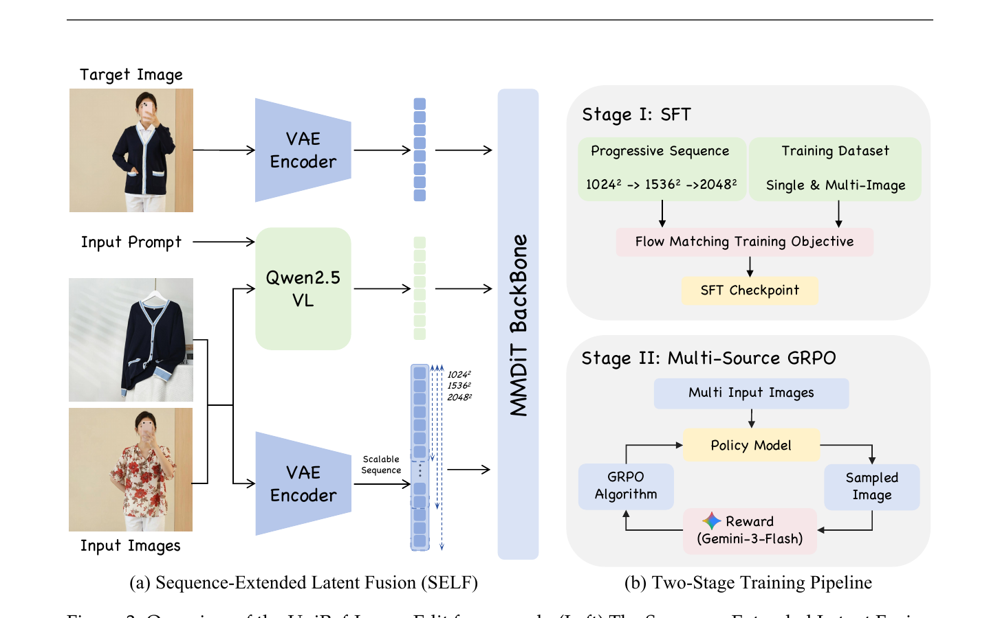

# UniRef-Image-Edit — Scalable and Consistent Multi-Reference Image Editing

## 메타 정보

| 항목 | 내용 |
|---|---|
| **제목** | UniRef-Image-Edit: Towards Scalable and Consistent Multi-Reference Image Editing |
| **저자** | Hongyang Wei, Bin Wen, Yancheng Long, Yankai Yang, Yuhang Hu, Tianke Zhang, … Lei Zhang, Guorui Zhou, Han Li (총 24명) |
| **소속** | Tsinghua University · **Kuaishou Technology** · Hong Kong Polytechnic University · Harbin Institute of Technology (Shenzhen) · CUHK MMLab |
| **공개일** | 2026-02-15 (arXiv v1) |
| **분야** | Multi-Reference Image Editing, Diffusion (Flow Matching), RLHF |
| **논문** | [arXiv:2602.14186](https://arxiv.org/abs/2602.14186) · [PDF](https://arxiv.org/pdf/2602.14186) |
| **코드/모델/데이터** | 공개 예정 (논문 명시: code, models, training data, reward data 모두 open-source) |
| **사용 백본** | DiT: **Qwen-Image-Edit** (double-stream MMDiT) · VLM: **Qwen2.5-VL** · VAE: Qwen-Image VAE |
| **사용 외부 모델** | 명령 생성: **GPT-5** · 데이터 합성: **Nano Banana Pro**, **Seedream 4.0** · RL 보상 심판: **Gemini 3 Flash** |
| **하드웨어** | SFT: H800 GPU 128장 · RL: H800 GPU 48장 |
| **공개 데이터셋** | **UniRef-40k** (HOI 20k + Multi-Person 20k) |

---

## 주요 용어 사전 (Glossary)

> 왜 이 절을 두는가? 본문에서 약어가 반복되니, 먼저 한 줄씩 정리해두면 수식 전개가 막힘 없이 읽힙니다.

### 아키텍처
- **SELF (Sequence-Extended Latent Fusion)**: 참조 이미지 K장을 잠재 시퀀스 차원으로 이어 붙여 한 줄로 만드는 입력 표현. 구조 변경 없이 K=1도 K=6도 같은 모델로 처리
- **MMDiT (Multimodal Diffusion Transformer)**: 이미지와 텍스트를 별도 스트림으로 받는 더블 스트림 트랜스포머. Qwen-Image-Edit이 사용하는 백본
- **Dual Encoding**: 참조 이미지를 두 갈래로 인코딩 — Qwen2.5-VL은 의미(semantic) 토큰, VAE는 픽셀 복원(reconstructive) 잠재
- **RoPE (Rotary Positional Embedding)**: 회전 행렬로 위치를 표현하는 위치 임베딩. φ(·)의 2D 패치화는 RoPE에 필요한 aspect ratio 메타데이터를 보존하기 위함

### 학습 / RL
- **Flow Matching**: 노이즈→데이터의 직선 보간 경로를 따라 속도(velocity)를 학습하는 생성 모델 학습 방식. ε-prediction과 달리 v_t = x_0 − x_1을 직접 학습
- **MSGRPO (Multi-Source GRPO)**: 본 논문이 제안. GRPO(Group Relative Policy Optimization)를 멀티 레퍼런스 편집에 맞춘 강화학습 알고리즘
- **GRPO**: PPO 변종. 그룹 내 보상의 평균·표준편차로 어드밴티지를 정규화 → critic(가치 함수) 없이 학습 가능
- **LLM-as-a-Judge**: MLLM이 결과 이미지를 보고 점수를 매기는 보상 방식 (VIEScore 원칙)
- **SDE Sampling**: 결정론적 ODE에 노이즈를 다시 주입해 확률 미분 방정식(SDE)으로 바꾸는 샘플링. RL 탐색에 필수
- **Progressive Sequence Length**: 1024² → 1536² → 2048²로 픽셀 예산을 점진적으로 늘리는 학습 커리큘럼

### 평가
- **OmniContext**: 멀티 레퍼런스 생성 일관성 벤치마크. SINGLE / MULTIPLE / SCENE × Character / Object 카테고리
- **MultiCom-Bench**: 사람-물체 상호작용(HOI) 200 트리플렛, Gemini 3 Flash로 평가. 2–3장과 4–6장 입력으로 구분 측정
- **GEdit-Bench / ImgEdit-Bench**: 단일 이미지 편집 벤치마크

### 비교 모델
- **Qwen-Image-Edit / -2509 / -2511**: Alibaba 라인업. 본 논문의 시작 가중치(2511) 및 비교 대상
- **Nano Banana / Nano Banana Pro**: Google 상용 (블랙박스). 데이터 합성에도 사용
- **Seedream 4.0**: ByteDance 상용. 데이터 합성에도 사용
- **UniWorld-V2, UniPic 2.0, BAGEL, OmniGen2, USO, UNO**: 오픈소스 통합 편집 모델군

---

## 논문 요약 (TL;DR)

**한 줄:** 참조 이미지 몇 장이든 받아 들이는 통합 편집 모델을 "잠재 시퀀스를 늘리는 것(SELF)"과 "여러 시각 제약을 RL로 화해시키는 것(MSGRPO)" 두 줄로 정리한 작업.

**핵심 문제:** 기존 멀티 레퍼런스 편집은 (1) 입력 개수가 2–3장 고정이거나 구조 수정이 필요하고, (2) "A의 얼굴 + B의 옷 스타일"처럼 충돌하는 시각 제약을 SFT 손실만으로는 화해시키지 못함.

**해결책:**
1. **SELF**: 참조 K장을 VAE로 인코딩 후 시퀀스 차원으로 이어 붙여 하나의 잠재 시퀀스로 만듦 → 구조 변경 없이 임의 K 수용
2. **Progressive Sequence Length**: 글로벌 픽셀 예산 1024² → 1536² → 2048²로 점진 증가
3. **MSGRPO**: Flow matching 정책에 GRPO를 적용. SDE 샘플링으로 G=16 궤적 탐색, **flow matching 덕분에 KL이 닫힌 형식으로 떨어짐**(식 9)
4. **데이터 파이프라인**: GPT-5로 다중 제약 명령 생성, Nano Banana Pro + Seedream 4.0으로 정답 합성 → UniRef-40k 공개

**검증:** OmniContext 평균 **8.78**로 GPT Image 1 [High]와 공동 1위. MultiCom-Bench Overall **0.5398**로 Seedream 4.0(0.5372)·Nano Banana(0.5232) 추월. SFT만(0.5260) → +MSGRPO(0.5398).

> ⚠️ 본 논문 §4.1: **모든 보고 결과는 1024² SFT 가중치 기준**. 1536²/2048²는 향후 업데이트 예정.

---

## 핵심 기여 (Contributions)

1. **SELF**: 임의 개수 참조 이미지를 잠재 시퀀스 차원으로 직렬화하는 통합 입력 표현. 구조 수정 없음
2. **MSGRPO**: 멀티 레퍼런스 이미지 생성을 위한 **최초의 RL 프레임워크**. flow matching의 SDE 변형 + closed-form KL이 핵심
3. **2단계 학습 레시피**: SFT(능력의 prior) → RL(정렬의 posterior). 멀티→단일 순서로 RL을 거쳐 단일 편집 능력 회복까지 포함
4. **데이터 파이프라인 + UniRef-40k**: GPT-5 + Nano Banana Pro + Seedream 4.0 증류로 합성된 40k 학습셋 공개. 멀티 레퍼런스 학습용 공개 데이터의 부재를 메움

---

## 주요 알고리즘 설명

### 1. Figure 3 — 전체 아키텍처

> 왜 이 절을 두는가? 두 핵심 기여(SELF + 2단계 학습)가 한 장에 모여 있어, 이후 식이 어디에 위치하는지 시각으로 잡고 가는 게 가장 빠릅니다.

> **원문 캡션:** *"Overview of the UniRef-Image-Edit framework. (Left) The Sequence-Extended Latent Fusion (SELF) architecture serializes multiple reference images into a unified sequence. (Right) The two-stage training pipeline comprising SFT and MSGRPO."*

#### (a) 왼쪽 — SELF (Sequence-Extended Latent Fusion)

세 갈래의 입력이 MMDiT 백본의 한 시퀀스로 합쳐지는 그림입니다.

- **Target Image (상단)**: 생성/편집의 목표 이미지. 학습 시엔 정답 이미지에 노이즈를 섞은 x_t가 들어감. VAE Encoder를 거쳐 노이즈 잠재 z_t가 됨. 보라색 토큰 막대로 표시
- **Input Prompt (중단)**: 텍스트 명령. **Qwen2.5-VL**이 처리해 의미(semantic) 토큰으로 변환. 초록색 막대로 표시
- **Input Images (하단)**: 참조 이미지 K장. 그림에선 흰 카디건(옷)과 꽃무늬 셔츠(스타일)가 보임. **VAE Encoder**가 각 이미지를 잠재 z_k로 인코딩, 옆에 "Scalable Sequence"라 적힌 보라색 막대가 시퀀스 길이 차원으로 늘어남
- **1024² → 1536² → 2048²** 라벨: 이 시퀀스의 픽셀 예산이 학습 단계별로 점진적으로 커진다는 표시 (Progressive Sequence Length)
- **MMDiT Backbone**: 세 갈래가 모두 이어붙어 한 줄의 시퀀스가 되어 들어감. 이때 핵심은 **세 갈래가 모두 같은 self-attention을 통과**한다는 점 — 타겟·텍스트·참조K장이 서로를 모두 봅니다. 그 결과 모델 구조 자체는 K와 무관

이 그림이 전달하는 핵심 메시지는 **"참조가 늘어도 구조는 그대로, 시퀀스 길이만 늘어난다"**. 그래서 추론 시에도 K=1, K=3, K=6을 모두 한 가중치로 처리 가능. 비유하자면 "발표용 슬라이드에 사진을 1장 붙이든 6장 붙이든, 페이지 레이아웃 자체는 안 바뀌고 종이만 더 옆으로 붙는 격".

또한 참조 이미지가 두 갈래(Qwen2.5-VL + VAE Encoder, 그림의 "Input Images"가 위·아래 두 화살표로 갈라지는 부분)로 들어가는 게 dual encoding. 위쪽 Qwen2.5-VL은 "이게 카디건이다, 사람이다" 같은 의미를 뽑고, 아래쪽 VAE는 "정확히 이 텍스처와 로고" 같은 픽셀 정보를 뽑아 분업합니다.

#### (b) 오른쪽 — 2단계 학습 파이프라인

위·아래 두 박스로 나뉘어 있습니다.

**Stage I: SFT**
- 입력: **Progressive Sequence** (1024² → 1536² → 2048²) + **Training Dataset** (단일·멀티 이미지 혼합 1.8M)
- 학습: **Flow Matching Training Objective** (식 4) 한 가지로 통일
- 출력: **SFT Checkpoint** — 이후 RL의 시작점
- 직관: "여러 이미지를 보는 방법" 자체를 가르치는 단계. 이 단계 끝에서 모델은 이미 "이 토큰들이 참조이고, 저게 타겟이다"를 안다

**Stage II: Multi-Source GRPO**
- 입력: **Multi Input Images** (멀티 레퍼런스 합성 데이터)
- **Policy Model**: SFT 체크포인트에서 LoRA(rank=64)로 미세조정되는 정책. SDE로 G=16개 결과를 샘플
- **Sampled Image**: 정책이 만든 후보 이미지
- **Reward (Gemini 3 Flash)**: MLLM 심판이 세 축(Multi-Source Integration / Feature Consistency / Visual Quality)으로 점수
- **GRPO Algorithm**: 그룹 정규화 어드밴티지(식 7) + PPO clip(식 8) + closed-form KL(식 9). 화살표가 Policy Model로 다시 돌아가 가중치 업데이트
- 직관: "여러 이미지를 어떻게 화해시켜야 좋은가"를 가르치는 단계. 보상이 절대적인 점수가 아니라 그룹 내 상대 우열이라는 점이 핵심

두 박스가 위→아래로 흐르며 첫 번째 박스의 결과(SFT Checkpoint)가 두 번째 박스의 시작점이 되는 구조. 본문 §3.3 마지막 단락에 따르면 MSGRPO는 **먼저 멀티 합성 데이터로**, **그 다음 단일 편집 데이터로** 순차 적용해 단일 편집 능력 손상을 막습니다.

---

### 2. SELF — 입력 표현 (식 1, 2)

> 왜 이 절을 두는가? 식 한 줄이 곧 이 논문의 첫 번째 기여여서, 이 식이 왜 충분한지 짚어두면 구조 변경 없는 확장이 왜 가능한지가 드러납니다.

#### 식 1 — 잠재 시퀀스 구성
> **Z_input = [ z_t ; φ(z_1) ; φ(z_2) ; … ; φ(z_K) ]**

- z_t : 시각 t의 노이즈 섞인 타겟 잠재
- z_k = VAE_encoder(I_k) : k번째 참조의 잠재
- φ(·) : 2D-aware patchify. 가로·세로 정보 보존 → RoPE가 정확한 위치를 매김
- 세미콜론 ";" : 시퀀스 길이 축으로 연결(concat)

이 한 줄이 전부입니다. cross-attention도, gating도, slot도 없습니다. 그냥 잠재를 **줄로 길게 잇기**.

#### 식 2 — 출력 슬라이싱
> **ε_θ(z_t, t, c_txt, I_ref) = T_θ(Z_input, t, c_txt) [ : , : L_t ]**

- T_θ : MMDiT 백본
- L_t : 타겟 잠재의 시퀀스 길이
- [:, :L_t] : 출력에서 타겟 영역만 잘라냄

쉽게 보면, 시퀀스의 **앞쪽**은 "그릴 캔버스", **뒤쪽**은 "참고 자료". 모델은 매 단계 캔버스 영역만 잘라 내고, 참조들은 attention의 key/value로만 작동합니다. all-to-all self-attention 덕에 캔버스의 어느 픽셀도 어느 참조의 어느 영역이든 자유롭게 볼 수 있어요.

---

### 3. SFT — Flow Matching 학습 (식 3, 4)

> 왜 이 절을 두는가? RL 단계의 KL 항(식 9)이 닫힌 형식으로 떨어지는 이유가 여기 정의된 velocity field 구조에서 비롯됩니다.

#### 식 3 — 데이터·노이즈 보간
> **x_t = t · x_0 + (1 − t) · x_1**

- x_0 = VAE(I_gt) : 정답 잠재
- x_1 ~ N(0, I) : 표준 가우시안 노이즈
- t ∈ [0, 1] : logit-normal에서 샘플 (양 끝점에 비중)

t=1이면 깨끗, t=0이면 순수 노이즈. 직선 보간.

#### 목표 velocity
> **v_t = dx_t / dt = x_0 − x_1**

직선의 미분이라 단순히 (정답 − 노이즈).

#### 식 4 — 학습 손실
> **L_SFT = E [ || v_θ(x_t, t, Z_input, c_text) − (x_0 − x_1) ||² ]**

모델 v_θ가 "x_t 위치에서 정답 방향으로 가야 할 속도"를 맞히게 합니다. ε-prediction이 아니라 **velocity prediction**임에 주의.

---

### 4. MSGRPO — RL로 시각 제약 화해시키기 (식 5–9)

> 왜 이 절을 두는가? "여러 시각 제약 간 충돌"은 픽셀 MSE로 가르칠 수 없는 화해의 영역이라, 보상으로 학습하는 RL이 등장합니다. 식 5~9가 한 호흡으로 이어집니다.

#### 식 5 — SDE 형태로 변환 (연속 시간)
> **dx_t = [ v_θ(Z_input, t) + (σ_t² / 2t) · ( x_t + (1 − t) v_θ(Z_input, t) ) ] dt + σ_t dw**

- σ_t : 무작위성 세기. 본문 noise level a=1.5
- dw : 브라운 운동 증분

원래 flow matching은 ODE라 결정론적 → 같은 노이즈면 같은 결과 → RL 탐색 불가. **인위로 노이즈 dw를 다시 주입해 SDE로 바꿈**.

#### 식 6 — Euler–Maruyama 이산화
> **x_{t+Δt} = x_t + [ v_θ + (σ_t² / 2t) · ( x_t + (1 − t) v_θ ) ] · Δt + σ_t · √Δt · ε**

- ε ~ N(0, I)
- Δt : 이산 스텝 크기 (논문 T=25 스텝)
- 한 프롬프트당 G=16개 궤적 샘플

직관: ODE의 평균 경로 주위로 가우시안 흔들림을 주며 16개 후보를 만듦. 비유하자면 같은 출발점에서 16명의 운전사가 약간씩 다른 길로 가게 한 뒤, 누가 잘 도착했는지를 평가.

#### 식 7 — 그룹 정규화 어드밴티지
> **A_i = ( R(y_i) − mean({R(y_j)}_{j=1..G}) ) / std({R(y_j)}_{j=1..G})**

- R(·) : 보상 (Gemini 3 Flash 점수의 가중합)
- 그룹 내 z-점수 정규화

보상의 절대값이 아니라 **그룹 내 상대 우열**만 학습 신호로 사용. → critic이 필요 없고, 심판 보상의 스케일에 강인.

#### 식 8 — PPO 스타일 손실
> **L_GRPO = E [ (1/G) Σ_i ( S(r_i, A_i) − β · D_KL(π_θ || π_ref) ) ]**

> **S(r_i, A_i) = min( r_i · A_i , clip(r_i, 1−ε, 1+ε) · A_i )**

- r_i = π_θ(y_i) / π_ref(y_i) : 정책 비율
- clip : 정책이 한 번에 너무 크게 움직이지 않게 자름
- 본문 §4.1: 실제 학습에서 **β = 0** (KL 항 끔)

#### 식 9 — Closed-form KL (이 논문의 가장 깔끔한 식)
> **D_KL(π_θ || π_ref) = (Δt / 2) · ( σ_t(1−t) / (2t) + 1 / σ_t )² · || v_θ(Z_input, t) − v_ref(Z_input, t) ||²**

- v_ref : SFT 종료 시점에서 동결된 velocity field
- **KL이 두 velocity의 L2 차이에 비례** → 한 번의 forward만으로 계산. Monte-Carlo 추정 불필요

일반 RLHF에서 KL은 시퀀스 확률의 로그를 잡고 MC로 추정해 비싼데, flow matching의 정책은 velocity로 정의되므로 가우시안 두 분포의 KL이 닫힌 형식으로 떨어집니다. 즉 **"SFT velocity에서 너무 멀어지지 마"** 라는 제약을 forward 한 번에 부과 가능.

**왜 β=0으로 끄는가에 대한 추측**: PPO의 clip(식 8)이 이미 정책 이동을 잘라주므로, KL 항이 없어도 안정. closed-form 식 자체는 향후 ablation/안정화를 위한 도구로 남겨둔 셈.

---

### 5. 보상 모델 — LLM-as-a-Judge

> 왜 이 절을 두는가? RL의 학습 신호는 결국 이 보상에서 나오므로, 어떤 축으로 평가하는지가 곧 모델이 어떤 방향으로 정렬되는지를 결정합니다.

| 축 | 평가 내용 | 학습이 향하는 방향 |
|---|---|---|
| **Multi-Source Integration** | 명령에 명시된 N개 참조의 시각 요소가 결과에 다 들어갔는가 | 참조 누락 방지 |
| **Feature Consistency** | 얼굴 ID·물체 기하 등 원본 속성이 보존됐는가 | 과편집·ID 손실 패널티 |
| **Visual Quality** | 조명·자연스러움·아티팩트 유무 | 합성 자연도 향상 |

- 심판: **Gemini 3 Flash** (VIEScore 평가 원칙)
- 점수 스케일: 0–10
- reward 데이터 공개 예정 — 심판 편향 검증 가능성 확보

---

### 6. 데이터 파이프라인 (4단계 자동 공장)

> 왜 이 절을 두는가? 멀티 레퍼런스 학습용 공개 데이터가 거의 없어, 합성 파이프라인의 품질이 곧 모델 상한선이 됩니다.

1. **Collection**
   - 사람: VITON-HD (실세계) + Qwen-Image·Z-Image (합성)
   - 물체·의류: Subjects200K
2. **Filtration**: **GPT-5**가 듀얼 필터. 저해상도, 미적 결함, NSFW 제거
3. **Annotation**: **GPT-5**가 여러 입력의 시각 관계를 분석해 "A의 사람이 B의 재킷을 입고 C의 기타를 든 장면" 같은 다중 제약 프롬프트 생성. 단순 캡션이 아닌 **multi-constraint** 명령
4. **Synthesis** (정답 이미지)
   - HOI (사람-물체 상호작용): **Nano Banana Pro** (물리 정합성 강점)
   - Multi-Person: **Seedream 4.0** (공간 배치 강점)
   - → 상용 SOTA 능력을 **distillation**으로 흡수

산출물 **UniRef-40k**: HOI 20k + Multi-Person 20k, 공개.

---

## 실험 요약

### 학습 디테일

| 단계 | 데이터 | GPU | Optimizer | 비고 |
|---|---|---|---|---|
| **SFT** | 1.8M (공개 0.8M + 합성 1M) | H800 ×128 | AdamW (β=0.9/0.95, wd=0.05, lr 4e-4 cosine) | 50k steps, batch 512, **1024² 시퀀스만 보고됨** |
| **RL** | MICo-150K | H800 ×48 | Adam (β=0.9/0.999, wd=1e-4, lr 3e-4) | 200 steps, batch 192, **LoRA r=64/α=128**, T=25, G=16, a=1.5, β=0, 512² |

### OmniContext (Table 1) — 멀티 레퍼런스 일관성

| Model | SINGLE-Char | SINGLE-Obj | MULTI-Char+Obj | SCENE-Char+Obj | **Average** |
|---|---|---|---|---|---|
| FLUX.1 Kontext [dev] | 8.07 | 7.97 | — | — | 5.14 |
| Nano Banana | 8.79 | 9.12 | 8.27 | 6.81 | 8.07 |
| Qwen-Image-Edit-2509 | 8.56 | 8.41 | 7.79 | 6.86 | 7.60 |
| GPT Image 1 [High] | **8.96** | 8.91 | **8.81** | **8.44** | **8.78** |
| **UniRef-Image-Edit** | 8.65 | **9.24** | 8.79 | 8.54 | **8.78** |

- **GPT Image 1과 평균 공동 1위 (8.78)**, SINGLE-Object에서는 단독 1위
- 비공개 상용 모델 Nano Banana(8.07) 대비 +0.71

### MultiCom-Bench (Table 2) — HOI 2–6장

| Model | 2–3 Images | 4–6 Images | **Overall** |
|---|---|---|---|
| Qwen-Image-Edit | 0.5817 | 0.2882 | 0.4349 |
| Qwen-Image-Edit-2511 | 0.4469 | 0.0271 | 0.2370 |
| Nano Banana | **0.6382** | 0.4082 | 0.5232 |
| Seedream 4.0 | 0.6018 | **0.4739** | 0.5372 |
| UniRef-Image-Edit (SFT) | 0.5997 | 0.4523 | 0.5260 |
| **UniRef-Image-Edit-MSGRPO** | 0.6180 | 0.4616 | **0.5398** |

- **Overall 1위.** 특히 Qwen-Image-Edit-2511의 4–6장에서 0.0271로 폭락하는 것과 대비
- MSGRPO 효과: 0.5260 → 0.5398 (+0.0138, 4–6장 +0.0093)

### 단일 편집 (Table 3, 4)
- **GEdit-Bench-EN**: G_O 7.65 — 오픈소스 중 최고, 상용 Seedream 4.0(7.68)에 0.03차
- **GEdit-Bench-CN**: G_O 7.51 — 오픈소스 중 최상
- **ImgEdit-Bench Overall**: 4.28 — Style 4.91·Action 4.72에서 강세

→ 멀티 학습이 단일 편집 능력을 손상시키지 않음을 확인 (RL의 "멀티 → 단일" 순차 적용 효과)

---

## 💬 Q&A 섹션

### Q1. 왜 SELF가 IP-Adapter/ControlNet 류보다 본질적으로 확장성이 좋은가?

기존 방식은 참조 입력마다 **별도 경로**(adapter 가중치, control branch, slot embedding)가 필요해 K가 늘면 가중치/구조가 같이 늘어야 합니다. SELF는 토큰 차원으로만 연장하므로 가중치는 그대로, 시퀀스 길이만 늘어요. self-attention의 O(L²) 비용은 늘지만 구조 수정은 0.

비유: "전철 칸을 더 붙이는 것"과 "지하철 노선을 새로 깔는 것"의 차이. SELF는 칸만 붙임.

### Q2. SDE 샘플링과 일반 flow matching의 추론 차이는?

| 모드 | 식 | 용도 |
|---|---|---|
| **ODE (추론)** | dx_t = v_θ dt | 결정론적, 같은 노이즈→같은 결과 |
| **SDE (RL 탐색)** | 식 5 (드리프트 + σ_t dw) | 같은 프롬프트로도 G개 다양한 결과 |

σ_t = 0이면 식 5는 식 3의 ODE로 환원. 즉 SDE는 ODE의 일반화이며, 본 논문은 RL 단계에서만 σ_t > 0을 사용.

### Q3. Closed-form KL(식 9)이 왜 중요한가?

일반 RLHF에서 KL = E[log π_θ − log π_ref]는 시퀀스 확률 두 개를 잡아야 해서 시퀀스가 긴 이미지 모델에선 매우 비쌉니다. flow matching에서는 정책이 velocity로 표현되고, 한 스텝의 분포가 가우시안이라 KL이 두 velocity의 L2 차이로 떨어집니다. **한 번의 forward로 KL이 나옴** → 학습 시간/메모리에서 큰 이득.

다만 실제 학습은 β=0이라 closed-form 자체를 안 씁니다. 식 9는 "쓰려고 마음먹으면 싸게 쓸 수 있다"는 이론적 자산.

### Q4. SFT 단계 안에서 데이터 비율은? 멀티 vs 단일?

본문에는 명시 비율이 없고, 다만 SFT는 단일·멀티 혼합 1.8M(공개 0.8M + 합성 1M)이라고만 함. RL은 멀티만 → 단일 순서로 진행. 즉 **SFT에서 두 task가 한 손실로 묶이고**, RL에서 분리 적용되는 구조.

### Q5. Qwen-Image-Edit-2511이 4–6장에서 0.0271로 폭락한 이유는?

본문 §4.2 noting: Qwen-Image-Edit-2509/2511은 공식적으로 **2–3 입력에 최적화**됨. 그 이상에서는 슬롯 처리 한계로 일관성이 깨짐. SELF의 "시퀀스 연장" 방식이 이 문제를 처음부터 회피하는 이유.

### Q6. 보상 모델이 Gemini 3 Flash인데, 이게 정책 편향이 되지 않는가?

위험은 있고, 본 논문도 이를 인지해 **reward 데이터를 공개**할 예정. 또한 LLM-as-a-Judge는 0–10 척도 + rationale 기반(VIEScore)이라 단일 토큰 비교보다 견고하다는 게 본문의 주장.

근본적으로는 distillation의 한 형태 — Gemini가 잡지 못하는 측면(예: 정밀한 색상 일치)에서는 모델 상한이 Gemini 수준으로 묶일 가능성이 있음.

### Q7. 본 논문이 [[paper_unicustom]]과 같은 Kuaishou 라인업인가? 노선 차이는?

두 논문 모두 Kuaishou 계열이지만 처방이 다릅니다.

| 측면 | UniCustom (2026-05) | UniRef-Image-Edit (2026-02) |
|---|---|---|
| 처방 | **조기 융합** — ViT+VAE를 VLM 전에 한 토큰으로 | **시퀀스 연장** — VAE를 시퀀스 길이로 이어붙이기 |
| 진단 | grounding-binding gap (의미↔외형 짝짓기) | 입력 개수 확장성 + 시각 제약 충돌 |
| RL | 없음 | **MSGRPO** (논문의 큰 줄기 절반) |
| 백본 | LongCat-Image-Edit | Qwen-Image-Edit |

같은 회사가 비슷한 문제를 다른 방향으로 푼 셈. UniCustom은 "표현 단계의 통합"에 집중, UniRef는 "구조 변경 없는 확장 + RL 정렬"에 집중.

---

## 한 줄 요약 (전체)

UniRef-Image-Edit = SELF(잠재 시퀀스 연장으로 K-참조 구조 변경 없이 처리) + Progressive Sequence(1024→1536→2048) + MSGRPO(flow matching에 GRPO + closed-form KL) + GPT-5/Nano Banana Pro/Seedream4 증류 UniRef-40k. OmniContext에서 GPT Image 1과 평균 1위(8.78), MultiCom Overall 1위(0.5398).

---

## 관련 메모리 링크

- [[paper_unicustom]] — 같은 Kuaishou 라인업의 멀티 레퍼런스 처방, "조기 융합" vs "시퀀스 연장" 비교
- [[paper_dmd2]] — RL/distillation 관점에서 GAN+real-data를 더한 후속 사례
- [[reference_pretrained_backbone_reuse_landscape]] — Qwen-Image-Edit 백본 재사용 사례 추가
